[](https://classroom.github.com/a/Ph837wyE)
|    NRP     |      Name                  |
| :--------: | :------------------------: |
| 5025241134 | Gilbran Mahdavikia Raja    |
| 5025241148 | Muhammad Zaky Zein         |
| 5025241171 | Muhammad Sholihuddin Rizky |

# Praktikum Modul 1 _(Module 1 Lab Work)_

### Daftar Soal _(Task List)_

- [Task 1 - New Jeans Global Teratas _(Top Global New Jeans)_](/task-1/)

- [Task 2 - Liburan Bersama Rudi _(Holiday with Rudi)_](/task-2/)

- [Task 3 - Ignatius Si Cloud Engineer _(Ignatius The Cloud Engineer)_](/task-3/)

- [Task 4 - Proxy Terbaik di New Eridu _(Best Proxy in New Eridu)_](/task-4/)

### Laporan Resmi Praktikum Modul 1 _(Module 1 Lab Work Report)_

# Task 1 Top Global new Jeans

Setelah comeback besar-besaran, NewJeans memecahkan berbagai rekor di chart musik global. Oleh karena itu, muncul lah niat Minji untuk menganalisis performa album mereka selama 2024. Manajer Minji memberikan kepada Minji data streaming dari platform “N” melalui link [newjeans_analysis.zip](https://drive.google.com/file/d/1poxmppuB7zOXOVm9Xn7_FtSRwtC10dbw/view?usp=sharing). Data tersebut mencakup data streamer dan detail album NewJeans. Sebagai penggemar NewJeans dan juga seorang suhu dalam dunia Linux, kamu ditantang oleh Minji untuk memenuhi rasa ingin tahunya. Minji ingin kamu untuk menganalisis data yang diberikan oleh manajernya menggunakan shell scripting dan awk. Sebagai Bunnies yang baik, tentu kamu tidak bisa menolak tantangan ini. Adapun analisis yang diminta oleh Minji adalah sebagai berikut:

## A

Minji penasaran dengan nama-nama user yang mendengarkan lagunya pada platform “N”. Berhubung Minji sangat menyukai angka **2** dan ia sangat membenci orang yang membuat username menggunakan **underscore (\_)**, bantulah Minji untuk mendapatkan username yang sesuai dengan kriterianya (**terdapat angka 2 dan tidak terdapat underscore**) dan tampilkan jumlahnya. **Pastikan username yang ditampilkan berurutan berdasarkan ASCII Table (dari kecil ke besar).**

**Rule:** gunakan **`DataStreamer.csv`**

---

### Kode Program:
```bash
#!/bin/bash

echo "User yang sesuai kriteria :"
echo "-------------------------------"

count=$(awk -F, '
 NR>1 && $2 ~ /2/ && $2 !~ /_/ { printf "%s \n", $2 }
' newjeans_analysis/DataStreamer.csv | sort | tee /dev/tty | wc -l )

echo "-------------------------------"
echo "Total nama: $count user"
```

- Shebang

  ```bash
  #!/bin/bash
  ```
  Menunjukkan kode program akan di eksekusi dengan shell `bash`

- Output Format

  ```bash
  echo "User yang sesuai kriteria :"
  ```

  dan

  ```bash
  echo "-------------------------------"
  ```
  Digunakan agar output dari kode bash lebih mudah dibaca

- Menggunakan `awk` untuk memfilter data sekaligus print username yang memenuhi kriteria

  ```bash
  count=$(awk -F, '
  NR>1 && $2 ~ /2/ && $2 !~ /_/ { printf "%s \n", $2 }
  ' newjeans_analysis/DataStreamer.csv | sort | tee /dev tty | wc -l )
  ```

  Penjelasan:

  - `count=$(...)` Digunakan untuk mengeksekusi perintah di dalamnya, lalu hasilnya disimpan dalam variabel `count`.
  - `awk -F,` File yang akan diolah bertipe CSV (Comma Separated Values) sehingga menggunakan koma (`,`) sebagai pemisah
  - `NR>1` Mulai membaca data file dari baris ke `2`
  - `$2 ~ /2/` Memastikan kolom kedua (kolom kedua di sini berisi username) mengandung angka `2`
  - `$2 !~ /_/` Memeriksa apakah username tidak mengandung mengandung angka (`_`) 
  - `{ printf %s, $2 }` Print username yang memenuhi kriteria
  - `' newjeans_analysis/DataStreamer.csv` Nama file yang akan diolah
  - `| sort` Mengurutkan hasil berdasarkan `ASCII`
  - `| tee /dev/tty` Menampilkan hasil ke terminal sambil meneruskan output ke proses selanjutnya.
  - `| wc -l` Menghitung jumlah baris (jumlah user yang sesuai kriteria)

  Dalam kode ini `tee dev/tty` digunakan agar fungsi print tetap menampilkan output ke terminal dan juga `count=$(...)` akan menyimpan value dari `| wc -l`.

- Fungsi echo

  ```bash
  echo "Total nama: $count user"
  ```
  Menampilkan jumlah user yang memenuhi kriteria ke terminal

### Output dari Kode Program:

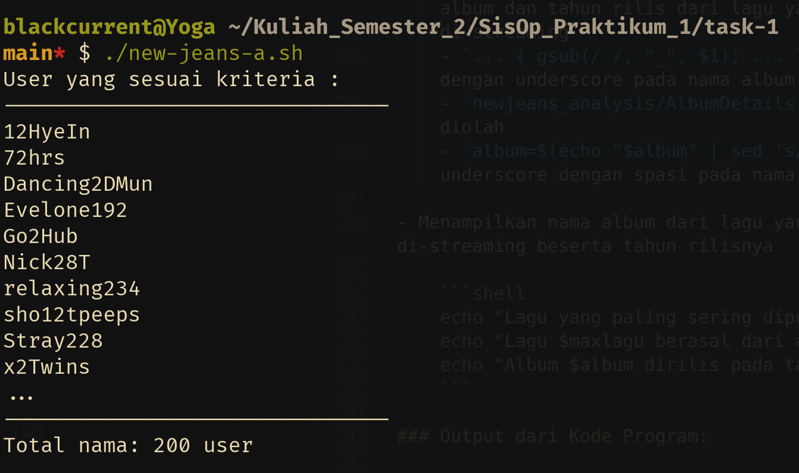
note: output yang ada pada gambar bukan output sebenarnya, karena output sebenarnya terlalu panjang untuk ditampilkan pada gambar.

## B

Ternyata, Minji tidak hanya menyukai angka 2, tetapi semua angka. Ia ingin mengetahui lagu apa yang paling banyak distreaming oleh user yang memiliki username berangka. Beri tahu Minji nama lagu tersebut dan jumlah usernya. Jika jumlah user tersebut tidak mencapai 24, maka berikan pesan kepada Minji “Maaf, Minji, total streamingnya tidak sesuai harapan :(“. Jika jumlah user mencapai atau melebihi 24, berikan pesan kepada Minji “Keren, Minji! Kamu hebat <3!”.

---

### Kode Program:

```bash
#!/bin/bash

read max maxlagu < <(awk -F, '
  BEGIN {
    max = 0;
    maxlagu = "";
  }
  NR > 1 && $2 ~ /[0-9]/ { lagu[$3]++ }
  END { for (i in lagu) print lagu[i], i }
  ' newjeans_analysis/DataStreamer.csv | sort -nr | head -n 1)

printf "Lagu yang paling banyak diputar : %s\n" "$maxlagu";
printf "Total streaming lagu %-10s : %d\n" "$maxlagu" "$max";

if [[ "$max" -ge 24 ]]; then
  echo "Keren, Minji! Kamu hebat <3!"
else
  echo "Maaf, Minji, total streamingnya tidak sesuai harapan :("
fi
```

- Shebang

  ```bash
  #!/bin/bash
  ```
  
  Menunjukkan kode program akan di eksekusi dengan shell `bash`

- Menggunakan `awk` untuk mencari nama Lagu dari lagu yang paling banyak distreaming dan jumlah usernya

  ```bash
  read max maxlagu < <(awk -F, '
  BEGIN {
      max = 0;
      maxlagu = "";
  }
  NR > 1 && $2 ~ /[0-9]/ { lagu[$3]++ }
  END { for (i in lagu) print lagu[i], i }
  ' newjeans_analysis/DataStreamer.csv | sort -nr | head -n 1)
  ```

  Penjelasan:

  - `read max maxlagu < <(awk ...)>` Memasukkan output dari awk kedalam variabel max dan maxlagu
  - `awk -F,` File yang akan diolah bertipe CSV (Comma Separated Values) sehingga menggunakan koma (`,`) sebagai pemisah
  - `BEGIN { max = 0; maxlagu = ""; }` Inisialisasi variabel max dan maxlagu
  - `NR > 1 && $2 ~ /[0-9]/ { lagu[$3]++ }` Menghitung berapa user yang memenuhi kriteria yang mendengarkan lagu new jeans
  - `END { for (i in lagu) print lagu[i], i }` Print hasil perhitungan dan nama lagu
  - `sort -nr` Mengurutkan hasil secara descending (nilai terbesar berada di paling atas)
  - `head -n 1` Mengambil data pertama paling atas dari hasil sorting
  - `' newjeans_analysis/DataStreamer.csv` Nama file yang akan diolah
  
  Pada kode program tersebut nilai maks didapatkan menggunakan `sort -nr | head -n 1` karena data paling atas dari hasil sorting secara descending adalah data paling besar.

  Lalu data paling atas akan dimasukkan ke dalam variabel `max` dan `maxlagu` yang berada diluar awk menggunakan `read`.

- Fungsi printf

  ```bash
  printf "Lagu yang paling banyak diputar : %s\n" "$maxlagu";
  printf "Total streaming lagu %-10s : %d\n" "$maxlagu" "$max";
  ```

  Menampilkan nama lagu yang paling banyak distreaming dan jumlah usernya ke terminal

- Menampilkan pesan kepada Minji

  ```bash
  if [[ "$max" -ge 24 ]]; then
    echo "Keren, Minji! Kamu hebat <3!"
  else
    echo "Maaf, Minji, total streamingnya tidak sesuai harapan :("
  fi
  ```

  - `-ge` Operator yang digunakan untuk membandingkan apakah nilai dari variabel `max` lebih besar atau sama dengan 24 (pada bahasa c biasanya menggunakan `>=`)

  Jika jumlah user yang mendengarkan lagu tersebut mencapai atau melebihi 24, maka akan menampilkan pesan "Keren, Minji! Kamu hebat <3!". Jika tidak, maka akan menampilkan pesan "Maaf, Minji, total streamingnya tidak sesuai harapan :("

### Output dari Kode Program:

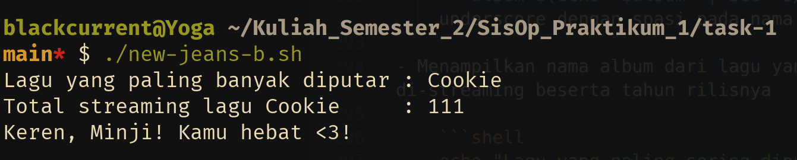

## C

Tiba-tiba Minji lupa, di album mana lagu yang paling banyak di-streaming tersebut berada. **Carikan Minji nama album dari lagu yang paling banyak di-streaming di platform tersebut, beserta tahun rilisnya!**

---

### Kode Program:

```bash
#!/bin/bash

read maxlagu < <(awk -F, '
  BEGIN { max = 0 }  
  NR > 1 && $2 ~ /[0-9]/ { lagu[$3]++ }  
  END {
    for (i in lagu) {
      if (lagu[i] > max) {
        max = lagu[i];
        maxlagu = i;
      }
    }
    print maxlagu; 
  }' newjeans_analysis/DataStreamer.csv
)

read album tahunrilis < <(awk -F, -v lagu="$maxlagu" '
 $2 == lagu { gsub(/ /, "_", $1); print $1, $3 }
' newjeans_analysis/AlbumDetails.csv)

album=$(echo "$album" | sed 's/_/ /g')

echo "Lagu yang paling sering diputar    : $maxlagu"
echo "Lagu $maxlagu berasal dari album     : $album"
echo "Album $album dirilis pada tahun : $tahunrilis"
```

- Shebang

  ```bash
  #!/bin/bash
  ```
  Menunjukkan kode program akan di eksekusi dengan shell `bash`

- Menggunakan `awk` untuk mencari nama Lagu dari lagu yang paling banyak distreaming

  ```bash
  read maxlagu < <(awk -F, '
    BEGIN { max = 0 }  
    NR > 1 && $2 ~ /[0-9]/ { lagu[$3]++ }  
    END {
      for (i in lagu) {
        if (lagu[i] > max) {
          max = lagu[i];
          maxlagu = i;
        }
      }
      print maxlagu; 
    }' newjeans_analysis/DataStreamer.csv
  )
  ```

  Penjelasan:

  - `read maxlagu < <(awk ...)>` Memasukkan output dari awk kedalam variabel maxlagu
  - `awk -F,` File yang akan diolah bertipe CSV (Comma Separated Values) sehingga menggunakan koma (`,`) sebagai pemisah
  - `BEGIN { max = 0 }` Inisialisasi variabel max
  - `NR > 1 && $2 ~ /[0-9]/ { lagu[$3]++ }` Menghitung berapa user yang memenuhi kriteria yang mendengarkan lagu new jeans
  - ```bash
    awk -F, '
      ...
      END {
        for (i in lagu) {
          if (lagu[i] > max) {
            max = lagu[i];
            maxlagu = i;
          }
        }
        ... 
      }
    `
    ```
    Mencari nama lagu yang paling banyak distreaming menggunakan pembanding lalu menyimpan nama lagu tersebut ke dalam variabel `maxlagu`
  - `END { ... print maxlagu; }` Print nama lagu yang paling banyak distreaming
  - `newjeans_analysis/DataStreamer.csv` File yang akan diolah

  Dalam kode program ini nilai dari `maxlagu` akan dimasukkan ke dalam variabel `maxlagu` yang berada diluar awk menggunakan `read` lalu akan digunakan pada proses selanjutnya.

- Menggunakan `awk` untuk mencari nama album dari lagu yang paling banyak distreaming

  ```bash
  read album tahunrilis < <(awk -F, -v lagu="$maxlagu" '
  $2 == lagu { gsub(/ /, "_", $1); print $1, $3 }
  ' newjeans_analysis/AlbumDetails.csv)

  album=$(echo "$album" | sed 's/_/ /g')
  ```

  Penjelasan:

  - `read album tahunrilis < <(awk ...)>` Memasukkan output dari awk kedalam variabel album dan tahunrilis
  - `awk -F,` File yang akan diolah bertipe CSV (Comma Separated Values) sehingga menggunakan koma (`,`) sebagai pemisah
  - `-v lagu="$maxlagu"` Menggunakan variabel `maxlagu` sebagai variabel `lagu` pada `awk`
  - `$2 == lagu { ... print $1, $3 }` Mengambil nama album dan tahun rilis dari lagu yang paling banyak distreaming
  - `... { gsub(/ /, "_", $1); ... }` Mengganti spasi dengan underscore pada nama album
  - `newjeans_analysis/AlbumDetails.csv` File yang akan diolah
  - `album=$(echo "$album" | sed 's/_/ /g')` Mengganti underscore dengan spasi pada nama album

  Ketika spasi tidak diganti dengan underscore, maka nama album yang memiliki spasi akan dianggap sebagai dua kolom yang berbeda. Sehingga, perlu dilakukan penggantian spasi dengan underscore agar nama album yang memiliki spasi dianggap sebagai satu kolom dan tidak terjadi kesalahan dalam pengambilan data.

- Fungsi echo

  ```bash
  echo "Lagu yang paling sering diputar    : $maxlagu"
  echo "Lagu $maxlagu berasal dari album     : $album"
  echo "Album $album dirilis pada tahun : $tahunrilis"
  ```

  Menampilkan nama album dari lagu yang paling banyak distreaming beserta tahun rilisnya ke terminal

### Output dari Kode Program:

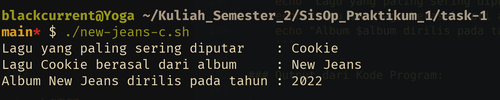

## D

Minji ingin mengajukan ke agensi untuk membuat campaign iklan supaya lagu-lagu NewJeans lebih dikenal, tapi Minji bingung mau optimasi iklan untuk device apa. Berikut tugas kamu untuk membantu Minji menyusun proposal iklan sebelum diberikan ke CEO ADOR:

1.  **Hitung berapa banyak pengguna** yang menggunakan setiap jenis device (**Tablet, Smart TV, Desktop, Mobile**) untuk streaming lagu NewJeans.
2.  **Hitung total durasi streaming (detik)** untuk setiap device.
3.  **Tentukan:**

    - **Device paling populer** yang punya user terbanyak.
    - **Device menang durasi** yang memiliki total streaming tertinggi.
    - **Device ter-“loyal”** berdasarkan **rasio (total durasi / user) tertinggi**.

---

### Kode Program:

```bash
#!/bin/bash

awk -F, '
  BEGIN {
    maxcount = 0;
    maxtime = 0;
    maxloyalty = 0;
    devicecount = "";
    devicetime = "";
    deviceloyal = "";
    print "Device       User    treamtime";
    print "------------------------------------";
  } 
  NR > 1 {
    gsub(/\r/, "", $7);
    device[$7] += 1;
    streamtime[$7] += $4;
  } 
  END {
    for (i in device) {
      printf "%-8s %8d %11d detik\n", i, device[i], streamtime[i];
      loyalty = streamtime[i] / device[i];

      if (device[i] > maxcount) {
        maxcount = device[i];
        devicecount = i;
      }
      if (streamtime[i] > maxtime) {
        maxtime = streamtime[i];
        devicetime = i;
      }
      if (loyalty > maxloyalty) {
        maxloyalty = loyalty;
        deviceloyal = i;
      }
    }
    print "------------------------------------";
    printf "user terbanyak          : %s (%d user)\n", devicecount, maxcount;
    printf "total streaming terlama : %s (%d detik)\n", devicetime, maxtime;
    printf "loyalitas tertinggi     : %s (%.2f detik/user)\n", deviceloyal, maxloyalty;
  }
' newjeans_analysis/DataStreamer.csv
```

- Shebang

  ```bash
  #!/bin/bash
  ```
  Menunjukkan kode program akan di eksekusi dengan shell `bash`

- Menggunakan `awk` untuk membantu Minji

  - Inisialisasi variabel dan menampilkan header tabel
    ```bash
    awk -F, '
      BEGIN {
      maxcount = 0;
      maxtime = 0;
      maxloyalty = 0;
      devicecount = "";
      devicetime = "";
      deviceloyal = "";
      print "Device       User    treamtime";
      print "------------------------------------";
      }
      ...
    '
    ``` 

    - Variabel maxcount, maxtime, maxloyalty, devicecount, devicetime, dan deviceloyal digunakan untuk menyimpan nilai maksimum dari user, total durasi streaming, dan loyalitas 
    - Variabel devicecount, devicetime, dan deviceloyal digunakan untuk menyimpan nama device yang memiliki user terbanyak, total durasi streaming terlama, dan loyalitas tertinggi

  - Menghitung jumlah user dan total durasi streaming untuk setiap device

    ```bash
    awk -F, '
      ...
      NR > 1 {
      gsub(/\r/, "", $7);
      device[$7] += 1;
      streamtime[$7] += $4;
      }
      ...
    '
    ```
  
    - `NR > 1` digunakan untuk mulai membaca data file dari baris ke `2`

    - `gsub(/\r/, "", $7);` digunakan untuk menghapus `\r` pada device karena device terdapat pada kolom terakhir pada file CSV

    - `device[$7] += 1;` digunakan untuk menghitung jumlah user yang menggunakan device tersebut

    - `streamtime[$7] += $4;` digunakan untuk menghitung total durasi streaming untuk setiap device

  - Menghitung user terbanyak, total streaming terlama, dan loyalitas tertinggi

    ```bash
    awk -F, '
      ...
      END {
      for (i in device) {
        printf "%-8s %8d %11d detik\n", i, device[i], streamtime[i];
        loyalty = streamtime[i] / device[i];

        if (device[i] > maxcount) {
          maxcount = device[i];
          devicecount = i;
        }
        if (streamtime[i] > maxtime) {
          maxtime = streamtime[i];
          devicetime = i;
        }
        if (loyalty > maxloyalty) {
          maxloyalty = loyalty;
          deviceloyal = i;
        }
      }
      ...
      }
    '
    ```

    - `printf "%-8s %8d %11d detik\n", i, device[i], streamtime[i];` Menampilkan nama device, jumlah user, dan total durasi streaming ke terminal

    - `loyalty = streamtime[i] / device[i];` Menghitung loyalitas (rasio total durasi streaming / user) untuk setiap device

    - `if (device[i] > maxcount) { maxcount = device[i]; devicecount = i; }` Menyimpan nama device yang memiliki user terbanyak

    - `if (streamtime[i] > maxtime) { maxtime = streamtime[i]; devicetime = i; }` Menyimpan nama device yang memiliki total durasi streaming terlama

    - `if (loyalty > maxloyalty) { maxloyalty = loyalty; deviceloyal = i; }` Menyimpan nama device yang memiliki loyalitas tertinggi

  - Fungi printf

    ```bash
    awk -F, '
      ...
      END {
      ...
      print "------------------------------------";
      printf "user terbanyak          : %s (%d user)\n", devicecount, maxcount;
      printf "total streaming terlama : %s (%d detik)\n", devicetime, maxtime;
      printf "loyalitas tertinggi     : %s (%.2f detik/user)\n", deviceloyal, maxloyalty;
      }
    '
    ```

    Menampilkan nama device yang memiliki user terbanyak, total durasi streaming terlama, dan loyalitas tertinggi ke terminal

### Output dari Kode Program:

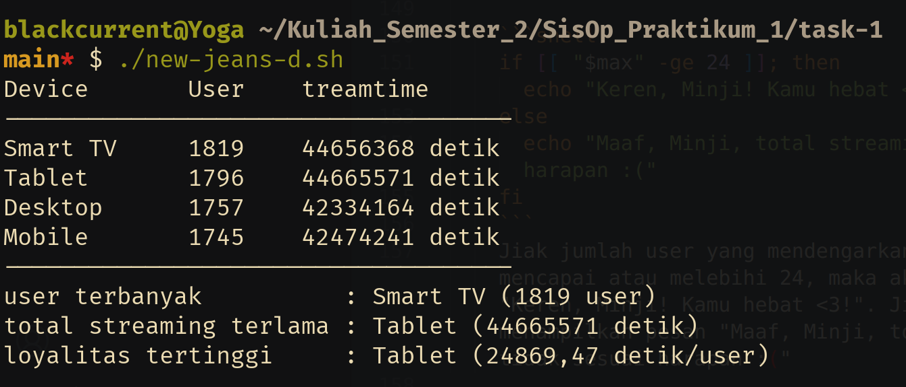


# Task 2 Liburan Bersama Rudi

Mengisi waktu liburan, Rudi membuat sebuah website untuk personal brandingnya yang sementara berjalan di local pada komputer laboratorium. Rudi yang baru belajar kebingungan karena sering muncul error yang tidak ia pahami. Untuk itu dia meminta ketiga temannya Andi, Budi, dan Caca untuk melakukan pengecekan secara berkala pada website Rudi. Dari pengecekan secara berkala, Rudi mendapatkan sebuah file access.log yang berisi catatan akses dari ketiga temannya. Namun, Rudi masih tidak paham cara untuk membaca data pada file tersebut sehingga meminta bantuanmu untuk mencari data yang dibutuhkan Rudi.

## A

Karena melihat ada IP dan Status Code pada file access.log. Rudi meminta praktikan untuk menampilkan total request yang dibuat oleh setiap IP dan menampilkan jumlah dari setiap status code.

---

### Kode Program:


```bash
#!bin/bash
```
 shebang, fungsinya untuk memberi tahu sistem operasi agar menggunakan  interpreter bash.

```bash
awk -F' '
```
 command awk berfungsi untuk melakukan operasi dari suatu record dan melakukan operasi terhadap recordnya.

 -F’ ‘ → digunakan untuk mendefinisikan (spasi ‘ ‘) sebagai delimiter atau separatornya.

```
192.168.1.2 - - [01/Jan/2025:00:00:25 +0700] "DELETE /about.html HTTP/1.1" 302 1582
```
 ↑ contoh dari lognya di mana dalam awk jika mendefinisikan separator sebagai spasi

```
192.168.1.2 → $1
- → $2
- → $3
[01/Jan/2025:00:00:25 → $4
+0700] → $5
“Delete → $6
/about.html → $7
HTTP/1.1” → $8
302 → $9
1582 → $10
```

```bash
countIP[$1]++
```
 membuat sebuah associative array yang mengambil IP sebagai key dan melakukan increment value masing-masing keynya.

```bash
countSC[$9]++
```
 membuat sebuah associative array yang mengambil status code sebagai key dan melakukan increment value masing-masing keynya.

```bash
END {
```
 END akan dieksekusi setelah input selesai dibaca.

```bash
print "Total request masing-masing IP: "
```
 untuk menampilkan string ke terminal.

```bash
for(IP in countIP) {
```
 untuk melakukan looping untuk setiap elemen dari associative array yang sudah dibuat.

```bash
print IP, countIP[IP]
```
 untuk menampilkan IP, yang mana merupakan key (dalam case ini IP) dari associative array, dan countIP[IP] yang merupakan nilai dari value hasil increment sebelum END pada awk.

```bash
print "Jumlah dari masing masing status code: "
```
 untuk menampilkan string ke terminal.

```bash
for(SC in countSC) {
```
 untuk melakukan looping untuk setiap elemen dari associative array yang sudah dibuat.

```bash
print SC, countSC[SC]
```
 untuk menampilkan SC, yang mana merupakan key (dalam case ini status code) dari associative array, dan countSC[SC] yang merupakan nilai dari value hasil increment sebelum END pada awk.

```bash
}' access.log
```
 merupakan bagian dari sintaks awk yang berfungsi untuk mereferensikan input filenya kepada command awk.

### Output dari kode program:


## B

Karena banyaknya status code error, Rudi ingin tahu siapa yang menemukan error tersebut. Setelah melihat-lihat, ternyata IP komputer selalu sama. Dengan bantuan [peminjaman_komputer.csv](https://drive.google.com/file/d/1-aN4Ca0M3IQdp6xh3PiS_rLQeLVT1IWt/view?usp=drive_link), Rudi meminta kamu untuk membuat sebuah program bash yang akan menerima inputan tanggal dan IP serta menampilkan siapa pengguna dan membuat file backup log aktivitas, dengan format berikut:

- **Tanggal** (format: `MM/DD/YYYY`)

- **IP Address** (format: `192.168.1.X`, karena menggunakan jaringan lokal, di mana `X` adalah nomor komputer)

- Setelah pengecekan, program akan memberikan **message pengguna dan log aktivitas** dengan format berikut:

  ```
  Pengguna saat itu adalah [Nama Pengguna Komputer]
  Log Aktivitas [Nama Pengguna Komputer]
  ```

  atau jika data tidak ditemukan:

  ```
  Data yang kamu cari tidak ada
  ```

- File akan disimpan pada directory “/backup/[Nama file]”, dengan format nama file sebagai berikut

  ```
  [Nama Pengguna Komputer]_[Tanggal Dipilih (MMDDYYY)]_[Jam saat ini (HHMMSS)].log
  ```

- Format isi log

  ```
  [dd/mm/yyyy:hh:mm:ss]: Method - Endpoint - Status Code
  ```

---

### Kode Program:


```bash
#!/bin/bash
```
 shebang, fungsinya untuk memberi tahu sistem operasi agar menggunakan  interpreter bash.

```bash
read -p "MM/DD/YYYY :" tanggal
```
 membaca input dari user dan menyimpan inputnya di variable tanggal.
 -p “” fungsinya untuk menampilkan prompt kepada user

```bash
read -p "192.168.1.X :" Ipaddress
```
 membaca input dari user dan menyimpan inputnya di variable ipaddress.
 -p “” fungsinya untuk menampilkan prompt kepada user

```bash
IPlast=$(cut -d '.' -f 4 <<< "$Ipaddress")
```
 variable IPlast digunakan untuk menyimpan oktet terakhir dari IP yang diinputkan oleh user.
 isi dari varriable IPlast didapatkan dari menggunakan command cut yang berfungsi untuk memotong string.
 cut -d ‘.‘ → mendefinisikan (titik ‘.’) sebagai delimiter
 -f 4 → mengambil fields ke 4 setelah Ipaddress-nya dipisahkan oleh delimiter.
```
Misalnya, 192.168.1.2
192 → field ke-1
168 → field ke-2
1 → field ke-3
2 → field ke-4
```

 <<< “$ipaddress” mengambil value dari variable ipaddress sebagai input dari command cut.

```bash
nama=$(grep -E "^$tanggal,$IPlast," peminjaman_computer.csv | cut -d ',' -f 3)
```
 mendefinisikan variable nama yang valuenya diambil dari menggunakan command grep yang kemudian dipipe ke command cut.
 grep -E “^$tanggal,$IPlast,” peminjaman_computer.csv
 mencari match dengan regex dari tanggal dan IPlast pada file peminjaman_computer.csv, jika ditemukan line yang sesuai maka akan menjadi output dari command grep.
 setelah mendapatkan output line file csv dari command grep, selanjutnya ingin didapatkan namanya saja, oleh karena itu output dari grep dipipe ke command cut.
```bash
cut -d’,’ -f 3
```
 sama seperti penjelasan sebelumnya, namun kali ini delimiternya adalah (koma ‘,’) dan diambil field ketiganya. Berikut contohnya:
```
01/02/2025,3,Budi
01/02/2025 → field ke-1
3 → field ke-2
Budi → field ke-3
```

```bash
if [ -n "$nama" ]; then
```
 percabangan if dimana di sini digunakan untuk melakukan cek variable nama, apakah variablenya kosong atau tidak. Dari line sebelumnya, bisa dilihat bahwa variable nama akan memiliki value hanya jika command grep menemukan matchnya, jika tidak maka variable nama tidak ada valuenya.
 -n adalah operator yang digunakan untuk memeriksa apakah string memiliki panjang lebih dari nol. Sehingga jika variable nama memiliki value, misalnya Budi, maka akan masuk ke line berikutnya, jika tidak akan masuk ke percabangan else.

```bash
echo "Pengguna saat itu adalah $nama"
echo "Log Aktivitas $nama"
```
 misal value dari variable nama adalah “Budi”
 echo akan menampilkan
```
Pengguna saat itu adalah Budi
Log Aktivitas Budi
```
 kepada user.

```bash
tanggalTr=$(tr -d / <<< "$tanggal")
```
 format dari variable tanggal adalah MM/DD/YYYY. Di sini dibuat variable tanggalTr yang berfungsi untuk menyimpan tanggal dalam format MMDDYYYY.
 command tr berfungsi untuk menghapus suatu karakter dari string
 tr -d / <<< “$tanggal”
 artinya adalah menghapus semua delimiter yang berupa (slash ‘/’) dari string tanggal.

```bash
currentTime=$(date +%H%M%S)
```
 command date digunakan untuk mendapatkan waktu sekarang. +%H%M%S adalah format untuk jammenitdetik, misal jam 1 lewat 52 menit 10 detik siang, maka akan menjadi 135210.

```bash
dir="./backup"
```
 variable dir untuk menyimpan string “./backup”

```bash
fileLoc="./${dir}/${nama}_${tanggalTr}_${currentTime}.log"
```
 variable fileLoc untuk menyimpan string dengan format nama dan direktori yang sudah ditentukan.

```bash
mkdir -p "$dir"
```
 command mkdir -p “$dir” digunakan untuk membuat direktori, jika direktorinya tidak ditemukan/belum dibuat.

```bash
DDMonthYYYY=$(date -d ${tanggal} "+%d/%b/%Y")
```
 DDMonthYYYY adalah variable yang dibuat untuk menyimpan tanggal dengan format yang lain.
 date -d ${tanggal} “+%d/%b/%Y” artinya menampilkan tanggal dari string tanggal (MM/DD/YYYY) dan mengubahnya menjadi format (DD/Month/YYYY).
 Misal 03/27/2025, maka akan diubah menjadi 27/Mar/2025.

```bash
DDMMYYYY=$(date -d ${tanggal} "+%d/%m/%Y")
```
 mengubah format menjadi DD/MM/YYYY. Misal 03/27/2025, maka akan diubah menjadi 27/03/2025.

```bash
(grep -E "^$IPaddress" access.log | grep -E "$DDMonthYYYY" | awk -F' ' -v t="$DDMMYYYY" '{ sub(/^[^:]+:/, "", $4)
print "[" t ":" $4 "]: " $6 " " $7 " " $8 " " $9
}') >> "$fileLoc"
```
 bagian ini merupakan bagian utama dari script yang saya buat. Pertama dilakukan command grep -E “^$Ipaddress” access.log untuk mencari line(s) yang  memiliki Ipaddress yang sesuai dengan input dari user pada file access.log, hasilnya bisa saja lebih dari satu line.

 kemudian hasil dari line(s) tadi dipipe ke grep -E “^$DDMonthYYYY”. Artinya di sini adalah hasil dari grep yang pertama akan dijadikan input untuk grep yang kedua, pada grep kedua akan mencocokkan lagi line(s) mana saja yang sesuai dengan tanggal yang formatnya juga sudah disesuaikan dengan format tanggal pada file access.log yaitu dengan format DDMonthYYYY (e.g. 27/Mar/2025).

 selanjutnya, list line(s) yang didapat dari kedua command grep sebelumnya akan dijadikan input untuk command awk.
 awk -F’ ‘ -v t=”$DDMMYYYY” artinya adalah menjalankan command awk dengan delimiter (spasi ‘ ‘) dan mendefinisikan variable untuk digunakan dalam command awk yang bernama t dan diambil dari variable global DDMMYYYY.

 Selanjutnya pada awk, saya lakukan sub(/^[^:]+:/, “”, $4)

 $4 pada list lognya adalah [01/Jan/2025:00:00:25
 jadi, command subnya akan melakukan operasi sub pada string di atas,

 `/^/` → anchor atau awal baris

 `[^:]` → akan mencocokkan karakter pertama yang tidak sesuai dengan isi dari kelas negasi tersebut, yaitu (titik dua ‘:’), jadi karakter yang sesuai adalah “[“

 `+` → artinya mencocokkan semua karakter yang tidak sama dengan (titik dua ‘:’) sampai ke index (titik dua ‘:’) tersebut, jadi hasilnya untuk [^:]+ adalah “[01/Jan/2025”

 `:` → mencocokkan dengan karakter (titik dua ‘:’) setelah “[01/Jan/2025”, sehingga hasil string yang akan dilakukan sub adalah “[01/Jan/2025:”
 parameter selanjutnya pada sub saya tulis dengan “”, artinya adalah string yang match tadi (“[01/Jan/2025:”) akan digantikan dengan ”” (dihapus)
 sehingga $4 akan menjadi “00:00:25”

 setelah itu saya print “[” t “:” $4 “]: ” $6 “ “ $7 “ “ $8 “ “ $9
 untuk menyusun log dengan format yang disesuaikan dengan soal, jadi contohnya adalah:
 [27/03/2025:00:00:25]: “Delete /about.html HTTP/1.1 302

 kemudian  hasil dari output awk akan disimpan pada file yang namanya disimpan dalam variable fileLoc

```bash
else
```
 percabangan jika nama tidak ditemukan

```bash
echo "Data yang kamu cari tidak ada"
```
 menampilkan output ke user bahwa nama pengguna komputer pada tanggal dan ip tertentu tidak ditemukan.

```bash
fi
```
 bagian akhir dari percabangan if

### Output dari Kode Program:


## C
Rudi ingin memberikan hadiah kepada temannya yang sudah membantu. Namun karena dana yang terbatas, Rudi hanya akan memberikan hadiah kepada teman yang berhasil menemukan server error dengan `Status Code 500` terbanyak. Bantu Rudi untuk menemukan siapa dari ketiga temannya yang berhak mendapat hadiah dan tampilkan jumlah `Status Code 500` yang ditemukan

---

### Kode Program:


```bash
#!/bin/bash
```
 shebang, fungsinya untuk memberi tahu sistem operasi agar menggunakan  interpreter bash.


```bash
awk -F'[, ]' '
NR==FNR {
    if(NR > 1) {
        user[$1][$2]=$3
    }
    next
}
```
 awk -F'[, ]' command awk dengan dua delimiter, ini merupakan praktek yang kurang baik, tetapi untuk kasus file pada soal ini seharusnya tidak terjadi error.

 jadi, di sini awknya digunakan untuk membaca dua file sekaligus, yaitu file csv dan juga file log,

 NR==FNR digunakan untuk membandingkan line yang sudah dibaca oleh awk `NR` dan juga line dari file `FNR`. jadi pada saat membaca file pertama, yaitu file csv, `NR` akan sama dengan `FNR`. sedangkan pada saat membaca file kedua, yaitu file log, `FNR` akan kembali ke awal sedangkan `NR` tetap, sehingga `NR != FNR` sehingga masuk ke bagian kode selanjutnya dengan `next`.

 di dalam `NR == FNR` sendiri terdapat bagian `if(NR > 1)` untuk mengabaikan baris pertama, selanjutnya jika baris lebih dari 1, maka akan masuk ke bagian kode yang akan membuat sebuah 2D associative array dengan key pertama $1 adalah tanggal dengan format MM/DD/YYYY dan key kedua $2 adalah nomor komputer, dan valuenya adalah $3, yaitu nama pengguna komputer.


```bash
{
```
 merupakan bagian awal dari script yang akan dijalankan ketika `NR != FNR`


```bash
if($9 == 500) {
```
 untuk mengecek apakah $9 yang mana merupakan status code sama dengan 500, karena pada soal yang diminta adalah user yang menemukan error 500


```bash
split($1, ip, ".")
split($4, timeStamp, ":")
```
 fungsi split digunakan untuk memisahkan suatu string, split yang pertama digunakan untuk memisahkan $1 (IP, e.g. `192.168.1.2`) menjadi beberapa bagian yang dipisahkan oleh delimiter (titik '.') yang akan disimpan pada variable yang bernama ip.

 split yang kedua digunakan untuk memisahkan $4 (waktu e.g. `[01/Jan/2025:00:02:47`) berdasarkan delimiter (titik dua ':') dan menyimpan hasilnya setelah dipisah pada variable bernama timeStamp.


```bash
gsub(/\[/, "", timeStamp[1])
```
 gsub di atas digunakan untuk mereplace `[` pada timeStamp[1] yang merupakan `[01/Jan/2025` dengan "", sehingga dengan kata lain `[` akan dihapus dari string timeStamp[1]. hasilnya: `01/Jan/2025`


```bash
split(timeStamp[1], tanggal, "/")
```
 melakukan split sekali lagi untuk timeStamp[1], contohnya `01/Jan/2025`, akan dipisah dengan delimiter `/` dan menyimpannya pada variable tanggal.


```bash
bulanNum["Jan"] = "01"; bulanNum["Feb"] = "02"; bulanNum["Mar"] = "03";
bulanNum["Apr"] = "04"; bulanNum["May"] = "05"; bulanNum["Jun"] = "06";
bulanNum["Jul"] = "07"; bulanNum["Aug"] = "08"; bulanNum["Sep"] = "09";
bulanNum["Oct"] = "10"; bulanNum["Nov"] = "11"; bulanNum["Dec"] = "12";
```
 barisan baris di atas adalah associative array dengan nama bulanNum untuk mengubah format tanggal dari bulan yang berupa singkatan kata menjadi angka mulai dari 01 hingga 12.


```bash
tanggalFormatted=bulanNum[tanggal[2]] "/" tanggal[1] "/" tanggal[3]
```
 variable tanggalFormatted digunakan untuk menyimpan tanggal dengan format yang sesuai dengan file csv, yaitu MM/DD/YYYY.


```bash
if (tanggalFormatted in user && ip[4] in user[tanggalFormatted]) {
    print user[tanggalFormatted][ip[4]]
}
```
 bagian script ini tujuannya untuk mencari siapa pengguna komputer pada waktu dan ip/nomor komputer pada saat tertentu, jika ada yang match, maka akan mengeluarkan output berupa value dari associative arraynya sehingga, outputnya adalah nama dari pengguna.

 jadi, logikanya adalah dengan mencari semua user yang mendapat error 500 dan mengeluarkan output berupa namanya.

```bash
}' peminjaman_computer.csv access.log | sort | uniq -c | sort -r | head -1 | awk -F' ' '{print "Paling banyak: " $2 "\nError 500 sebanyak: " $1}'
```
 selanjutnya setelah output nama dikeluarkan, contoh outputnya seperti berikut:

 (note : hanya contoh, hasil sebenarnya adalah Andi dengan error 500 sebanyak 9723)
```
Budi
Budi
Caca
Budi
Andi
Caca
```
 karena output urutan namanya masih acak, maka fungsi uniq -c tidak akan bekerja dengan benar. oleh karena itu hal yang pertama dilakukan adalah dengan melakukan piping output dari `awk` ke command `sort`, sehingga hasilnya bisa urut.
```
Andi
Budi
Budi
Budi
Caca
Caca
```
 setelah outputnya terurut, maka selanjutnya bisa dilakukan penghitungan, berapa banyak jumlah dari masing-masing nama dengan command `uniq -c`, selanjutnya akan muncul output seperti berikut.
```
1 Andi
3 Budi
2 Caca
```
 karena hasilnya belum terurut dari yang paling banyak ke paling sedikit, maka hasilnya dipipe lagi ke command `sort -r` untuk melakukan sorting secara descending.
```
3 Budi
2 Caca
1 Andi
```
 nah karena yang diminta hanyalah yang paling banyak, maka hanya diambil baris pertama, sehingga dipipe ke command `head -1` untuk mengambil hanya baris pertama.
```
3 Budi
```
 untuk mempercantik hasilnya, maka dipipe lagi ke command awk, sehingga outputnya menjadi.
```
Paling banyak: Budi
Error 500 sebanyak: 3


Hasil sebenarnya:

Paling banyak: Andi
Error 500 sebanyak: 9723
```

### Output dari Kode Program:


## Task 3 Ignatius Si Cloud Engineer

Ignatius ingin mengembangkan sebuah sistem **Cloud Storage Otomatis** untuk mengelola penyimpanan file secara terintegrasi setelah pengguna berhasil login. Sistem ini harus menyediakan mekanisme **register dan login** untuk memastikan keamanan akses. Serta secara otomatis **mengunduh gambar** dari internet ketika pengguna berhasil login, tentunya layanan Cloud Storage juga memberikan otomasi backup gambar dalam format terkompresi dengan nama yang disesuaikan berdasarkan waktu pembuatan.

### A. Login dan Register
Sistem harus memastikan hanya pengguna terdaftar yang dapat mengakses layanan. Proses registrasi dilakukan melalui script `register.sh` dan data pengguna yang berhasil didaftarkan disimpan di `/cloud_storage/users.txt`. Proses login dilakukan melalui script `login.sh` dan semua aktivitas login atau register dicatat dalam file `cloud_log.txt`.

- Data pengguna disimpan dalam: `/cloud_storage/users.txt`
- Kriteria Password:
  - Minimal 8 karakter.
  - Mengandung setidaknya satu huruf kapital, satu angka, dan satu karakter spesial (misalnya: @, #, $, dll.).
  - Password tidak boleh sama dengan username.
  - Tidak boleh mengandung kata "cloud" atau "storage".
- Pencatatan Log :
  Semua aktivitas dicatat dalam `cloud_log.txt` dengan format: `YY/MM/DD hh:mm:ss MESSAGE`
  Contoh pesan log:

  - Jika pengguna mencoba register dengan username yang sudah ada:

    ```
    YY/MM/DD hh:mm:ss REGISTER: ERROR User already exists
    ```

  - Jika pengguna mencoba register tetapi tidak sesuai dengan kriteria password:

    ```
    YY/MM/DD hh:mm:ss REGISTER: ERROR {Penyebab Error}
    ```

  - Jika register berhasil:

    ```
    YY/MM/DD hh:mm:ss REGISTER: INFO User registered successfully
    ```

  - Jika login gagal:

    ```
    YY/MM/DD hh:mm:ss LOGIN: ERROR Failed login attempt on user {USERNAME}
    ```

  - Jika login berhasil:

    ```
    YY/MM/DD hh:mm:ss LOGIN: INFO User {USERNAME} logged in
    ```

  - Jika logout berhasil:

    ```
    YY/MM/DD hh:mm:ss LOGOUT: INFO User {USERNAME} logged out
    ```

**Catatan:** Sistem hanya mengizinkan satu pengguna login pada satu waktu. Jika sudah ada pengguna aktif berdasarkan log, login dari pengguna lain tidak diproses sampai sesi sebelumnya berakhir (User yang sedang login melakukan logout).

---

#### Register.sh
```bash
#!/bin/bash

while true; do
  read -p "username: " username

  if grep -q "^$username:" cloud_storage/users.txt; then
    massage="$(date '+%y/%m/%d %H:%M:%S') REGISTER: ERROR User already exists"
    echo -e "$massage\n"
    echo -e "$massage\n$(cat cloud_storage/cloud_log.txt)" > cloud_storage/cloud_log.txt
    continue
  else
    echo -e "Username valid!\n"
    break
  fi
done

while true; do
  read -p "password: " password
  passwordinvalid=""

  if [[ ${#password} -lt 8 ]]; then
    passwordinvalid="Password harus lebih dari 8 karakter" 
  elif [[ ! "$password" =~ [A-Z] ]]; then
    passwordinvalid="Password harus mengandung huruf kapital"
  elif [[ ! "$password" =~ [0-9] ]]; then
    passwordinvalid="Password harus mengandung angka"
  elif [[ ! "$password" =~ [[:punct:]] ]]; then
    passwordinvalid="Password harus mengandung karakter spesial"
   elif [[ "$password" == "$username" ]]; then
    passwordinvalid="Password tidak boleh sama dengan username"
  elif [[ "$password" =~ [sS][tT][oO][rR][aA][gG][eE] || "$password" =~ [cC][lL][oO][uU][dD] ]]; then
    passwordinvalid="Password tidak boleh mengandung kata cloud atau storage"
  fi  

  if [[ -n "$passwordinvalid" ]]; then
    massage="$(date '+%y/%m/%d %H:%M:%S') REGISTER: ERROR {$passwordinvalid}"
    echo -e "$massage\n"
    echo -e "$massage\n$(cat cloud_storage/cloud_log.txt)" > cloud_storage/cloud_log.txt
    continue  
  fi
  break 
done

if [[ -z "$passwordinvalid" ]]; then
  massage="$(date '+%y/%m/%d %H:%M:%S') REGISTER: INFO $username registered successfully"
  echo -e "Password valid!"
  echo -e "$massage"
  echo -e "$massage\n$(cat cloud_storage/cloud_log.txt)" > cloud_storage/cloud_log.txt
  echo "$username:$password" >> cloud_storage/users.txt
else
  echo "unexpected error"
fi

```

- Shebang

  ```shell
  #!/bin/bash
  ```

   Menandakan bahwa file ini adalah script bash.

- Input username

  ```bash
  while true; do
    read -p "username: " username

    if grep -q "^$username:" cloud_storage/users.txt; then
        massage="$(date '+%y/%m/%d %H:%M:%S') REGISTER: ERROR User already exists"
        echo -e "$massage\n"
        echo -e "$massage\n$(cat cloud_storage/cloud_log.txt)" > cloud_storage/cloud_log.txt
        continue
    else
        echo -e "Username valid!\n"
        break
    fi
  done
  ```

  - `while true; do` Perulangan tak terbatas
  - `read -p "username: " username` Meminta input username dari user

  - Cek username sudah ada atau belum
    ```bash
    if grep -q "^$username:" cloud_storage/users.txt; then
        massage="$(date '+%y/%m/%d %H:%M:%S') REGISTER: ERROR User already exists"
        echo -e "$massage\n"
        echo -e "$massage\n$(cat cloud_storage/cloud_log.txt)" > cloud_storage/cloud_log.txt
        continue
    else
        echo -e "Username valid!\n"
        break
    fi
    ```
    - `if grep -q "^$username:" cloud_storage/users.txt; then` Mengecek apakah username sudah ada di file `users.txt`
    - `$(date '+%y/%m/%d %H:%M:%S')` Format waktu untuk pesan log
    - `massage="$(date '+%y/%m/%d %H:%M:%S') REGISTER: ERROR User already exists"` Membuat pesan log jika username sudah ada
    - `echo -e "$massage\n"` Menampilkan pesan log ke terminal
    - `echo -e "$massage\n$(cat cloud_storage/cloud_log.txt)" > cloud_storage/cloud_log.txt` Menyimpan pesan log ke file `cloud_log.txt` dibaris pertama
    - `continue` Melanjutkan perulangan 
    - `else` Jika username belum ada
    - `echo -e "Username valid!\n"` Menampilkan pesan bahwa username valid
    - `break` Menghentikan perulangan 

    Jika username sudah ada, maka akan menampilkan pesan error dan menyimpan pesan error ke file `cloud_log.txt` dibaris pertama dan melanjutkan perulangan. Jika username valid, maka akan keluar dari perulangan

- Input password

  ```bash
  while true; do
    read -p "password: " password
    passwordinvalid=""

    if [[ ${#password} -lt 8 ]]; then
      passwordinvalid="Password harus lebih dari 8 karakter" 
    elif [[ ! "$password" =~ [A-Z] ]]; then
      passwordinvalid="Password harus mengandung huruf kapital"
    elif [[ ! "$password" =~ [0-9] ]]; then
      passwordinvalid="Password harus mengandung angka"
    elif [[ ! "$password" =~ [[:punct:]] ]]; then
      passwordinvalid="Password harus mengandung karakter spesial"
    elif [[ "$password" == "$username" ]]; then
      passwordinvalid="Password tidak boleh sama dengan username"
    elif [[ "$password" =~ [sS][tT][oO][rR][aA][gG][eE] || "$password" =~ [cC][lL][oO][uU][dD] ]]; then
      passwordinvalid="Password tidak boleh mengandung kata cloud atau storage"
    fi  

    if [[ -n "$passwordinvalid" ]]; then
      massage="$(date '+%y/%m/%d %H:%M:%S') REGISTER: ERROR {$passwordinvalid}"
      echo -e "$massage\n"
      echo -e "$massage\n$(cat cloud_storage/cloud_log.txt)" > cloud_storage/cloud_log.txt
      continue  
    fi
    break 
  done
  ```

  - `while true; do` Perulangan tak terbatas
  - `read -p "password: " password` Meminta input password dari user
  - `passwordinvalid=""` Inisialisai variabel untuk menyimpan pesan error password

  - 
    ```bash
      if [[ ${#password} -lt 8 ]]; then 
        passwordinvalid="Password harus lebih dari 8 karakter"
    ```
    Mengecek apakah password kurang dari 8 karakter dan menyimpan pesan error jika password kurang dari 8 karakter
  
  - 
    ```bash
      elif [[ ! "$password" =~ [A-Z] ]]; then
        passwordinvalid="Password harus mengandung huruf kapital"
    ```
    Mengecek apakah password mengandung huruf kapital dan menyimpan pesan error jika password tidak mengandung huruf kapital
  
  - 
    ```bash
      elif [[ ! "$password" =~ [0-9] ]]; then
        passwordinvalid="Password harus mengandung angka"
    ```
    Mengecek apakah password mengandung angka dan menyimpan pesan error jika password tidak mengandung angka
  
  - 
    ```bash
      elif [[ ! "$password" =~ [[:punct:]] ]]; then
        passwordinvalid="Password harus mengandung karakter spesial"
    ```
    Mengecek apakah password mengandung karakter spesial dan menyimpan pesan error jika password tidak mengandung karakter spesial
  
  - 
    ```bash
      elif [[ "$password" == "$username" ]]; then
        passwordinvalid="Password tidak boleh sama dengan username"
    ```
    Mengecek apakah password sama dengan username dan menyimpan pesan error jika password sama dengan username

  - 
    ```bash
      elif [[ "$password" =~ [sS][tT][oO][rR][aA][gG][eE] || "$password" =~ [cC][lL][oO][uU][dD] ]]; then
        passwordinvalid="Password tidak boleh mengandung kata cloud atau storage"
    ```
    Mengecek apakah password mengandung kata cloud atau storage tidak peduli huruf besar atau kecil dan menyimpan pesan error jika password mengandung kata cloud atau storage

  - 
    ```bash
      if [[ -n "$passwordinvalid" ]]; then
        massage="$(date '+%y/%m/%d %H:%M:%S') REGISTER: ERROR {$passwordinvalid}"
        echo -e "$massage\n"
        echo -e "$massage\n$(cat cloud_storage/cloud_log.txt)" > cloud_storage/cloud_log.txt
        continue  
      fi
      break 
    ```
    - `if [[ -n "$passwordinvalid" ]]; then` Mengecek apakah password tidak valid
    - `$date '+%y/%m/%d %H:%M:%S')` Format waktu untuk pesan log
    - `massage="$(date '+%y/%m/%d %H:%M:%S') REGISTER: ERROR {$passwordinvalid}"` Membuat pesan log jika password tidak valid
    - `echo -e "$massage\n"` Menampilkan pesan error ke terminal
    - `echo -e "$massage\n$(cat cloud_storage/cloud_log.txt)" > cloud_storage/cloud_log.txt` Menyimpan pesan error ke file `cloud_log.txt` dibaris pertama
    - `continue` Melanjutkan perulangan
    - `fi` Jika password valid
    - `break` Menghentikan perulangan

    Jika password tidak valid, maka akan menampilkan pesan error dan menyimpan pesan error ke file `cloud_log.txt` dan melanjutkan perulangan. Jika password valid, maka akan keluar dari perulangan.

- Register berhasil

  ```bash 
  if [[ -z "$passwordinvalid" ]]; then
    massage="$(date '+%y/%m/%d %H:%M:%S') REGISTER: INFO $username registered successfully"
    echo -e "Password valid!"
    echo -e "$massage"
    echo -e "$massage\n$(cat cloud_storage/cloud_log.txt)" > cloud_storage/cloud_log.txt
    echo "$username:$password" >> cloud_storage/users.txt
  else
    echo "unexpected error"
  fi
  ```
  
  - `if [[ -z "$passwordinvalid" ]]; then` Mengecek apakah password valid
  - `$date '+%y/%m/%d %H:%M:%S')` Format waktu untuk pesan log
  - `massage="$(date '+%y/%m/%d %H:%M:%S') REGISTER: INFO $username registered successfully"` Membuat pesan log jika register berhasil
  - `echo -e "Password valid!"` Menampilkan pesan password valid
  - `echo -e "$massage"` Menampilkan pesan log ke terminal
  - `echo -e "$massage\n$(cat cloud_storage/cloud_log.txt)" > cloud_storage/cloud_log.txt` Menyimpan pesan log ke file `cloud_log.txt` dibaris pertama
  - `echo "$username:$password" >> cloud_storage/users.txt` Menyimpan username dan password ke file `users.txt`
  - 
    ```
    else 
      echo "unexpected error"
    fi
    ```
    Antisisi jika terjadi error yang tidak terduga
  
  Jika register berhasil username dan password akan disimpan di file `users.txt` dan menampilkan pesan log ke terminal dan menyimpan pesan log ke file `cloud_log.txt` dibaris pertama.

#### Login.sh
```bash
#!/bin/bash

login() {
  status=$(awk '($3 ~ "LOGIN:" || $3 ~ "LOGOUT:") && $4 !~ "ERROR" {print $3, $6}' cloud_storage/cloud_log.txt | head -n 1)
  action=$(echo "$status" | awk '{print $1}')
  user=$(echo "$status" | awk '{print $2}')

  if [[ "$action" == "LOGIN:" ]]; then
    massage="$(date '+%y/%m/%d %H:%M:%S') LOGIN: ERROR User $user already logged in"
    echo -e "$massage"
    echo -e "$massage\n$(cat cloud_storage/cloud_log.txt)" > cloud_storage/cloud_log.txt
    exit 1
  fi

  read -p "Masukkan username: " username
  read -s -p "Masukkan password: " password
  if grep -q "$username:$password" cloud_storage/users.txt; then
    massage="$(date '+%y/%m/%d %H:%M:%S') LOGIN: INFO User $username logged in"
    echo -e "$massage\n"
    echo -e "$massage\n$(cat cloud_storage/cloud_log.txt)" > cloud_storage/cloud_log.txt
  else
    massage="$(date '+%y/%m/%d %H:%M:%S') LOGIN: ERROR Failed login attempt on user $username"
    echo -e "$massage\n"
    echo -e "$massage\n$(cat cloud_storage/cloud_log.txt)" > cloud_storage/cloud_log.txt
  fi
}

logout(){
  status=$(awk '($3 ~ "LOGIN:" || $3 ~ "LOGOUT:") && $4 !~ "ERROR" {print $3, $6}' cloud_storage/cloud_log.txt | head -n 1)
  action=$(echo "$status" | awk '{print $1}')
  user=$(echo "$status" | awk '{print $2}')

  if [[ "$action" == "LOGOUT:" ]]; then
    massage="$(date '+%y/%m/%d %H:%M:%S') LOGOUT: ERROR User $user already logged out"
    echo -e "$massage"
    echo -e "$massage\n$(cat cloud_storage/cloud_log.txt)" > cloud_storage/cloud_log.txt
    exit 1
  fi

  read -p "Masukkan username: " username
  if [[ "$username" == "$user" ]]; then
    massage="$(date '+%y/%m/%d %H:%M:%S') LOGOUT: INFO User $username logged out"
    echo -e "$massage\n"
    echo -e "$massage\n$(cat cloud_storage/cloud_log.txt)" > cloud_storage/cloud_log.txt
  else
    massage="$(date '+%y/%m/%d %H:%M:%S') LOGOUT: ERROR Failed logout attempt on user $username"
    echo -e "$massage\n"
    echo -e "$massage\n$(cat cloud_storage/cloud_log.txt)" > cloud_storage/cloud_log.txt
  fi
}

echo -e "1. Login\n2. Logout"
read -p "Pilih: " pilih
if [[ "$pilih" == "1" ]]; then
  login
elif [[ "$pilih" == "2" ]]; then
  logout
else
  echo "Pilihan tidak valid"
  exit 1
fi
```

- Shebang

  ```shell
  #!/bin/bash
  ```

   Menandakan bahwa file ini adalah script bash.

- Fungsi login
  
  ```bash
  login() {
    status=$(awk '($3 ~ "LOGIN:" || $3 ~ "LOGOUT:") && $4 !~ "ERROR" {print $3, $6}' cloud_storage/cloud_log.txt | head -n 1)
    action=$(echo "$status" | awk '{print $1}')
    user=$(echo "$status" | awk '{print $2}')

    if [[ "$action" == "LOGIN:" ]]; then
      massage="$(date '+%y/%m/%d %H:%M:%S') LOGIN: ERROR User $user already logged in"
      echo -e "$massage"
      echo -e "$massage\n$(cat cloud_storage/cloud_log.txt)" > cloud_storage/cloud_log.txt
      exit 1
    fi

    read -p "Masukkan username: " username
    read -s -p "Masukkan password: " password
    if grep -q "$username:$password" cloud_storage/users.txt; then
      massage="$(date '+%y/%m/%d %H:%M:%S') LOGIN: INFO User $username logged in"
      echo -e "$massage\n"
      echo -e "$massage\n$(cat cloud_storage/cloud_log.txt)" > cloud_storage/cloud_log.txt
    else
      massage="$(date '+%y/%m/%d %H:%M:%S') LOGIN: ERROR Failed login attempt on user $username"
      echo -e "$massage\n"
      echo -e "$massage\n$(cat cloud_storage/cloud_log.txt)" > cloud_storage/cloud_log.txt
    fi
  }
  ```

  - `status=$(awk '($3 ~ "LOGIN:" || $3 ~ "LOGOUT:") && $4 !~ "ERROR" {print $3, $6}' cloud_storage/cloud_log.txt | head -n 1)` Mencari status login atau logout terakhir yang tidak error
  - `action=$(echo "$status" | awk '{print $1}')` Menyimpan action login atau logout
  - `user=$(echo "$status" | awk '{print $2}')` Menyimpan username yang login atau logout
  - Cek ada user yang login atau tidak
    ```bash
    if [[ "$action" == "LOGIN:" ]]; then
      massage="$(date '+%y/%m/%d %H:%M:%S') LOGIN: ERROR User $user already logged in"
      echo -e "$massage"
      echo -e "$massage\n$(cat cloud_storage/cloud_log.txt)" > cloud_storage/cloud_log.txt
      exit 1
    fi
    ```
    - `if [[ "$action" == "LOGIN:" ]]; then` Mengecek apakah user sudah login
    - `$date '+%y/%m/%d %H:%M:%S')` Format waktu untuk pesan log
    - `massage="$(date '+%y/%m/%d %H:%M:%S') LOGIN: ERROR User $user already logged in"` Membuat pesan log jika user sudah login
    - `echo -e "$massage"` Menampilkan pesan log ke terminal
    - `echo -e "$massage\n$(cat cloud_storage/cloud_log.txt)" > cloud_storage/cloud_log.txt` Menyimpan pesan log ke file `cloud_log.txt` dibaris pertama
    - `exit 1` Menghentikan script

    Jika user sudah login, maka akan menampilkan pesan error dan menyimpan pesan error ke file `cloud_log.txt` dibaris pertama dan menghentikan script. Jika user belum login, maka akan melanjutkan proses login.

  - Input username dan password
    ```bash
    read -p "Masukkan username: " username
    read -s -p "Masukkan password: " password
    if grep -q "$username:$password" cloud_storage/users.txt; then
      massage="$(date '+%y/%m/%d %H:%M:%S') LOGIN: INFO User $username logged in"
      echo -e "$massage\n"
      echo -e "$massage\n$(cat cloud_storage/cloud_log.txt)" > cloud_storage/cloud_log.txt
    else
      massage="$(date '+%y/%m/%d %H:%M:%S') LOGIN: ERROR Failed login attempt on user $username"
      echo -e "$massage\n"
      echo -e "$massage\n$(cat cloud_storage/cloud_log.txt)" > cloud_storage/cloud_log.txt
    fi
    ```
    - `read -p "Masukkan username: " username` Meminta input username dari user
    - `read -s -p "Masukkan password: " password` Meminta input password dari user
    -
      ```bash
      if grep -q "$username:$password" cloud_storage/users.txt; then
      massage="$(date '+%y/%m/%d %H:%M:%S') LOGIN: INFO User $username logged in"
      echo -e "$massage\n"
      echo -e "$massage\n$(cat cloud_storage/cloud_log.txt)" > cloud_storage/cloud_log.txt
      ```
      - `if grep -q "$username:$password" cloud_storage/users.txt; then` Mengecek apakah username dan password sudah terdaftar di file `users.txt`
      - `$date '+%y/%m/%d %H:%M:%S')` Format waktu untuk pesan log
      - `massage="$(date '+%y/%m/%d %H:%M:%S') LOGIN: INFO User $username logged in"` Membuat pesan log jika login berhasil
      - `echo -e "$massage"` Menampilkan pesan log ke terminal
      - `echo -e "$massage\n$(cat cloud_storage/cloud_log.txt)" > cloud_storage/cloud_log.txt` Menyimpan pesan log ke file `cloud_log.txt` dibaris pertama

      Jika username dan password sudah terdaftar di `user.txt` maka akan menampilkan pesan log ke terminal dan menyimpan pesan log ke file `cloud_log.txt` dibaris pertama yang menyatakan bahwa login berhasil.

    -
      ```bash
      else
        massage="$(date '+%y/%m/%d %H:%M:%S') LOGIN: ERROR Failed login attempt on user $username"
        echo -e "$massage\n"
        echo -e "$massage\n$(cat cloud_storage/cloud_log.txt)" > cloud_storage/cloud_log.txt
      ```
      - `else` Jika username dan passwrd tidak terdaftar di `user.txt`
      - `$date '+%y/%m/%d %H:%M:%S')` Format waktu untuk pesan log
      - `massage="$(date '+%y/%m/%d %H:%M:%S') LOGIN: ERROR Failed login attempt on user $username"` Membuat pesan log jika login gagal
      - `echo -e "$massage\n"` Menampilkan pesan log ke terminal
      - `echo -e "$massage\n$(cat cloud_storage/cloud_log.txt)" > cloud_storage/cloud_log.txt` Menyimpan pesan log ke file `cloud_log.txt` dibaris pertama

      Jika username dan password tidak terdaftar di `user.txt` maka akan menampilkan pesan log ke terminal dan menyimpan pesan log ke file `cloud_log.txt` dibaris pertama yang menyatakan bahwa login gagal.
  
- Fungsi logout
  ```bash
  logout(){
    status=$(awk '($3 ~ "LOGIN:" || $3 ~ "LOGOUT:") && $4 !~ "ERROR" {print $3, $6}' cloud_storage/cloud_log.txt | head -n 1)
    action=$(echo "$status" | awk '{print $1}')
    user=$(echo "$status" | awk '{print $2}')

    if [[ "$action" == "LOGOUT:" ]]; then
      massage="$(date '+%y/%m/%d %H:%M:%S') LOGOUT: ERROR User $user already logged out"
      echo -e "$massage"
      echo -e "$massage\n$(cat cloud_storage/cloud_log.txt)" > cloud_storage/cloud_log.txt
      exit 1
    fi

    read -p "Masukkan username: " username
    if [[ "$username" == "$user" ]]; then
      massage="$(date '+%y/%m/%d %H:%M:%S') LOGOUT: INFO User $username logged out"
      echo -e "$massage\n"
      echo -e "$massage\n$(cat cloud_storage/cloud_log.txt)" > cloud_storage/cloud_log.txt
    else
      massage="$(date '+%y/%m/%d %H:%M:%S') LOGOUT: ERROR Failed logout attempt on user $username"
      echo -e "$massage\n"
      echo -e "$massage\n$(cat cloud_storage/cloud_log.txt)" > cloud_storage/cloud_log.txt
    fi
  }
  ```
 - `status=$(awk '($3 ~ "LOGIN:" || $3 ~ "LOGOUT:") && $4 !~ "ERROR" {print $3, $6}' cloud_storage/cloud_log.txt | head -n 1)` Mencari status login atau logout terakhir yang tidak error
  - `action=$(echo "$status" | awk '{print $1}')` Menyimpan action login atau logout
  - `user=$(echo "$status" | awk '{print $2}')` Menyimpan username yang login atau logout
  - Cek ada user yang logout atau tidak
    ```bash
    if [[ "$action" == "LOGOUT:" ]]; then
      massage="$(date '+%y/%m/%d %H:%M:%S') LOGOUT: ERROR User $user already logged out"
      echo -e "$massage"
      echo -e "$massage\n$(cat cloud_storage/cloud_log.txt)" > cloud_storage/cloud_log.txt
      exit 1
    fi
    ```
    - `if [[ "$action" == "LOGOUT:" ]]; then` Mengecek apakah user sudah logout
    - `$date '+%y/%m/%d %H:%M:%S')` Format waktu untuk pesan log
    - `massage="$(date '+%y/%m/%d %H:%M:%S') LOGOUT: ERROR User $user already logged out"` Membuat pesan log jika user sudah logout
    - `echo -e "$massage"` Menampilkan pesan log ke terminal
    - `echo -e "$massage\n$(cat cloud_storage/cloud_log.txt)" > cloud_storage/cloud_log.txt` Menyimpan pesan log ke file `cloud_log.txt` dibaris pertama
    - `exit 1` Menghentikan script

    Jika user sudah logout, maka akan menampilkan pesan error dan menyimpan pesan error ke file `cloud_log.txt` dibaris pertama dan menghentikan script. Jika user belum logout, maka akan melanjutkan proses logout.

  - Input username
    ```bash
    read -p "Masukkan username: " username
    if [[ "$username" == "$user" ]]; then
      massage="$(date '+%y/%m/%d %H:%M:%S') LOGOUT: INFO User $username logged out"
      echo -e "$massage\n"
      echo -e "$massage\n$(cat cloud_storage/cloud_log.txt)" > cloud_storage/cloud_log.txt
    else
      massage="$(date '+%y/%m/%d %H:%M:%S') LOGOUT: ERROR Failed logout attempt on user $username"
      echo -e "$massage\n"
      echo -e "$massage\n$(cat cloud_storage/cloud_log.txt)" > cloud_storage/cloud_log.txt
    fi
    ```
    - `read -p "Masukkan username: " username` Meminta input username dari user
    - 
      ```bash
      if [[ "$username" == "$user" ]]; then
        massage="$(date '+%y/%m/%d %H:%M:%S') LOGOUT: INFO User $username logged out"
        echo -e "$massage\n"
        echo -e "$massage\n$(cat cloud_storage/cloud_log.txt)" > cloud_storage/cloud_log.txt
      ```
      - `if [[ "$username" == "$user" ]]; then` Mengecek apakah username yang diinput sama dengan username yang login
      - `$date '+%y/%m/%d %H:%M:%S')` Format waktu untuk pesan log
      - `massage="$(date '+%y/%m/%d %H:%M:%S') LOGOUT: INFO User $username logged out"` Membuat pesan log jika logout berhasil
      - `echo -e "$massage\n"` Menampilkan pesan log ke terminal
      - `echo -e "$massage\n$(cat cloud_storage/cloud_log.txt)" > cloud_storage/cloud_log.txt` Menyimpan pesan log ke file `cloud_log.txt` dibaris pertama

      Jika username yang diinput sama dengan username yang login, maka akan menampilkan pesan log ke terminal dan menyimpan pesan log ke file `cloud_log.txt` dibaris pertama yang menyatakan bahwa logout berhasil.

    - 
      ```bash
      else
        massage="$(date '+%y/%m/%d %H:%M:%S') LOGOUT: ERROR Failed logout attempt on user $username"
        echo -e "$massage\n"
        echo -e "$massage\n$(cat cloud_storage/cloud_log.txt)" > cloud_storage/cloud_log.txt
      ```
      - `else` Jika username yang diinput tidak sama dengan username yang login
      - `$date '+%y/%m/%d %H:%M:%S')` Format waktu untuk pesan log
      - `massage="$(date '+%y/%m/%d %H:%M:%S') LOGOUT: ERROR Failed logout attempt on user $username"` Membuat pesan log jika logout gagal
      - `echo -e "$massage\n"` Menampilkan pesan log ke terminal
      - `echo -e "$massage\n$(cat cloud_storage/cloud_log.txt)" > cloud_storage/cloud_log.txt` Menyimpan pesan log ke file `cloud_log.txt` dibaris pertama

      Jika username yang diinput tidak sama dengan username yang login, maka akan menampilkan pesan log ke terminal dan menyimpan pesan log ke file `cloud_log.txt` dibaris pertama yang menyatakan bahwa logout gagal.

- Pilihan login atau logout
  ```bash
  echo -e "1. Login\n2. Logout"
  read -p "Pilih: " pilih
  if [[ "$pilih" == "1" ]]; then
    login
  elif [[ "$pilih" == "2" ]]; then
    logout
  else
    echo "Pilihan tidak valid"
    exit 1
  fi
  ```
  - `echo -e "1. Login\n2. Logout"` Menampilkan pilihan login atau logout
  - `read -p "Pilih: " pilih` Meminta input pilihan dari user
  - 
    ```bash
    if [[ "$pilih" == "1" ]]; then
      login
    elif [[ "$pilih" == "2" ]]; then
      logout
    else
      echo "Pilihan tidak valid"
      exit 1
    fi
    ```
    - `if [[ "$pilih" == "1" ]]; then` Jika user memilih login
    - `login` Menjalankan fungsi login
    - `elif [[ "$pilih" == "2" ]]; then` Jika user memilih logout
    - `logout` Menjalankan fungsi logout
    - `else` Jika user memilih selain login atau logout
    - `echo "Pilihan tidak valid"` Menampilkan pesan pilihan tidak valid
    - `exit 1` Menghentikan script

    Jika user memilih login, maka akan menjalankan fungsi login. Jika user memilih logout, maka akan menjalankan fungsi logout. Jika user memilih selain login atau logout, maka akan menampilkan pesan pilihan tidak valid dan menghentikan script.

---
### B. Automatic Image Download
The system will periodically check the log file to detect if there is one user currently logged in using the `automation.sh` script. If detected, the system will automatically run the image download process in the `download.sh` script.

- Login Status Check:

  - The system checks the log file (cloud_log.txt) every 2 minutes to ensure there is one user logged in.
  - If the condition is met, the image download process begins.
  - If the user logs out, the download process is stopped.

  Note: Utilize the use of cronjob to automate the login status check.

- Image Storage:

  - Download images from Google Images every 10 minutes with a nature theme.
  - Each user has their own image storage folder in:
    `/cloud_storage/downloads/{USERNAME}/`
  - Downloaded images must be named in the format:
    `HH-MM_DD-MM-YYYY.zip` (Example: `14-20_12-03-2025.zip` indicates an archive created at 14:20 on December 12, 2025.)

#### Crontabs
```crontab
SHELL=/bin/bash
PATH=/usr/local/sbin:/usr/local/bin:/usr/sbin:/usr/bin:/sbin:/bin

*/2 * * * * /bin/bash /home/blackcurrent/Kuliah_Semester_2/SisOp_Praktikum_1/task-3/automation.sh
*/10 * * * * /bin/bash /home/blackcurrent/Kuliah_Semester_2/SisOp_Praktikum_1/task-3/download.sh
0 */2 * * * /bin/bash /home/blackcurrent/Kuliah_Semester_2/SisOp_Praktikum_1/task-3/archive.sh
```

- `SHELL=/bin/bash` Menentukan shell yang digunakan
- `PATH=/usr/local/sbin:/usr/local/bin:/usr/sbin:/usr/bin:/sbin:/bin` Menentukan path yang digunakan
- `*/2 * * * * /bin/bash /home/blackcurrent/Kuliah_Semester_2/SisOp_Praktikum_1/task-3/automation.sh` Menjalankan script `automation.sh` setiap 2 menit
- `*/10 * * * * /bin/bash /home/blackcurrent/Kuliah_Semester_2/SisOp_Praktikum_1/task-3/download.sh` Menjalankan script `download.sh` setiap 10 menit
- `0 */2 * * * /bin/bash /home/blackcurrent/Kuliah_Semester_2/SisOp_Praktikum_1/task-3/archive.sh` Menjalankan script `archive.sh` setiap 2 jam

#### Automation.sh
```bash
#!/bin/bash

logdir="/home/blackcurrent/Kuliah_Semester_2/SisOp_Praktikum_1/task-3/cloud_storage/cloud_log.txt"

status=$(awk '($3 ~ "LOGIN:" || $3 ~ "LOGOUT:") && $4 !~ "ERROR" {print $3, $6}' "$logdir" | head -n 1)
action=$(echo "$status" | awk '{print $1}')
user=$(echo "$status" | awk '{print $2}')

if [[ "$action" == "LOGIN:" ]]; then
  activeuser="$user"
else
  activeuser=""
fi

if [[ -z "$activeuser" ]]; then
  massage="$(date '+%y/%m/%d %H:%M:%S') AUTOMATION: INFO no user active" 
  echo -e "$massage"
  echo -e "$massage\n$(cat $logdir)" > $logdir
  (crontab -l | grep -v -E "download.sh|archive.sh") | crontab
else
  massage="$(date '+%y/%m/%d %H:%M:%S') AUTOMATION: INFO $activeuser is active"
  echo -e "$massage"
  echo -e "$massage\n$(cat $logdir)" > $logdir
  crontabfile="/home/blackcurrent/Kuliah_Semester_2/SisOp_Praktikum_1/task-3/crontabs"

  if [[ -f "$crontabfile" ]]; then
    crontab "$crontabfile"
    massage="$(date '+%y/%m/%d %H:%M:%S') AUTOMATION: INFO executing crontab download and archive"
    echo -e "$massage"
    echo -e "$massage\n$(cat $logdir)" > $logdir
  else
    echo "ERROR: Crontab file not found!" >&2
  fi
fi
```
- Shebang

  ```shell
  #!/bin/bash
  ```

   Menandakan bahwa file ini adalah script bash.

- Variabel logdir

  ```bash
  logdir="/home/blackcurrent/Kuliah_Semester_2/SisOp_Praktikum_1/task-3/cloud_storage/cloud_log.txt"
  ```

  Variabel untuk menyimpan path file log.

- Cek status login

  ```bash
  status=$(awk '($3 ~ "LOGIN:" || $3 ~ "LOGOUT:") && $4 !~ "ERROR" {print $3, $6}' "$logdir" | head -n 1)
  action=$(echo "$status" | awk '{print $1}')
  user=$(echo "$status" | awk '{print $2}')
  ```
  - `status=$(awk '($3 ~ "LOGIN:" || $3 ~ "LOGOUT:") && $4 !~ "ERROR" {print $3, $6}' "$logdir" | head -n 1)` Mencari status login atau logout terakhir yang tidak error lalu menyimpannya ke variabel status
  - `action=$(echo "$status" | awk '{print $1}')` Menyimpan action login atau logout lalu menyimpannya ke variabel action
  - `user=$(echo "$status" | awk '{print $2}')` Menyimpan username yang login atau logout lalu menyimpannya ke variabel user


- Cek ada user yang login atau tidak

  ```bash
  if [[ "$action" == "LOGIN:" ]]; then
    activeuser="$user"
  else
    activeuser=""
  fi
  ```
  - `if [[ "$action" == "LOGIN:" ]]; then` Mengecek apakah user sedang login
  - `activeuser="$user"` Menyimpan username yang login
  - `else` Jika user tidak sedang login
  - `activeuser=""` variabel activeuser kosong

- Cek user aktif

  ```bash
  if [[ -z "$activeuser" ]]; then
    massage="$(date '+%y/%m/%d %H:%M:%S') AUTOMATION: INFO no user active" 
    echo -e "$massage"
    echo -e "$massage\n$(cat $logdir)" > $logdir
    (crontab -l | grep -v -E "download.sh|archive.sh") | crontab
  else
    massage="$(date '+%y/%m/%d %H:%M:%S') AUTOMATION: INFO $activeuser is active"
    echo -e "$massage"
    echo -e "$massage\n$(cat $logdir)" > $logdir
    crontabfile="/home/blackcurrent/Kuliah_Semester_2/SisOp_Praktikum_1/task-3/crontabs"

    if [[ -f "$crontabfile" ]]; then
      crontab "$crontabfile"
      massage="$(date '+%y/%m/%d %H:%M:%S') AUTOMATION: INFO executing crontab download and archive"
      echo -e "$massage"
      echo -e "$massage\n$(cat $logdir)" > $logdir
    else
      echo "ERROR: Crontab file not found!" >&2
    fi
  fi
  ```
  - activeuser kosong
    ```bash
    if [[ -z "$activeuser" ]]; then
    massage="$(date '+%y/%m/%d %H:%M:%S') AUTOMATION: INFO no user active" 
    echo -e "$massage"
    echo -e "$massage\n$(cat $logdir)" > $logdir
    (crontab -l | grep -v -E "download.sh|archive.sh") | crontab
    ```
    - `if [[ -z "$activeuser" ]]; then` Mengecek apakah activeuser kosong. return true jika kosong
    - `$date '+%y/%m/%d %H:%M:%S')` Format waktu untuk pesan log
    - `massage="$(date '+%y/%m/%d %H:%M:%S') AUTOMATION: INFO no user active"` Membuat pesan log jika tidak ada user yang aktif
    - `echo -e "$massage"` Menampilkan pesan log ke terminal
    - `echo -e "$massage\n$(cat $logdir)" > $logdir` Menyimpan pesan log ke file `cloud_log.txt` dibaris pertama
    - `(crontab -l | grep -v -E "download.sh|archive.sh") | crontab` Menghapus crontab download dan archive

    Jika tidak ada user yang aktif, maka akan menampilkan pesan log ke terminal dan menyimpan pesan log ke file `cloud_log.txt` dibaris pertama dan menghapus crontab download dan archive.

  - activeuser tidak kosong 
    ```bash
    else
      massage="$(date '+%y/%m/%d %H:%M:%S') AUTOMATION: INFO $activeuser is active"
      echo -e "$massage"
      echo -e "$massage\n$(cat $logdir)" > $logdir
      crontabfile="/home/blackcurrent/Kuliah_Semester_2/SisOp_Praktikum_1/task-3/crontabs"

      if [[ -f "$crontabfile" ]]; then
        crontab "$crontabfile"
        massage="$(date '+%y/%m/%d %H:%M:%S') AUTOMATION: INFO executing crontab download and archive"
        echo -e "$massage"
        echo -e "$massage\n$(cat $logdir)" > $logdir
      else
        echo "ERROR: Crontab file not found!" >&2
      fi
    fi
    ```
    - `else` Jika activeuser tidak kosong
    - `$date '+%y/%m/%d %H:%M:%S')` Format waktu untuk pesan log
    - `massage="$(date '+%y/%m/%d %H:%M:%S') AUTOMATION: INFO $activeuser is active"` Membuat pesan log jika ada user yang aktif
    - `echo -e "$massage"` Menampilkan pesan log ke terminal
    - `echo -e "$massage\n$(cat $logdir)" > $logdir` Menyimpan pesan log ke file `cloud_log.txt` dibaris pertama
    - `crontabfile="/home/blackcurrent/Kuliah_Semester_2/SisOp_Praktikum_1/task-3/crontabs"` Variabel untuk menyimpan path file crontab
    - File crontab ditemukan
      ``` bash
      if [[ -f "$crontabfile" ]]; then
        crontab "$crontabfile"
        massage="$(date '+%y/%m/%d %H:%M:%S') AUTOMATION: INFO executing crontab download and archive"
        echo -e "$massage"
        echo -e "$massage\n$(cat $logdir)" > $logdir
      ```
      - `if [[ -f "$crontabfile" ]]; then` Mengecek apakah file crontab ditemukan
      - `crontab "$crontabfile"` Menjalankan crontab
      - `$date '+%y/%m/%d %H:%M:%S')` Format waktu untuk pesan log
      - `massage="$(date '+%y/%m/%d %H:%M:%S') AUTOMATION: INFO executing crontab download and archive"` Membuat pesan log jika crontab dijalankan
      - `echo -e "$massage"` Menampilkan pesan log ke terminal
      - `echo -e "$massage\n$(cat $logdir)" > $logdir` Menyimpan pesan log ke file `cloud_log.txt` dibaris pertama
    - File crontab tidak ditemukan
      ```bash
      else
        echo "ERROR: Crontab file not found!" >&2
      fi
      ```
      - `else` Jika file crontab tidak ditemukan
      - `echo "ERROR: Crontab file not found!" >&2` Menampilkan pesan error file crontab tidak ditemukan

    Jika ada user yang aktif, maka akan menampilkan pesan log ke terminal dan menyimpan pesan log ke file `cloud_log.txt` dibaris pertama dan menjalankan crontab download dan archive. Jika file crontab tidak ditemukan, maka akan menampilkan pesan error file crontab tidak ditemukan.

#### Download.sh
```bash
#!/bin/bash

dir="/home/blackcurrent/Kuliah_Semester_2/SisOp_Praktikum_1/task-3/cloud_storage"

link=("https://ugm.ac.id/wp-content/uploads/2021/12/09122116390430331217170805.jpg" "https://res-1.cloudinary.com/jnto/image/upload/w_750,h_1100,c_fill,f_auto,fl_lossy,q_auto/v1/media/filer_public/b4/df/b4df55a0-8e8a-446f-b93f-3ecbdba0b9af/image2_wvwrvh" "https://ik.imagekit.io/tvlk/blog/2020/01/keindahan-alam-indonesia-1-Wikipedia-scaled.jpg?tr=q-70,c-at_max,w-500,h-300,dpr-2" "https://i.pinimg.com/originals/2b/25/36/2b2536b030d93426eac7db88abadcfc8.jpg" "https://www.suarakalbar.co.id/wp-content/uploads/2023/12/IMG_20231205_021419.jpg")

username=$(awk -F" " '$3 ~ "AUTOMATION:" && $5 !~ "executing" {print $5}' "$dir/cloud_log.txt" | head -n 1)

if [[ "$username" == "no" ]]; then
  massage="$(date '+%y/%m/%d %H:%M:%S') DOWNLOAD: ERROR no user active"
  echo "$massage"
  echo -e "$massage\n$(cat $dir/cloud_log.txt)" > $dir/cloud_log.txt
  exit 1
fi

massage="$(date '+%y/%m/%d %H:%M:%S') DOWNLOAD: INFO user active found, begin downloading.."
echo "$massage"
echo -e "$massage\n$(cat $dir/cloud_log.txt)" > $dir/cloud_log.txt

mkdir -p "$dir/downloads/$username"

date=$(date '+%H-%M_%d-%m-%Y')

random=$(shuf -i 0-4 -n 1)
curl -s -l "${link[$random]}" -o "$dir/downloads/$username/$date.jpg"

zipname="$dir/downloads/$username/$date.zip"

cd "$dir/downloads/$username"
zip -q -r "$zipname" *.jpg
cd "$dir"
cd ..

if [[ ! -f  "$zipname" ]]; then
  massage="$(date '+%y/%m/%d %H:%M:%S') DOWNLOAD: ERROR failed to download image"
  echo "$massage"
  echo -e "$massage\n$(cat $dir/cloud_log.txt)" > $dir/cloud_log.txt
  exit 1
fi

massage="$(date '+%y/%m/%d %H:%M:%S') DOWNLOAD: INFO image downloaded successfully"
echo "$massage"
echo -e "$massage\n$(cat $dir/cloud_log.txt)" > $dir/cloud_log.txt

rm -rf "$dir"/downloads/"$username"/*.jpg
```
- Shebang

  ```shell
  #!/bin/bash
  ```

   Menandakan bahwa file ini adalah script bash.

- Variabel dir

  ```bash
  dir="/home/blackcurrent/Kuliah_Semester_2/SisOp_Praktikum_1/task-3/cloud_storage"
  ```

  Variabel untuk menyimpan path folder cloud_storage.

- Variabel link

  ```bash
  link=("https://ugm.ac.id/wp-content/uploads/2021/12/09122116390430331217170805.jpg" "https://res-1.cloudinary.com/jnto/image/upload/w_750,h_1100,c_fill,f_auto,fl_lossy,q_auto/v1/media/filer_public/b4/df/b4df55a0-8e8a-446f-b93f-3ecbdba0b9af/image2_wvwrvh" "https://ik.imagekit.io/tvlk/blog/2020/01/keindahan-alam-indonesia-1-Wikipedia-scaled.jpg?tr=q-70,c-at_max,w-500,h-300,dpr-2" "https://i.pinimg.com/originals/2b/25/36/2b2536b030d93426eac7db88abadcfc8.jpg" "https://www.suarakalbar.co.id/wp-content/uploads/2023/12/IMG_20231205_021419.jpg")
  ```
  Variabel untuk menyimpan link download gambar.

- Menggunakan `awk` untuk mencari username yang aktif

  ```bash
  username=$(awk -F" " '$3 ~ "AUTOMATION:" && $5 !~ "executing" {print $5}' "$dir/cloud_log.txt" | head -n 1)
  ```
  - `username=$(awk ..)` menyimpan output `awk` ke variabel `username`
  - `awk -F" " '$3 ~ "AUTOMATION:" && $5 !~ "executing" {print $5}' "$dir/cloud_log.txt" | head -n 1` Mencari username yang aktif dari file log

  Menggunakan `awk` untuk mencari username yang aktif dari file log. lalu menyimpannya ke variabel `username`.

- Cek user aktif

  ```bash
  if [[ "$username" == "no" ]]; then
    massage="$(date '+%y/%m/%d %H:%M:%S') DOWNLOAD: ERROR no user active"
    echo "$massage"
    echo -e "$massage\n$(cat $dir/cloud_log.txt)" > $dir/cloud_log.txt
    exit 1
  fi
  ```
  - `if [[ "$username" == "no" ]]; then` Mengecek apakah username yang aktif adalah `no`
  - `$date '+%y/%m/%d %H:%M:%S')` Format waktu untuk pesan log

  Jika username yang aktif adalah `no`, maka akan menampilkan pesan error dan menyimpan pesan error ke file `cloud_log.txt` dibaris pertama dan menghentikan script.

- username bukan `no`

  ```bash
  massage="$(date '+%y/%m/%d %H:%M:%S') DOWNLOAD: INFO user active found, begin downloading.."
  echo "$massage"
  echo -e "$massage\n$(cat $dir/cloud_log.txt)" > $dir/cloud_log.txt
  ```
  - `$date '+%y/%m/%d %H:%M:%S')` Format waktu untuk pesan log
  - `massage="$(date '+%y/%m/%d %H:%M:%S') DOWNLOAD: INFO user active found, begin downloading.."` Membuat pesan log jika user aktif ditemukan
  - `echo "$massage"` Menampilkan pesan log ke terminal
  - `echo -e "$massage\n$(cat $dir/cloud_log.txt)" > $dir/cloud_log.txt` Menyimpan pesan log ke file `cloud_log.txt` dibaris pertama

- Buat folder download

  ```bash
  mkdir -p "$dir/downloads/$username"
  ```
  - `mkdir -p "$dir/downloads/$username"` Membuat folder download dengan nama username

- Variabel date

  ```bash
  date=$(date '+%H-%M_%d-%m-%Y')
  ```
  Variabel untuk menyimpan format waktu.

- Random link

  ```bash
  random=$(shuf -i 0-4 -n 1)
  ```
  `random=$(shuf -i 0-4 -n 1)` Membuat angka random dari 0-4

- Download gambar

  ```bash
  curl -s -l "${link[$random]}" -o "$dir/downloads/$username/$date.jpg"
  ```
  `curl -s -l "${link[$random]}" -o "$dir/downloads/$username/$date.jpg"` Mendownload gambar dari link yang sudah di random ke folder download

- Variabel zipname

  ```bash
  zipname="$dir/downloads/$username/$date.zip"
  ```
  Variabel untuk menyimpan path file zip

- Zip gambar

  ```bash
  cd "$dir/downloads/$username"
  zip -q -r "$zipname" *.jpg
  cd "$dir"
  cd ..
  ```
  - `cd "$dir/downloads/$username"` Masuk ke folder download
  - `zip -q -r "$zipname" *.jpg` Mengzip folder download
  - `cd "$dir"` Kembali ke folder cloud_storage
  - `cd ..` Kembali ke folder sebelumnya

  Zip gambar yang barusan didownload

- Cek Zip berhasil
  
  ```bash
  if [[ ! -f  "$zipname" ]]; then
    massage="$(date '+%y/%m/%d %H:%M:%S') DOWNLOAD: ERROR failed to download image"
    echo "$massage"
    echo -e "$massage\n$(cat $dir/cloud_log.txt)" > $dir/cloud_log.txt
    exit 1
  fi
  ```
  - `if [[ ! -f  "$zipname" ]]; then` Mengecek apakah file zip berhasil dibuat
  - `$date '+%y/%m/%d %H:%M:%S')` Format waktu untuk pesan log

  Jika file zip tidak berhasil dibuat, maka akan menampilkan pesan error dan menyimpan pesan error ke file `cloud_log.txt` dibaris pertama dan menghentikan script.

- Zip berhasil

  ```bash
  massage="$(date '+%y/%m/%d %H:%M:%S') DOWNLOAD: INFO image downloaded successfully"
  echo "$massage"
  echo -e "$massage\n$(cat $dir/cloud_log.txt)" > $dir/cloud_log.txt
  ```
  - `$date '+%y/%m/%d %H:%M:%S')` Format waktu untuk pesan log
  - `massage="$(date '+%y/%m/%d %H:%M:%S') DOWNLOAD: INFO image downloaded successfully"` Membuat pesan log jika zip berhasil dibuat
  - `echo "$massage"` Menampilkan pesan log ke terminal
  - `echo -e "$massage\n$(cat $dir/cloud_log.txt)" > $dir/cloud_log.txt` Menyimpan pesan log ke file `cloud_log.txt` dibaris pertama

- Hapus gambar

  ```bash
  rm -rf "$dir"/downloads/"$username"/*.jpg
  ```
  `rm -rf "$dir"/downloads/"$username"/*.jpg` Menghapus gambar yang sudah di zip

---

## C

Pengarsipan Gambar Untuk menjaga kerapihan penyimpanan, setiap gambar yang telah diunduh akan dikumpulkan dan diarsipkan ke dalam file ZIP secara otomatis setiap 2 jam menggunakan script archive.sh. Setiap pengguna memiliki folder arsip sendiri.

- Frekuensi Pengarsipan: Sistem mengarsipkan gambar setiap 2 jam.
- Setiap pengguna memiliki folder arsip masing-masing di:
  `/cloud_storage/archives/USERNAME/`
- Format nama file zip:
  `archive_HH-DD-MM-YYYY.zip` (Contoh: `archive_12-03-2025.zip` menunjukkan arsip dibuat pada tanggal 12 Maret 2025.)

#### Archive.sh

```bash
#!/bin/bash

dir="/home/blackcurrent/Kuliah_Semester_2/SisOp_Praktikum_1/task-3/cloud_storage"

for user in "$dir/downloads/"*; do
  if [[ -d "$user" ]]; then
    username=$(basename "$user")

    mkdir -p "$dir/archives/$username"

    date="archive_$(date '+%H-%d-%m-%Y')"
    zipname="$dir/archives/$username/$date.zip"

    cd "$user"
    zip -q -r "$zipname" *
    cd "$dir"
    cd ..

    if [[ ! -f "$zipname" ]]; then
      message="$(date '+%y/%m/%d %H:%M:%S') ARCHIVE: ERROR failed to archive files for $username"
      echo "$message"
      echo -e "$message\n$(cat $dir/cloud_log.txt)" > "$dir/cloud_log.txt"
      continue
    fi

    message="$(date '+%y/%m/%d %H:%M:%S') ARCHIVE: INFO files for $username archived successfully"
    echo "$message"
    echo -e "$message\n$(cat $dir/cloud_log.txt)" > "$dir/cloud_log.txt"

    rm -rf "$user"/*.jpg
  fi
done
```

- Shebang

  ```bash
  #!/bin/bash
  ```
  Menunjukkan kode program akan di eksekusi dengan shell `bash`

- Menggunakan variable dir untuk menyimpan string directory dari task-3
  
  ```bash
  dir="/home/blackcurrent/Kuliah_Semester_2/SisOp_Praktikum_1/task-3/cloud_storage"
  ```

- Looping melalui directory dalam `$dir/downloads/`
  
  ```bash
  for user in "$dir/downloads/"*; do
  ```
  - Melakukan iterasi pada setiap file atau folder dalam `$dir/downloads/`
  - Variabel `user` akan menyimpan path dari setiap file atau folder yang ditemukan

- Mengecek apakah `user` adalah sebuah directory
  
  ```bash
  if [[ -d "$user" ]]; then
  ```
  - `[[ -d "$user" ]]` mengecek apakah user adalah sebuah direktori
  - Jika user bukan direktori (misalnya file biasa), maka iterasi akan dilewati

- Melakukan pengambilan nama `user`
  
  ```bash
  username=$(basename "$user")
  ```

  - `basename "$user"` digunakan untuk mengambil nama folder saja tanpa path lengkapnya
  - Misalnya, jika `user="/home/user/downloads/mahda"`, maka `username="mahda"`

- Membuat folder archive
  
  ```bash
  mkdir -p "$dir/archives/$username"
  ```
  
  `mkdir -p` digunakan untuk membuat folder secara rekursif (jika folder sudah ada, tidak akan error)

- Mempersiapkan format nama untuk file archivenya
  
  ```bash
  date="archive_$(date '+%H-%d-%m-%Y')"
  zipname="$dir/archives/$username/$date.zip"
  ```

  - `date` menghasilkan format waktu HH-DD-MM-YYYY dan disimpan dalam variabel date dan diawali dengan string `"archive_HH"`
  - `zipname` akan menjadi path lengkap file ZIP, misalnya:
    ```
    /home/user/archives/mahda/archive_19-27-03-2025.zip
    ```

- Melakukan pengarsipan files di dalam folder `$user`
  
  ```bash
  cd "$user"
  zip -q -r "$zipname" *
  cd "$dir"
  cd ..
  ```

  - Masuk ke directory user `cd "$user"`
  - Membuat arsip ZIP `zip -q -r "$zipname" *`
    - `-q` Mode quiet (tidak menampilkan output)
    - `-r` Rekursif, mencakup semua file & folder dalam directory
  - Kembali ke directory utama `cd "$dir"` `cd ..`

- Mengecek apakah arsip berhasil dibuat

  ```bash
  if [[ ! -f "$zipname" ]]; then
    message="$(date '+%y/%m/%d %H:%M:%S') ARCHIVE: ERROR failed to archive files for $username"
    echo "$message"
    echo -e "$message\n$(cat $dir/cloud_log.txt)" > "$dir/cloud_log.txt"
    continue
  fi
  ```

  - `[[ ! -f "$zipname" ]]` mengecek apakah file ZIP tidak ditemukan
  - Jika gagal, maka akan mencetak pesan error dengan timestamp `date '+%y/%m/%d %H:%M:%S'`
  - `echo "$message"` menampilkan pesan error ke terminal
  - `echo -e "$message\n$(cat $dir/cloud_log.txt)" > "$dir/cloud_log.txt"` Menambahkan pesan error ke file log `cloud_log.txt`
  - `continue` digunakan untuk melewati sisa kode dan langsung memproses user berikutnya

- Menuliskan log jika archive berhasil
  
  ```bash
  message="$(date '+%y/%m/%d %H:%M:%S') ARCHIVE: INFO files for $username archived successfully"
  echo "$message"
  echo -e "$message\n$(cat $dir/cloud_log.txt)" > "$dir/cloud_log.txt"
  ```
  
- Menghapus File JPG dalam Folder User

  ```bash
  rm -rf "$user"/*.jpg
  ```

### Output dari Kode Program:

- Jika saat register, user memasukkan username yang sudah terdaftar 

  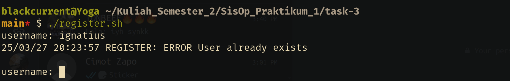

- Jika saat register, user memasukkan username yang belum terdaftar 

  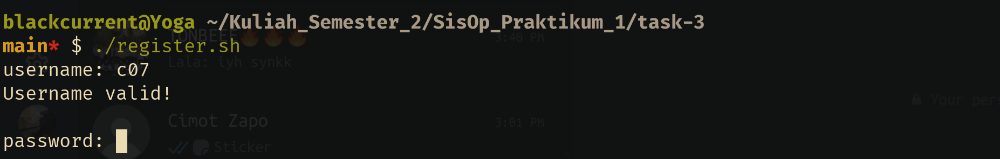

- Jika saat register, user memasukkan password yang tidak valid

  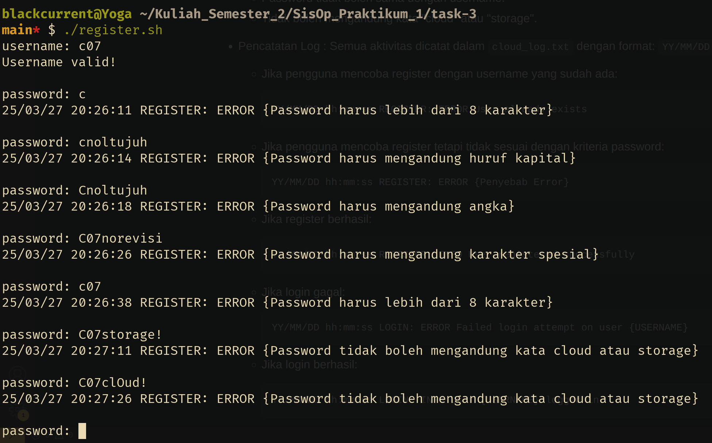

- Jika saat register, user memasukkan password yang valid

  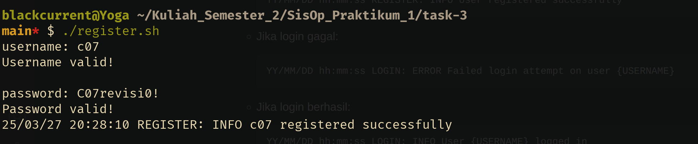

- Jika saat login, user memasukkan username atau password yang salah

  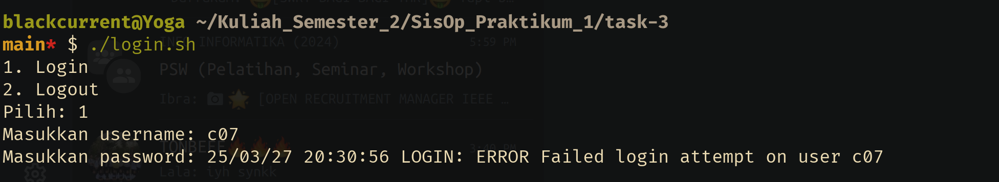

- Jika saat login, user memasukkan username dan password yang benar

  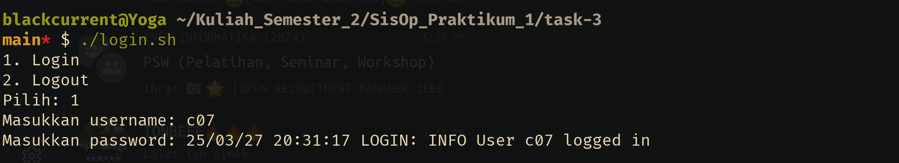

- Jika saat logout, user memasukkan username yang sama dengan username yang login

  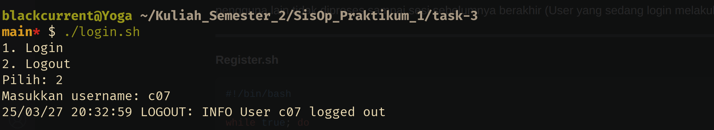

- Jika saat logout, user memasukkan username yang tidak sama dengan username yang login

  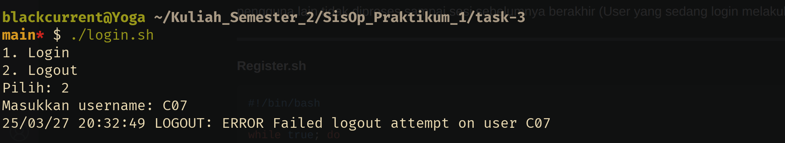

- Sebelum automation berjalan

  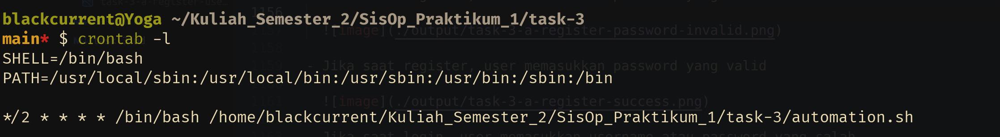

- Setelah automation berjalan

  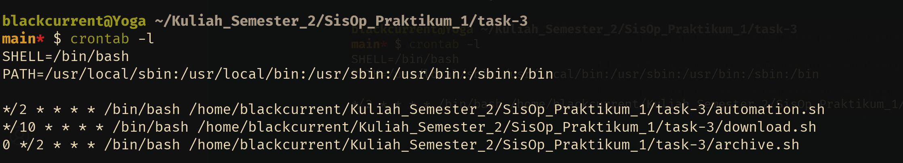

- Hasil dari download.sh

  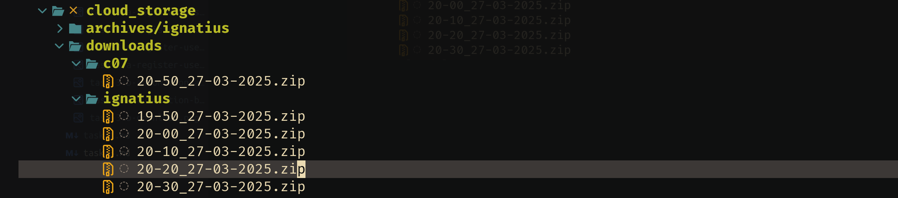

- Hasil dari archive.sh

  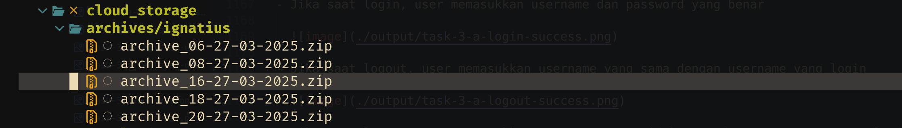

- log bisa dilihat pada [cloud_log.txt](./task-3/cloud_storage/cloud_log.txt)


## Proxy Terbaik di New Eridu

**Belle dan Wise** adalah Proxy dengan nama **Phaethon** di Kota New Eridu yang menyamar sebagai warga biasa dengan membuka **Toko Video di Sixth Street**. Suatu hari, Wise meminta Belle untuk memantau setiap server yang berjalan di PC mereka karena biaya listrik bulanan yang tinggi. Karena Belle terlalu sibuk mengelola Toko Video, ia meminta bantuan kalian (**Proxy yang Hebat**) untuk membuat program monitoring ini.

Buatlah program untuk memantau sumber daya pada setiap server. Program ini hanya perlu memantau:

- **Penggunaan RAM** menggunakan perintah `free -m`.
- **Ukuran suatu direktori** menggunakan perintah `du -sh <target_path>`.
- **Uptime** menggunakan perintah `uptime` dan ambil bagian yang menunjukkan waktu berjalan.
- **Load average** menggunakan perintah `cat /proc/loadavg` dan ambil tiga nilai pertama (1, 5, dan 15 menit).
- **Catat semua metrics** yang diperoleh dari hasil `free -m`. Untuk hasil `du -sh <target_path>`, catat ukuran dari path direktori tersebut. Direktori yang akan dipantau adalah `/home/{user}/`.

---

### Cara Pengerjaan
#### 1. Membuat File Log Monitoring Sistem

Buat file `minute5_log.sh` untuk mencatat penggunaan memori, swap, dan penyimpanan setiap **5 menit**.
```bash
touch minute5_log.sh
chmod +x minute5_log.sh
```

Isi file `minute5_log.sh` dengan kode berikut:
```bash
#!/bin/bash

curTime=$(date "+%Y%m%d%H%m%s")
user=$(whoami)
logDir="/home/$user/metrics/"
fileName="metrics_$curTime.log"

if [ ! -d $logDir ]; then
    mkdir -p $logDir
fi

memory="$(free -m | awk '/Mem:/ {printf"%s,%s,%s,%s,%s,%s", $2,$3,$4,$5,$6,$7}")"
swap="$(free -m | awk '/Swap:/ {printf"%s,%s,%s", $2,$3,$4}")"
storage="$(du -sh /home/$user/ | awk '{printf"%s,%s", $2,$1}')"

echo "mem_total,mem_used,mem_free,mem_shared,mem_buff,mem_available,swap_total,swap_used,swap_free,path,path_size" > $logDir$fileName
echo "$memory,$swap,$storage" >> $logDir$fileName

chmod 400 $logDir$fileName
```
#### Penjelasan
- **Inisialisasi Variabel**  
   - Script mengambil timestamp saat ini (`curTime`) dalam format `YYYYMMDDHHMMSS`, nama pengguna (`user`), direktori penyimpanan log (`logDir`), dan menentukan nama file log (`fileName`).  
   - Ini memastikan setiap file log memiliki nama unik berdasarkan waktu eksekusi.  
- **Cek dan Buat Direktori Log**  
   - Script memeriksa apakah direktori log (`/home/$user/metrics/`) sudah ada.  
   - Jika belum ada, script membuatnya dengan `mkdir -p`, memastikan direktori tersedia sebelum menyimpan log.  
- **Mengumpulkan Data Sistem**  
   - **Memori:** Menggunakan `free -m` dan `awk` untuk mengambil data seperti total memori, yang digunakan, yang tersedia, dan buffer.  
   - **Swap:** Menggunakan `free -m` untuk mendapatkan total swap, yang digunakan, dan yang tersisa.  
   - **Storage:** Menggunakan `du -sh` untuk mengetahui ukuran direktori home pengguna.  
   - Semua data diformat dalam CSV untuk mempermudah analisis.  
- **Menyimpan Data ke File Log**  
   - Script menuliskan header CSV ke file log untuk menunjukkan struktur data.  
   - Data metrik sistem yang dikumpulkan kemudian ditambahkan ke file log dalam format yang rapi dan mudah dibaca.  

- **Mengatur Keamanan File Log**  
   - File log diberikan izin `chmod 400`, yang membuatnya hanya bisa dibaca oleh pemiliknya.  
   - Ini mencegah perubahan atau akses oleh pengguna lain, menjaga keamanan data sistem.  

Script Bash ini berfungsi untuk mencatat metrik sistem seperti penggunaan memori, swap, dan ukuran direktori home pengguna ke dalam file log dengan format CSV. Script ini dimulai dengan mengambil timestamp dan nama pengguna untuk menentukan lokasi serta nama file log. Jika direktori penyimpanan belum ada, script akan membuatnya terlebih dahulu. Data sistem dikumpulkan menggunakan perintah free -m untuk memori dan swap, serta du -sh untuk ukuran direktori, lalu diformat menggunakan awk sebelum ditulis ke file log. 

### Output


Pertama kita run dengan masukin ./minute5_log.sh, lalu buka folder metrcisnya, kemudian di ls, lalu pilih format (metrics yyyymmdd paling baru yang bawah seperti di gambar) kemudian masukin syntaxnya cat (metrics yang dipilih tadi), maka akan keluar output seperti pada gambar.

---

### 2. Mengagregasi Log Setiap Jam

Buat file `agg_5min_to_hour.sh` untuk menggabungkan log setiap 5 menit menjadi laporan per jam.
```bash
touch agg_5min_to_hour.sh
chmod +x agg_5min_to_hour.sh
```

Isi file `agg_5min_to_hour.sh` dengan kode berikut:
```bash
#!/bin/bash

user=$(whoami)
logDir="/home/$user/metrics/"
outputFile="$logDir/hourly_metrics_$(date "+%Y%m%d%H").log"

cat $logDir/metrics_$(date "+%Y%m%d%H")*.log > $outputFile
chmod 400 $outputFile
```
#### Penjelasan 
- **Inisialisasi Variabel**  
   - Script mengambil nama pengguna (`user`), waktu saat ini (`curTime`) dalam format `YYYYMMDDHH`, dan menentukan direktori penyimpanan log (`logDir`).  
   - Nama file log agregat juga dibuat dengan format `metrics_agg_<timestamp>.log`.  
- **Menghitung Statistik Metrik Sistem**  
   - Script membaca semua file log metrik dalam satu jam (`metrics_<timestamp>*.log`).  
   - Menggunakan kombinasi `grep`, `awk`, dan `sort` untuk menghitung nilai **maksimum, minimum, dan rata-rata** dari berbagai parameter seperti:  
     - **Total memori, memori yang digunakan, memori bebas, memori shared, buffer, dan memori yang masih bisa digunakan.**  
     - **Total swap, swap yang digunakan, dan swap yang tersisa.**  
     - **Ukuran direktori home pengguna.**  
   - Nilai rata-rata dihitung dengan `awk` menggunakan pendekatan penjumlahan total lalu dibagi jumlah data.  
- **Menyimpan Hasil ke File Log Agregat**  
   - Header CSV ditulis ke file log agregat untuk menunjukkan struktur data:  
     ```bash
     echo "type,mem_total,mem_used,mem_free,mem_shared,mem_buff,mem_available,swap_total,swap_used,swap_free,path,path_size" > $logDir"metrics_agg_"$curTime.log
     ```
   - Tiga baris ditambahkan ke dalam file log:  
     - **Minimum**: Menyimpan nilai terendah dari setiap parameter.  
     - **Maksimum**: Menyimpan nilai tertinggi dari setiap parameter.  
     - **Rata-rata**: Menyimpan rata-rata dari setiap parameter.  
- **Mengamankan File Log Agregat**  
   - Menggunakan `chmod 400` untuk membatasi akses file agar hanya bisa dibaca oleh pemiliknya, menjaga keamanan data metrik sistem.  

#### **Tambahan :**  
Script ini menganalisis log metrik sistem dalam satu jam terakhir, menghitung nilai maksimum, minimum, dan rata-rata untuk parameter terkait memori, swap, dan storage pengguna, lalu menyimpannya ke dalam file log agregat yang aman. Ini membantu dalam pemantauan dan analisis performa sistem secara otomatis. 🚀
## Output


Kita run agg_5min_to_hour.sh nya, lalu kita ls pada direktori metrics, kita cari yang formatnya (metrics_agg_yyyymmdd) paling baru, Setelah itu kita cat metrics barusan dan akan mendapatkan output seperti pada gambar.

---

### 3. Monitoring Uptime dan Load Average

Buat file `uptime_monitor.sh` untuk mencatat uptime dan load average.
```bash
touch uptime_monitor.sh
chmod +x uptime_monitor.sh
```

Isi file `uptime_monitor.sh` dengan kode berikut:
```bash
#!/bin/bash

curTime=$(date "+%Y%m%d%H")
user=$(whoami)
fileName="/home/$user/metrics/uptime_$curTime.log"

upTm=$(uptime | awk '{printf "%s %s %s", $1, $2, $3}')
load=$(cat /proc/loadavg | awk '{printf "%s,%s,%s", $1, $2, $3}')

echo "uptime,load_avg_1min,load_avg_5min,load_avg_15min" > $fileName
echo "$upTm,$load" >> $fileName
```
#### Penjelasan
Script Bash ini digunakan untuk mencatat informasi uptime sistem dan load average dalam interval 1, 5, dan 15 menit terakhir ke dalam file log berformat CSV. File log ini disimpan di direktori `/home/<user>/metrics/` dengan nama `uptime_<timestamp>.log`, di mana `<timestamp>` mewakili tahun, bulan, hari, dan jam saat script dijalankan. Script ini memanfaatkan beberapa perintah sistem seperti `uptime`, `awk`, dan membaca `/proc/loadavg` untuk mengumpulkan data.

- **Inisialisasi Variabel**  
   - `curTime=$(date "+%Y%m%d%H")` → Mengambil timestamp saat ini dalam format **YYYYMMDDHH** (tahun, bulan, hari, dan jam). Ini memastikan setiap file log memiliki nama unik berdasarkan waktu eksekusi.  
   - `user=$(whoami)` → Mengambil nama pengguna yang menjalankan script untuk digunakan dalam path file log.  
   - `fileName="/home/$user/metrics/uptime_$curTime.log"` → Menentukan lokasi file log di dalam direktori home pengguna dengan nama file yang menyertakan timestamp.  

- **Mengumpulkan Data Uptime dan Load Average**  
   - **Mengambil Uptime (`upTm`)**  
     - `uptime` digunakan untuk mengambil informasi waktu sistem berjalan.  
     - `awk '{printf "%s %s %s", $1, $2, $3}'` digunakan untuk mengekstrak tiga kata pertama dari output `uptime`, yang biasanya menunjukkan waktu saat ini dan durasi uptime sistem.  
   - **Mengambil Load Average (`load`)**  
     - Load average menunjukkan rata-rata jumlah proses yang berjalan dalam sistem dalam interval 1, 5, dan 15 menit terakhir.  
     - Data ini dibaca langsung dari `/proc/loadavg`, file sistem Linux yang menyimpan informasi load average.  
     - `awk '{printf "%s,%s,%s", $1, $2, $3}'` digunakan untuk mengambil tiga nilai pertama dari `/proc/loadavg`, yaitu load average selama 1, 5, dan 15 menit terakhir, lalu memformatnya dalam bentuk CSV.  

- **Menyimpan Data ke File Log**  
   - Baris pertama dari file log ditulis dengan header CSV menggunakan:  
     ```bash
     echo "uptime,load_avg_1min,load_avg_5min,load_avg_15min" > $fileName
     ```
     Ini memastikan data yang disimpan memiliki struktur yang jelas saat dianalisis.  
   - Data uptime dan load average kemudian ditambahkan ke file log dalam format CSV:  
     ```bash
     echo "$upTm,$load" >> $fileName
     ```
     Dengan format ini, file log dapat digunakan untuk melacak performa sistem dari waktu ke waktu dengan mudah.
### Output


Kita run uptime_monitor.sh nya, kita cari di direktori metrics, akan ada file yang formatnya (uptime_yyyymmdd), kita pilih yang paling bawah alias paling baru kemudian kita buka dengan syntax (cat uptime_yyymmdd) tadi.

---

### 4. Cleanup Log Lama

Buat file `cleanup_log.sh` untuk menghapus log agregasi.
```bash
touch cleanup_log.sh
chmod +x cleanup_log.sh
```

Isi file `cleanup_log.sh` dengan kode berikut:
```bash
#!/bin/bash

user="$(whoami)"

curTime=$(date "+%Y%m%d%H")
user=$(whoami)
logDir="/home/$user/metrics/"
fileName="metrics_$curTime.log"

chmod 700 $logDir"metrics_agg_"*.log

rm $logDir"metrics_agg_"*.log
```
#### Penjelasan
Script Bash ini digunakan untuk mengelola file log agregat metrik sistem yang tersimpan di direktori `/home/<user>/metrics/`. Pertama, script memastikan bahwa hanya pemilik file yang dapat mengakses file log dengan mengubah izin file. Setelah itu, script menghapus semua file log agregat lama untuk mencegah penumpukan data yang tidak diperlukan. 

- **Inisialisasi Variabel**  
   - `user="$(whoami)"` → Mengambil nama pengguna yang menjalankan script.  
   - `curTime=$(date "+%Y%m%d%H")` → Mengambil timestamp saat ini dalam format **YYYYMMDDHH** (tahun, bulan, hari, dan jam).  
   - `logDir="/home/$user/metrics/"` → Menentukan lokasi penyimpanan file log metrik dalam direktori home pengguna.  
   - `fileName="metrics_$curTime.log"` → Mendefinisikan nama file log berdasarkan timestamp saat ini (walaupun tidak digunakan lebih lanjut dalam script ini).  

- **Mengubah Izin File Log Agregat**  
   - `chmod 700 $logDir"metrics_agg_"*.log`  
     - Mengubah izin semua file log agregat (`metrics_agg_*.log`) di dalam direktori `metrics`.  
     - Izin `700` berarti **hanya pemilik file yang memiliki akses penuh** (membaca, menulis, dan mengeksekusi), sedangkan pengguna lain tidak dapat mengaksesnya.  
     - Langkah ini dilakukan sebelum penghapusan untuk memastikan bahwa file hanya bisa dihapus oleh pemiliknya dan tidak dapat diakses oleh pihak lain.  

- **Menghapus File Log Agregat Lama**  
   - `rm $logDir"metrics_agg_"*.log`  
     - Menghapus semua file log agregat (`metrics_agg_*.log`) yang ada di direktori `metrics`.  
     - Ini dilakukan untuk membersihkan file log lama yang mungkin tidak lagi diperlukan, sehingga menghemat ruang penyimpanan dan menjaga agar sistem tetap rapi.  

Script ini, dapat membantu sistem secara otomatis menghapus file log lama setelah memastikan bahwa file tersebut tidak dapat diakses oleh pengguna lain, menjaga keamanan dan efisiensi dalam pengelolaan log metrik.

### Output


Nah untuk menghapus aggregasi kita perlu menjalankan cleanup_log.sh, dan saat kita ls direktori metrics, maka log yang formatnya (metrics _agg_yyyymmdd) akan hilang.

---

### 5. Crontab Configuration
Pada crontab nya kita jalankan sesuai dengan perintah pada soal,

| No  | Nama File Script      | Fungsi                                               |
| --- | --------------------- | ---------------------------------------------------- |
| 1   | minute5_log.sh      | Script pencatatan metrics setiap 5 menit             |
| 2   | agg_5min_to_hour.sh | Script agregasi log per jam                          |
| 3   | uptime_monitor.sh   | Script monitoring uptime dan load average setiap jam |
| 4   | cleanup_log.sh      | Script penghapusan log lama setiap hari              |

#### Penulisan Crontab :
```bash
SHELL=/bin/bash
PATH=/usr/local/sbin:/usr/local/bin:/usr/sbin:/usr/bin:/sbin:/bin

*/5 * * * * /bin/bash /home/$USER/minute5_log.sh >> /home/$USER/metrics/minute5_log.txt 2>&1
0 * * * * /bin/bash /home/$USER/agg_5min_to_hour.sh >> /home/$USER/metrics/agg_log.txt 2>&1
0 * * * * /bin/bash /home/$USER/uptime_monitor.sh >> /home/$USER/metrics/uptime_log.txt 2>&1
0 0 * * * /bin/bash /home/$USER/cleanup_log.sh >> /home/$USER/metrics/cleanup_log.txt 2>&1
```
## **Cronjob yang dijalankan ada 4, yaitu :**  
   - **Menjalankan `minute5_log.sh` setiap 5 menit**  
     ```bash
     */5 * * * * /bin/bash /home/rizky/SisOp_Praktikum_1/task-4/minute5_log.sh >> /home/rizky/metrics/minute5_log.txt 2>&1
     ```
     - Script ini berjalan **setiap 5 menit**.  
     - Output dan error dari eksekusi script disimpan di file log `/home/rizky/metrics/minute5_log.txt`.  
     - Kemungkinan besar, script ini mencatat metrik sistem dalam interval 5 menit untuk pemantauan berkala.  

   - **Mengagregasi log setiap jam**  
     ```bash
     0 * * * * /bin/bash /home/rizky/SisOp_Praktikum_1/task-4/agg_5min_to_hour.sh >> /home/rizky/metrics/agg_log.txt 2>&1
     ```
     - Script ini berjalan **setiap jam pada menit ke-0** (misalnya pukul 01:00, 02:00, dst.).  
     - Kemungkinan besar, script ini mengambil data log 5 menit sebelumnya dan menggabungkannya menjadi data metrik per jam.  
     - Hasilnya dicatat dalam file log `/home/rizky/metrics/agg_log.txt`.  

   - **Memantau uptime setiap jam**  
     ```bash
     0 * * * * /bin/bash /home/rizky/SisOp_Praktikum_1/task-4/uptime_monitor.sh >> /home/rizky/metrics/uptime_log.txt 2>&1
     ```
     - Script ini berjalan **setiap jam pada menit ke-0**.  
     - Kemungkinan besar, script ini mencatat waktu uptime sistem dan load average, lalu menyimpannya ke `/home/rizky/metrics/uptime_log.txt`.  

   - **Membersihkan log setiap hari pada tengah malam**  
     ```bash
     0 0 * * * /bin/bash /home/rizky/SisOp_Praktikum_1/task-4/cleanup_log.sh >> /home/rizky/metrics/cleanup_log.txt 2>&1
     ```
     - Script ini berjalan **setiap hari pada pukul 00:00**.  
     - Kemungkinan script ini menghapus file log lama untuk menghemat ruang penyimpanan.  
     - Hasil proses pembersihan dicatat dalam `/home/rizky/metrics/cleanup_log.txt`.  

Dengan konfigurasi cron job ini, sistem dapat secara otomatis mengumpulkan, mengagregasi, dan mengelola log metrik secara berkala tanpa perlu intervensi manual, memastikan efisiensi dalam pemantauan sistem.
#### Seperti dibawah ini,


Untuk yang minute5_log.sh akan diatur tiap 5 menit, kemudian untuk agg_5min_to_hour.sh akan diatur tiap jam, begitu seterusnya sesuai perintah dan akan masuk ke file lognya seperti di gambar...
