[](https://classroom.github.com/a/9LcL5VTQ)
|    NRP     |            Name            |
| :--------: | :------------------------: |
| 5025241134 | Gilbran Mahdavikia Raja    |
| 5025241148 | Muhammad Zaky Zein         |
| 5025241171 | Muhammad Sholihuddin Rizky |

# Praktikum Modul 2 _(Module 2 Lab Work)_

</div>

### Daftar Soal _(Task List)_

- [Task 1 - Trabowo & Peddy Movie Night](/task-1/)

- [Task 2 - Organize and Analyze Anthony's Favorite Films](/task-2/)

- [Task 3 - Cella’s Manhwa](/task-3/)

- [Task 4 - Pipip's Load Balancer](/task-4/)

### Laporan Resmi Praktikum Modul 2 _(Module 2 Lab Work Report)_

Tulis laporan resmi di sini!

_Write your lab work report here!_

# task-1 Trabowo & Peddy Movie Night
### a. Ekstraksi File ZIP
```c
    char *filename = "trabowo.zip";
```
> buat string untuk nama file zip yang akan didowndload
```c
    if(fork() == 0) {
        char cmd[512];
        snprintf(cmd, sizeof(cmd), "wget -q -O %s \"https://drive.usercontent.google.com/u/0/uc?id=1nP5kjCi9ReDk5ILgnM7UCnrQwFH67Z9B&export=download\"", filename);
        execlp("sh", "sh", "-c", cmd, NULL);
        exit(0);
    }
    wait(NULL);
```
> Buat child process baru dengan `fork()` dan jalankan command wget dengan fungsi `execlp()`. Gunakan `wait(NULL)` untuk menunggu process child selesai (memastikan file zip sudah terdownload sebelum melakukan operasi-operasi lainnya) sebelum melanjutkan parent process.\
Jalankan command `wget -q -O <nama_file> <link_download>` untuk mendownload file film. `-q -O` artinya adalah menjalankan `wget` secara quiet dan mendownloadnya dengan nama file yang lain.\
Gunakan string `cmd` dan gunakan `snprintf` untuk melakukan formatting pada string `cmd`.
```c
    if(fork() == 0) {
        char cmd[512];
        snprintf(cmd, sizeof(cmd), "unzip -q %s", filename);
        execlp("sh", "sh", "-c", cmd, NULL);
    }
    wait(NULL);
```
> Buat child process baru dengan `fork()` dan jalankan command `unzip` dengan fungsi `execlp()` untuk melakukan unzip pada file zip yang sudah didownload sebelumnya. Tetap gunakan `wait(NULL)` untuk memastikan file telah terunzip sebelum menghapusnya.\
`unzip -q <nama_file>` untuk menjalankan command unzip dalam quiet mode.
```c
    if(fork() == 0) {
        char cmd[512];
        snprintf(cmd, sizeof(cmd), "rm -rf %s", filename);
        execlp("sh", "sh", "-c", cmd, NULL);
        exit(0);
    }
```
> Buat child process baru dengan `fork()` dan jalankan command `rm -rf <nama_file>` untuk menghapus file zip.

Output:\
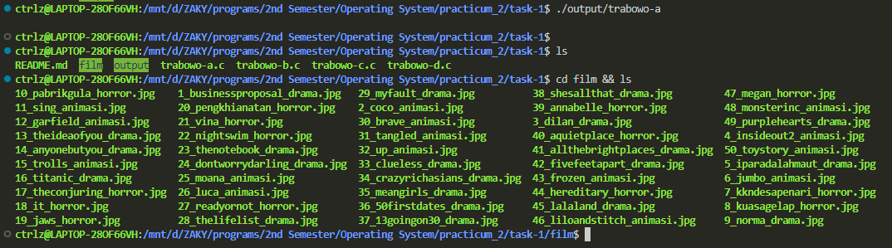

### b. Pemilihan Film Secara Acak
```c
    char cmd[512];
    snprintf(cmd, sizeof(cmd), "find ./film -maxdepth 1 -type f | shuf -n 1 | awk -F'/' '{ print \"Film for Trabowo & Peddy: \" $3 }'");
    execlp("sh", "sh", "-c", cmd, NULL);
```
> Jalankan command bash dengan fungsi `execlp()`.\
`find ./film -maxdepth 1 -type f`\
untuk mencari file pada directory film dengan maksimal depth 1, artinya tidak akan mencari file dalam subdirectory.\
`shuf -n 1`\
untuk melakukan shufle dan mengambil hanya 1 file saja.\
contoh outputnya: `./film/18_it_horror.jpg`\
`awk -F'/' '{ print \"Film for Trabowo & Peddy: \" $3 }'`\
gunakan awk untuk mengubah formatnya, print string yang ada di soal, lalu $3 karena nama filenya ada di field ke-3 yang dipisahkan oleh delimiter berupa `/`.

Output:\
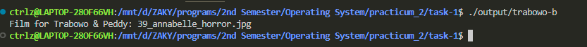

### c. Memilah Film Berdasarkan Genre
```c
#define NFNAME 64
#define NFILES 50

const char *dirname = "./film";

void mkdir();
void f_list(char files[][NFNAME], int *idx);
void mv_log(char *fname, char *genre, int who);
void f_folder(char files[][NFNAME], int start, int end, int who);
void f_worker(char files[][NFNAME], int idx);
int f_count(char *genre);
void total(int cnt[]);

int main() {
    char files[NFILES][NFNAME];
    int idx = 0, cnt[4] = {0};  // [0]=cnt_horror ; [1]=cnt_animasi ; [2]=cnt_drama ; [3]=cnt_max

    mkdir();
    f_list(files, &idx);
    f_worker(files, idx);

    cnt[0] = f_count("FilmHorror");
    cnt[3] = (cnt[0] > cnt[3]) ? cnt[0] : cnt[3];
    cnt[1] = f_count("FilmAnimasi");
    cnt[3] = (cnt[1] > cnt[3]) ? cnt[1] : cnt[3];
    cnt[2] = f_count("FilmDrama");
    cnt[3] = (cnt[2] > cnt[3]) ? cnt[2] : cnt[3];

    total(cnt);

    return 0;
}
```
> Fungsi `main()` akan memanggil fungsi `mkdir()` terlebih dahulu untuk membuat directory yang diperlukan, lalu memanggil fungsi `f_list()` unduk mendapatkan list file, dan dilanjutkan dengan menjalankan kedua worker untuk memindahkan file ke dalam directory sesuai dengan genrenya. Setelah itu, cari genre dengan jumlah terbanyak, lalu panggil fungsi `total()` untuk membuat file `total.txt`\
Di sini ada 7 fungsi yang masing-masing berfungsi untuk:\
`mkdir()` bukan fungsi dari library di C, fungsi ini gunanya untuk membuat 3 subdirectory dalam directory `./film`. yaitu FilmHorror FilmAnimasi FilmDrama.\
`f_list()` fungsi untuk mendapatkan list file yang terurut berdasarkan nomor film.\
`mv_log` fungsi untuk melakukan pemindahan file dan melakukan logging untuk setiap file yang dipindah.\
`f_folder` fungsi untuk melakukan iterasi pada file dan memilahnya sesuai dengan genre film (memanggil fungsi `mv_log` dengan parameter sesuai genre film).\
`f_worker` fungsi untuk menjalankan 2 worker sekaligus (Peddy dan Trabowo :3).\
`f_count` fungsi untuk menghitung jumlah dari masing-masing genre.\
`total` fungsi untuk membuat file `total.txt`.\

```c
void mkdir() {
    if(fork() == 0) {
        char cmd[512];
        snprintf(cmd, sizeof(cmd), "cd %s && mkdir -p FilmHorror FilmAnimasi FilmDrama", dirname);
        execlp("sh", "sh", "-c", cmd, NULL);
        exit(0);
    }
    wait(NULL);
}
```
> Fungsi ini akan menjalankan command  `mkdir` dengan menggunakan `execlp` pada process baru untuk membuat 3 folder yang diminta pada soal, yaitu FilmHorror, FilmAnimasi, dan FilmDrama


```c
void f_list(char files[][NFNAME], int *idx) {
    int fd[2];
    pipe(fd);

    if(fork() == 0) {
        close(fd[0]);
        dup2(fd[1], STDOUT_FILENO);
        close(fd[1]);
        
        char cmd[512];
        snprintf(cmd, sizeof(cmd), "cd %s && ls -1 *.jpg | sort -V", dirname);
        execlp("sh", "sh", "-c", cmd, NULL);
        exit(0);
    } else {        
        close(fd[1]);
        char buff[NFILES * NFNAME + NFILES];
        ssize_t nbytes = read(fd[0], buff, sizeof(buff) - 1);
        buff[nbytes] = '\0';
        close(fd[0]);

        char *token = strtok(buff, "\n");
        while(token && *idx < NFILES) {
            strncpy(files[(*idx)++], token, NFNAME);
            token = strtok(NULL, "\n");
        }
    }
    wait(NULL);
}
```
> Fungsi ini gunanya untuk mendapatkan list-list nama file yang terurut dan menyimpannya pada sebuah array of string. Cara kerjanya adalah dengan menjalankan command `cd ./film && ls -1 *.jpg | sort -V` pada child process untuk mendapatkan nama-nama file secara terurut berdasarkan nomor versi, lalu pipe hasil outputnya kedalam input dari parent process dengan fungsi `read()`, setelah buffer didapatkan, maka pisahkan ke dalam masing-masing index pada array dengan menggunakan token berupa `\n` yang merepresentasikan baris baru.

```c
void mv_log(char *fname, char *genre, int who) {
    if(fork() == 0) {
        char cmd[512];
        snprintf(cmd, sizeof(cmd), "cd %s && mv -n %s ./%s", dirname, fname, genre);
        execlp("sh", "sh", "-c", cmd, NULL);
        exit(0);
    }
    wait(NULL);

    if(fork() == 0) {
        char cmd[512];
        char *name;
        name = (who == 0) ? "Peddy" : "Trabowo";
        snprintf(cmd, sizeof(cmd), "echo \"[$(date +'%%d-%%m-%%Y %%H:%%M:%%S')]\" %s: %s telah dipindahkan ke %s >> recap.txt", name, fname, genre);
        execlp("sh", "sh", "-c", cmd, NULL);
        exit(0);
    }
    wait(NULL);
}
```
> Fungsi di atas gunanya adalah untuk memindahkan file sekaligus membuat log filenya setelah pemindahan file berhasil dilakukan. Pada fungsi  tersebut terdapat dua process, process pertama akan menjalankan command mv untuk memindahkan file berdasarkan folder genrenya. Setelah memastikan process pertama sudah berjalan secara lancar, process kedua akan menjalankan command untuk membuat log yang akan di append ke file recap.txt. Variable `who` akan merepresentasikan siapa workernya, apakah Peddy atau Trabowo, jika who bernilai 0, maka direpresentasikan sebagai Peddy dan jika who bernilai 1, maka direpresentasikan sebagai Trabowo.

```c
void f_folder(char files[][NFNAME], int start, int end, int who) {
    for (start; start < end; start++) {     
        if(strstr(files[start], "_animasi")) mv_log(files[start], "FilmAnimasi", who);
        else if(strstr(files[start], "_drama")) mv_log(files[start], "FilmDrama", who);
        else if(strstr(files[start], "_horror")) mv_log(files[start], "FilmHorror", who);
    }
}
```
> Fungsi tersebut gunanya untuk melakukan iterasi pada nama-nama files yang akan dipindahkan sekaligus melakukan sortir berdasarkan genrenya yang selanjutnya proses pemindahan dan juga pembuatan log filenya akan dijalankan oleh fungsi `mv_log` sebelumnya. Fungsi ini melakukan iterasi dari start dan end yang berbeda, tergantung dengan workernya, Jika workernya adalah 0 (Peddy), maka dia akan melakukan iterasi dari index 0 sampai dengan setengah dari jumlah files, sedangkan jika workernya adalah 1 (Trabowo), maka dia akan melakukan iterasi dari index tengah sampai akhir.

```c
void f_worker(char files[][NFNAME], int idx) {
    if(fork() == 0) {
        f_folder(files, 0, idx / 2, 0);
        exit(0);
    }
    
    if(fork() == 0) {
        f_folder(files, idx / 2, idx, 1);
        exit(0);
    }

    wait(NULL);
    wait(NULL);
}
```
> Fungsi ini adalah fungsi untuk menjalankan dua worker secara bersamaan, 0 merepresentasikan Peddy, dan 1 merepresentasikan Trabowo.

```c
int f_count(char *genre) {
    int film, fd[2];

    pipe(fd);

    if(fork() == 0) {
        dup2(fd[1], STDOUT_FILENO);
        close(fd[0]);
        close(fd[1]);

        char cmd[512];
        snprintf(cmd, sizeof(cmd), "cd %s/%s && ls -1 | wc -l", dirname, genre);
        execlp("sh", "sh", "-c", cmd, NULL);
        exit(0);
    }

    wait(NULL);
    
    char buff[10];
    ssize_t nbytes = read(fd[0], buff, sizeof(buff) - 1);
    buff[nbytes] = '\0';
    film = atoi(buff);
    
    close(fd[0]);
    close(fd[1]);

    return film;
}
```
> Fungsi `f_count()` di atas berfungsi untuk menghitung jumlah film dari masing-masing genre, langkah kerjanya adalah dengan membuat sebuah child process yang akan menjalankan command `cd %s/%s && ls -1 | wc -l` untuk mendapatkan jumlah baris file dari suatu genre. Outputnya tidak akan ditampilkan di terminal, melainkan akan dipipe sebagai input pada parent process yang bisa didapat dengan fungsi `read()`. Setelah mendapat string dari jumlah filmnya, ubah stringnya menjadi integer dengan fungsi `atoi()` dan return hasilnya.

```c
void total(int cnt[]) {
    if(fork() == 0) {
        char genre[NFILES];
        if(cnt[3] == cnt[0]) strcpy(genre, "horror");
        if(cnt[3] == cnt[1]) strcpy(genre, "animasi");
        if(cnt[3] == cnt[2]) strcpy(genre, "drama");
        char cmd[512];
        snprintf(cmd, sizeof(cmd), "echo \"Jumlah film horror: %d\nJumlah film animasi: %d\nJumlah film drama: %d\nGenre dengan jumlah film terbanyak: %s\" > total.txt", cnt[0], cnt[1], cnt[2], genre);
        execlp("sh", "sh", "-c", cmd, NULL);
        exit(0);
    }
    wait(NULL);
}
```
> Fungsi `total()` akan membuat sebuah file `total.txt` dengan jumlah yang sudah didapatkan dari fungsi `f_count()`. `cnt[3]` adalah index yang menyimpan nilai dari jumlah file terbanyak dari semua genre. `cnt[3]` akan dibandingkan dengan `cnt[2], cnt[1], dan cnt[0]` yang masing-masing indexnya merupakan banyaknya film pada masing-masing genre. Jika `cnt[3]` (maksimum)-nya sesuai dengan salah satu index, maka string `genre[]` akan dicopy dengan nama dari genre yang sesuai.

Output:\
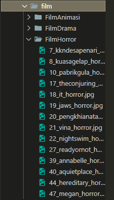
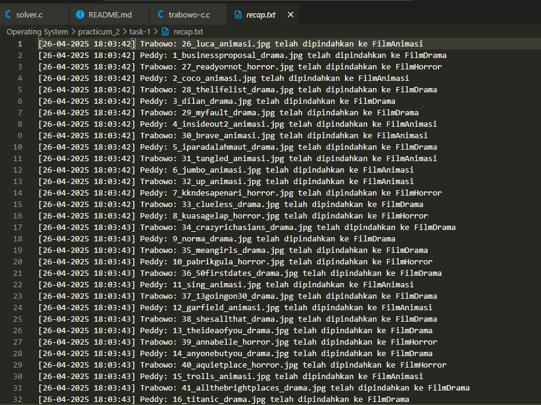
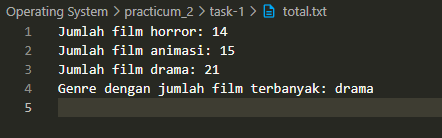

### d. Pengarsipan Film
```c
int main() {
    if(fork() == 0) {
        char cmd[512];
        snprintf(cmd, sizeof(cmd), "cd ./film && zip -rq FilmAnimasi.zip ./FilmAnimasi && rm -rf FilmAnimasi");
        execlp("sh", "sh", "-c", cmd, NULL);
        exit(0);
    }

    if(fork() == 0) {
        char cmd[512];
        snprintf(cmd, sizeof(cmd), "cd ./film && zip -rq FilmDrama.zip ./FilmDrama && rm -rf FilmDrama");
        execlp("sh", "sh", "-c", cmd, NULL);
        exit(0);
    }
    
    if(fork() == 0) {
        char cmd[512];
        snprintf(cmd, sizeof(cmd), "cd ./film && zip -rq FilmHorror.zip ./FilmHorror && rm -rf FilmHorror");
        execlp("sh", "sh", "-c", cmd, NULL);
        exit(0);
    }
}
```
> Buat 3 child process yang berjalan secara bersamaan (overlapping) yang mana masing-masing commandnya akan melakukan zip setiap directory pada directory film sesuai dengan genrenya lalu menghapus directory genrenya.

Output:\
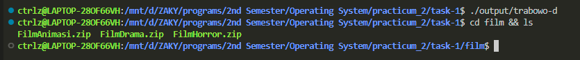

# Task 2 - Organize and Analyze Anthony's Favorite Films

Pada kesempatan ini kita akan membuat sebuah program yang ketika dirun memunculkan menu interaktif untuk mengolah dan menganalisis data film favorit dari milik Anthony.

## Overview

Program ini terdiri dari tiga fungsi utama yang dapat diakses melalui menu:
1. Download dan ekstrak file zip berisi data film
2. Kelompokkan film berdasarkan judul (abjad) dan tahun rilis
3. Buat statistik film berdasarkan negara dan tahun rilis

## Struktur Program

### Header Files
```c
#include <stdio.h>
#include <stdlib.h>
#include <unistd.h>
#include <string.h>
#include <pthread.h>
#include <sys/types.h>
#include <sys/wait.h>
#include <sys/stat.h>
#include <time.h>
#include <dirent.h>
#include <ctype.h>
#include <errno.h>
```

### Definisi Konstanta
```c
#define ZIP_FILE "NetflixCollect.zip"
#define EXTRACT_FOLDER "NetflixCollect"
#define INPUT_FILE "NetflixCollect/netflixData.csv"
#define OUTPUT_FOLDER "HasilPengelompokan"
#define JUDUL_FOLDER "HasilPengelompokan/Judul"
#define TAHUN_FOLDER "HasilPengelompokan/Tahun"
#define LOG_FILE "log.txt"
#define CSV_FILE "NetflixCollect/netflixData.csv"
#define MAX_NEGARA 1000
```

### Fungsi Menu

#### 1. Menu 1: Download & Extract
Fungsi ini bertugas untuk:
- Mendownload file zip dari Google Drive menggunakan `wget`
- Mengekstrak file zip menggunakan `unzip`
- Menghapus file zip setelah diekstrak

```c
void menu1() {
    char *download_link = "https://drive.google.com/uc?export=download&id=12GWsZbSH858h2HExP3x4DfWZB1jLdV-J";
    pid_t pid_download = fork();

    if (pid_download == 0) {
        char *args[] = {"/usr/bin/wget", "-O", ZIP_FILE, download_link, NULL};
        execv("/usr/bin/wget", args);
        perror("Download gagal");
        exit(1);
    } else {
        wait(NULL);
        pid_t pid_extract = fork();
        if (pid_extract == 0) {
            char *args1[] = {"/usr/bin/unzip", ZIP_FILE, "-d", EXTRACT_FOLDER, NULL};
            execv("/usr/bin/unzip", args1);
            perror("Extract gagal");
            exit(1);
        } else {
            wait(NULL);
            remove(ZIP_FILE);
            printf("Extract selesai dan file ZIP dihapus!\n");
        }
    }
}
```

#### 2. Menu 2: Kelompokkan Film
Fungsi ini bertugas untuk:
- Membuat folder output jika belum ada
- Membaca file CSV yang berisi data film
- Mengelompokkan film berdasarkan:
  - Abjad pertama judul film (A.txt, B.txt, ..., #.txt untuk karakter khusus)
  - Tahun rilis film (1999.txt, 2000.txt, dll)
- Mencatat log aktivitas

```c
typedef struct {
    char title[256];
    char director[256];
    int release_year;
} FilmData;

void create_folder(const char *folder_name) {
    struct stat st = {0};
    if (stat(folder_name, &st) == -1) {
        mkdir(folder_name, 0755);
    }
}

void write_log(const char *activity, const char *title) {
    time_t now = time(NULL);
    struct tm *t = localtime(&now);
    char timestamp[20];
    strftime(timestamp, sizeof(timestamp), "[%H:%M:%S]", t);

    pthread_mutex_lock(&log_mutex);
    FILE *log = fopen(LOG_FILE, "a");
    if (log != NULL) {
        fprintf(log, "%s Proses mengelompokkan berdasarkan %s: sedang mengelompokkan untuk film %s\n", 
                timestamp, activity, title);
        fclose(log);
    }
    pthread_mutex_unlock(&log_mutex);
}

void* process_film(void *arg) {
    FilmData *film = (FilmData *)arg;
    char first_char = film->title[0];
    char file_judul[512], file_tahun[512];
    char formatted_text[1024];

    if (isalpha(first_char)) {
        sprintf(file_judul, "%s/%c.txt", JUDUL_FOLDER, toupper(first_char));
    } else if (isdigit(first_char)) {
        sprintf(file_judul, "%s/%c.txt", JUDUL_FOLDER, first_char);
    } else {
        sprintf(file_judul, "%s/#.txt", JUDUL_FOLDER);
    }

    sprintf(file_tahun, "%s/%d.txt", TAHUN_FOLDER, film->release_year);
    sprintf(formatted_text, "%s - %d - %s\n", film->title, film->release_year, film->director);

    pthread_mutex_lock(&file_mutex);
    FILE *fjudul = fopen(file_judul, "a");
    if (fjudul) {
        fputs(formatted_text, fjudul);
        fclose(fjudul);
    }
    pthread_mutex_unlock(&file_mutex);
    write_log("Abjad", film->title);

    pthread_mutex_lock(&file_mutex);
    FILE *ftahun = fopen(file_tahun, "a");
    if (ftahun) {
        fputs(formatted_text, ftahun);
        fclose(ftahun);
    }
    pthread_mutex_unlock(&file_mutex);
    write_log("Tahun", film->title);

    free(film);
    pthread_exit(NULL);
}

void menu2() {
    create_folder(OUTPUT_FOLDER);
    create_folder(JUDUL_FOLDER);
    create_folder(TAHUN_FOLDER);

    FILE *csv = fopen(INPUT_FILE, "r");
    if (!csv) {
        perror("Gagal membuka file CSV");
        return;
    }

    FILE *log = fopen(LOG_FILE, "w");
    if (log) fclose(log);

    char line[1024];
    fgets(line, sizeof(line), csv); // skip header

    pthread_t threads[1024];
    int thread_count = 0;

    while (fgets(line, sizeof(line), csv)) {
        FilmData *film = malloc(sizeof(FilmData));
        if (!film) continue;

        char country[256];
        sscanf(line, "%255[^,],%255[^,],%255[^,],%d", film->title, film->director, country, &film->release_year);

        if (pthread_create(&threads[thread_count++], NULL, process_film, film) != 0) {
            perror("Gagal membuat thread");
            free(film);
            continue;
        }

        if (thread_count >= 1000) {
            for (int i = 0; i < thread_count; i++) {
                pthread_join(threads[i], NULL);
            }
            thread_count = 0;
        }
    }

    for (int i = 0; i < thread_count; i++) {
        pthread_join(threads[i], NULL);
    }

    fclose(csv);
}
```

#### 3. Menu 3: Statistik Film
Fungsi ini bertugas untuk:
- Membaca data film dari file CSV
- Menghitung jumlah film per negara
- Mengkategorikan film berdasarkan tahun rilis (sebelum/sesudah 2000)
- Menyimpan hasil statistik ke file report dengan format tanggal

```c
typedef struct {
    char negara[100];
    int before_2000;
    int after_2000;
} StatFilm;

StatFilm statistik[MAX_NEGARA];
int negara_count = 0;

void write_log_stat(const char* message, const char* filename) {
    struct stat st = {0};
    if (stat(EXTRACT_FOLDER, &st) == -1) {
        mkdir(EXTRACT_FOLDER, 0700);
    }

    char fullpath[256];
    sprintf(fullpath, "%s/%s", EXTRACT_FOLDER, filename);
    
    FILE *log = fopen(fullpath, "a");
    if (!log) {
        printf("Error: Gagal membuka file log '%s' (Error: %s)\n", fullpath, strerror(errno));
        return;
    }
    fprintf(log, "%s\n", message);
    fclose(log);
}

int find_negara_index(const char *negara) {
    for (int i = 0; i < negara_count; i++) {
        if (strcmp(statistik[i].negara, negara) == 0) {
            return i;
        }
    }
    return -1;
}

void* process_statistik(void *arg) {
    FILE *csv = fopen(CSV_FILE, "r");
    if (!csv) {
        printf("Gagal membuka file CSV! (Error: %s)\n", strerror(errno));
        pthread_exit(NULL);
    }

    char line[512];
    if (!fgets(line, sizeof(line), csv)) {
        printf("File CSV kosong atau format salah!\n");
        fclose(csv);
        pthread_exit(NULL);
    } // skip header

    char *saveptr;
    while (fgets(line, sizeof(line), csv)) {
        char *token;
        char negara[100] = "Unknown";
        int year = 0;

        token = strtok_r(line, ",", &saveptr); // title
        token = strtok_r(NULL, ",", &saveptr); // director
        token = strtok_r(NULL, ",", &saveptr); // country
        if (token) {
            strncpy(negara, token, sizeof(negara)-1);
            negara[sizeof(negara)-1] = '\0';
        }
        token = strtok_r(NULL, ",\n", &saveptr); // release_year
        if (token) {
            year = atoi(token);
        }

        pthread_mutex_lock(&lock);
        int idx = find_negara_index(negara);
        if (idx == -1) {
            if (negara_count >= MAX_NEGARA) {
                printf("Warning: Batas negara tercapai\n");
                pthread_mutex_unlock(&lock);
                continue;
            }
            idx = negara_count++;
            strncpy(statistik[idx].negara, negara, sizeof(statistik[idx].negara)-1);
            statistik[idx].before_2000 = 0;
            statistik[idx].after_2000 = 0;
        }

        if (year < 2000) statistik[idx].before_2000++;
        else statistik[idx].after_2000++;

        pthread_mutex_unlock(&lock);
    }

    fclose(csv);
    pthread_exit(NULL);
}

void menu3() {
    pthread_t tid;
    time_t t = time(NULL);
    struct tm tm = *localtime(&t);
    char filename[100];
    sprintf(filename, "report_%02d%02d%04d.txt", tm.tm_mday, tm.tm_mon + 1, tm.tm_year + 1900);

    negara_count = 0;
    memset(statistik, 0, sizeof(statistik));

    pthread_mutex_init(&lock, NULL);
    pthread_create(&tid, NULL, process_statistik, NULL);
    pthread_join(tid, NULL);
    pthread_mutex_destroy(&lock);

    if (negara_count == 0) {
        write_log_stat("Tidak ada data yang diproses (file CSV tidak ditemukan atau kosong)", filename);
        printf("Tidak ada data yang diproses. File report dibuat tetapi kosong.\n");
    } else {
        for (int i = 0; i < negara_count; i++) {
            char log_message[256];
            sprintf(log_message, "%d. Negara: %s\nFilm sebelum 2000: %d\nFilm setelah 2000: %d",
                    i + 1, statistik[i].negara, statistik[i].before_2000, statistik[i].after_2000);
            write_log_stat(log_message, filename);
        }
        printf("Statistik film selesai dihitung! File: %s/%s\n", EXTRACT_FOLDER, filename);
    }
}
```

## Cara Penggunaan

1. Kompilasi program:
   ```bash
   gcc -o Anthony Anthony.c -lpthread
   ```

2. Jalankan program:
   ```bash
   ./film_organizer
   ```

3. Pilih menu yang tersedia:
   - 1: Download dan ekstrak data film
   - 2: Kelompokkan film berdasarkan judul dan tahun
   - 3: Buat statistik film
   - 0: Keluar dari program

## Output yang Dihasilkan

1. Menu 1:
   - File `NetflixCollect.zip` akan didownload
   
   
   - File akan diekstrak ke folder `NetflixCollect`
   
   
   - File zip akan dihapus setelah ekstraksi
   

2. Menu 2:
   - Folder `HasilPengelompokan` akan dibuat
   - Subfolder `Judul` dan `Tahun` akan berisi file-file hasil pengelompokan
   
   
   - File `log.txt` akan mencatat aktivitas pengelompokan
  
    

3. Menu 3:
   - File report dengan format `report_DDMMYYYY.txt` akan dibuat di folder `NetflixCollect`
   - Berisi statistik jumlah film per negara yang dikategorikan berdasarkan tahun rilis
   
   

## Catatan

Pastikan:
1. Terdapat akses internet untuk mendownload file
2. Package `wget` dan `unzip` sudah terinstall

---

# task-3 Cella’s Manhwa
```c
#define MXLINK 4096
#define MXBUFF 2048
#define MXLINE 64
#define MANHWA 4

typedef struct {
    int  rls;
    char lnk[MXBUFF];
    char hrn[MXLINE];
} Waifu;

const char *dirM = "Manhwa";
const char *dirA = "Archive";
const char *dirH = "Heroines";
const char *dirI = "Images";

void make_dir(const char *);
void Summoning_the_Manhwa_Stats(char*, int [MANHWA], char [][MXLINE], char [][MXLINE], int);
void Seal_the_Scrolls(char [][MXLINE], char [][MXLINE]);
void *Making_the_Waifu_Gallery(void *);
void Zip_Save_Goodbye(char *[], char [][MXLINE], char [][MXLINE]);

void make_dir(const char *dir) {
    char cmd[512];
    snprintf(cmd, sizeof(cmd), "mkdir -p %s", dir);
    execlp("sh", "sh", "-c", cmd, NULL);
}

int main() {
    char *IDmanhwa[] = {"168827", "147205", "169731", "175521"};
    char *LKmanhwa[] = {
        "https://encrypted-tbn0.gstatic.com/images?q=tbn:ANd9GcRlmdSSDhJBbCgGHwNfAJVi0rq07v7TXu_nlw&s",
        "https://encrypted-tbn0.gstatic.com/images?q=tbn:ANd9GcQt7950IuqfQTjUQrWilemifRXTZ_lWDEAFyA&s",
        "https://d1ed0vta5mrb00.cloudfront.net/chapters/753123785/thumbnails/01b8de86-08f9-4075-8091-f7f330f3c191.jpg",
        "https://cdn.anime-planet.com/manga/primary/darling-why-cant-we-divorce-novel-1.jpg?t=1741355035"
    };
    char *HRmanhwa[] = {"Lia", "Artezia", "Adelia", "Ophelia"};
    char FILEname[MANHWA][MXLINE];
    char ZIPname[MANHWA][MXLINE];
    int Release[MANHWA];

    pid_t pid[3];

    pid[0] = fork();
    if(pid[0] == 0) {
        make_dir(dirM);
        exit(0);
    }
    
    pid[1] = fork();
    if(pid[1] == 0) {
        make_dir(dirA);
        exit(0);
    }

    pid[2] = fork();
    if(pid[2] == 0) {
        make_dir(dirH);
        exit(0);
    }

    for (int i = 0; i < 3; i++) {
        waitpid(pid[i], NULL, 0);
    }
        
    for (int i = 0; i < MANHWA; i++) Summoning_the_Manhwa_Stats(IDmanhwa[i], Release, FILEname, ZIPname, i);
    
    Seal_the_Scrolls(FILEname, ZIPname);
    
    pthread_t tid[MANHWA];
    for (int i = 0; i < MANHWA; i++) {
        Waifu *args = malloc(sizeof(*args));
        strncpy(args->lnk, LKmanhwa[i], MXBUFF);
        strncpy(args->hrn, HRmanhwa[i], MXLINE);
        args->rls = Release[i];
        pthread_create(&tid[i], NULL, Making_the_Waifu_Gallery, args);
        pthread_join(tid[i], NULL);
    }

    Zip_Save_Goodbye(HRmanhwa, FILEname, ZIPname);

    return 0;
}
```
> Terdapat array-array yang berfungsi untuk menyimpan nilai dari data-data yang diperlukan untuk fungsi-fungsi pada subtask a-d, index pada semua array merepresentasikan salah satu judul Manhwa, sesuai pada soal.\
index 0 -> Mistaken as the Monster Duke's Wife\
index 1 -> The Villainess Lives Again\
index 2 -> No, I Only Charmed the Princess!\
index 3 -> Darling, Why Can't We Divorce?\
IDmanhwa menyimpan data dari ID manhwa yang nantinya digunakan untuk `curl` ke API, LKmanhwa menyimpan link-link untuk download file gambar dari masing-masing heroine manhwa, HRmanhwa menyimpan nama-nama heroine, FILEname menyimpan nama file dengan format yang sudah ditentukan [judul versi bahasa Inggris (tanpa karakter khusus dan spasi diganti dengan underscore)], ZIPname menyimpan nama file ZIP sesuai dengan format yang sudah ditentukan (diambil dari huruf kapital nama file), Release menyimpan release date dari masing-masing manhwa.\
Selanjutnya, fungsi main akan membuat 3 process baru yang masing-masing berfungsi untuk membuat folder Manhwa, Archive, dan Heroines.\
Setelah ketiga process selesai dijalankan, selanjutnya masuk ke soal A.

### a. Summoning the Manhwa Stats
```c
void Summoning_the_Manhwa_Stats(char *IDcode, int Release[MANHWA], char FILEname[MANHWA][MXLINE], char ZIPname[MANHWA][MXLINE], int indexRelease) {
    char attr[MXLINE][MXLINE];
    int idx = 0, fd[2];
    pipe(fd);

    if(fork() == 0) {
        close(fd[0]);
        dup2(fd[1], STDOUT_FILENO);
        close(fd[1]);
        
        char cmd[512];
        snprintf(cmd, sizeof(cmd), "curl -s https://api.jikan.moe/v4/manga/%s | jq -r '.data as $d | \"\\($d.title_english)\n\\($d.status)\n\\($d.published.from | split(\"T\")[0])\", ($d.genres | map(.name) | join(\", \")), ($d.themes | map(.name) | join(\", \")), ($d.authors | map(.name) | join(\", \"))'", IDcode);
        execlp("sh", "sh", "-c", cmd, NULL);
        exit(0);
    } else {
        close(fd[1]);
        char buff[MXBUFF];
        ssize_t nbytes = read(fd[0], buff, sizeof(buff) - 1);
        buff[nbytes] = '\0';
        close(fd[0]);

        char *token = strtok(buff, "\n");
        while(token && idx < MXLINE) {
            strncpy(attr[idx++], token, MXLINE);
            token = strtok(NULL, "\n");
        }

        int j = 0, k = 0, len = strlen(attr[0]);
        char out[MXLINE], ZIP[MXLINE];
        for (int i = 0; i < len; i++) {
            if(isalnum(attr[0][i])) {
                out[j++] = attr[0][i];
            } else if(attr[0][i] == ' ') {
                out[j++] = '_';
            }
            if(isupper(attr[0][i])) ZIP[k++] = attr[0][i];
        }
        out[j] = '\0';
        ZIP[k] = '\0';

        char tmp[3];
        strncpy(tmp, attr[2] + 5, 2);
        tmp[2] = '\0';
        Release[indexRelease] = atoi(tmp);
        strncpy(FILEname[indexRelease], out, MXLINE);
        strncpy(ZIPname[indexRelease], ZIP, MXLINE);

        if(fork() == 0) {
            char cmd[1024];
            snprintf(cmd, sizeof(cmd), 
            "printf \"Title: %s\\nStatus: %s\\nRelease: %s\\nGenre: %s\\nTheme: %s\\nAuthor: %s\\n\" > ./%s/%s.txt",
            attr[0], attr[1], attr[2], attr[3], attr[4], attr[5], dirM, out);
            execlp("sh", "sh", "-c", cmd, NULL);
            exit(0);
        }
        wait(NULL);
    }
    wait(NULL);
}
```
> Fungsi untuk menjalankan soal A, sebenarnya sekaligus untuk mengambil data-data yang diperlukan ke dalam array yang sudah disebutkan sebelumnya. Cara kerjanya adalah dengan membuat child process yang akan menjalankan command `curl` ke API dan akan dipipe ke command `jq -r '<...>'` untuk melakukan parsing dan mengambil raw datanya tanpa formatting JSON sekaligus memformat ulang outputnya menjadi newline tiap datanya. Contoh output commandnya:\
Darling, Why Can't We Divorce?\
Publishing\
2024-10-02\
Fantasy, Romance\
Isekai, Villainess\
Cha, Sohee, Studio Inus\
Output di atas tidak akan ditampilkan pada terminal, akan tetapi outputnya akan dipipe sebagai input untuk parent process nantinya.\
Pada parent process, sebuah buffer akan mengambil data yang dipipe dari child process dengan fungsi `read()`, hasilnya akan dimasukkan ke dalam array of string yang bernama attr, yang masing-masing indexnya akan menampung masing-masing line dari data seperti contoh di atas. Setelah itu, Untuk mendapatkan FILEname dari masing-masing manhwa, ambil data dari line pertama, yang merupakan judul, dan cek dengan fungsi `isalnum()` untuk menghilangkan special character, dan ganti juga space dengan underscore. Untuk mendapatkan nama ZIPname, cek dengan `isupper()`. Untuk mendapatkan release date, gunakan data dari line ke-3 dan gunakan strncpy untuk mencopy bagian bulannya saja (index ke 5-6), lalu gunakan fungsi `atoi()` untuk mengubah string menjadi integer.\
Setelah semua data penting diambil, maka langkah selanjutnya adalah jalankan tujuan utama dari subtask a ini. Jalankan process baru untuk menjalankan command `printf <...>` untuk memformat ulang data-data pada attr ke dalam format yang diminta soal.

### b. Seal the Scrolls
```c
void Seal_the_Scrolls(char FILEname[MANHWA][MXLINE], char ZIPname[MANHWA][MXLINE]) {    
    for (int i = 0; i < MANHWA; i++) {
        if(fork() == 0) {
            char cmd[512];
            snprintf(cmd, sizeof(cmd), "zip -q ./%s/%s.zip ./%s/%s.txt", dirA, ZIPname[i], dirM, FILEname[i]);
            execlp("sh", "sh", "-c", cmd, NULL);
            exit(0);
        }
        wait(NULL);
    }    
}
```
> Fungsi ini akan membuat process baru untuk masing-masing manhwanya untuk menjalankan perintah `zip` dengan melakukan iterasi menggunakan for-loop.

### c. Making the Waifu Gallery
```c
void *Making_the_Waifu_Gallery(void *args) {
    Waifu *parameter = args;

    char cmdDir[MXBUFF];
    snprintf(cmdDir, sizeof(cmdDir), "cd ./%s && mkdir -p %s && cd ..", dirH, parameter->hrn);
    system(cmdDir);

    for (int i = 1; i <= parameter->rls; i++) {
        char cmd[MXLINK];
        snprintf(cmd, sizeof(cmd), "mkdir -p ./%s/%s && curl -s -o ./%s/%s/%s_%d.jpg \"%s\"", dirH, parameter->hrn, dirH, parameter->hrn, parameter->hrn, i, parameter->lnk);
        system(cmd);
    }

    free(parameter);
    return NULL;
}
```
> Fungsi ini dijalankan dengan menggunakan thread. Akan menjalankan dua command bash, command pertama akan membuat subdirectory pada directory Heroines sesuai dengan nama Heroines dari masing-masing manhwa. Selanjutnya akan menjalankan for loop yang akan berjalan sebanyak release date dari masing-masing manhwa. command yang akan dijalankan adalah `curl -s -o ./Heroines/<nama_heroines>/<nama_heroines_index>.jpg <link_download>` untuk mendownload file gambar heroines.

### d. Zip. Save. Goodbye
```c
void Zip_Save_Goodbye(char *HRmanhwa[], char FILEname[MANHWA][MXLINE], char ZIPname[MANHWA][MXLINE]) {
    for (int i = 0; i < MANHWA; i++) {
        if(fork() == 0) {
            char cmd[512];
            snprintf(cmd, sizeof(cmd), "mkdir -p ./%s/%s && cd %s && zip -q -r ../%s/%s/%s_%s.zip %s", dirA, dirI, dirH, dirA, dirI, ZIPname[i], HRmanhwa[i], HRmanhwa[i]);
            execlp("sh", "sh", "-c", cmd, NULL);
            exit(0);
        }
    }
    for (int i = 0; i < MANHWA; i++) wait(NULL);
    
    for (int i = 0; i < MANHWA; i++) {
        if(fork() == 0) {
            char cmd[512];
            snprintf(cmd, sizeof(cmd), "find ./%s/%s -type f | sort | while read -r file; do rm \"$file\"; done", dirH, HRmanhwa[i]);
            execlp("sh", "sh", "-c", cmd, NULL);
            exit(0);
        }
    }
    for (int i = 0; i < MANHWA; i++) wait(NULL);
}
```
> Fungsi ini akan melakukan iterasi untuk setiap manhwa, pada for loop pertama, akan membuat process-process yang akan menjalankan command untuk membuat subdirectory Images jika belum ada dan melakukan `zip -q -r <nama_zip> <nama_folder>` untuk zip file dalam mode quiet dan secara rekursif. Setelah semua process zip selesai, maka lakukan iterasi lagi pada for loop kedua untuk menghapus file-file pada folder Heroines secara terurut dengan abjad, masing-masing iterasi akan menjalankan command `find ./Heroines/<nama_heroines> -type f | sort | while read -r file; do rm "$file\; done`. Command tersebut akan mencari file dalam directory `./Heroines/<nama_heroines>` dan akan disort berdasarkan abjad, lalu outputnya dipipe ke while loop yang akan membaca masing-masing linenya dan menghapusnya satu-persatu.

Output:\
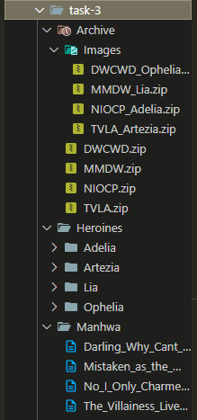
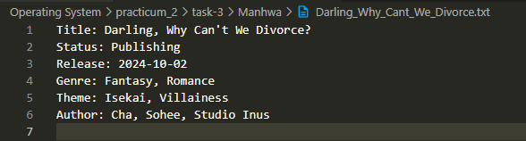

# Task-4 Pipip's Load Balancer
## Penjelasan
Program ini terdiri dari tiga file yaitu `client.c`, `loadbalancer.c`, dan `worker.c`. Program ini menggunakan segmentasi memori bersama (shared memory) dan antrian pesan (message queue) untuk mengirimkan pesan dari client ke load balancer, dan kemudian dari load balancer ke worker. Setiap worker akan menerima pesan secara bergiliran (round-robin) dan mencatat jumlah pesan yang diterima.
## Penjelasan Kode
### client.c
```c
#include <stdio.h>
#include <stdlib.h>
#include <sys/types.h>
#include <sys/shm.h>
#include <sys/ipc.h>
#include <sys/wait.h>
#include <string.h>
#include <unistd.h>

void printlog(char *logmessage) {
    char *log = malloc(1025);
    sprintf(log, "echo \"%s\\n$(cat system.log)\" > system.log", logmessage);

    pid_t pid = fork();
    if (pid == 0) {
        // Child process
        char *args[] = {"/bin/sh", "-c", log, NULL};
        execv("/bin/sh", args);
        exit(0);
    }

    wait(NULL);
    free(log);
}

int main(){
    key_t key = 1234;
    char *messages;

    int shmid = shmget(key, 1024, 0666|IPC_CREAT);
    messages = shmat(shmid, NULL, 0);

    printf("Maksukkan pesan (pesan;jumlah): ");
    fgets(messages, 1024, stdin);

    messages[strcspn(messages, "\n")] = '\0';

    char *content = malloc(1024);
    char *temp = malloc(1024);
    char *logmessage = malloc(1024);
    char *separator = strchr(messages, ';');
    if (separator) {
        size_t len = separator - messages;
        strncpy(content, messages, len);
        strcpy(temp, separator + 1);
    }

    shmdt(messages);
    int count = atoi(temp);

    sprintf(logmessage, "Message from client: %s\nMessage count: %d", content, count);
    printlog(logmessage);

    wait(NULL);
    free(content);
    free(temp);
    free(logmessage);

    return 0;
}
```
- #### Fungsi `printlog`
    Fungsi ini digunakan untuk mencetak pesan log ke dalam file `system.log`. Fungsi ini menerima parameter `logmessage`, yang merupakan pesan log yang ingin dicetak. Fungsi ini membuat sebuah string `log` yang berisi perintah shell untuk mencetak pesan log dan isi dari file `system.log` ke dalam file `system.log`, dengan begitu log terbaru akan berada di paling atas file. Kemudian, fungsi ini membuat proses anak menggunakan `fork()`, di mana proses anak akan menjalankan perintah shell tersebut menggunakan `execv()`. Setelah itu, proses induk menunggu proses anak selesai dengan `wait(NULL)`, dan akhirnya membebaskan memori yang dialokasikan untuk string `log`.

- #### Fungsi `main`
    Fungsi `main` adalah fungsi utama dari program ini. Di dalamnya, pertama-tama didefinisikan `key_t key` yang digunakan untuk mengidentifikasi segmentasi memori bersama (shared memory) dengan ID 1234. Kemudian, program membuat segmentasi memori bersama dengan `shmget()` dan mengaitkannya ke pointer `messages` menggunakan `shmat()`. Setelah itu, program meminta pengguna untuk memasukkan pesan dan jumlah pesan yang ingin dikirimkan dengan format `<isi pesan>;<jumlah pesan>`.

    Pesan yang dimasukkan oleh pengguna disimpan dalam segmentasi memori bersama. Program kemudian memisahkan pesan dan jumlah menggunakan `strchr()` untuk menemukan posisi karakter ';' dan menyalin bagian pesan ke variabel `content` dan bagian jumlah ke variabel `temp`. Setelah itu, segmentasi memori bersama dilepaskan dengan `shmdt()`, dan program mencetak pesan log yang menunjukkan pesan yang dimasukkan oleh pengguna. Terakhir, program membebaskan memori yang dialokasikan untuk variabel-variabel yang digunakan.

### loadbalancer.c
```c
#include <sys/types.h>
#include <sys/shm.h>
#include <pthread.h>
#include <sys/ipc.h>
#include <sys/wait.h>
#include <stdio.h>
#include <stdlib.h>
#include <string.h>
#include <unistd.h>
#include <sys/msg.h>

struct msgbuf {
  long mtype;
  char mtext[1024];
};

void printlog(char *logmessage) {
  char *log = malloc(1025);
  sprintf(log, "echo \"%s\\n$(cat system.log)\" > system.log", logmessage);

  pid_t pid = fork();
  if (pid == 0) {
    // Child process
    char *args[] = {"/bin/sh", "-c", log, NULL};
    execv("/bin/sh", args);
    exit(0);
  }

  wait(NULL);
  free(log);
}

int main(){
  key_t key = 1234;
  char *messages;
  int shmid = shmget(key, 1024, 0666|IPC_CREAT);
  messages = shmat(shmid, NULL, 0);

  key_t msgkey = 4321;
  int msqid = msgget(msgkey, 0666 | IPC_CREAT);
  struct msgbuf message;

  char *temp = malloc(1024);
  char *content = malloc(1024);
  char *separator = strchr(messages, ';');
  if (separator) {
    size_t len = separator - messages;
    strncpy(content, messages, len);
    strcpy(temp, separator + 1);
  }

  shmdt(messages);
  shmctl(shmid, IPC_RMID, NULL);
  int count = atoi(temp);

  key_t workerkey = 1342;
  int workerid = shmget(workerkey, 1024, 0666|IPC_CREAT);
  int *numworker = shmat(workerid, NULL, 0);

  printf("Masukkan jumlah worker: ");
  scanf("%d", numworker);
  
  int num = 1;

  for(int i = count; i > 0; i--){
    char *log = malloc(1024);
    char *logmessage = malloc(1024);

    sprintf(logmessage, "Received at lb: %s (#message %d)", content, i);
    printlog(logmessage);
    
    if (num > *numworker) {
      num = 1;
    }

    message.mtype = num;
    snprintf(message.mtext, 1024, "%s", content);
    msgsnd(msqid, &message, strlen(message.mtext) + 1, 0);

    num++;
    wait(NULL);
    free(log);
    free(logmessage);
  }

  for(int i = 0; i < *numworker; i++){
    message.mtype = i + 1;
    snprintf(message.mtext, 1024, "exit");
    msgsnd(msqid, &message, sizeof(message.mtext), 0);
  }

  wait(NULL);
  shmdt(numworker);
  free(content);
  free(temp);

  return 0;
}
```
- #### Fungsi `printlog`
   Sama seperti fungsi `printlog` pada `client.c`.

- #### Fungsi `main`
    Fungsi `main` adalah fungsi utama dari program ini. Di dalamnya, pertama-tama didefinisikan `key_t key` yang digunakan untuk mengidentifikasi segmentasi memori bersama (shared memory) dengan ID 1234. Kemudian, program membuat segmentasi memori bersama dengan `shmget()` dan mengaitkannya ke pointer `messages` menggunakan `shmat()`. Setelah itu, program mendefinisikan `key_t msgkey` yang digunakan untuk mengidentifikasi antrian pesan (messages queue) dengan ID 4321. Program juga membuat antrian pesan dengan `msgget()`.

    Selanjutnya, program meminta pengguna untuk memasukkan jumlah worker dan menyimpannya di segmentasi memori bersama. Setelah itu, program memisahkan pesan dan jumlah menggunakan `strchr()` untuk menemukan posisi karakter ';' dan menyalin isi pesan ke variabel `content` dan bagian jumlah pesan ke variabel `temp`. Setelah itu, segmentasi memori bersama dilepaskan dengan `shmdt()`, dan segmentasi memori dihapus dengan `shmctl()`.

    Program kemudian mengirimkan pesan ke antrian pesan menggunakan `msgsnd()` dalam loop sebanyak jumlah pesan yang diminta oleh pengguna. Pesan yang dikirimkan berisi konten pesan yang diterima dari client. Setelah semua pesan dikirimkan, program mengirimkan pesan "exit" ke setiap worker untuk memberi tahu bahwa tidak ada lagi pesan yang akan diterima. Terakhir, program membebaskan memori yang dialokasikan untuk variabel-variabel yang digunakan.

### worker.c
```c
#include <stdio.h>
#include <stdlib.h>
#include <string.h>
#include <sys/types.h>
#include <sys/ipc.h>
#include <sys/shm.h>
#include <sys/msg.h>
#include <unistd.h>
#include <sys/wait.h>
#include <pthread.h>
#include <sys/types.h>

struct msgbuf {
  long mtype;
  char mtext[1025];
};

pthread_mutex_t lock;
pthread_cond_t cond;
int turn = 1;
int total_workers = 0;

void printlog(char *logmessage) {
  char *log = malloc(1025);
  sprintf(log, "echo \"%s\\n$(cat system.log)\" > system.log", logmessage);

  pid_t pid = fork();
  if (pid == 0) {
    // Child process
    char *args[] = {"/bin/sh", "-c", log, NULL};
    execv("/bin/sh", args);
    exit(0);
  }

  wait(NULL);
  free(log);
}

int count[1024];

void* worker(void *arg) {
  int id = *((int*)arg);
  key_t msgkey = 4321;
  int msqid = msgget(msgkey, 0666);

  struct msgbuf message;

  while (1) {
    if (msgrcv(msqid, &message, sizeof(message.mtext), id, 0) > 0) {
      if (strcmp(message.mtext, "exit") == 0) {
        break;
      }
      
      pthread_mutex_lock(&lock);
      while (turn != id) {
        pthread_cond_wait(&cond, &lock);
      }

      char *logmessage = malloc(1025);
      sprintf(logmessage, "Worker%d: message received", id);
      printlog(logmessage);

      count[id-1]++;

      turn = (turn % total_workers) + 1;
      pthread_cond_broadcast(&cond);
      pthread_mutex_unlock(&lock);
    }
  }
}

int main(){
  key_t workerkey = 1342;
  int workerid = shmget(workerkey, 1024, 0666|IPC_CREAT);
  int *numworker = shmat(workerid, NULL, 0);
  total_workers = *numworker;


  pthread_t thread[*numworker];
  int id[*numworker];
  for(int i = 0; i < *numworker; i++){
    id[i] = i + 1;
    count[i] = 0;
  }

  for(int i = 0; i < *numworker; i++){
    pthread_create(&thread[i], NULL, worker, (void *)&id[i]);
  }

  for(int i = 0; i < *numworker; i++){
    pthread_join(thread[i], NULL);
  }

  printf("\n");
  for(int i = *numworker; i > 0; i--){  
    char *logmessage = malloc(1025);
    sprintf(logmessage, "Worker %d: %d messages", i, count[i-1]);
    printlog(logmessage);
    free(logmessage);
  } 

  return 0;
}
```
- #### Fungsi `printlog`
    Sama seperti fungsi `printlog` pada `client.c`.
- #### Fungsi `worker`
    Fungsi `worker` adalah fungsi yang dijalankan oleh setiap thread worker. Di dalamnya, pertama-tama didefinisikan `key_t msgkey` yang digunakan untuk mengidentifikasi antrian pesan dengan ID 4321. Kemudian, program menerima pesan dari antrian pesan menggunakan `msgrcv()`. Jika pesan yang diterima adalah "exit", maka loop akan dihentikan.
    
    Jika pesan yang diterima bukan "exit", maka program akan mengunci mutex menggunakan `pthread_mutex_lock()` dan menunggu giliran worker untuk memproses pesan. Setelah mendapatkan giliran, program mencetak pesan log yang menunjukkan bahwa worker telah menerima pesan, kemudian menghitung jumlah pesan yang diterima oleh worker tersebut. Setelah selesai, giliran worker diubah dan mutex dibuka kembali dengan `pthread_mutex_unlock()`.
- #### Fungsi `main`
    Fungsi `main` adalah fungsi utama dari program ini. Di dalamnya, pertama-tama didefinisikan `key_t workerkey` yang digunakan untuk mengidentifikasi segmentasi memori bersama (shared memory) dengan ID 1342. Kemudian, program membuat segmentasi memori bersama dengan `shmget()` dan mengaitkannya ke pointer `numworker` menggunakan `shmat()`. Setelah itu, program membuat thread worker sebanyak jumlah worker yang diminta oleh pengguna.
    
    Setiap thread worker menjalankan fungsi `worker`, dan setelah semua thread selesai, program mencetak jumlah pesan yang diterima oleh setiap worker ke dalam file `system.log`. Terakhir, program membebaskan memori yang dialokasikan untuk variabel-variabel yang digunakan.


## Contoh Output
note: urutan terbalik karena log terbaru ada paling atas file, untuk `a` dan `d` tidak terbalik karena dianggap satu kali print.
### a. Client Mengirimkan Pesan ke Load Balancer
- Kode `client.c`
- Input `Maksukkan pesan (pesan;jumlah): Halo A;10`
- Output `system.log`


### b. Load Balancer Mendistribusikan Pesan ke Worker Seara Round-Robin
- Kode `loadbalancer.c`
- Input `Masukkan jumlah worker: 5`
- Output `system.log`
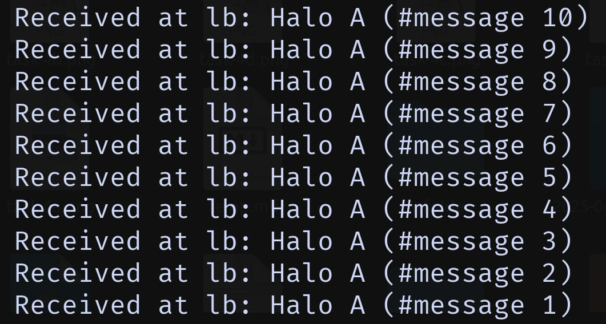

### c. Worker Mencatat Pesan yang Diterima
- Kode `worker.c `
- Input ` `
- Output `system.log`
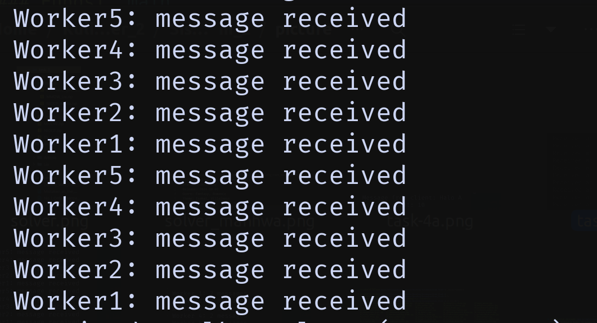

### d. Catat Total Pesan yang Diterima Setiap Worker di Akhir Eksekusi
- Kode `worker.c`
- Input ` ` 
- Output `system.log`
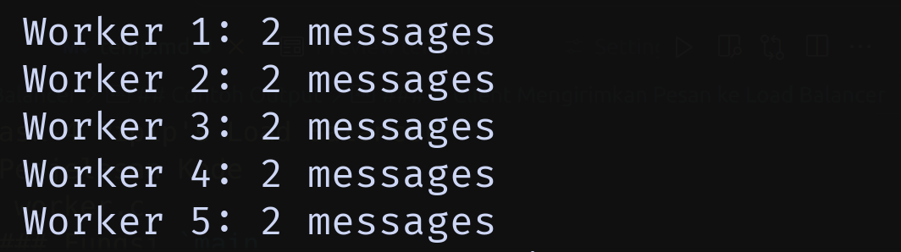
