[](https://classroom.github.com/a/Eu-CByJh)
|    NRP     |            Name            |
| :--------: | :------------------------: |
| 5025241134 | Gilbran Mahdavikia Raja    |
| 5025241148 | Muhammad Zaky Zein         |
| 5025241171 | Muhammad Sholihuddin Rizky |

# Praktikum Modul 3 _(Module 3 Lab Work)_

### Laporan Resmi Praktikum Modul 3 _(Module 3 Lab Work Report)_

Di suatu pagi hari yang cerah, Budiman salah satu mahasiswa Informatika ditugaskan oleh dosennya untuk membuat suatu sistem operasi sederhana. Akan tetapi karena Budiman memiliki keterbatasan, Ia meminta tolong kepadamu untuk membantunya dalam mengerjakan tugasnya. Bantulah Budiman untuk membuat sistem operasi sederhana!

_One sunny morning, Budiman, an Informatics student, was assigned by his lecturer to create a simple operating system. However, due to Budiman's limitations, he asks for your help to assist him in completing his assignment. Help Budiman create a simple operating system!_

### Soal 1

> Sebelum membuat sistem operasi, Budiman diberitahu dosennya bahwa Ia harus melakukan beberapa tahap terlebih dahulu. Tahap-tahapan yang dimaksud adalah untuk **mempersiapkan seluruh prasyarat** dan **melakukan instalasi-instalasi** sebelum membuat sistem operasi. Lakukan seluruh tahapan prasyarat hingga [perintah ini](https://github.com/arsitektur-jaringan-komputer/Modul-Sisop/blob/master/Modul3/README-ID.md#:~:text=sudo%20apt%20install%20%2Dy%20busybox%2Dstatic) pada modul!

> _Before creating the OS, Budiman was informed by his lecturer that he must complete several steps first. The steps include **preparing all prerequisites** and **installing** before creating the OS. Complete all the prerequisite steps up to [this command](https://github.com/arsitektur-jaringan-komputer/Modul-Sisop/blob/master/Modul3/README-ID.md#:~:text=sudo%20apt%20install%20%2Dy%20busybox%2Dstatic) in the module!_

**Answer:**

- **Code:**
1. 
```bash
sudo apt -y update
sudo apt -y install qemu-system build-essential bison flex libelf-dev libssl-dev bc grub-common grub-pc libncurses-dev libssl-dev mtools grub-pc-bin xorriso tmux
```
2.
```bash
mkdir -p osboot
cd osboot
```
3.
```bash
wget https://cdn.kernel.org/pub/linux/kernel/v6.x/linux-6.1.1.tar.xz
tar -xvf linux-6.1.1.tar.xz
cd linux-6.1.1
```
4.
```bash
make tinyconfig
make menuconfig
```
```bash
64-Bit Kernel
General Setup > Configure standard kernel features > Enable support for printk
General Setup > Configure standard kernel features > Enable futex support
General Setup > Initial RAM filesystem and RAM disk (initramfs/initrd) support
General Setup > Control Group Support
Enable the block layer > Legacy autoloading support
Enable the block layer > Partition type > Advanced Partition Selection
Device Drivers > Character devices > Enable TTY
Device Drivers > Character devices > Virtio console
Device Drivers > Character devices > /dev/mem virtual device support
Device Drivers > Network device support > Virtio Network Driver
Device Drivers > Serial Ata / Paralel ATA
Device Drivers > Block Devices > Virtio block driver
Device Drivers > Block Devices > loopback device support
Device Drivers > Block Devices > RAM block device support
Device Drivers > Virtio drivers
Device Drivers > Virtualization Drivers
Device Drivers > Generic  Driver Options > Maintain a devtmpfs at filesystems
Device Drivers > Generic Driver Options > Automount devtmpfs at /dev
Executable file formats > Kernel Support for ELF binaries
Executable file formats > Kernel Support scripts starting with #!
File Systems > FUSE support
File Systems > The extended 3 filesystem
File Systems > The extended 4 filesystem
File Systems > Second extended fs support
File Systems > Virtio Filesystem
File Systems > Kernel automounter support
File Systems > Pseudo File Systems > /proc file system support
File Systems > Pseudo File Systems > sysctl support
File Systems > Pseudo File Systems > sysfs file system support
Networking Support > Networking options > Unix domain sockets
Networking Support > Networking options > TCP/IP Networking
```
5. 
```bash
make -j$(nproc)
```
6. 
```bash
cp arch/x86/boot/bzImage ..
```
7. 
```bash
sudo apt install -y busybox-static
```
```bash
whereis busybox
```
Nantinya, BusyBox akan ditemukan di direktori `/usr/bin/busybox`.

**Explanation:**
- Sebelum membuat OS kita harus mempersiapakan terlebih dahulu yang lain, yang pertama kita mulai dari meng-update dan meng-install software pendukung, mengunduh kode sumber kernel, melakukan konfigurasi kernel sesuai kebutuhan, serta mengkompilasi kernel. Jalankan no. 1 pada code diatas.
- Kemudian menyiapkan sebuah direktori dan dipindahkan ke direktori yang akan dibuat itu. jalankan no.2 pada code
- Lalu, kita dowload dan ekstrak kernel linuxnya versi 6.1.1, dan setelah di download kita akan mengekstraknya ke dalam direktori `linux-6.1.1`. Jalankan no.3 pada code
- Nah, setelah semua langkah tadi, pastinya kita harus meng-konfigurasinya sebelum nantinya dikompilasi, kita bisa memulainya menggunakan konfigurasi minimal dengan `make tinyconfig`, setelah itu kita bisa lanjur untuk menyesuaikan konfigurasi dengan `make menuconfig`, ini gunanya untuk mengaktifkan fitur-fitur yang diperlukan nantinya di OS. Jalankan no. 4 pada code
- List fitur yang harus diaktifkan setelah masuk ke `menu config`. Bisa diliat pada no.4 di code
- Setelah sudah dikonfigurasi, saatnya di kompilasi, kompilasi ini akan menghasilkan file `bzImage yang merupakan file kernel yang siap digunakan untuk booting. Jalankan no.5
- Setelah kompilasi selesai, file `bzImage` tadi, ada di dalam direktori arch/x86/boot/. Pindahkan file ini ke direktori osboot untuk persiapan langkah selanjutnya. Hasilnya file `bzImage`. Jalankan no.6
- Kita juga perlu untuk penginstalan BusyBox, bergunan untuk mengganti banyak perintah standar Linux yang ada di sistem operasi dengan versi yang lebih ringan, berfungsi dalam lingkungan terbatas sumber daya, menyediakan utilitas seperti `ls`, `cp`, `mv`, `mount`, dan banyak lainnya. Ngecek sudah terinstal apa belum bisa dengan di no.7.

**Screenshot:**


### Soal 2

> Setelah seluruh prasyarat siap, Budiman siap untuk membuat sistem operasinya. Dosen meminta untuk sistem operasi Budiman harus memiliki directory **bin, dev, proc, sys, tmp,** dan **sisop**. Lagi-lagi Budiman meminta bantuanmu. Bantulah Ia dalam membuat directory tersebut!

> _Once all prerequisites are ready, Budiman is ready to create his OS. The lecturer asks that the OS should contain the directories **bin, dev, proc, sys, tmp,** and **sisop**. Help Budiman create these directories!_

**Answer:**

- **Code:**
```bash
sudo bash
```
```bash
mkdir -p myramdisk/{bin,dev,proc,sys,etc,root,home,sisop}
```

- **Explanation:**

Pertama kita masuk ke mode privilleged (Superuser) dengan mengetik `sudo bash`, lalu kita buat direktori untuk OS-nya dengan `mkdir` seperti code diatas.

- **Screenshot:**


### Soal 3

> Budiman lupa, Ia harus membuat sistem operasi ini dengan sistem **Multi User** sesuai permintaan Dosennya. Ia meminta kembali kepadamu untuk membantunya membuat beberapa user beserta directory tiap usernya dibawah directory `home`. Buat pula password tiap user-usernya dan aplikasikan dalam sistem operasi tersebut!

> _Budiman forgot that he needs to create a **Multi User** system as requested by the lecturer. He asks your help again to create several users and their corresponding home directories under the `home` directory. Also set each user's password and apply them in the OS!_

**Format:** `user:pass`

```
root:Iniroot
Budiman:PassBudi
guest:guest
praktikan1:praktikan1
praktikan2:praktikan2
```

**Answer:**

- **Code:**
```bash
mkdir -p /home/{Budiman, guest, praktikan1, praktikan2}
```
```bash
cd /myramdisk/etc/
```
```bash
openssl passwd -1 (pass masing2 user, ex : Iniroot)
```
```bash
nano passwd
```
```bash
root:$1$koSGJ61N$rdskXoWEM8vsB7RYqTwUS1:0:0:root:/root:/bin/sh
Budiman:$1$SGZPLAMg$WKmoxQu9gVtapZqCSwe38/:1001:100:Budiman:/home/Budiman:/bin/sh
guest:$1$I2Ph.I7s$MFPwtwkrz72RfG90.BJLG.:1002:100:guest:/home/guest:/bin/sh
praktikan1:$1$iuJ0g6A2$fjQA6pBw6xmVEGSXjY0WS/:1003:100:praktikan1:/home/praktikan1:/bin/sh
praktikan2:$1$/03sYiWH$vSl0z2pml0A2dBkC4GpXl0:1004:100:praktikan2:/home/praktikan2:/bin/sh
```
```bash
nano group
```
```bash
root:x:0:
bin:x:1:root
sys:x:2:root
tty:x:5:root,Budiman,guest,praktikan1,praktikan2
disk:x:6:root
wheel:x:10:root,Budiman,guest,praktikan1,praktikan2
users:x:100:Budiman,guest,praktikan1,praktikan2
```

- **Explanation:**
Pada saat kita  `nano passwd` , kita masukkan passwordnya dengan menggunakan `openssl passwd -1 myrootpassword` nanti akan mendapatkan kode unik trus di copy masukkan ke bagian `passwd`. Untuk yang `group` kita ubah aksesnya samakan dengan modul.

- **Screenshot:**


### Soal 4

> Dosen meminta Budiman membuat sistem operasi ini memilki **superuser** layaknya sistem operasi pada umumnya. User root yang sudah kamu buat sebelumnya akan digunakan sebagai superuser dalam sistem operasi milik Budiman. Superuser yang dimaksud adalah user dengan otoritas penuh yang dapat mengakses seluruhnya. Akan tetapi user lain tidak boleh memiliki otoritas yang sama. Dengan begitu user-user selain root tidak boleh mengakses `./root`. Buatlah sehingga tiap user selain superuser tidak dapat mengakses `./root`!

> _The lecturer requests that the OS must have a **superuser** just like other operating systems. The root user created earlier will serve as the superuser in Budiman's OS. The superuser should have full authority to access everything. However, other users should not have the same authority. Therefore, users other than root should not be able to access `./root`. Implement this so that non-superuser accounts cannot access `./root`!_

**Answer:**

- **Code:**
```bash
sudo bash
```
```bash
nano group
```
```bash
root:x:0:
bin:x:1:root
sys:x:2:root
tty:x:5:root,Budiman,guest,praktikan1,praktikan2
disk:x:6:root
wheel:x:10:root                                    
users:x:100:Budiman,guest,praktikan1,praktikan2
```
```bash
chmod 700 /root
```

- **Explanation:**
Dengan konfigurasi chmod 700 /root, serta penempatan user non-root ke grup non-privileged, maka sistem telah berhasil membatasi akses ke direktori /root hanya untuk user superuser (root) saja. 

- **Screenshot:**


### Soal 5

> Setiap user rencananya akan digunakan oleh satu orang tertentu. **Privasi dan otoritas tiap user** merupakan hal penting. Oleh karena itu, Budiman ingin membuat setiap user hanya bisa mengakses dirinya sendiri dan tidak bisa mengakses user lain. Buatlah sehingga sistem operasi Budiman dalam melakukan hal tersebut!

> _Each user is intended for an individual. **Privacy and authority** for each user are important. Therefore, Budiman wants to ensure that each user can only access their own files and not those of others. Implement this in Budiman's OS!_

**Answer:**

- **Code:**

  `put your answer here`
  ```bash
  sudo bash
  
  cd osboot/myramdisk/home
  
  sudo chown 1001:100 Budiman
  sudo chown 1002:100 guest
  sudo chown 1003:100 praktikan1
  sudo chown 1004:100 praktikan2
  
  sudo chmod 700 Budiman
  sudo chmod 700 guest
  sudo chmod 700 praktikan1
  sudo chmod 700 praktikan2
  ```

- **Explanation:**

  > `sudo bash` digunakan untuk menjalankan command command selanjutnya sebagai root. Selanjutnya, `cd osboot/myramdisk/home` untuk pindah ke directory home. `sudo chown UID:GID` digunakan untuk mengganti kepemilikan dari directory sesuai dengan soal nomor 3. `sudo chmod 700` digunakan untuk memastikan setiap directory hanya bisa diakses oleh user yang bersangkutan.

- **Screenshot:**

  <div align="center">
    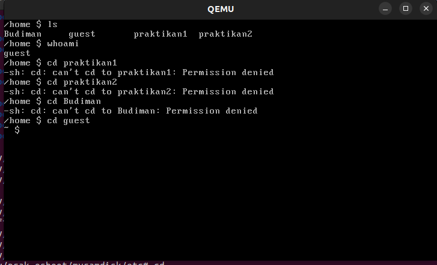
  </div>

  <div align="center">
    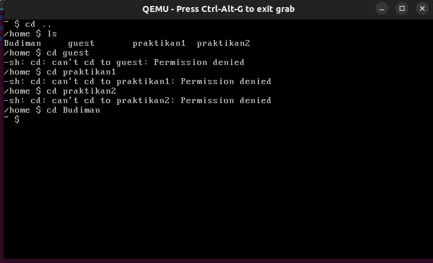
  </div>

### Soal 6

> Dosen Budiman menginginkan sistem operasi yang **stylish**. Budiman memiliki ide untuk membuat sistem operasinya menjadi stylish. Ia meminta kamu untuk menambahkan tampilan sebuah banner yang ditampilkan setelah suatu user login ke dalam sistem operasi Budiman. Banner yang diinginkan Budiman adalah tulisan `"Welcome to OS'25"` dalam bentuk **ASCII Art**. Buatkanlah banner tersebut supaya Budiman senang! (Hint: gunakan text to ASCII Art Generator)

> _Budiman wants a **stylish** operating system. Budiman has an idea to make his OS stylish. He asks you to add a banner that appears after a user logs in. The banner should say `"Welcome to OS'25"` in **ASCII Art**. Use a text to ASCII Art generator to make Budiman happy!_ (Hint: use a text to ASCII Art generator)

**Answer:**

- **Code:**

  ```bash
  sudo bash

  cd osboot/myramdisk/etc

  buat file motd yang berisi:

   /$$      /$$           /$$                                            
  | $$  /$ | $$          | $$                                            
  | $$ /$$$| $$  /$$$$$$ | $$  /$$$$$$$  /$$$$$$  /$$$$$$/$$$$   /$$$$$$ 
  | $$/$$ $$ $$ /$$__  $$| $$ /$$_____/ /$$__  $$| $$_  $$_  $$ /$$__  $$
  | $$$$_  $$$$| $$$$$$$$| $$| $$      | $$  \ $$| $$ \ $$ \ $$| $$$$$$$$
  | $$$/ \  $$$| $$_____/| $$| $$      | $$  | $$| $$ | $$ | $$| $$_____/
  | $$/   \  $$|  $$$$$$$| $$|  $$$$$$$|  $$$$$$/| $$ | $$ | $$|  $$$$$$$
  |__/     \__/ \_______/|__/ \_______/ \______/ |__/ |__/ |__/ \_______/
                                                                        
                                                                        
                                                                        
     /$$                      /$$$$$$   /$$$$$$ /$$  /$$$$$$  /$$$$$$$   
    | $$                     /$$__  $$ /$$__  $$\ $ /$$__  $$| $$____/   
   /$$$$$$    /$$$$$$       | $$  \ $$| $$  \__/ \/|__/  \ $$| $$        
  |_  $$_/   /$$__  $$      | $$  | $$|  $$$$$$      /$$$$$$/| $$$$$$$   
    | $$    | $$  \ $$      | $$  | $$ \____  $$    /$$____/ |_____  $$  
    | $$ /$$| $$  | $$      | $$  | $$ /$$  \ $$   | $$       /$$  \ $$  
    |  $$$$/|  $$$$$$/      |  $$$$$$/|  $$$$$$/   | $$$$$$$$|  $$$$$$/  
     \___/   \______/        \______/  \______/    |________/ \______/   
                                                                       

  buat file profile yang berisi:

  #!/bin/bash
  cat /etc/motd
  ```

- **Explanation:**

  > `sudo bash` digunakan untuk menjalankan command command selanjutnya sebagai root. Selanjutnya, `cd osboot/myramdisk/etc` untuk pindah ke directory etc. Directory etc sendiri merupakan directory linux untuk menyimpan file dan folder konfigurasi linux. Untuk menampilkan `Welcome to OS'25` pada terminal diperlukan file profile pada directory etc. Di dalam file profile akan menjalankan command bash untuk menampilkan isi dari file motd. file motd adalah file yang berisi ASCII art yang digenerate dari https://patorjk.com.

- **Screenshot:**

  <div align="center">
    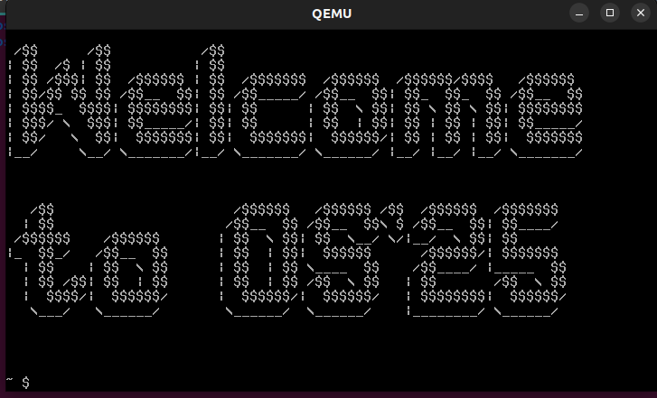
  </div>

### Soal 7

> Melihat perkembangan sistem operasi milik Budiman, Dosen kagum dengan adanya banner yang telah kamu buat sebelumnya. Kemudian Dosen juga menginginkan sistem operasi Budiman untuk dapat menampilkan **kata sambutan** dengan menyebut nama user yang login. Sambutan yang dimaksud berupa kalimat `"Helloo %USER"` dengan `%USER` merupakan nama user yang sedang menggunakan sistem operasi. Kalimat sambutan ini ditampilkan setelah user login dan setelah banner. Budiman kembali lagi meminta bantuanmu dalam menambahkan fitur ini.

> _Seeing the progress of Budiman's OS, the lecturer is impressed with the banner you created. The lecturer also wants the OS to display a **greeting message** that includes the name of the user who logs in. The greeting should say `"Helloo %USER"` where `%USER` is the name of the user currently using the OS. This greeting should be displayed after user login and after the banner. Budiman asks for your help again to add this feature._

**Answer:**

- **Code:**

  ```bash
  sudo bash

  cd osboot/myramdisk/etc

  tambahkan line echo "Helloo $USER"
  pada file profile,

  #!/bin/bash
  cat /etc/motd
  echo "Helloo $USER"
  ```

- **Explanation:**

  > `sudo bash` digunakan untuk menjalankan command command selanjutnya sebagai root. Selanjutnya, `cd osboot/myramdisk/etc` untuk pindah ke directory etc. edit file profile, tambahkan command `echo "Helloo $USER` untuk menampilkan Helloo dan diikuti dengan nama user yang login.

- **Screenshot:**

  <div align="center">
    
  </div>

  <div align="center">
    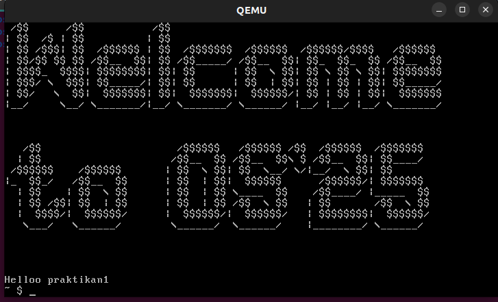
  </div>

### Soal 8

> Dosen Budiman sudah tua sekali, sehingga beliau memiliki kesulitan untuk melihat tampilan terminal default. Budiman menginisiatif untuk membuat tampilan sistem operasi menjadi seperti terminal milikmu. Modifikasilah sistem operasi Budiman menjadi menggunakan tampilan terminal kalian.

> _Budiman's lecturer is quite old and has difficulty seeing the default terminal display. Budiman takes the initiative to make the OS look like your terminal. Modify Budiman's OS to use your terminal appearance!_

**Answer:**

- **Code and Explanation:**

  - Aktifkan config serial 8250 di dalam `osboot/linux-6.1.1/.config`

    ```
    CONFIG_SERIAL_8250=y
    CONFIG_SERIAL_8250_CONSOLE=y
    ```

  - Di dalam file `init` ubah `tty1` menjadi `ttyS0`

    ```bash
    #!/bin/sh
    /bin/mount -t proc none /proc
    /bin/mount -t sysfs none /sys

    while true
    do
    -   /bin/getty -L tty1 115200 vt100
    +   /bin/getty -L ttyS0 115200 vt100
        sleep 1
    done
    ```

  - Tambahkan `console=ttyS0` pada kernel boot args di dalam file `osboot/mylinuxiso/boot/grub/grub.cfg`

    ```bash
    set timeout=5
    set default=0

    menuentry "Linux-Budiman" {
    - linux /boot/bzImage quiet loglevel=3
    + linux /boot/bzImage quiet loglevel=3 console=ttyS0
      initrd /boot/myramdisk.gz
    }
    ```

- **Screenshot:**

  - file `.config` yang sudah di tambahkan

    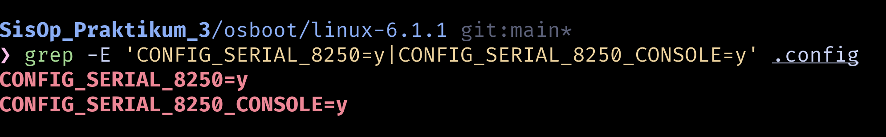

  - isi file `mylinuxiso/boot/grub/grub.cfg`

    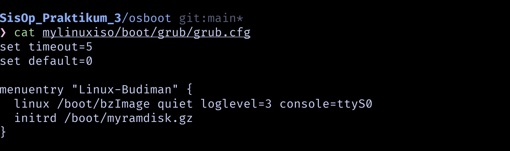
  
  - isi file `myramdisk/init`

    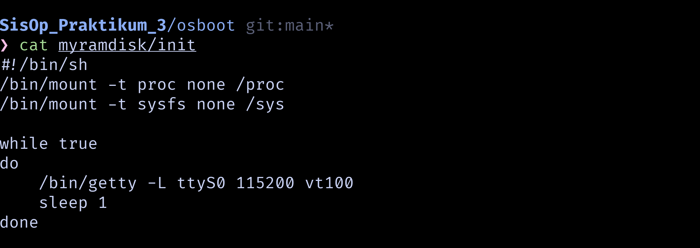

  - tampilan terminal setelah diubah

    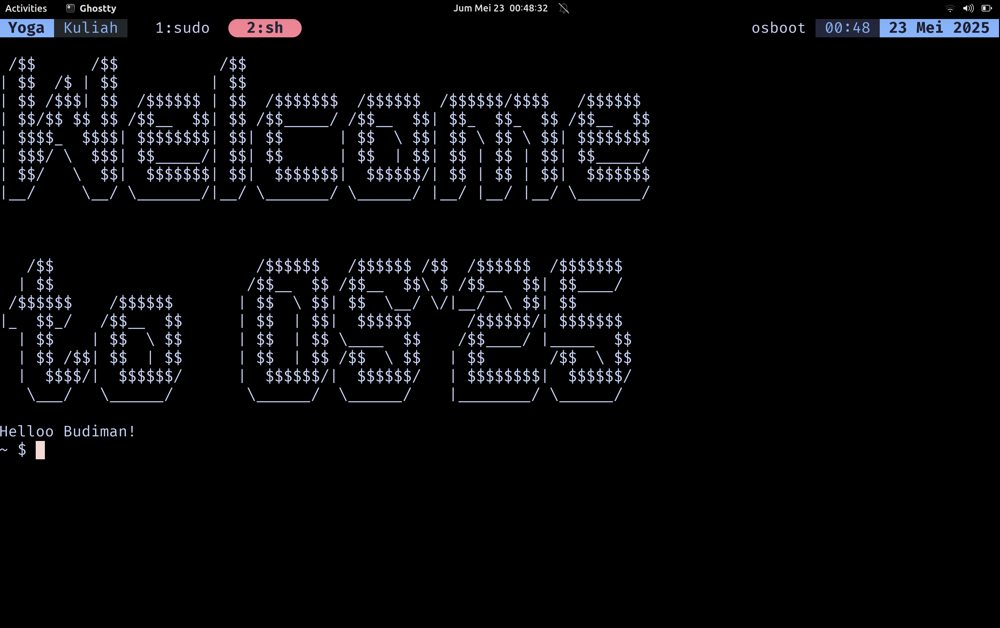

### Soal 9

> Ketika mencoba sistem operasi buatanmu, Budiman tidak bisa mengubah text file menggunakan text editor. Budiman pun menyadari bahwa dalam sistem operasi yang kamu buat tidak memiliki text editor. Budimanpun menyuruhmu untuk menambahkan **binary** yang telah disiapkan sebelumnya ke dalam sistem operasinya. Buatlah sehingga sistem operasi Budiman memiliki **binary text editor** yang telah disiapkan!

> _When trying your OS, Budiman cannot edit text files using a text editor. He realizes that the OS you created does not have a text editor. Budiman asks you to add the prepared **binary** into his OS. Make sure Budiman's OS has the prepared **text editor binary**!_

**Answer:**

- **Code:**

  ```bash
  cd osboot/myramdisk/sisop
  git clone https://github.com/morisab/budiman-text-editor.git
  cd budiman-text-editor
  g++ -static -o budiman main.cpp
  cp budiman ../../bin
  ```
  
- **Explanation:**

  - Masuk ke directory `osboot/myramdisk/sisop`

    ```bash
    cd osboot/myramdisk/sisop
    ```
  
  - Clone github repository yang sudah diberikan

    ```bash
    git clone https://github.com/morisab/budiman-text-editor.git
    ```
  
  - Masuk ke directory `budiman-text-editor`

    ```bash
    cd budiman-text-editor
    ```

  - Compile file `main.cpp` dengan argumen static

    ```bash
    g++ -static -o budiman main.cpp
    ```

  - salin hasil compile `budiman-text-editor` ke dalam directory `../../bin` atau `osboot/myramdisk/bin`

    ```bash
    cp budiman ../../bin
    ```

- **Screenshot:**

  - tampilan text editor budiman

    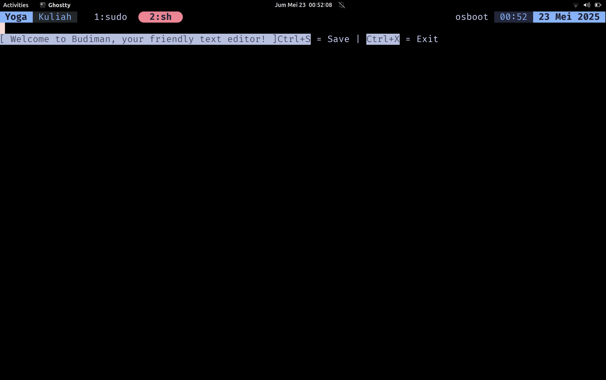

### Soal 10

> Setelah seluruh fitur yang diminta Dosen dipenuhi dalam sistem operasi Budiman, sudah waktunya Budiman mengumpulkan tugasnya ini ke Dosen. Akan tetapi, Dosen Budiman tidak mau menerima pengumpulan selain dalam bentuk **.iso**. Untuk terakhir kalinya, Budiman meminta tolong kepadamu untuk mengubah seluruh konfigurasi sistem operasi yang telah kamu buat menjadi sebuah **file .iso**.

> After all the features requested by the lecturer have been implemented in Budiman's OS, it's time for Budiman to submit his assignment. However, Budiman's lecturer only accepts submissions in the form of **.iso** files. For the last time, Budiman asks for your help to convert the entire configuration of the OS you created into a **.iso file**.

**Answer:**

- **Code:**

  ```bash
  cd osboot
  mkdir -p mylinuxiso/boot/grub
  cp bzImage mylinuxiso/boot
  cp myramdisk.gz mylinuxiso/boot
  cat > mylinuxiso/boot/grub/grub.cfg << 'EOF'
  set timeout=5
  set default=0

  menuentry "Linux-Budiman" {
    linux /boot/bzImage quiet loglevel=3 console=ttyS0
    initrd /boot/myramdisk.gz
  }
  EOF
  grub-mkrescue -o mylinux.iso mylinuxiso
  qemu-system-x86_64 \
    -smp 2 \
    -m 256 \
    -display curses \
    -vga std \
    -cdrom mylinux.iso
  ```

- **Explanation:**

  - Masuk ke directory `boot`
    
    ```bash
    cd boot
    ```

  - Buat struktur directory baru `mylinux/boot/grub/`

    ```bash
    mkdir -p mylinux/boot/grub/
    ```

  - Salin file kernel `bzImage` dan root `myramdisk.gz` ke dalam directory `mylinuxiso/boot`

    ```bash
    cp bzImage mylinuxiso/boot
    cp myramdisk.gz mylinuxiso/boot
    ```

  - Buat file `grub.cfg` didalam directory `mylinuxiso/boot/grub/` dan tambahkan config nya seperti di code

    ```bash
    cat > mylinuxiso/boot/grub/grub.cfg << 'EOF'
    set timeout=5
    set default=0

    menuentry "Linux-Budiman" {
      linux /boot/bzImage quiet loglevel=3 console=ttyS0
      initrd /boot/myramdisk.gz
    }
    EOF
    ```

  - Buat file iso bootable

    ```bash
    grub-mkrescue -o mylinux.iso mylinuxiso
    ```

  - Terakhir jalankan sistem dengan QEMU menggunakan file iso

    ```bash
    qemu-system-x86_64 \
      -m 256 \
      -smp 2 \
      -cdrom mylinux.iso \
      -boot d \
      -nographic \
      -serial mon:stdio
    ```

- **Screenshot:**

  - struktur directory `mylinuxiso`

    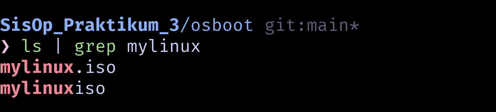
    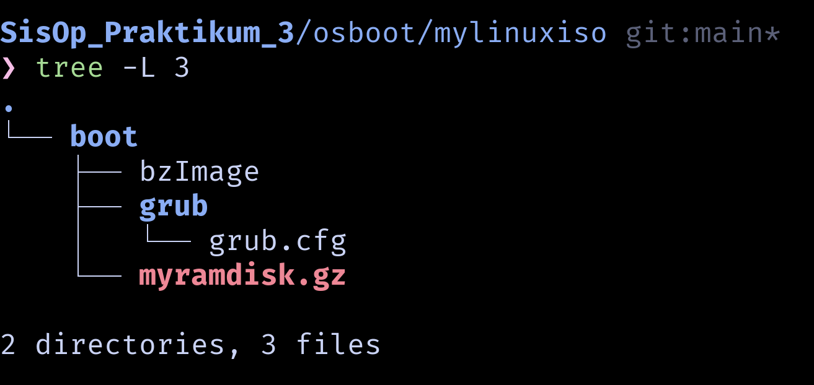

  - jalankan sistem operasi Budiman menggunakan iso

    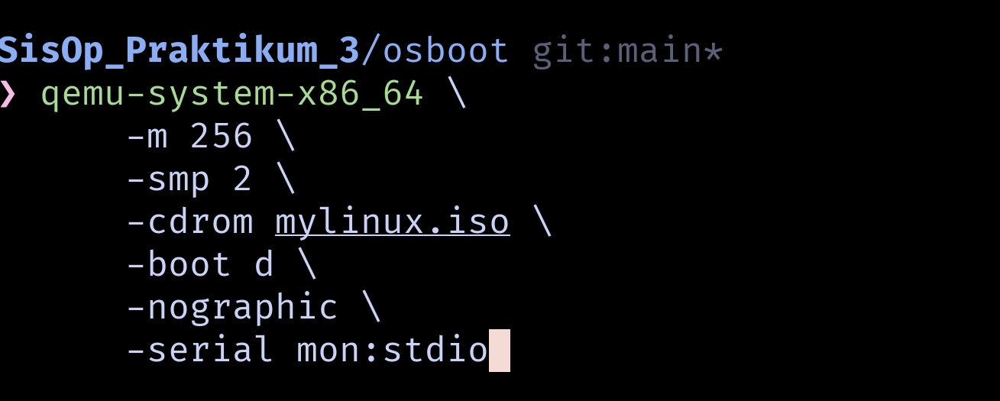
    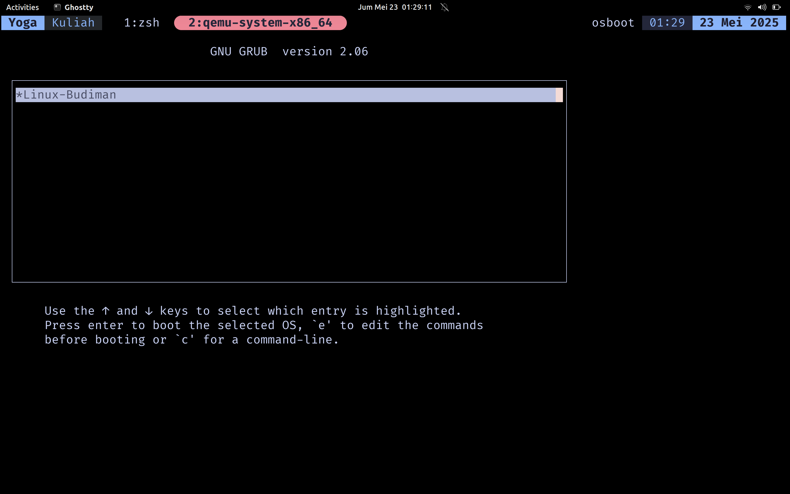
    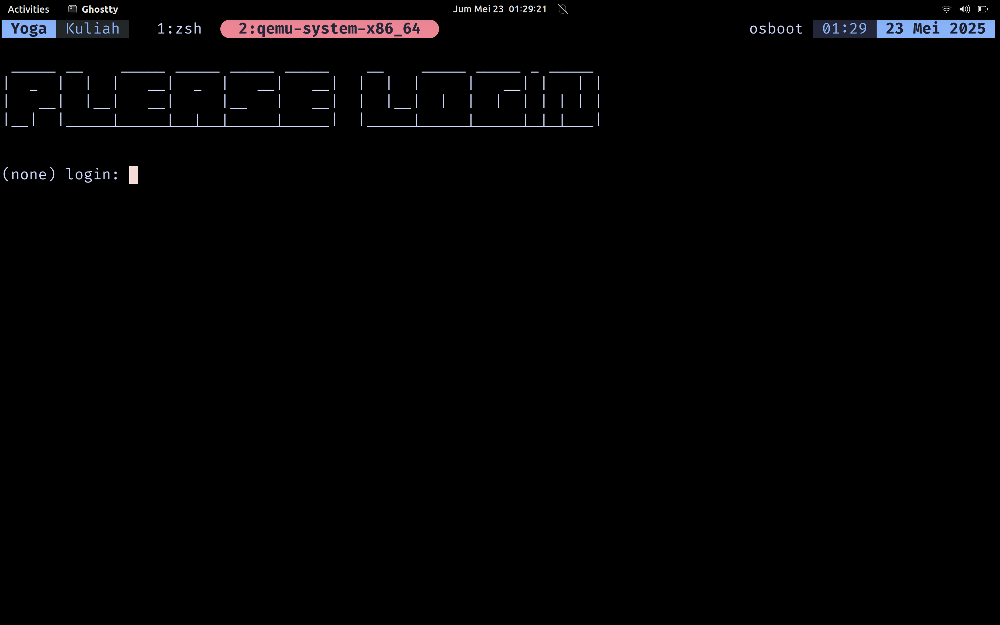
    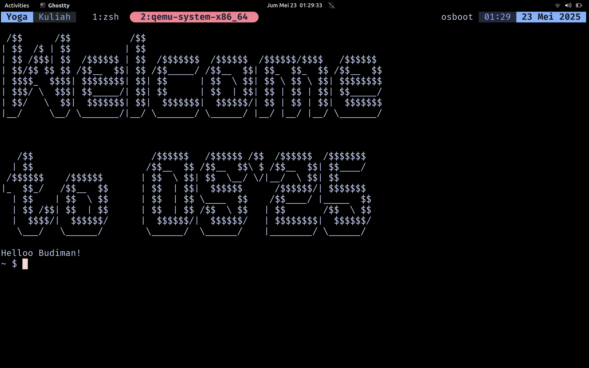

---

Pada akhirnya sistem operasi Budiman yang telah kamu buat dengan susah payah dikumpulkan ke Dosen mengatasnamakan Budiman. Kamu tidak diberikan credit apapun. Budiman pun tidak memberikan kata terimakasih kepadamu. Kamupun kecewa tetapi setidaknya kamu telah belajar untuk menjadi pembuat sistem operasi sederhana yang andal. Selamat!

_At last, the OS you painstakingly created was submitted to the lecturer under Budiman's name. You received no credit. Budiman didn't even thank you. You feel disappointed, but at least you've learned to become a reliable creator of simple operating systems. Congratulations!_
