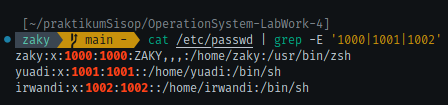
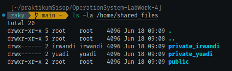
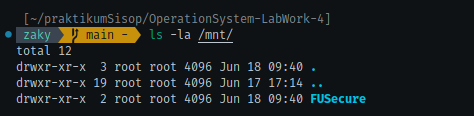
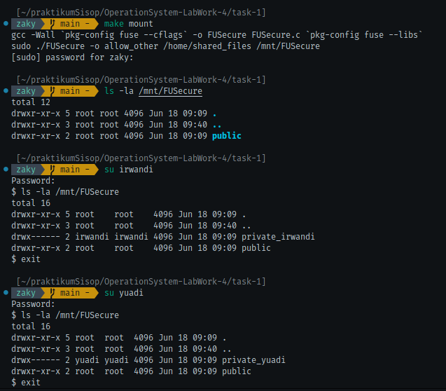
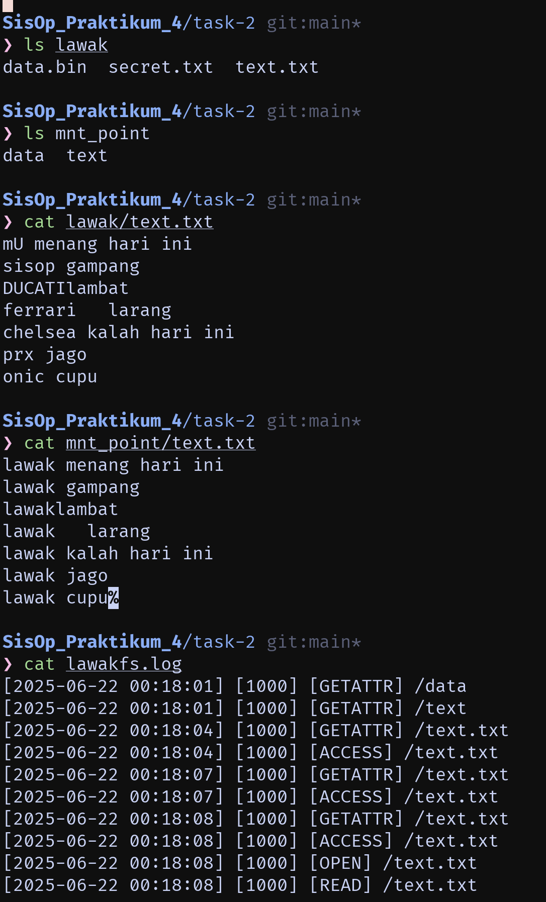
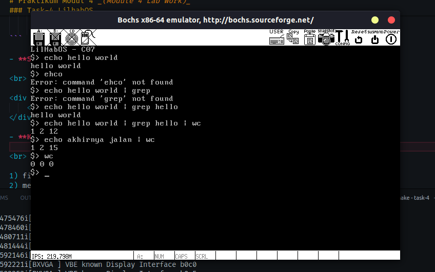

[](https://classroom.github.com/a/V7fOtAk7)
|    NRP     |      Name      |
| :--------: | :------------: |
| 5025241134 | Gilbran Mahdavikia Raja    |
| 5025241148 | Muhammad Zaky Zein         |
| 5025241171 | Muhammad Sholihuddin Rizky |

# Praktikum Modul 4 _(Module 4 Lab Work)_

</div>

### Daftar Soal _(Task List)_

- [Task 1 - FUSecure](/task-1/)

- [Task 2 - LawakFS++](/task-2/)

- [Task 3 - Drama Troll](/task-3/)

- [Task 4 - LilHabOS](/task-4/)

### Laporan Resmi Praktikum Modul 4 _(Module 4 Lab Work Report)_

Tulis laporan resmi di sini!

_Write your lab work report here!_
### task-1 FUSecure
**Answer:**

- **Code & explanation:**

**a. Setup Direktori dan Pembuatan User**
Langkah pertama dalam rencana Yuadi adalah mempersiapkan infrastruktur dasar sistem keamanannya.
1. Buat sebuah "source directory" di sistem Anda (contoh: `/home/shared_files`). Ini akan menjadi tempat penyimpanan utama semua file.
2. Di dalam source directory ini, buat 3 subdirektori: `public`, `private_yuadi`, `private_irwandi`. Buat 2 Linux users: `yuadi` dan `irwandi`. Anda dapat memilih password mereka.

   | User    | Private Folder   |
   | ------- | ---------------  |
   | yuadi   | private_yuadi    |
   | irwandi | private_irwandi  |

Yuadi dengan bijak merancang struktur ini:
folder `public` untuk berbagi materi kuliah dan referensi yang boleh diakses siapa saja, sementara setiap orang memiliki folder private untuk menyimpan jawaban praktikum mereka masing-masing.

```bash
sudo mkdir -p /home/shared_files{public,private_yuadi,private_irwandi}
```
> kode di atas akan membuat source directory beserta subdirectory-nya.

```bash
sudo adduser yuadi
sudo passwd yuadi
```
```bash
sudo adduser irwandi
sudo passwd irwandi
```
> kode di atas digunakan untuk menambah user yang bernama yuadi dan irwandi, passwd untuk membuat password untuk masing-masing user.


```bash
cd /home/shared_files
sudo chown yuadi:yuadi private_yuadi
sudo chmod 700 private_yuadi
```
```bash
sudo chown irwandi:irwandi private_irwandi
sudo chmod 700 private_irwandi
```
> agar foldernya hanya dapat diakses oleh user tertentu, ubah akses dan kepemilikan dari masing-masing private folder.

<br>

**b. Akses Mount Point**

Selanjutnya, Yuadi ingin memastikan sistem filenya mudah diakses namun tetap terkontrol.

FUSE mount point Anda (contoh: `/mnt/secure_fs`) harus menampilkan konten dari `source directory` secara langsung. Jadi, jika Anda menjalankan `ls /mnt/secure_fs`, Anda akan melihat `public/`, `private_yuadi/`, dan `private_irwandi/`.

```bash
sudo mkdir -p /mnt/secure_fs
```
> buat folder untuk mounting point

```c
// global variable
static const char *source_dir = NULL;

int main(int argc, char *argv[]) {
    source_dir = realpath(argv[argc - 2], NULL);
    if (!source_dir) {
        perror("Invalid source_dir");
        exit(1);
    }

    argv[argc - 2] = argv[argc - 1];
    argc--;

    return fuse_main(argc, argv, &scr_oper, NULL);
}
```
> input saat menjalankan program adalah
`sudo ./$(TARGET) -o allow_other $(SRC_DIR) $(MOUNT_DIR)`
yang mana akan memiliki 4 argumen, 2 argumen pertama adalah argumen milik FUSE, sedangkan 2 argumen selanjutnya untuk mendapatkan source directory dan juga mounting pointnya.
variable source_dir akan meyimpan path absolut dari directory source dengan menggunakan fungsi
`realpath(argv[argc - 2], NULL);`
`if (!source_dir)` untuk memastikan apakah source directory adalah directory yang valid, jika tidak keluarkan error message.
`argv[argc - 2] = argv[argc - 1];`
`argc--;`
argv[argc-2] mengarah pada alamat argumen kedua, yaitu source directory, nilainya akan diassign dengan argumen terakhir, yang tidak lain adalah mounting pointnya (menimpanya dengan argumen terakhir). setelah itu argumen countnya akan dikurangi. Hal ini harus dilakukan karena
`fuse_main(argc, argv, &scr_oper, NULL);`
fungsi pada fuse_main tidak membutuhkan parameter source directorynya.

<br>

**c. Read-Only untuk Semua User**

Yuadi sangat kesal dengan kebiasaan Irwandi yang suka mengubah atau bahkan menghapus file jawaban setelah menyalinnya untuk menghilangkan jejak plagiat. Untuk mencegah hal ini, dia memutuskan untuk membuat seluruh sistem menjadi read-only.

1. Jadikan seluruh FUSE mount point **read-only untuk semua user**.
2. Ini berarti tidak ada user (termasuk `root`) yang dapat membuat, memodifikasi, atau menghapus file atau folder apapun di dalam `/mnt/secure_fs`. Command seperti `mkdir`, `rmdir`, `touch`, `rm`, `cp`, `mv` harus gagal semua.

"Sekarang Irwandi tidak bisa lagi menghapus jejak plagiatnya atau mengubah file jawabanku," pikir Yuadi puas.

> karena soal meminta hanya akses read only saja, maka buat struct fusenya hanya dengan fungsi-fungsi yang dibutuhkan untuk read saja.

```c
static struct fuse_operations scr_oper = {
    .getattr = scr_getattr,
    .readdir = scr_readdir,
    .open    = scr_open,
    .read    = scr_read,    
};
```

<br>

**d. Akses Public Folder**

Meski ingin melindungi jawaban praktikumnya, Yuadi tetap ingin berbagi materi kuliah dan referensi dengan Irwandi dan teman-teman lainnya.

Setiap user (termasuk `yuadi`, `irwandi`, atau lainnya) harus dapat **membaca** konten dari file apapun di dalam folder `public`. Misalnya, `cat /mnt/secure_fs/public/materi_kuliah.txt` harus berfungsi untuk `yuadi` dan `irwandi`.

<br>

**e. Akses Private Folder yang Terbatas**

Inilah bagian paling penting dari rencana Yuadi - memastikan jawaban praktikum benar-benar terlindungi dari plagiat.

1. File di dalam `private_yuadi` **hanya dapat dibaca oleh user `yuadi`**. Jika `irwandi` mencoba membaca file jawaban praktikum di `private_yuadi`, harus gagal (contoh: permission denied).
2. Demikian pula, file di dalam `private_irwandi` **hanya dapat dibaca oleh user `irwandi`**. Jika `yuadi` mencoba membaca file di `private_irwandi`, harus gagal.

"Akhirnya," senyum Yuadi, "Irwandi tidak bisa lagi menyalin jawaban praktikumku, tapi dia tetap bisa mengakses materi kuliah yang memang kubuat untuk dibagi."

untuk soal d dan e:
```c
static const char *users[] = {"yuadi", "irwandi"};
static const char *users_dir[] = {"private_yuadi", "private_irwandi"};
static const int usrcnt = 2;
```

```c
int check_access(const char *path) {
    struct fuse_context *context = fuse_get_context();
    struct passwd *pw = getpwuid(context->uid);
    const char *username = pw ? pw->pw_name : "";

    if (strstr(path, "public") != NULL) return 0;

    for (int i = 0; i < usrcnt; i++) if (strstr(path, users_dir[i]) != NULL && strcmp(username, users[i]) != 0) return -EACCES;
    
    return 0;
}
```
> `struct fuse_context *context = fuse_get_context();` pointer context akan menyimpan context pada FUSE, seperti UID, GID, dan PID.
`struct passwd *pw = getpwuid(context->uid);` Fungsi getpwuid() mengambil informasi user (nama, home dir, shell, dll) berdasarkan UID dari context FUSE tadi.
`const char *username = pw ? pw->pw_name : "";` menyimpan username jika pw tidak NULL, jika NULL inisialisasikan dengan string kosong.
`if (strstr(path, "public") != NULL) return 0;`
jika pathnya ada kata/substring public, maka kembalikan nilai 0 (bisa diakses siapa saja).
`for (int i = 0; i < usrcnt; i++) if (strstr(path, users_dir[i]) != NULL && strcmp(username, users[i]) != 0) return -EACCES;`
menelusuri path-path yang mengandung nama 'private_yuadi' dan 'private_irwandi' jika sesuai dengan nama dan usernamenya tidak sesuai, maka kembalikan -EACCESS (tolak akses).
`return 0;` jika tidak sesuai dengan public ataupun folder-folder private tadi, maka kembalikan nilai 0 (folder lain juga dapat diakses oleh siapa saja).

<br>

implementasi dari fungsi-fungsi FUSE untuk read-only


```c
static void fullpath(char fpath[PATH_MAX], const char *path) {
    snprintf(fpath, PATH_MAX, "%s%s", source_dir, path);
}

static int scr_getattr(const char *path, struct stat *statbuf) {
    char fpath[PATH_MAX];
    fullpath(fpath, path);
    
    if (check_access(path) != 0) return -EACCES;
    
    if (lstat(fpath, statbuf) == -1) return -errno;
    
    return 0;
}

static int scr_readdir(const char *path, void *buf, fuse_fill_dir_t filler, off_t offset, struct fuse_file_info *fi) {
    char fpath[PATH_MAX];
    fullpath(fpath, path);
    
    DIR *dp = opendir(fpath);
    if (dp == NULL) return -errno;
    
    struct fuse_context *context = fuse_get_context();
    struct passwd *pw = getpwuid(context->uid);
    const char *username = pw ? pw->pw_name : "";
    
    struct dirent *de;
    filler(buf, ".", NULL, 0);
    filler(buf, "..", NULL, 0);
    
    while ((de = readdir(dp)) != NULL) {
        const char *name = de->d_name;
        int has_access = 0;
        
        if (strcmp(name, "public") == 0) {
            has_access = 1;
        } else {
            for (int i = 0; i < usrcnt; i++) {
                if (strcmp(name, users_dir[i]) == 0 && strcmp(username, users[i]) == 0) {
                    has_access = 1;
                    break;
                }
            }
        }
        if (has_access) filler(buf, name, NULL, 0);
    }

    closedir(dp);
    return 0;
}

static int scr_open(const char *path, struct fuse_file_info *fi) {
    char fpath[PATH_MAX];
    fullpath(fpath, path);

    if (check_access(path) != 0) return -EACCES;

    if ((fi->flags & O_WRONLY) || (fi->flags & O_RDWR)) return -EACCES;

    int fd = open(fpath, fi->flags);
    if (fd == -1) return -errno;

    close(fd);
    return 0;
}

static int scr_read(const char *path, char *buf, size_t size, off_t offset, struct fuse_file_info *fi) {
    char fpath[PATH_MAX];
    fullpath(fpath, path);

    if (check_access(path) != 0) return -EACCES;

    int fd = open(fpath, O_RDONLY);
    if (fd == -1) return -errno;

    int res = pread(fd, buf, size, offset);
    if (res == -1) res = -errno;

    close(fd);
    return res;
}
```

> `static void fullpath(char fpath[PATH_MAX], const char *path)`
Fungsi ini membuat path absolut fpath dari source_dir dan path relatif dari FUSE.
Contoh: source_dir = /home/shared_files dan path = /public/file.txt, maka fpath akan menjadi /home/shared_files/public/file.txt.
`static int scr_getattr(const char *path, struct stat *statbuf)`
jika akses ke path ditolak, maka kembalikan -EACCESS. jika bisa akes, maka fungsi ini akan mendapatkan atribut dari path tersebut dengan `lstat(fpath, statbuf)` yang artinya atribut dari path tersebut akan disimpan pada stat buffer yang bernama statbuf. jika pengambilan tidak berhasil, maka return kode error.
`static int scr_readdir(const char *path, void *buf, fuse_fill_dir_t filler, off_t offset, struct fuse_file_info *fi)`
secara singkan fungsi di atas akan menangani command `ls`. awalnya buka directory dengan `opendir()` lalu dapatkan context. setelah itu lakukan iterasi ke folder-folder dalam directory yang dibuka. jika memiliki akses tambahkan ke buffer dengan `filler()`.
`static int scr_open(const char *path, struct fuse_file_info *fi)`
`static int scr_read(const char *path, char *buf, size_t size, off_t offset, struct fuse_file_info *fi)`
kedua fungsi di atas masing-masing berguna untuk menangani pembukaan file dan dan pembacaan file.

- **Screenshots :**

a.
<div align="center">
    
</div>

<div align="center">
    
</div>

b.
<div align="center">
    
</div>

result:
<div align="center">
    
</div>

### Task-2 LawakFS++
**Answer:**
- **Code & explanation:** <br>
Untuk menyelesaikan task ini, kita akan membuat sebuah sistem file yang memiliki beberapa fitur keamanan dan akses kontrol. Sistem file ini akan menggunakan FUSE (Filesystem in Userspace) untuk mengimplementasikan fungsionalitasnya. <br>
terdapat fungsi tambahan yang akan digunakan untuk mengimplementasikan fitur-fitur yang diminta pada soal, yaitu:

- fungsi `map_path`:
  ``` c
  static char *map_path(const char *path) {
    const char *rel_path = (path[0] == '/') ? path + 1 : path; // menghapus karakter '/' pertama jika ada
    if (!rel_path[0]) rel_path = "."; // jika rel_path kosong, set rel_path menjadi "."

    char *full_path = malloc(strlen(source_dir) + strlen(rel_path) + 2); // alokasikan memori untuk full_path
    sprintf(full_path, "%s/%s", source_dir, rel_path); // menggabungkan source_dir dan rel_path menjadi full_path
    return full_path; // kembalikan full_path
  }
  ```
  Fungsi `map_path` akan mengubah path relatif menjadi path absolut dengan menggabungkan `source_dir` dan `path` yang diberikan. Jika path dimulai dengan '/', maka karakter tersebut akan dihapus. Jika path kosong, maka akan di-set menjadi '.' (current directory).


  #### **a. Ekstensi File Tersembunyi** <br >
  Untuk mengimplementasikan ekstensi file tersembunyi, kita perlu memodifikasi fungsi `fs_readdir` untuk menambahkan ekstensi pada setiap file yang ada di dalam direktori yang dibaca.

  - fungsi `fs_readdir`:
    ```c
    static int fs_readdir(const char *path, void *buf, fuse_fill_dir_t filler, off_t offset, struct fuse_file_info *fi) {
      ... // kode lainnya

      struct dirent *entry; // deklarasi variabel entry untuk menyimpan informasi tentang file yang dibaca
      while ((entry = readdir(dir))) { // loop membaca setiap entry di dalam direktori
        if (strcmp(entry->d_name, ".") == 0 || 
          strcmp(entry->d_name, "..") == 0) continue; // skip current dan parent directory

        if (is_secret_file(entry->d_name) && !is_within_access_time()) continue; // skip secret file diluar waktu akses

        char *name_no_ext = remove_extension(entry->d_name); // menghapus ekstensi dari nama file
        if (name_no_ext) { // cek jika name_no_ext tidak NULL
          filler(buf, name_no_ext, NULL, 0); // tambahkan nama file tanpa ekstensi ke buffer
          free(name_no_ext); // bebaskan memori yang dialokasikan untuk name_no_ext
        }
      }
      ... // kode lainnya
    }
    ```
    Pada kode di atas, kita menggunakan fungsi `remove_extension` untuk menghapus ekstensi dari nama file yang dibaca. Fungsi ini akan mengembalikan nama file tanpa ekstensi tersebut.

  - fungsi `remove_extension`:
    ```c
    static char *remove_extension(const char *name) {
      char *dot = strrchr(name, '.'); // mencari karakter terakhir '.' pada nama file
      if (!dot) return strdup(name); // jika tidak ada '.', kembalikan nama file apa adanya

      size_t len = dot - name; // menghitung panjang nama file tanpa ekstensi
      char *res = malloc(len + 1); // alokasikan memori untuk nama file tanpa ekstensi
      strncpy(res, name, len); // salin nama file tanpa ekstensi ke dalam res
      res[len] = '\0'; // tambahkan null terminator di akhir string
      return res; // kembalikan nama file tanpa ekstensi
    } 
    ```
    Fungsi `remove_extension` akan mencari karakter terakhir `.` pada nama file dan mengembalikan nama file tanpa ekstensi. Jika tidak ada ekstensi, maka nama file akan dikembalikan apa adanya.

  - fungsi `hidden_file`:
    ```c
    char *hidden_extension(const char *dir_path, const char *name) {
      DIR *dir = opendir(dir_path); // buka directori tujuan
      if (!dir) return NULL; // jika gagal membuka direktori, kembalikan NULL

      struct dirent *entry; // deklarasi variabel entry untuk menyimpan informasi tentang file yang dibaca
      char *result = NULL; // inisialisasi result dengan NULL

      while ((entry = readdir(dir))) { // loop membaca setiap entry di dalam direktori
        if (strcmp(entry->d_name, ".") == 0 || 
          strcmp(entry->d_name, "..") == 0) continue; // skip current dan parent directory

        if (strcmp(entry->d_name, name) == 0) { // jika nama file sama dengan yang dicari
          result = strdup(entry->d_name); // salin nama file ke result
          break; // keluar dari loop
        }

        char *no_ext = remove_extension(entry->d_name); // menghapus ekstensi dari nama file
        if (no_ext && strcmp(no_ext, name) == 0) { // jika nama file tanpa ekstensi sama dengan yang dicari
          result = strdup(entry->d_name); // salin nama file dengan ekstensi ke result
          free(no_ext); // bebaskan memori yang dialokasikan untuk no_ext
          break; // keluar dari loop
        }
        free(no_ext); // bebaskan memori yang dialokasikan untuk no_ext jika tidak digunakan
      }

      closedir(dir); // tutup direktori yang telah dibuka
      return result; // kembalikan nama file dengan ekstensi atau NULL jika tidak ditemukan
    }
    ```
    Fungsi `hidden_extension` akan mencari file(dengan ekstensi) menggunakan nama(tanpa ekstensi) yang diberikan di dalam direktori yang diberikan. Jika ditemukan, fungsi ini akan mengembalikan nama file tersebut dengan ekstensi. Jika tidak ditemukan, maka akan mengembalikan NULL.
  
  dengan demikian, kita telah berhasil mengimplementasikan ekstensi file tersembunyi pada sistem file kita. Setiap file yang memiliki ekstensi akan disembunyikan dari daftar file yang ditampilkan saat membaca direktori. Hanya nama file tanpa ekstensi yang akan ditampilkan.

  #### **b. Akses Berbasis Waktu untuk File Secret** <br>
  Untuk mengimplementasikan akses berbasis waktu untuk file secret, kita perlu menambahkan beberapa fungsi tambahan untuk memeriksa apakah file secret dapat diakses pada waktu tertentu.

  - fungsi `is_secret_file`:
    ```c
    int is_secret_file(const char *filename) {
      const char *base = strrchr(filename, '/'); // mencari karakter '/' terakhir pada nama file
      base = base ? base + 1 : filename; // jika ada '/', ambil nama file setelahnya, jika tidak, gunakan nama file apa adanya

      char *name = remove_extension(base); // menghapus ekstensi dari nama file
      int result = name && strcmp(name, config.secret_file_basename) == 0; // membandingkan nama file tanpa ekstensi dengan nama dasar file secret yang telah ditentukan dalam konfigurasi
      free(name); // bebaskan memori yang dialokasikan untuk name
      return result; // kembalikan 1 jika nama file cocok dengan nama dasar file secret, 0 jika tidak
    }
    ```
    Fungsi `is_secret_file` akan memeriksa apakah nama file yang diberikan adalah file secret berdasarkan nama dasar yang telah ditentukan dalam konfigurasi. Jika nama file cocok, maka fungsi ini akan mengembalikan nilai true (1), jika tidak, maka akan mengembalikan false (0).
  
  - fungsi `is_within_access_time`:
    ```c
    int is_within_access_time() {
      time_t now = time(NULL); // mendapatkan waktu saat ini
      struct tm *local = localtime(&now); // mengonversi waktu saat ini ke dalam format lokal
      int now_minutes = local->tm_hour * 60 + local->tm_min; // menghitung waktu saat ini dalam menit
      int start_minutes = config.access_start_hour * 60 + config.access_start_min; // menghitung waktu mulai akses dalam menit
      int end_minutes = config.access_end_hour * 60 + config.access_end_min; // menghitung waktu akhir akses dalam menit
      return now_minutes >= start_minutes && now_minutes <= end_minutes; // memeriksa apakah waktu saat ini berada dalam rentang waktu akses yang telah ditentukan
    }
    ```
    Fungsi `is_within_access_time` akan memeriksa apakah waktu saat ini berada dalam rentang waktu akses yang telah ditentukan dalam konfigurasi. Jika ya, maka fungsi ini akan mengembalikan nilai true (1), jika tidak, maka akan mengembalikan false (0).

    selain itu, kita juga perlu untuk menambahkan baris kode:
    ```c
    if (is_secret_file(real_name) && !is_within_access_time()) {
      ... // kode lainnya
      return -ENOENT; // return file not found jika file secret diakses diluar waktu akses
    }
    ```
    pada fungsi `fs_getattr`, `fs_access` dan `fs_open` untuk memeriksa apakah file yang diminta adalah file secret dan apakah aksesnya berada dalam rentang waktu yang diizinkan. Jika tidak, maka akan mengembalikan error `ENOENT` (file not found).

  dengan demikian, kita telah berhasil mengimplementasikan akses berbasis waktu untuk file secret pada sistem file kita. File secret hanya dapat diakses pada waktu tertentu yang telah ditentukan dalam konfigurasi.

  #### **c. Filtering Konten Dinamis** <br>
  Untuk mengimplementasikan filtering konten dinamis, kita perlu menambahkan beberapa fungsi tambahan untuk memfilter konten file berdasarkan kriteria tertentu.

  - fungsi `fs_read`:
      ```c
      static int fs_read(const char *path, char *buf, size_t size, off_t offset, struct fuse_file_info *fi) {
        ... // kode lainnya

        char *processed = NULL; // inisialisasi variabel processed dengan NULL
        size_t processed_len = 0; // inisialisasi panjang konten yang telah diproses dengan 0

        if (is_text_file(content, st.st_size)) { // memeriksa apakah file adalah file teks
          processed = filter_text(content); // memfilter konten file teks
          processed_len = processed ? strlen(processed) : 0; // mendapatkan panjang konten yang telah diproses
        } else { // jika file bukan file teks
          processed = base64_encode((unsigned char *)content, st.st_size, &processed_len); // mengkodekan konten binary file ke dalam format Base64
        }
        free(content); // bebaskan memori yang dialokasikan untuk konten file

        if (!processed) return -ENOMEM; // jika alokasi memori untuk konten yang telah diproses gagal, kembalikan error ENOMEM

        if (offset >= processed_len) { // jika offset lebih besar atau sama dengan panjang konten yang telah diproses
          free(processed); // bebaskan memori yang dialokasikan untuk konten yang telah diproses
          return 0; // kembalikan 0 (tidak ada data yang dibaca)
        }
        
        ... // kode lainnya
      }
      ```
      Pada kode di atas, kita memeriksa apakah file yang dibaca adalah file teks atau bukan. Jika file tersebut adalah file teks, maka kita akan memanggil fungsi `filter_text` untuk memfilter konten file tersebut. Jika bukan, maka kita akan mengkodekan konten file tersebut ke dalam format Base64 menggunakan fungsi `base64_encode`.

  - fungsi `is_text_file`:
    ```c
    int is_text_file(const char *buffer, size_t size) {
      for (size_t i = 0; i < size; i++) { // iterasi setiap karakter dalam buffer
        if (!isprint(buffer[i]) && !isspace(buffer[i])) return 0; // jika ada karakter yang bukan printable atau whitespace, kembalikan 0 (bukan file teks)
      }
      return 1; // jika semua karakter adalah printable atau whitespace, kembalikan 1 (file teks)
    }
    ```
    Fungsi `is_text_file` akan memeriksa apakah konten file adalah file teks dengan memeriksa setiap karakter dalam buffer. Jika ada karakter yang bukan printable atau whitespace, maka fungsi ini akan mengembalikan nilai false (0), jika semua karakter adalah printable atau whitespace, maka akan mengembalikan nilai true (1).

  - fungsi `filter_text`:
    ```c
    char *filter_text(const char *content) {
      size_t len = strlen(content); // mendapatkan panjang konten
      char *result = malloc(len * 5 + 1); // alokasikan memori untuk hasil filter, dengan asumsi setiap kata yang diganti akan diganti dengan "lawak" (5 karakter)
      if (!result) return NULL; // jika alokasi memori gagal, kembalikan NULL

      char *out = result; // inisialisasi pointer out untuk menulis hasil filter
      while (*content) { // iterasi setiap karakter dalam konten
        int replaced = 0; // inisialisasi variabel replaced dengan 0 (tidak ada kata yang diganti)
        for (int i = 0; i < config.filter_count; i++) { // iterasi setiap kata yang ada dalam daftar filter
          size_t word_len = strlen(config.filter_words[i]); // mendapatkan panjang kata yang ada dalam daftar filter
          if (strncasecmp(content, config.filter_words[i], word_len) == 0) { // jika kata yang ada dalam daftar filter cocok dengan konten
            memcpy(out, "lawak", 5); // ganti kata yang cocok dengan "lawak"
            out += 5; // pindahkan pointer out ke posisi setelah "lawak"
            content += word_len; // pindahkan pointer content ke posisi setelah kata yang cocok
            replaced = 1; // tandai bahwa ada kata yang telah diganti
            break; // keluar dari loop jika ada kata yang diganti
          }
        }
        if (!replaced) *out++ = *content++; // jika tidak ada kata yang diganti, salin karakter saat ini ke hasil filter
      }
      *out = '\0'; // tambahkan null terminator di akhir string hasil filter
      return result; // kembalikan hasil filter
    }
    ```
    Fungsi `filter_text` akan memfilter konten file teks dengan mengganti setiap kata yang cocok dengan kata yang ada dalam daftar filter dengan kata "lawak". Jika tidak ada kata yang cocok, maka karakter tersebut akan tetap ditampilkan.
  - fungsi `base64_encode`:
    ```c
    static const char base64_table[] = "ABCDEFGHIJKLMNOPQRSTUVWXYZabcdefghijklmnopqrstuvwxyz0123456789+/"; // tabel untuk encoding Base64

    char *base64_encode(const unsigned char *src, size_t len, size_t *out_len) {
      size_t olen = 4 * ((len + 2) / 3); // menghitung panjang output Base64
      char *out = malloc(olen + 1); // alokasikan memori untuk output Base64
      if (!out) return NULL; // jika alokasi memori gagal, kembalikan NULL

      size_t j = 0; // inisialisasi indeks untuk output Base64
      for (size_t i = 0; i < len; i += 3) { // iterasi setiap 3 byte dari input
        uint32_t triple = src[i] << 16; // menggeser byte pertama ke kiri 16 bit
        if (i+1 < len) triple |= src[i+1] << 8; // menggeser byte kedua ke kiri 8 bit jika ada
        if (i+2 < len) triple |= src[i+2]; // menggeser byte ketiga ke posisi paling kanan jika ada

        out[j++] = base64_table[(triple >> 18) & 0x3F]; // mengambil 6 bit pertama dari triple dan mengonversinya ke karakter Base64
        out[j++] = base64_table[(triple >> 12) & 0x3F]; // mengambil 6 bit kedua dari triple dan mengonversinya ke karakter Base64
        out[j++] = (i+1 < len) ? base64_table[(triple >> 6) & 0x3F] : '='; // mengambil 6 bit ketiga dari triple dan mengonversinya ke karakter Base64, jika tidak ada byte ketiga, tambahkan '=' sebagai padding
        out[j++] = (i+2 < len) ? base64_table[triple & 0x3F] : '='; // mengambil 6 bit terakhir dari triple dan mengonversinya ke karakter Base64, jika tidak ada byte keempat, tambahkan '=' sebagai padding
      }
      out[j] = '\0'; // tambahkan null terminator di akhir string output Base64
      if (out_len) *out_len = j; // jika out_len tidak NULL, set panjang output Base64
      return out; // kembalikan output Base64
    }
    ```
    Fungsi `base64_encode` akan mengkodekan konten file binary ke dalam format Base64. Fungsi ini akan mengembalikan string yang berisi hasil encoding Base64 dari konten file.

  dengan demikian, kita telah berhasil mengimplementasikan filtering konten dinamis pada sistem file kita. Konten file teks akan difilter dengan mengganti kata-kata tertentu dengan "lawak", sedangkan konten file binary akan dikodekan ke dalam format Base64.

  #### **d. Logging Akses** <br>
  Untuk mengimplementasikan logging akses, kita perlu menambahkan fungsi tambahan untuk mencatat setiap akses yang dilakukan pada sistem file.

  - fungsi `log_access`:
    ```c
    void log_action(const char *action, const char *path) {
      ... // kode lainnya

      FILE *log_file = fopen(LOG_PATH, "a"); // membuka file log untuk ditambahkan
      if (!log_file) return; // jika gagal membuka file log, keluar dari fungsi

      time_t now = time(NULL); // mendapatkan waktu saat ini
      struct tm *t = localtime(&now); // mengonversi waktu saat ini ke dalam format lokal
      char time_str[20];
      strftime(time_str, sizeof(time_str), "%F %T", t); // mengonversi waktu ke dalam format string

      fprintf(log_file, "[%s] [%d] [%s] %s\n", time_str, getuid(), action, path); // mencatat waktu, UID, jenis akses, dan path file yang diakses
      fclose(log_file); // menutup file log
    }
    ```
    Fungsi `log_access` akan mencatat setiap akses yang dilakukan pada sistem file. Fungsi ini akan mencatat waktu akses, jenis akses (misalnya "read", "write", "open"), dan path file yang diakses.

  tambahkan pemanggilan fungsi `log_action` pada fungsi-fungsi yang menangani akses file, seperti `fs_getattr`, `fs_open`, `fs_read`, dan `fs_write`. Contohnya:
    ```c
    static int fs_getattr(const char *path, struct stat *stbuf) {
      ... // kode lainnya

      if (res == 0) log_action("GETATTR", path); // mencatat akses getattr jika sukses
      return 0; // kembalikan 0 jika sukses
    }
    ```

  dengan demikian, kita telah berhasil mengimplementasikan logging akses pada sistem file kita. Setiap akses yang dilakukan pada sistem file akan dicatat dalam file log yang telah ditentukan.

  #### **e. Konfigurasi** <br>
  Untuk mengimplementasikan konfigurasi, kita perlu menambahkan beberapa fungsi tambahan untuk membaca dan menyimpan konfigurasi sistem file.

  contoh file konfigurasi `lawakfs.conf`:
  ```
  FILTER_WORDS=ducati,ferrari,mu,chelsea,prx,onic,sisop
  SECRET_FILE_BASENAME=secret
  ACCESS_START=08:00
  ACCESS_END=18:00
  ```

  dengan struct `config` sebagai berikut:
  ```c
  typedef struct {
    char *filter_words[MAX_FILTER_WORDS]; // variabel untuk menyimpan kata yang difilter
    int filter_count; // variabel yang menyimpan jumlah dari kata yang difilter
    char secret_file_basename[256]; // variabel yang menyimpan nama dari file secret
    int access_start_hour, access_start_min; // variabel yang menyimpan jam dan menit dimulainya waktu akses file secret
    int access_end_hour, access_end_min; // variabel yang menyimpan jam dan menit berakhirnya waktu akses file secret
  } lawak_config; // struct untuk meyimpan hasil parsing dari file config
  ```

  maka parsing file konfigurasi tersebut menjadi struct `config` adalah sebagai berikut:
  
  - fungsi `parsing_config`:

    ```c
    lawak_config config; // deklarasi variabel global untuk menyimpan konfigurasi

    void parsing_config(const char *config_path) { 
      FILE *fp = fopen(config_path, "r"); // membuka file konfigurasi untuk dibaca
      if (!fp) {  // jika gagal membuka file konfigurasi
        perror("Gagal membuka file konfigurasi"); // tampilkan pesan error
        exit(EXIT_FAILURE); // keluar dari program dengan status error
      }

      char line[1024]; // buffer untuk menyimpan setiap baris dari file konfigurasi
      while (fgets(line, sizeof(line), fp)) { // membaca setiap baris dari file konfigurasi
        line[strcspn(line, "\r\n")] = '\0'; // menghapus karakter newline di akhir baris

        if (strncmp(line, "FILTER_WORDS=", 13) == 0) { // jika baris dimulai dengan "FILTER_WORDS="
          char *words = line + 13; // mendapatkan kata-kata setelah "FILTER_WORDS="
          char *token = strtok(words, ","); // memecah kata-kata berdasarkan koma
          config.filter_count = 0; // inisialisasi jumlah filter words menjadi 0
          while (token && config.filter_count < MAX_FILTER_WORDS) { // selama token tidak NULL dan jumlah filter words belum mencapai batas maksimum
            config.filter_words[config.filter_count++] = strdup(token); // menyimpan token ke dalam array filter_words
            token = strtok(NULL, ","); // mendapatkan token berikutnya
          }
        } else if (strncmp(line, "SECRET_FILE_BASENAME=", 21) == 0) { // jika baris dimulai dengan "SECRET_FILE_BASENAME="
          strcpy(config.secret_file_basename, line + 21); // menyimpan nama dasar file secret ke dalam struct config
        } else if (strncmp(line, "ACCESS_START=", 13) == 0) { // jika baris dimulai dengan "ACCESS_START="
          sscanf(line + 13, "%d:%d", &config.access_start_hour, &config.access_start_min); // membaca jam dan menit dari waktu mulai akses
        } else if (strncmp(line, "ACCESS_END=", 11) == 0) { // jika baris dimulai dengan "ACCESS_END="
          sscanf(line + 11, "%d:%d", &config.access_end_hour, &config.access_end_min); // membaca jam dan menit dari waktu akhir akses
        }
      }
      fclose(fp); // menutup file konfigurasi
    }
    ```
    Fungsi `parsing_config` akan membaca file konfigurasi dan menyimpan nilai-nilai yang ditemukan ke dalam struct `config`. Fungsi ini akan memecah kata-kata yang ada dalam daftar filter berdasarkan koma, dan menyimpan nama dasar file secret serta waktu akses yang diizinkan.

  lalu panggil fungsi `parsing_config` pada fungsi `main` sebelum memulai FUSE:
  ```c
  int main(int argc, char *argv[]) {
    ... // kode lainnya

    parsing_config("./lawak.conf"); // membaca konfigurasi dari file lawak.conf yang terletak di direktori yang sama dengan program

    ... // kode lainnya yang memulai FUSE
  }
  ```

  dengan demikian, kita telah berhasil mengimplementasikan konfigurasi pada sistem file kita. Konfigurasi dapat dibaca dari file eksternal dan digunakan untuk mengatur perilaku sistem file.

  ### **Main FUSE Funtion**
  
  - struct `fuse_operations`:

    ```c
    static struct fuse_operations hideext_oper = {
      .getattr = fs_getattr, // fungsi untuk mendapatkan atribut file
      .readdir = fs_readdir, // fungsi untuk membaca direktori
      .open    = fs_open, // fungsi untuk membuka file
      .read    = fs_read, // fungsi untuk membaca file
      .release = fs_release, // fungsi untuk melepaskan file setelah dibaca
      .write   = fs_write, // fungsi untuk menulis ke file
      .truncate = fs_truncate, // fungsi untuk memotong file
      .create  = fs_create, // fungsi untuk membuat file baru
      .unlink  = fs_unlink, // fungsi untuk menghapus file
      .mkdir   = fs_mkdir, // fungsi untuk membuat directory baru
      .rmdir   = fs_rmdir, // fungsi untuk menghapus directory
      .rename  = fs_rename, // fungsi untuk mengganti nama file/directory
      .access  = fs_access, // fungsi untuk menentukan akses user
    };
    ```

  - fungsi `main`:
    ```c
    int main(int argc, char *argv[]) {
      if (argc < 3) { // memeriksa jumlah argumen yang diberikan
        fprintf(stderr, "Usage: %s <source_dir> <mountpoint>\n", argv[0]); // menampilkan pesan penggunaan jika argumen tidak cukup
        return 1; // keluar dari program dengan status error
      }

      parsing_config("./lawak.conf"); // membaca konfigurasi dari file lawak.conf yang terletak di direktori yang sama dengan program
      source_dir = realpath(argv[1], NULL); // mendapatkan path absolut dari direktori sumber
      if (!source_dir) { // jika path tidak valid
        perror("Invalid source directory"); // menampilkan pesan error
        return 1; // keluar dari program dengan status error
      }

      char *fuse_argv[argc - 1]; // mempersiapkan argumen untuk FUSE
      fuse_argv[0] = argv[0]; // 
      for (int i = 2; i < argc; i++) 
        fuse_argv[i - 1] = argv[i];// mengisi argumen FUSE dengan argumen yang diberikan

      return fuse_main(argc - 1, fuse_argv, &hideext_oper, NULL); // memulai FUSE dengan argumen yang telah disiapkan
    }
    ```
  Pada fungsi `main`, kita memeriksa apakah jumlah argumen yang diberikan cukup. Jika tidak, maka akan menampilkan pesan penggunaan dan keluar dari program. Kemudian, kita memanggil fungsi `parsing_config` untuk membaca konfigurasi dari file `lawak.conf`. Setelah itu, kita mendapatkan path absolut dari direktori sumber menggunakan `realpath`. Jika path tidak valid, maka akan menampilkan pesan error dan keluar dari program. Terakhir, kita mempersiapkan argumen untuk FUSE dan memanggil `fuse_main` untuk memulai sistem file.

  - **Screenshots:** <br>
    <div align="left">
      
    </div>

  
  Dengan demikian, kita telah berhasil menyelesaikan task ini dengan mengimplementasikan berbagai fitur keamanan dan akses kontrol pada sistem file menggunakan FUSE.

### Task-4 LilhabOS
**Answer:**
- **Code & explanation:**

<br>

kernel.c
```c
#include "std_lib.h"
#include "kernel.h"

// Masukkan variabel global dan prototipe fungsi di sini
#define MAX_COMMAND 16
#define MAX_BUFFERS 128

enum CommandType { CMD_ECHO, CMD_GREP, CMD_WC, CMD_ERR }; //enum untuk jenis command yang dijalankan

char *grep(char *buf, char *arg);
void wc(char *str);
void runCommand(char *buf);
int parseString(char *str, char *commands[]);
bool prefix(char *cmd, char *type);
enum CommandType getCmdType(char *cmd);
char *strstr(char *str, char *substring);
void toString(int integer, char *out);

int main() {
    char buf[128];
    
    clearScreen();
    printString("LilHabOS - C07\n");
    
    while (1) {
        printString("$> ");
        readString(buf);
        printString("\n");
        
        if (strlen(buf) > 0) {
            runCommand(buf);
        }
    }
}

void printString(char* str) {
    while (*str != 0) { // selama karakter bukan \0
        if (*str == '\n') {
          // jika ada karakter enter, maka pindahkan kursor ke awal baris lalu pindah ke baris baru
            interrupt(0x10, 0x0E00 | '\r', 0, 0, 0);
            interrupt(0x10, 0x0E00 | '\n', 0, 0, 0);
        } else {
          // jika karakter bukan enter, maka outputkan karakter tersebut ke kernel
            interrupt(0x10, 0x0E00 | *str, 0, 0, 0);
        }
        str++;
    }
}

void readString(char* buf) {
    int index = 0, ch;
    char tostr[2]; //untuk mengubah karakter ke string (dengan \0)

    while (1) {
      // ambil input dengan interrupt 0x16 dan ambil 8 bit bawah
        ch = interrupt(0x16, 0x0000, 0, 0, 0) & 0xFF;
        if (ch == 0x0D) { // jika enter ditekaan, maka assign buffer index terakhir dengan null terminator
            buf[index] = 0;
            break;
        } else if (ch == 0x08) { // jika backspace ditekan, maka cek
            if (index > 0) { // jika index lebih dari 0, berarti bisa menghapus
                index--; // kurangi index buffer
                printString("\b \b"); // mundur 1 cell, print spasi, lalu mundur lagi 1 cell
            }
        } else {
            buf[index++] = ch; // assign buffer index saat ini dengan ch dari interrupt di atas, lalu increment index
            tostr[0] = ch; tostr[1] = 0;
            printString(tostr); // tampilkan karakter ke kernel
        }
    }
}

void clearScreen() {
  // 0x06 untuk scroll up, 0x184F adalah hex gabungan CH dan CL, CH = 0x18 (hex untuk 24), CL = 0x4F (hex untuk 79) [karena kernel ukurannya 25x80], 0x0007 untuk kolom atas kiri. kode di bawah untuk menghapus layar
    interrupt(0x10, 0x0006, 0x0000, 0x184F, 0x0007);
  // 0x02 set cursor position 0x00 ke posisi 0,0
    interrupt(0x10, 0x0002, 0x0000, 0x0000, 0x0000);
}

// fungsi grep mengembalikan string jika argumennya ditemukan pada buffernya, jika tidak mengembalikan NULL
char *grep(char *buf, char *arg) {
    if (strstr(buf, arg)) return buf;
    return 0;
}

void wc(char *str) {
    int countChar = 0;
    int countWord = 0;
    int countLine = 0;
    char buf[32]; // buffer untuk mengubah nilai integer ke string
    bool inWord = false; // untuk track apakah sedang ada dalam sebuah kata atau tidak
    int i = 0; // index

    while (str[i]) { // iterasi karakter pada string
        countChar++; // selalu tambahkan karakter sampai null
        if (str[i] == '\n') countLine++; // jika terdapat karakter \n maka hitung sebagai baris baru
        if (str[i] != ' ' && str[i] != '\n') { // jika bukan karakter spasi dan bukan \n cek, apakah sedang ada di dalam suatu kata
            if (!inWord) { // jika tidak dalam kata, maka mark sebagai dalam kata, dan increment countWord
                inWord = true;
                countWord++;
            }
        } else { // jika karakternya adalah spasi, maka sedang tidak dalam kata
            inWord = false;
        }
        i++;
    }

    if (countChar > 0 && str[i - 1] != '\n') countLine++; // jika karakter lebih dari 1 dan index terakhirnya bukan \n maka juga hitung sebagai baris baru (baris terakhir)

  // ubah integernya ke string, lalu print
    toString(countLine, buf); printString(buf); printString(" ");
    toString(countWord, buf); printString(buf); printString(" ");
    toString(countChar, buf); printString(buf); printString("\n");
}

void runCommand(char *buf) {
    int i;
    char *res;
    char *commands[MAX_COMMAND]; // array urutan commandnya
    int cmdCount = parseString(buf, commands); // panggil fungsi yang akan memisahkan command dari buffer, return valuenya adalah jumlah command yang berhasil dipisah

  // buat buffer untuk pipe dan inisialisasi dengan 0 semua (clear)
    char pipeBuf[MAX_BUFFERS];
    clear((byte *)pipeBuf, MAX_BUFFERS);

    for (i = 0; i < cmdCount; i++) {
        enum CommandType type = getCmdType(commands[i]); // jika command sudah dipisah pisah, maka lakukan iterasi, lalu dapatkan tipe command ke-i

        if (type == CMD_ECHO) { // jika commandnya adalah echo, maka
        // karena echo terdiri dari 4 karakter, dan karakter selanjutnya dalah spasi, maka copy karakter dari index ke 5 sampai null ke pipeBuf
            strcpy(commands[i] + 5, pipeBuf); // echo[spasi]argumen
            if (cmdCount == 1) { // jika hanya ada 1 command, maka langsung tampilkan saja ke layar
                printString(pipeBuf);
                printString("\n");
            }
        } else if (type == CMD_GREP) { // jika commandnya adalah grep, maka
            if (strlen(commands[i]) <= 5) { // jika commandnya hanya grep[spasi], maka akan kekurangan argumen yang diperlukan, keluarkan pesan error
                printString("Error: missing argument for grep\n");
                break;
            }
            res = grep(pipeBuf, commands[i] + 5); // grep[spasi]argumen
            if (!res) { // jika grep tidak menemukan match, maka clear buffer dan output NULL ke layar
                clear((byte *)pipeBuf, MAX_BUFFERS);
                printString("NULL\n");
                break;
            } else { // jika grep menemukan match, maka copy hasilnya ke pipeBuf
                strcpy(res, pipeBuf);
                if (i == cmdCount - 1) { // jika grep merupakan command terakhir, tampilkan hasil grepnya ke layar
                    printString(pipeBuf);
                    printString("\n");
                }
            }
        } else if (type == CMD_WC) { // jika command typenya wc, maka panggil fungsi wc
            wc(pipeBuf);
        } else { // jika typenya CMD_ERR (tidak ada command yang sesuai), print errornya
            printString("Error: command '");
            printString(commands[i]);
            printString("' not found\n");
        }
    }
}

int parseString(char *str, char *commands[]) {
    int cmdCounter = 0;
    int stringIndex = 0;
    commands[cmdCounter++] = str; // command pertama adalah string itu sendiri (yang nantinya akan di null terminate)

  // iterasi string sampai akhir dan jumlah commandnya tidak melebihi max command
    while (str[stringIndex] && cmdCounter < MAX_COMMAND) {
        if (str[stringIndex] == '|') { // jika karakter ke-i adalah pipe
            str[stringIndex++] = 0; // jadikan indexnya null dan increment stringIndex
            while (str[stringIndex] == ' ') stringIndex++; // menghiraukan spasi sebelum command selanjutnya
            commands[cmdCounter++] = &str[stringIndex]; // command selanjutnya adalah alamat dari string ke-i setelah pipe dan spasi
        } else { // jika bukan karakter pipe, maka increment stringIndex saja
            stringIndex++;
        }
    }

    return cmdCounter; // jumlah command sebagai kembalian fungsi
}

bool prefix(char *cmd, char *type) { // fungsi utilitas untuk mendapatkan command type, dengan membandingkan n karakter awal dari string command dan type yang dicek
    while (*type) {
        if (*cmd++ != *type++) return false;
    }
    return true;
}

// fungsi untuk mengecek satu persatu apa type commandnya
enum CommandType getCmdType(char *cmd) {    
    if (prefix(cmd, "echo ")) return CMD_ECHO;
    if (prefix(cmd, "grep ")) return CMD_GREP;
    if (strcmp(cmd, "wc") == 0) return CMD_WC;
    return CMD_ERR;
}

// fungsi utilitas untuk grep, fungsinya untuk mencari substring
char *strstr(char *str, char *substring) {
    char *a;
    char *b;

    b = substring;
  
  // jika tidak ada substring yang dicari kembalikan string itu sendiri
    if (*b == 0) return (char *) str;

  // iterasi sampai null
    for (; *str != 0; str++) {
        if (*str != *b) continue; // jika karakternya tidak sesuai continue

        a = str; // jika sesuai, bandingkan index index selanjutnya
        while (1) {
            if (*b == 0) return (char *) str;
            if (*a++ != *b++) break;
        }
        b = substring; // kembalikan b ke alamat awal substring
    }

    return 0;
}

// fungsi untuk mengubah integer ke string
void toString(int integer, char *out) {
    int i; int j;
    char buf[32];
    clear((byte *)out, 32); // clear buffer untuk memastikan stringnya benar sesuai integernya
    i = 0; j = 0;

    if (integer == 0) {
        out[0] = '0';
        out[1] = 0;
        return;
    }

    while (integer > 0) {
        buf[i++] = '0' + mod(integer, 10);
        integer = div(integer, 10);
    }

    while (i > 0) {
        out[j++] = buf[--i];
    }
    out[j] = 0;
}
```


std_lib.c
```c
#include "std_lib.h"

int div(int a, int b) {
    int sign, quotient;
    if (a == 0 || b == 0) return 0;

  // variable untuk menampung sign hasil apakah positif atau negatif
    sign = 1;
  // jika sign a dan b beda, maka sign negatif
    if ((a < 0 && b >= 0) || (a >= 0 && b < 0)) sign = -1;

    // jika a negatif, maka jadikan positif
    if (a < 0) a = -a;
    if (b < 0) b = -b;

    // lakukan pembagian manual dengan while loop
    quotient = 0;
    while (a >= b) {
        a -= b;
        quotient++;
    }

    return sign * quotient;
}

// caranya kurang lebih sama dengan div, hanya saja yang dikembalikan adalah sisa baginya
int mod(int a, int b) {
    int sign;
    if (a == 0 || b == 0) return 0;

    sign = 1;
    if (a < 0) {
        sign = -1;
        a = -a;
    }
    if (b < 0) b = -b;

    while (a >= b) {
        a -= b;
    }

    return sign * a;
}

// memcpy lakukan iterasi sebesar size dan untuk setiap index destination diassign dengan source
void memcpy(byte* src, byte* dst, unsigned int size) {
    unsigned int i;
    for (i = 0; i < size; i++) {
        dst[i] = src[i];
    }
}

// selama belum mendapat null, tambahkan len
unsigned int strlen(char* str) {
    int len = 0;
    while (*str != 0) {
        len++;
        str++;
    }
    return len;
}

bool strcmp(char* str1, char* str2) {
  // selama str1 dan str2 belum ada yang null, jika karakternya beda, return 1 (beda)
    while (*str1 && *str2) {
        if (*str1 != *str2) return 1;
        str1++;
        str2++;
    }
    if (*str1 || *str2) return 1; // jika salah satunya tidak null (length beda) return 1 (beda)
    return 0; // jika semuanya sama, maka return 0 (sama)
}

// iterasi source sampai akhir, dan assign dst dengan src
void strcpy(char* src, char* dst) {
    while (*src != 0) {
        *dst = *src;
        dst++;
        src++;
    }
    *dst = 0;
}

// semua index buffer sebesar size assign dengan 0
void clear(byte* buf, unsigned int size) {
    unsigned int i;
    for (i = 0; i < size; i++) {
        buf[i] = 0;
    }
}
```

```makefile
SRC=src # nama folder source
BIN=bin # nama folder bin
INCLUDE=include # nama folder include 

# untuk melakukan build, jalankan prepare, bootloader, stdlib, kernel, dan link
build: prepare bootloader stdlib kernel link

# menyiapkan file image
prepare:
	dd if=/dev/zero of=$(BIN)/floppy.img bs=512 count=2880

# compile bootloader
bootloader:
	nasm -f bin $(SRC)/bootloader.asm -o $(BIN)/bootloader.bin
	dd if=$(BIN)/bootloader.bin of=$(BIN)/floppy.img bs=512 count=1 conv=notrunc

# compile library
stdlib:
	bcc -ansi -c $(SRC)/std_lib.c -I$(INCLUDE) -o $(BIN)/std_lib.o

# compile kernel c dan kernel asm
kernel:
	nasm -f as86 $(SRC)/kernel.asm -o $(BIN)/kernel-asm.o
	bcc -ansi -c $(SRC)/kernel.c -I$(INCLUDE) -o $(BIN)/kernel.o
	ld86 -o $(BIN)/kernel.bin -d $(BIN)/kernel.o $(BIN)/kernel-asm.o $(BIN)/std_lib.o
	dd if=$(BIN)/kernel.bin of=$(BIN)/floppy.img bs=512 seek=1 count=5 conv=notrunc

link:
	@echo "Linking done via kernel target"

# untuk run jalankan command bochsnya
run:
	bochs -f bochsrc.txt

# hapus isi bin saat clean
clean:
	rm -f $(BIN)/floppy.img \
	      $(BIN)/bootloader.bin \
	      $(BIN)/kernel.bin \
	      $(BIN)/kernel-asm.o \
	      $(BIN)/kernel.o \
	      $(BIN)/std_lib.o
```

- **Screenshots:**

<br>

<div align="center">
    
</div>

<br>

- **Kendala:**

<br>

1) file std_type yang diberi masih ada error, yaitu harus tampai ifndef __cplusplus
2) membuat bootloader.asmnya (tidak menemukan source belajarnya)
3) untuk testnya agak susah, jadi saya buat versi stdio dahulu