[](https://classroom.github.com/a/aRvIU2lf)
| Name           | NRP        | Kelas     |
| ---            | ---        | ----------|
| Gilbran Mahdavikia Raja | 5025241134 | B |


## Put your topology config image here!

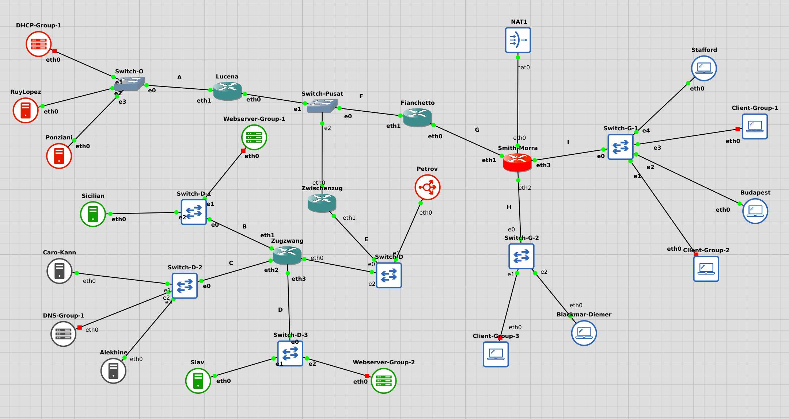

## Put your GNS3 Project file here!

[GNS3 Project File](./gns3project.gns3project)

<br>

## Soal 1

> Menggunakan metode VLSM, buatlah pembagian subnet untuk masing-masing gedung dengan cara yang seefisien mungkin!

> _Using the VLSM method, create subnets for each building as efficiently as possible!_

**Answer:**

- Screenshot

  #### VLSM Tree
  

- Explanation

  #### Subnetting Table
  | Subnet | Total Host | Range IP                        | Length | Subnet Mask        |
  |--------|------------|----------------------------------|--------|---------------------|
  | A      | 53         | 10.125.0.64 - 10.125.0.127       | /26    | 255.255.255.192     |
  | B      | 102        | 10.125.0.128 - 10.125.0.255      | /25    | 255.255.255.128     |
  | C      | 13         | 10.125.0.32 - 10.125.0.47        | /28    | 255.255.255.240     |
  | D      | 202        | 10.125.1.0 - 10.125.1.255        | /24    | 255.255.255.0       |
  | E      | 3          | 10.125.0.8 - 10.125.0.15         | /29    | 255.255.255.248     |
  | F      | 3          | 10.125.0.16 - 10.125.0.23        | /29    | 255.255.255.248     |
  | G      | 2          | 10.125.0.0 - 10.125.0.3          | /30    | 255.255.255.252     |
  | H      | 5002       | 10.125.32.0 - 10.125.63.255      | /19    | 255.255.224.0       |
  | I      | 1253       | 10.125.8.0 - 10.125.15.255       | /21    | 255.255.248.0       |

  #### Detailed Subnetting Information
  <table>
  <thead>
  <tr>
    <th>Subnet</th>
    <th>Node</th>
    <th>Interface</th>
    <th>Type</th>
    <th>Host</th>
    <th>IP Address</th>
  </tr>
  </thead>

  <tbody>

  <!-- SUBNET A -->
  <tr>
    <td rowspan="4">A</td>
    <td>Lucena</td>
    <td>eth1</td>
    <td>Router</td>
    <td>1</td>
    <td>10.125.0.65</td>
    
  </tr>
  <tr>
    <td>RuyLopez</td>
    <td>eth0</td>
    <td>DHCP Server</td>
    <td>1</td>
    <td>10.125.0.66</td>
  </tr>
  <tr>
    <td>Ponziani</td>
    <td>eth0</td>
    <td>DHCP Server</td>
    <td>1</td>
    <td>10.125.0.67</td>
  </tr>
  <tr>
    <td>DHCP-Group-1</td>
    <td>eth0</td>
    <td>DHCP Server</td>
    <td>50</td>
    <td>-</td>
  </tr>

  <!-- SUBNET B -->
  <tr>
    <td rowspan="3">B</td>
    <td>Zugzwang</td>
    <td>eth1</td>
    <td>Router</td>
    <td>1</td>
    <td>10.125.0.129</td>
    
  </tr>
  <tr>
    <td>Sicilian</td>
    <td>eth0</td>
    <td>Web Server</td>
    <td>1</td>
    <td>10.125.0.130</td>
  </tr>
  <tr>
    <td>Webserver-Group-1</td>
    <td>eth0</td>
    <td>Web Server</td>
    <td>100</td>
    <tdq>-</tdq>
  </tr>

  <!-- SUBNET C -->
  <tr>
    <td rowspan="3">C</td>
    <td>Zugzwang</td>
    <td>eth2</td>
    <td>Router</td>
    <td>1</td>
    <td>10.125.0.33</td>
    
  </tr>
  <tr>
    <td>Caro-Kann</td>
    <td>eth0</td>
    <td>DNS Master</td>
    <td>1</td>
    <td>10.125.0.34</td>
  </tr>
  <tr>
    <td>Alekhine</td>
    <td>eth0</td>
    <td>DNS Slave</td>
    <td>1</td>
    <td>10.125.0.35</td>
  </tr>

  <!-- SUBNET D -->
  <tr>
    <td rowspan="3">D</td>
    <td>Zugzwang</td>
    <td>eth3</td>
    <td>Router</td>
    <td>1</td>
    <td>10.125.1.1</td>
    
  </tr>
  <tr>
    <td>Slav</td>
    <td>eth0</td>
    <td>Web Server</td>
    <td>1</td>
    <td>10.125.1.2</td>
  </tr>
  <tr>
    <td>Webserver-Group-2</td>
    <td>eth0</td>
    <td>Web Server</td>
    <td>200</td>
    <td>-</td>
  </tr>

  <!-- SUBNET E -->
  <tr>
    <td rowspan="3">E</td>
    <td>Zwischenzug</td>
    <td>eth1</td>
    <td>Router</td>
    <td>1</td>
    <td>10.125.0.9</td>
    
  </tr>
  <tr>
    <td>Zugzwang</td>
    <td>eth0</td>
    <td>Router</td>
    <td>1</td>
    <td>10.125.0.10</td>
  </tr>
  <tr>
    <td>Petrov</td>
    <td>eth0</td>
    <td>Reverse Proxy</td>
    <td>1</td>
    <td>10.125.0.11</td>
  </tr>

  <!-- SUBNET F -->
  <tr>
    <td rowspan="3">F</td>
    <td>Fianchetto</td>
    <td>eth1</td>
    <td>Router</td>
    <td>1</td>
    <td>10.125.0.17</td>
  </tr>
  <tr>
    <td>Lucena</td>
    <td>eth0</td>
    <td>Router</td>
    <td>1</td>
    <td>10.125.0.18</td>
  </tr>
  <tr>
    <td>Zwischenzug</td>
    <td>eth0</td>
    <td>Router</td>
    <td>1</td>
    <td>10.125.0.19</td>
  </tr>

  <!-- SUBNET G -->
  <tr>
    <td rowspan="2">G</td>
    <td>SmithMorra</td>
    <td>eth1</td>
    <td>Router</td>
    <td>1</td>
    <td>10.125.1.1</td>
    
  </tr>
  <tr>
    <td>Fianchetto</td>
    <td>eth0</td>
    <td>Router</td>
    <td>1</td>
    <td>10.125.1.2</td>
  </tr>

  <!-- SUBNET H -->
  <tr>
    <td rowspan="3">H</td>
    <td>SmithMorra</td>
    <td>eth2</td>
    <td>Router</td>
    <td>1</td>
    <td>10.125.32.1</td>
   
  </tr>
  <tr>
    <td>Blackmar-Diemer</td>
    <td>eth0</td>
    <td>Client</td>
    <td>1</td>
    <td>DHCP</td>
  </tr>
  <tr>
    <td>Client-Group-3</td>
    <td>eth0</td>
    <td>Client</td>
    <td>5000</td>
    <td>-</td>
  </tr>

  <!-- SUBNET I -->
  <tr>
    <td rowspan="4">I</td>
    <td>SmithMorra</td>
    <td>eth3</td>
    <td>Router</td>
    <td>1</td>
    <td>10.125.8.1</td>
   
  </tr>
  <tr>
    <td>Budapest</td>
    <td>eth0</td>
    <td>Client</td>
    <td>1</td>
    <td>DHCP</td>
  </tr>
  <tr>
    <td>Stafford</td>
    <td>eth0</td>
    <td>Client</td>
    <td>1</td>
    <td>DHCP</td>
  </tr>
  <tr>
    <td>Client-Group-1</td>
    <td>eth0</td>
    <td>Client</td>
    <td>250</td>
    <td>-</td>
  </tr>

  </tbody>
  </table>


<br>

## Soal 2

> Konfigurasi semua router agar bisa terhubung ke semua jaringan. Gunakan static routing dan uji dengan melakukan ping dari **Budapest** ke **Alekhine** dan dari **Ponziani** ke **Sicilian**!

> _Configure all routers to connect to all networks. Use static routing and perform testing by pinging from **Budapest** to **Alekhine** and from **Ponziani** to **Sicilian**!_

**Answer:**

- Screenshot

  #### Hasil ping dari Budapest ke Alekhine
  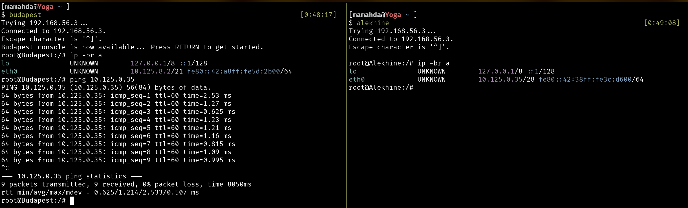
  #### Hasil ping dari Ponziani ke Sicilian
  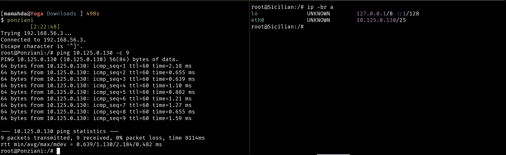

- Explanation

  ##### Static routing configuration di masing-masing router:
  - Smith-Morra
    ```
    ip route add 10.125.0.64/26 via 10.125.0.2
    ip route add 10.125.0.128/25 via 10.125.0.2
    ip route add 10.125.0.32/28 via 10.125.0.2
    ip route add 10.125.1.0/24 via 10.125.0.2
    ip route add 10.125.0.8/29 via 10.125.0.2
    ip route add 10.125.0.16/29 via 10.125.0.2
    ```
  - Fianchetto
    ```
    ip route add 10.125.0.64/26 via 10.125.0.18
    ip route add 10.125.0.128/25 via 10.125.0.19
    ip route add 10.125.0.32/28 via 10.125.0.19
    ip route add 10.125.1.0/24 via 10.125.0.19
    ip route add 10.125.0.8/29 via 10.125.0.19
    ```
  - Zwischenzug
    ```
    ip route add 10.125.0.128/25 via 10.125.0.10
    ip route add 10.125.0.32/28 via 10.125.0.10
    ip route add 10.125.1.0/24 via 10.125.0.10
    ```

<br>

## Soal 3

> Berikan seluruh client (**Blackmar-Diemer, Budapest,** dan **Stafford**) IP secara dinamis dari DHCP. Range IP dibebaskan, namun tunjukkan bahwa mereka mendapatkan IP secara dinamis!

> _Assign all clients (**Blackmar-Diemer, Budapest,** and **Stafford**) dynamic IP addresses via DHCP. You may use any IP range you would like, but prove that they receive IP addresses dynamically!_

**Answer:**

- Screenshot

  #### IP Address Dinamis dari Blackmar-Diemer, Budapest, dan Stafford
  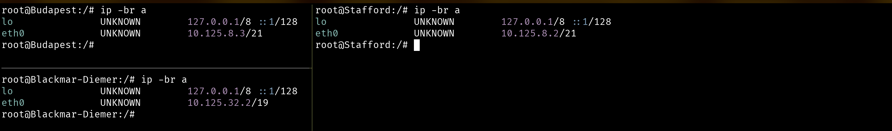

- Explanation

  #### Konfigurasi DHCP Server di RuyLopez
  - Konfigurasi DHCP di dalam file `/etc/dhcp/dhcpd.conf` sebagai Primary DHCP Server
    ```
    failover peer "dhcp-failover" {
      primary;
      address 10.125.0.67;
      port 647;
      peer address 10.125.0.66;
      peer port 647;
      max-response-delay 60;
      max-unacked-updates 10;
      load balance max seconds 3;
      mclt 3600;
      split 128; # Pembagian beban 50-50
    }

    subnet 10.125.0.64 netmask 255.255.255.192 {
    }

    subnet 10.125.8.0 netmask 255.255.248.0 {
      option routers 10.125.8.1;
      option domain-name-servers 10.125.0.34, 10.125.0.35;
      pool {
        failover peer "dhcp-failover";
        range 10.125.8.2 10.125.15.254;
      }
    }

    subnet 10.125.32.0 netmask 255.255.224.0 {
      option routers 10.125.32.1;
      option domain-name-servers 10.125.0.34, 10.125.0.35;
      pool {
        failover peer "dhcp-failover";
        range 10.125.32.2 10.125.63.254;
      }
    }

    subnet 10.125.1.0 netmask 255.255.255.0 {
      option routers 10.125.1.1;
      option domain-name-servers 10.125.0.34, 10.125.0.35;
      pool {
        failover peer "dhcp-failover";
        range 10.125.1.2 10.125.1.254;
      }
    }

    subnet 10.125.0.128 netmask 255.255.255.128 {
      option routers 10.125.0.129;
      option domain-name-servers 10.125.0.34, 10.125.0.35;
      pool {
        failover peer "dhcp-failover";
        range 10.125.0.130 10.125.0.254;
      }
    }
    ```

    - Lalu lakukan restart dhcp di node RuyLopez
    ```
    service isc-dhcp-server restart
    ```

  #### Konfigurasi DHCP Server di Ponziani
    - Kemudian konfigurasi DHCP di dalam file `/etc/dhcp/dhcpd.conf` sebagai Secondary DHCP Server
    ```
    failover peer "dhcp-failover" {
      secondary; 
      address 10.125.0.66;
      port 647;
      peer address 10.125.0.67;
      peer port 647;
      max-response-delay 60;
      max-unacked-updates 10;
      load balance max seconds 3;
    }

    subnet 10.125.0.64 netmask 255.255.255.192 {
    }

    subnet 10.125.8.0 netmask 255.255.248.0 {
      option routers 10.125.8.1;
      option domain-name-servers 10.125.0.34, 10.125.0.35;
      pool {
        failover peer "dhcp-failover";
        range 10.125.8.2 10.125.15.254;
      }
    }

    subnet 10.125.32.0 netmask 255.255.224.0 {
      option routers 10.125.32.1;
      option domain-name-servers 10.125.0.34, 10.125.0.35;
      pool {
        failover peer "dhcp-failover";
        range 10.125.32.2 10.125.63.254;
      }
    }

    subnet 10.125.1.0 netmask 255.255.255.0 {
      option routers 10.125.1.1;
      option domain-name-servers 10.125.0.34, 10.125.0.35;
      pool {
        failover peer "dhcp-failover";
        range 10.125.1.2 10.125.1.254;
      }
    }

    subnet 10.125.0.128 netmask 255.255.255.128 {
      option routers 10.125.0.129;
      option domain-name-servers 10.125.0.34, 10.125.0.35;
      pool {
        failover peer "dhcp-failover";
        range 10.125.0.130 10.125.0.254;
      }
    }
    ```

    - Lalu lakukan restart dhcp di node Ponziani
    ```
    service isc-dhcp-server restart
    ```

<br>

## Soal 4

> Berikan web server **Slav** dan **Sicilian** IP address yang tetap/fixed dari DHCP. 

> _Assign **Slav** and **Sicilian** web servers fixed IP addresses via DHCP._

**Answer:**

- Screenshot

  #### IP Address Fixed dari Sicilian dan Slav
  

- Explanation

  - Konfigurasi fixed IP di dalam file `/etc/dhcp/dhcpd.conf` di node RuyLopez 
    ```
    host Sicilian {
        hardware ethernet 02:42:0a:7d:00:82;
        fixed-address 10.125.0.130;
    }

    host Slav {
        hardware ethernet 02:42:0a:7d:00:01;
        fixed-address 10.125.1.2;
    }
    ```
    - Lalu lakukan restart dhcp di node RuyLopez
    ```
    service isc-dhcp-server restart
    ```
    - Kemudian konfigurasi fixed IP di dalam file `/etc/dhcp/dhcpd.conf` di node Ponziani 
    ```
    host Sicilian {
        hardware ethernet 02:42:0a:7d:00:82;
        fixed-address 10.125.0.130;
    }

    host Slav {
        hardware ethernet 02:42:0a:7d:00:01;
        fixed-address 10.125.1.2;
    }
    ```
    - Lalu lakukan restart dhcp di node Ponziani
    ```
    service isc-dhcp-server restart
    ```

<br>

## Soal 5

> Buatlah konfigurasi untuk domain:  
**parkov.com** → IP Node **Slav**  
**paskarov.com** → IP Node **Sicilian** 
Pada **DNS Master Caro-Kann.** Tambahkan juga subdomain www untuk kedua domain tersebut.

> _Configure the domains:  
**parkov.com** → **Slav** Node IP  
**paskarov.com** → **Sicilian** Node IP  
On the **Caro-Kann DNS Master,** then add the www subdomain for both domains._

**Answer:**

- Screenshot

  #### Hasil ping ke domain parkov.com dan paskarov.com dari Client
  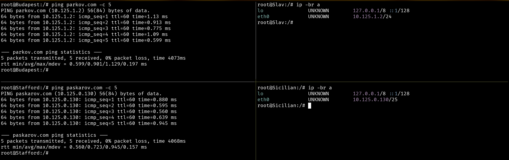

- Explanation

  - Konfigurasi zone di dalam file `/etc/bind/named.conf.local` di node Caro-Kann
    ```
    zone "parkov.com" {
        type master;
        notify yes;
        also-notify { 10.125.0.35; };
        allow-transfer { 10.125.0.35; };
        file "/etc/bind/zones/parkov.com";
    };

    zone "paskarov.com" {
        type master;
        notify yes;
        also-notify { 10.125.0.35; };
        allow-transfer { 10.125.0.35; };
        file "/etc/bind/zones/paskarov.com";
    };

    ```

  - Buat file zone untuk parkov.com di dalam direktori `/etc/bind/zone/parkov.com.db` di node Caro-Kann
    ```
    $TTL    604800
    @       IN      SOA     parkov.com. root.parkov.com. (
                                  2024062701         ; Serial
                                      604800         ; Refresh
                                        86400         ; Retry
                                      2419200         ; Expire
                                      604800 )       ; Negative Cache TTL
    ;
    @     IN      NS      parkov.com.
    @     IN      A       10.125.1.2
    www   IN      CNAME   parkov.com.
    ```

  - Buat file zone untuk paskarov.com di dalam direktori `/etc/bind/zone/paskarov.com.db` di node Caro-Kann
    ```
    $TTL    604800
    @       IN      SOA     paskarov.com. root.paskarov.com. (
                                  2024062701         ; Serial
                                      604800         ; Refresh
                                      86400         ; Retry
                                    2419200         ; Expire
                                      604800 )       ; Negative Cache TTL
    ;
    @     IN      NS      paskarov.com.
    @     IN      A       10.125.0.130
    www   IN      CNAME   paskarov.com.
    ```

  - Lalu lakukan restart bind di node Caro-Kann
    ```
    service named restart
    ``` 

<br>

## Soal 6

> Konfigurasikan juga **Alekhine** sebagai **DNS Slave** yang bekerja untuk membantu **Caro-Kann.** Lakukan pengujian dengan **mematikan Caro-Kann** lalu coba ping ke domain dan subdomain tersebut (pilih salah satu saja).

> _Configure **Alekhine** as a **DNS Slave** to assist **Caro-Kann**. Perform testing by **disabling Caro-Kann** and then pinging the domain and subdomain (choose only one)._

**Answer:**

- Screenshot

  #### Hasil ping ke domain parkov.com setelah mematikan Caro-Kann
  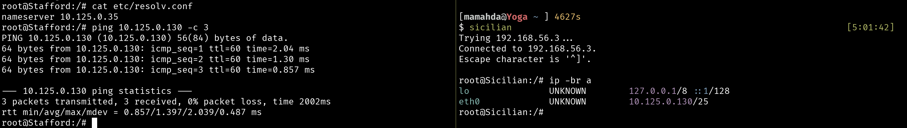

- Explanation

  - Konfigurasi zone di dalam file `/etc/bind/named.conf.local` di node Alekhine
    ```
    zone "parkov.com" {
        type slave;
        masters { 10.125.0.34; };
        file "/var/lib/bind/parkov.com";
    };

    zone "paskarov.com" {
        type slave;
        masters { 10.125.0.34; };
        file "/var/lib/bind/paskarov.com";
    };

    zone "openings.com" {
        type slave;
        masters { 10.125.0.34; };
        file "/var/lib/bind/openings.com";
    };
    ```

  - Lalu lakukan restart bind di node Alekhine
    ```
    service named restart
    ```

<br>

## Soal 7

> Konfigurasikan **Sicilian** agar berfungsi sebagai **web server nginx** yang akan menyajikan [halaman berikut](https://drive.google.com/file/d/1eX0ZjRKprx8T34XFAssrpc7ZE1j6Jv0j/view). Konfigurasikan juga agar **Sicilian** bisa menyimpan custom access log ke file **/tmp/access.log** dan error log ke file **/tmp/error.log.**

> _Configure **Sicilian** to function as an **nginx web server**that will serve [this page](https://drive.google.com/file/d/1eX0ZjRKprx8T34XFAssrpc7ZE1j6Jv0j/view). Also, configure **Sicilian** to save custom access logs to **/tmp/access.log** and error logs to **/tmp/error.log.**_

**Answer:**

- Screenshot

  #### Hasil lynx web server di Sicilian
  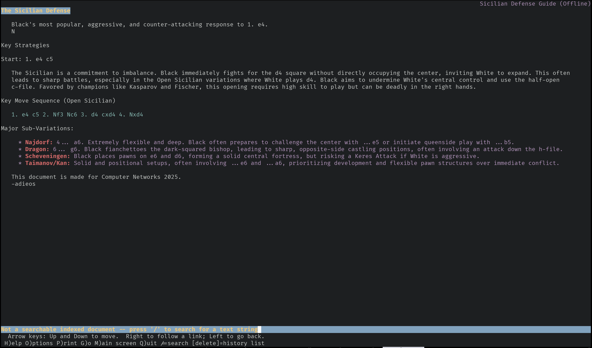

- Explanation

  - Simpan halaman sicilian.html di direktori `/var/www/html/` pada node Sicilian
    ```
    wget -O /var/www/html/sicilian.html https://drive.google.com/uc?export=download&id=1eX0ZjRKprx8T34XFAssrpc7ZE1j6Jv0j
    ```
  - Konfigurasi server block di dalam file `/etc/nginx/sites-available/default` di node Sicilian
    ```
    server {
        listen 80;
        root /var/www/html;
        index sicilian.html;
        server_name _;

        location / {
            try_files $uri $uri/ =404;
        }

        location ~ /\.ht {
            deny all;
        }

        access_log /tmp/access.log;
        error_log /tmp/error.log;
    }
    ```

    - Lalu lakukan restart nginx di node Sicilian
    ```
    service nginx restart
    ```

<br>

## Soal 8

> Buatlah custom access log ke file **/tmp/access.log.** Untuk keperluan logging, gunakan format log seperti di bawah:
> - Tanggal dan waktu akses dalam format standar log.
> - Nama node yang sedang diakses.
> - Alamat IP klien yang mengakses website.
> - Metode HTTP dan URI yang diakses oleh klien.
> - Status respons HTTP yang diberikan oleh server.
> - Jumlah byte yang dikirimkan dalam respons.
> - Waktu yang dihabiskan oleh server untuk menangani permintaan.> 
> - Contoh format log yang sesuai:  
[01/Oct/2024:11:30:45 +0000] Jarkom Node Sicilian Access from 192.168.1.15 using method "GET /resep/bayam HTTP/1.1" returned status 200 with 2567 bytes sent in 0.038 seconds

> _Webserver: Create a custom access log to the file **/tmp/access.log.** For logging purposes, use the log format shown below:_
> - _The date and time of access in standard log format._
> - _The name of the node being accessed._
> - _The IP address of the client accessing the website._
> - _The HTTP method and URI accessed by the client._
> - _The HTTP response status returned by the server._
> - _The number of bytes sent in the response._
> - _The time spent by the server processing the request._
> - _Example of appropriate log format:  
[01/Oct/2024:11:30:45 +0000] Jarkom Node Sicilian Access from 192.168.1.15 using method "GET /resep/bayam HTTP/1.1" returned status 200 with 2567 bytes sent in 0.038 seconds_

**Answer:**

- Screenshot

  #### Custom log format di Sicilian
  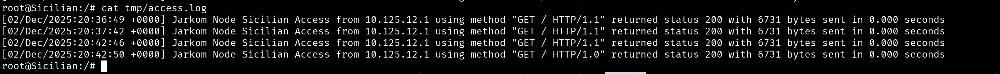

- Explanation

  - Buat custom log format di dalam file `/etc/nginx/nginx.conf` di node Sicilian
    ```
    ...
    http {
        log_format custom_access '[$time_local] Jarkom Node Sicilian Access from $remote_addr using method "$request" returned status $status with $body_bytes_sent bytes sent in $request_time seconds';
        ...
    }
    ```

  - Tambahkan access_log dengan custom log di dalam server block di file `/etc/nginx/sites-available/default` di node Sicilian
    ```
    server {
        ...
        access_log /tmp/access.log custom_access;
        ...
    }
    ```

    - Lalu lakukan restart nginx di node Sicilian
    ```
    service nginx restart
    ```


<br>

## Soal 9

> Konfigurasikan juga **Slav** agar berfungsi sebagai **web server nginx** yang menyajikan [halaman berikut](https://drive.google.com/file/d/1h8ik1Zcubntp0dvHt9NHYqSZLSTG6FuZ/view) dan **hanya** bisa diakses melalui port **8000** dan **8888.**

> _Configure **Slav** to function as an **nginx web server** that serves [this page](https://drive.google.com/file/d/1h8ik1Zcubntp0dvHt9NHYqSZLSTG6FuZ/view?usp=drive_link) and is **only** accessible via ports **8000** and **8888.**_

**Answer:**

- Screenshot

  #### Hasil web server di Sicilian melalui port 80
  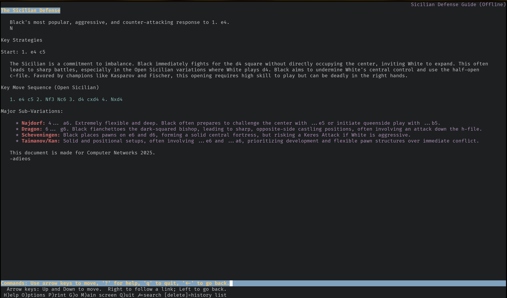
  #### Hasil web server di Slav melalui port 8000
  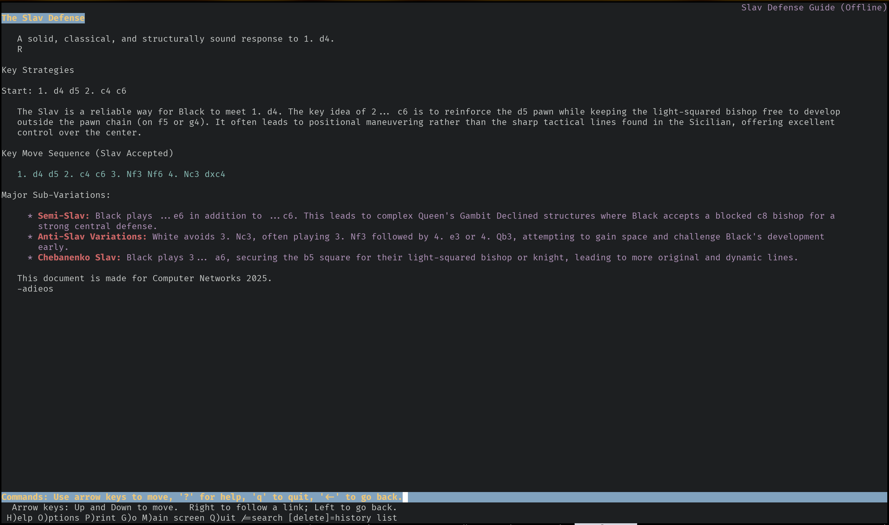
  #### Hasil web server di Slav melalui port 80 (gagal)
  

- Explanation

  - Simpan halaman slav.html di direktori `/var/www/html/` pada node Slav
    ```
    wget -O /var/www/html/slav.html https://drive.google.com/uc?export=download&id=1h8ik1Zcubntp0dvHt9NHYqSZLSTG6FuZ
    ```
  - Konfigurasi server block di dalam file `/etc/nginx/sites-available/default` di node Slav
    ```
    server {
        listen 8000;
        listen 8888;
        root /var/www/html;
        index slav.html;
        server_name _;

        location / {
            try_files $uri $uri/ =404;
        }

        location ~ /\.ht {
            deny all;
        }

        access_log /tmp/access.log custom_access;
        error_log /tmp/error.log;
    }
    ```

    - Buat custom log format di dalam file `/etc/nginx/nginx.conf` di node Slav
    ```
    ...
    http {
        log_format custom_access '[$time_local] Jarkom Node Sicilian Access from $remote_addr using method "$request" returned status $status with $body_bytes_sent bytes sent in $request_time seconds';
        ...
    }
    ```

    - Lalu lakukan restart nginx di node Slav
    ```
    service nginx restart
    ```

    Dengan konfigurasi di atas, web server Slav hanya bisa diakses melalui port 8000 dan 8888.

<br>

## Soal 10

> Untuk memudahkan akses, buatlah satu domain lagi dengan nama **openings.com** yang mengarah ke **Petrov.** Lalu, konfigurasikan juga **Petrov** sebagai **Reverse Proxy** yang akan melakukan forward request ke server yang sesuai berdasarkan URL profile yang diminta oleh klien dengan ketentuan sebagai berikut:
> - Request untuk “openings.com/**sicilian**” harus dialihkan ke web server **Sicilian.**
> - Request untuk “openings.com/**slav**” harus dialihkan ke web server **Slav.**

> _To facilitate access, create another domain with the name **openings.com** that points to **Petrov.** Then, configure **Petrov** as a **Reverse Proxy** that will forward requests to the appropriate server based on the profile URL requested by the client with the following conditions:_
> - _Requests for “openings.com/**sicilian**” must be forwarded to web server **Sicilian.**_
> - _Request for “openings.com/**slav**” must be forwarded to web server **Slav.**_

**Answer:**

- Screenshot

  #### Hasil curl `/sicilian` di Client
  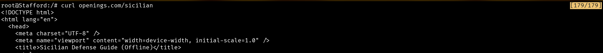
  #### Hasil curl `/slav` di Client
  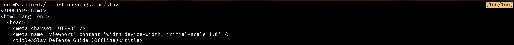

- Explanation

  - Konfigurasi zone di dalam file `/etc/bind/named.conf.local` di node Caro-Kann
    ```
    zone "openings.com" {
        type master;
        notify yes;
        also-notify { 10.125.0.35; };
        allow-transfer { 10.125.0.35; };
        file "/etc/bind/zones/openings.com";
    };
    ```

  - Buat file zone untuk openings.com di dalam direktori `/etc/bind/zone/openings.com.db` di node Caro-Kann
    ```
    $TTL    604800
    @       IN      SOA     openings.com. root.openings.com. (
                                  2024062701         ; Serial
                                      604800         ; Refresh
                                      86400         ; Retry
                                    2419200         ; Expire
                                      604800 )       ; Negative Cache TTL
    ;
    @     IN      NS      openings.com.
    @     IN      A       10.125.0.11
    www   IN      CNAME   openings.com.
    ```
  - Lalu lakukan restart bind di node Caro-Kann
    ```
    service named restart
    ```


  - Tambahkan server block di dalam file `/etc/nginx/sites-available/default` di node Petrov
    ```
    server {
          listen 80;
          server_name openings.com;

          location /sicilian {
                proxy_pass http://paskarov.com;
          }

          location /slav {
                proxy_pass http://parkov.com;
          }
    }
    ```

    - Lalu lakukan restart nginx di node Petrov
    ```
    service nginx restart
    ```


<br>

## Soal 11

> Tambahkan juga konfigurasi agar request untuk “openings.com/**random**” akan mengalihkan request ke webserver **Sicilian** dan **Slav** dengan algoritma _round-robin_.

> _Additionally, configure requests for "openings.com/**random**" to be redirected to the **Sicilian** and **Slav** web servers using a round-robin algorithm._

**Answer:**

- Screenshot

  #### Hasil curl di Client 
  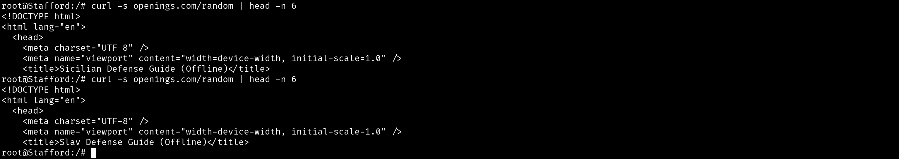

- Explanation

  - Tambahkan upstream block di dalam file `/etc/nginx/sites-available/default` di node Petrov
    ```
    upstream web_servers {
          server paskarov.com:80;
          server parkov.com:8000;
    }
    ```

  - Tambahkan location block di dalam server block di file yang sama
    ```
    location /random {
          proxy_pass http://web-servers/;
    }
    ```

  - Lalu lakukan restart nginx di node Petrov
    ``` 
    service nginx restart
    ```

    secara otomatis konfigurasi di atas akan menggunakan algoritma round-robin untuk mendistribusikan request ke web server Sicilian dan Slav.

<br>

## Soal 12

> Anatoly Parkov berencana untuk melakukan ekspansi secara besar-besaran. Maka dari itu, hapus seluruh konfigurasi Static Routing dan ubah agar seluruh router menggunakan Dynamic Routing. Gunakan protokol RIP!

> _Anatoly Parkov plans to perform a great expansion. Therefore, remove all Static Routing configurations and configure all routers to use Dynamic Routing. Use the RIP protocol!_

**Answer:**

- Screenshot

  #### Hasil konfigurasi dynamic routing menggunakan protokol RIP
  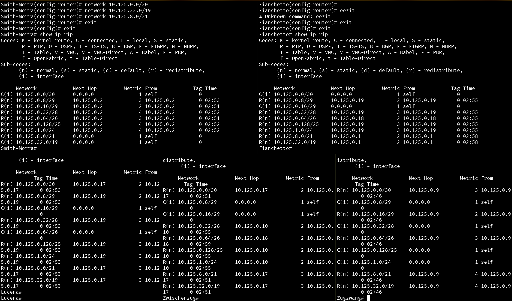

- Explanation

  - Hapus seluruh konfigurasi static routing di masing-masing router
    - Smith-Morra
      ```
      ip route del 10.125.0.8/29
      ip route del 10.125.0.16/29
      ip route del 10.125.0.32/28
      ip route del 10.125.0.64/26
      ip route del 10.125.0.128/25
      ip route del 10.125.1.0/24
      ```
    - Fianchetto
      ```
      ip route del 10.125.0.8/29
      ip route del 10.125.0.32/28
      ip route del 10.125.0.64/26
      ip route del 10.125.0.128/25
      ip route del 10.125.1.0/24
      ```
    - Zwischenzug
      ```
      ip route del 10.125.0.32/28
      ip route del 10.125.0.128/25
      ip route del 10.125.1.0/24
      ```
      #### Jalan kan service FRR pada masing-masing router
      ```
      cd /usr/lib/frr
      ./zebra -d
      ./ripd -d
      ./mgmtd -d
        
      vtysh
      conf t
      router rip
      ```

      #### Konfigurasi masing-masing router untuk dynamic routing menggunakan protokol RIP
      - Smith-Morra
        ```
        network 10.125.0.0/30
        network 10.125.32.0/19
        network 10.125.8.0/21
        ```
      - Fianchetto
        ```
        network 10.125.0.16/29
        network 10.125.0.0/30
        ```
      - Lucena
        ```
        network 10.125.0.16/29
        network 10.125.0.64/26
        ```
      - Zwischenzug
        ```
        network 10.125.0.8/29
        network 10.125.0.16/29
        ```
      - Zugzwang
        ```
        network 10.125.0.128/25
        network 10.125.0.32/28
        network 10.125.1.0/24
        network 10.125.0.8/29
        ```

<br>

## Soal 13

> Untuk meningkatkan keamanan, konfigurasikan firewall **Smith-Morra** untuk melakukan pembatasan koneksi SSH ke server DNS. Drop semua packet SSH yang berasal dari seluruh client yang memiliki tujuan ke **Caro-Kann** atau **Alekhine.**

> _To increase security, configure the **Smith-Morra** firewall to restrict SSH connections to the **DNS server.** Drop all SSH packets from all clients destined for **Caro-Kann** or **Alekhine.**_

**Answer:**

- Screenshot

  #### Hasil `watch -n 1 "iptables -nvL FORWARD"` di Smith-Morra saat melakukan SSH dari Client ke Caro-Kann dan Alekhine
  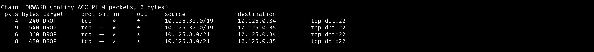

- Explanation

  - Tambahkan rule iptables di dalam firewall Smith-Morra
    ```
    iptables -A FORWARD -p tcp -s 10.125.32.0/19 -d 10.125.0.34 --dport 22 -j DROP
    iptables -A FORWARD -p tcp -s 10.125.32.0/19 -d 10.125.0.35 --dport 22 -j DROP
    iptables -A FORWARD -p tcp -s 10.125.8.0/21 -d 10.125.0.34 --dport 22 -j DROP
    iptables -A FORWARD -p tcp -s 10.125.8.0/21 -d 10.125.0.35 --dport 22 -j DROP
    ```
    keterangan:
    - Rule pertama dan kedua: Drop paket SSH dari subnet H (`10.125.32.0/19`) yang ditujukan ke Caro-Kann (`10.125.0.34`) dan Alekhine (`10.125.0.35`)
    - Rule ketiga dan keempat: Drop paket SSH dari subnet I (`10.125.8.0/21`) yang ditujukan ke Caro-Kann (`10.125.0.34`) dan Alekhine (`10.125.0.35`)
    

<br>

## Soal 14

> Nampaknya, web server juga manusia sehingga hanya ingin bekerja di hari kerja. Maka dari itu, semua client hanya bisa mengakses **Sicilian** dan **Slav** pada hari Senin-Jumat pada pukul 09:00-17:00.

> _Apparently, web servers are humans too, so they only want to work on weekdays. Therefore, all clients can only access **Sicilian** and **Slav** on Monday through Friday, 9:00 AM to 5:00 PM._

**Answer:**

- Screenshot

  #### Hasil `watch -n 1 "iptables -nvL FORWARD"` di Smith-Morra saat mengakses web server di luar jam kerja
  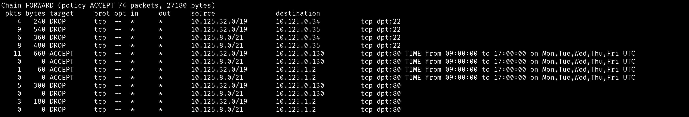

- Explanation

  - Tambahkan rule iptables di dalam firewall Smith-Morra
    ```
    iptables -A FORWARD -s 10.125.32.0/19 -d 10.125.0.130 -p tcp --dport 80 -m time --timestart 09:00 --timestop 17:00 --weekdays Mon,Tue,Wed,Thu,Fri -j ACCEPT
    iptables -A FORWARD -s 10.125.8.0/21 -d 10.125.0.130 -p tcp --dport 80 -m time --timestart 09:00 --timestop 17:00 --weekdays Mon,Tue,Wed,Thu,Fri -j ACCEPT

    iptables -A FORWARD -s 10.125.32.0/19 -d 10.125.1.2 -p tcp -m multiport --dports 8000,8888 -m time --timestart 09:00 --timestop 17:00 --weekdays Mon,Tue,Wed,Thu,Fri -j ACCEPT
    iptables -A FORWARD -s 10.125.8.0/21 -d 10.125.1.2 -p tcp -m multiport --dports 8000,8888 -m time --timestart 09:00 --timestop 17:00 --weekdays Mon,Tue,Wed,Thu,Fri -j ACCEPT

    iptables -A FORWARD -s 10.125.32.0/19 -d 10.125.0.130 -p tcp --dport 80 -j DROP
    iptables -A FORWARD -s 10.125.8.0/21 -d 10.125.0.130 -p tcp --dport 80 -j DROP

    iptables -A FORWARD -s 10.125.32.0/19 -d 10.125.1.2 -p tcp -m multiport --dports 8000,8888 -j DROP
    iptables -A FORWARD -s 10.125.8.0/21 -d 10.125.1.2 -p tcp -m multiport --dports 8000,8888 -j DROP
    ```
    keterangan:
    - Rule pertama sampai keempat: Mengizinkan akses ke web server Sicilian (`10.125.0.130`) dan Slav (`10.125.1.2`) pada hari Senin-Jumat pukul 09:00-17:00 dari subnet H (`10.125.32.0/19`) dan subnet I (`10.125.8.0/21`)
    - Rule kelima sampai kedelapan: Menolak akses ke web server Sicilian (`10.125.0.130`) dan Slav (`10.125.1.2`) di luar waktu yang telah ditentukan
<br>

## Soal 15

> Terakhir, Gerry Paskarov berpesan untuk selalu melakukan logging, sehingga konfigurasikan fitur logging untuk melakukan log terhadap seluruh paket yang di-DROP pada firewall **Smith-Morra.**
> _Finally, Gerry Paskarov advises to always perform logging, so configure a logging feature to log all packets dropped on the **Smith-Morra** firewall._

**Answer:**

- Screenshot

  #### Hasil `watch -n 1 "iptables -nvL FORWARD"` di Smith-Morra saat melakukan SSH dan HTTP di-drop
  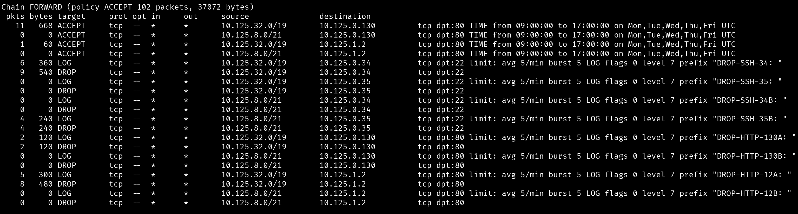

- Explanation

  - Hapus rule iptables sebelumnya di dalam firewall Smith-Morra
    ```
    iptables -F
    ```
  - Tambahkan rule iptables di dalam firewall Smith-Morra
    ```
    iptables -A FORWARD -s 10.125.32.0/19 -d 10.125.0.130 -p tcp --dport 80 -m time --timestart 09:00 --timestop 17:00 --weekdays Mon,Tue,Wed,Thu,Fri -j ACCEPT
    iptables -A FORWARD -s 10.125.8.0/21 -d 10.125.0.130 -p tcp --dport 80 -m time --timestart 09:00 --timestop 17:00 --weekdays Mon,Tue,Wed,Thu,Fri -j ACCEPT

    iptables -A FORWARD -s 10.125.32.0/19 -d 10.125.1.2 -p tcp --dport 80 -m time --timestart 09:00 --timestop 17:00 --weekdays Mon,Tue,Wed,Thu,Fri -j ACCEPT
    iptables -A FORWARD -s 10.125.8.0/21 -d 10.125.1.2 -p tcp --dport 80 -m time --timestart 09:00 --timestop 17:00 --weekdays Mon,Tue,Wed,Thu,Fri -j ACCEPT

    iptables -A FORWARD -p tcp --dport 22 -s 10.125.32.0/19 -d 10.125.0.34 -m limit --limit 5/min -j LOG --log-prefix "DROP-SSH: " --log-level 7
    iptables -A FORWARD -p tcp --dport 22 -s 10.125.32.0/19 -d 10.125.0.34 -j DROP

    iptables -A FORWARD -p tcp --dport 22 -s 10.125.32.0/19 -d 10.125.0.35 -m limit --limit 5/min -j LOG --log-prefix "DROP-SSH: " --log-level 7
    iptables -A FORWARD -p tcp --dport 22 -s 10.125.32.0/19 -d 10.125.0.35 -j DROP

    iptables -A FORWARD -p tcp --dport 22 -s 10.125.8.0/21 -d 10.125.0.34 -m limit --limit 5/min -j LOG --log-prefix "DROP-SSH: " --log-level 7
    iptables -A FORWARD -p tcp --dport 22 -s 10.125.8.0/21 -d 10.125.0.34 -j DROP

    iptables -A FORWARD -p tcp --dport 22 -s 10.125.8.0/21 -d 10.125.0.35 -m limit --limit 5/min -j LOG --log-prefix "DROP-SSH: " --log-level 7
    iptables -A FORWARD -p tcp --dport 22 -s 10.125.8.0/21 -d 10.125.0.35 -j DROP

    iptables -A FORWARD -p tcp --dport 80 -s 10.125.32.0/19 -d 10.125.0.130 -m limit --limit 5/min -j LOG --log-prefix "DROP-HTTP: " --log-level 7
    iptables -A FORWARD -p tcp --dport 80 -s 10.125.32.0/19 -d 10.125.0.130 -j DROP

    iptables -A FORWARD -p tcp --dport 80 -s 10.125.8.0/21 -d 10.125.0.130 -m limit --limit 5/min -j LOG --log-prefix "DROP-HTTP: " --log-level 7
    iptables -A FORWARD -p tcp --dport 80 -s 10.125.8.0/21 -d 10.125.0.130 -j DROP

    iptables -A FORWARD -p tcp -m multiport --dports 8000,8888 -s 10.125.32.0/19 -d 10.125.1.2 -m limit --limit 5/min -j LOG --log-prefix "DROP-HTTP: " --log-level 7
    iptables -A FORWARD -p tcp -m multiport --dports 8000,8888 -s 10.125.32.0/19 -d 10.125.1.2 -j DROP

    iptables -A FORWARD -p tcp -m multiport --dports 8000,8888 -s 10.125.8.0/21 -d 10.125.1.2 -m limit --limit 5/min -j LOG --log-prefix "DROP-HTTP: " --log-level 7
    iptables -A FORWARD -p tcp -m multiport --dports 8000,8888 -s 10.125.8.0/21 -d 10.125.1.2 -j DROP
    ```

    Rule di atas akan mencatat setiap paket yang di-DROP dengan prefix "DROP-SSH: " untuk paket SSH dan "DROP-HTTP: " untuk paket HTTP, serta membatasi jumlah log yang dihasilkan menjadi 5 log per menit untuk menghindari flooding log.

    Rule Logging harus ditempatkan sebelum rule DROP agar paket yang di-DROP dapat tercatat dengan benar.

<br>
  
## Problems

## Revisions (if any)
