[](https://classroom.github.com/a/tPVgLsdF)
| Name | NRP | Class |
| ---- | --- | ----- |
| Gilbran Mahdavikia Raja | 5025241134 | B      |

# Laporan Praktikum 1: Wireshark

## Task 1

- Flag

  ```
  JARKOM25{Ja0G_Bbbb4ng3t_S1_1Y928XMCIQ6IXNR8KBME60L66N4HLN0xl0vel16motslwoc4bjc0vfuj2gbb9_97ab51264c2dcb2d12e420885c65d9f0}
  ```
  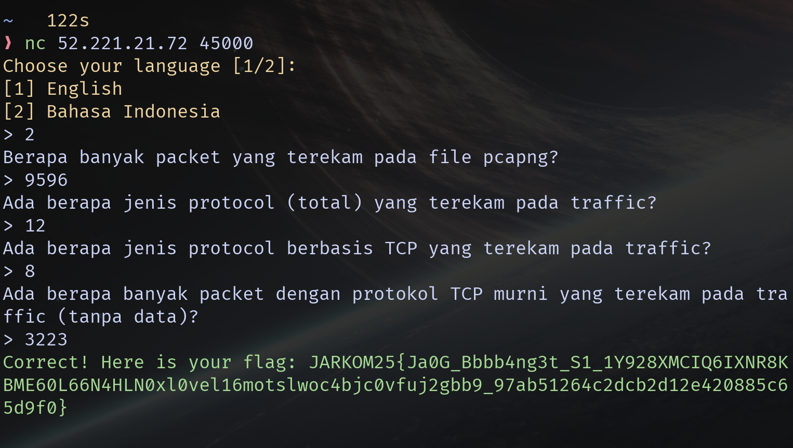

> a. Berapa banyak packet yang terekam pada file pcapng?

> _a. How many packets are recorded in the pcapng file?_

**Answer:** `9596`

- Filter expression

  ```
  -
  ```

- Explanation

  Untuk yang soal ini kita bisa langsung liat ke pojok kanan bawah wireshark, disitu ada tulisan `Packets: 9596`.

- Output result

  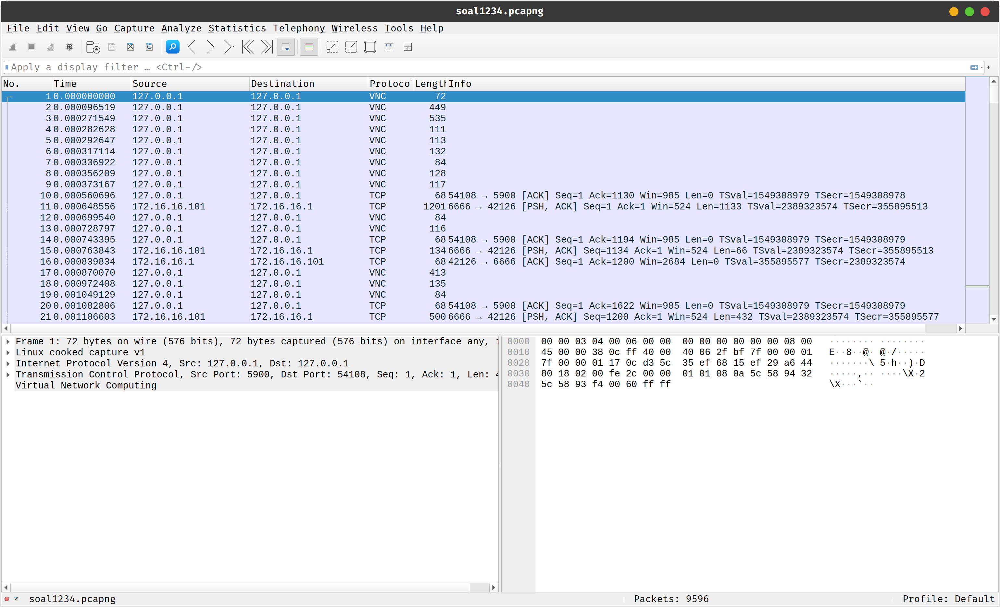

<br>
<br>

> b. Ada berapa jenis protocol (total) yang terekam pada traffic?

> _b. How many types of protocol (totals) are recorded in the traffic?_

**Answer:** `12`

- Filter expression

  ```
  -
  ```

- Explanation

  Kita bisa liat di bagian `Protocol Hierarchy` di menu `Statistics`, disitu ada jumlah total protocol yang terekam pada traffic.

- Output result

  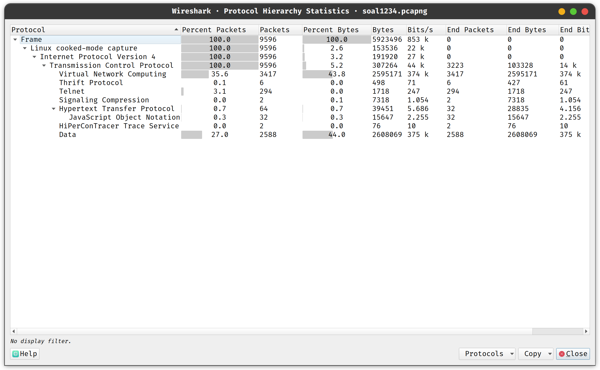

<br>
<br>

> c. Ada berapa jenis protocol berbasis TCP yang terekam pada traffic?

> _c. How many types of TCP-based applications protocol are recorded in the traffic?_

**Answer:** `8`

- Filter expression

  ```
  -
  ```


- Explanation

  Sama seperti soal sebelumnya, kita bisa liat di bagian `Protocol Hierarchy` di menu `Statistics`, disitu ada list dari protocol yang terekam pada traffic, lalu kita bisa hitung ada berapa jenis protocol berbasis TCP.

- Output result

  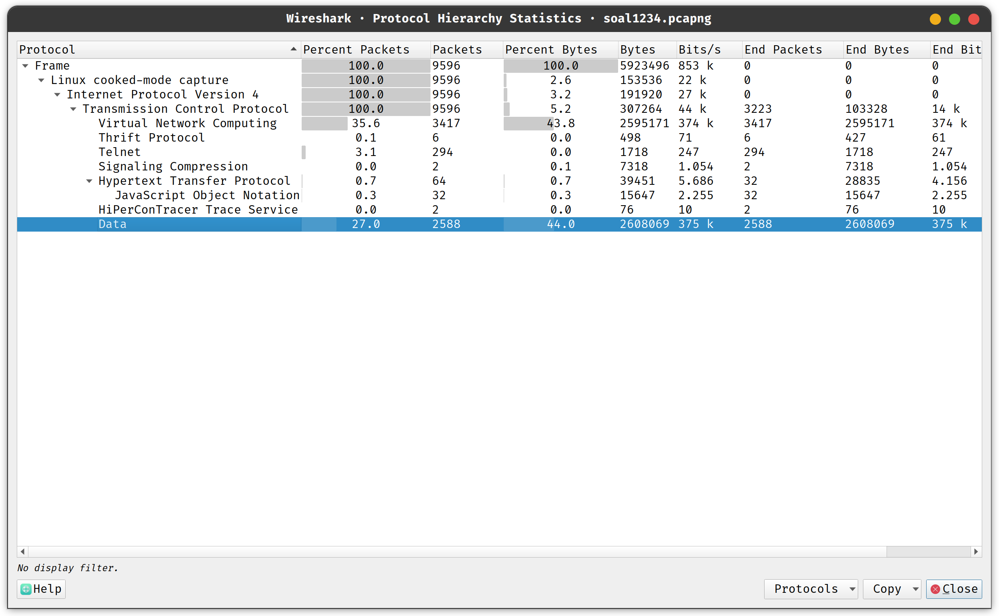

  <br>
  <br>

> d. Ada berapa banyak packet dengan protokol TCP murni yang terekam pada traffic (tanpa data)?

> _d. How many packets with pure TCP protocol are recorded in the traffic (without data)?_

**Answer:** `3223`

- Filter expression

  ```
  tcp
  ```

- Explanation

  Buka `Protocol Hierarchy` di menu `Statistics`, lalu pada bagian `tcp` terdapat `9596 packets`, karena dicari `tcp` yang murni (tanpa data) maka kita kurangi 9596 dengan semua protocal yang ada dibawah `tcp`. Jadi jawabannya adalah `9596-3417-6-294-2-64-2-2588` yaitu `3223`.

- Output result

  

## Task 2

- Flag

  ```
  JARKOM25{N1c3_0ne_b4nggg_OCSFANIPNKyuMM13ypxmkeyizhikphmsqfvdqc3r4t0ps80024045837050523554_df3110ea6edbe65324f3c6aeebd6ea85}
  ```
  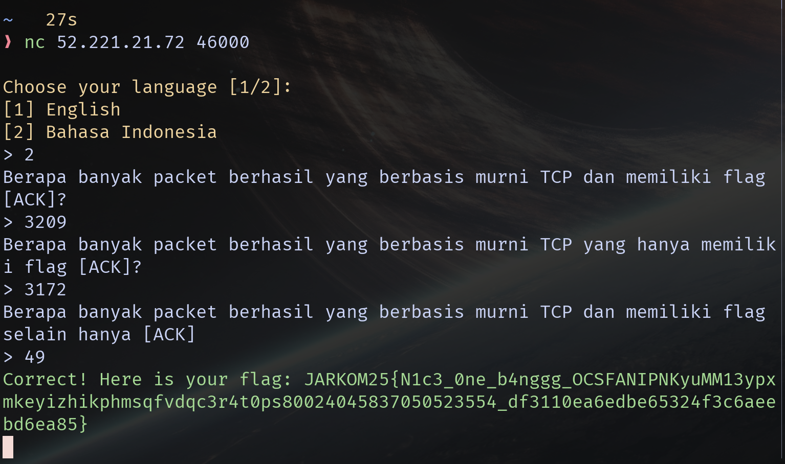

> a. Berapa banyak packet berhasil yang berbasis murni TCP dan memiliki flag [ACK]?

> _a. How many packets succeed that are pure TCP based and have [ACK] flag?_

**Answer:** `3209`

- Filter expression
  
  ``` 
  tcp.len == 0 && tcp.flags.ack == 1
  ```

- Explanation

  Gunakan display filter `tcp.len == 0 && tcp.flags.ack == 1` untuk menampilkan packet dengan protokol TCP murni (tanpa data) dan memiliki flag [ACK], lalu lihat di pojok kanan bawah wireshark, disitu ada tulisan `Displayed: 3210 (33.5%)`. Namun, sama seperti soal sebelumnya waktu saya submit `3210` keluar response `incorrect answer` lalu saya coba submit dengan angka `-1` dari package yang terdisplay yaitu `3209` ternyata jawabannya benar.

- Output result

  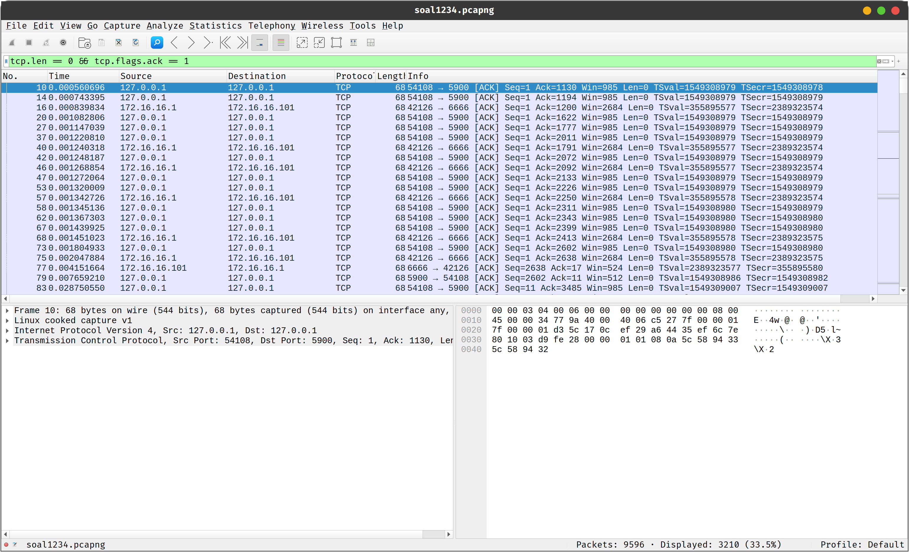

  <br>
  <br>

> b. Berapa banyak packet berhasil yang berbasis murni TCP yang hanya memiliki flag [ACK]?

> _b. How many packets succeed that are pure TCP based and have only [ACK] flag?_

**Answer:** `3172`

- Filter expression

  ```
  tcp.len == 0 && tcp.flags == 0x10
  ```

- Explanation

  Gunakan display filter `tcp.len == 0 && tcp.flags == 0x10` untuk menampilkan packet dengan protokol TCP murni (tanpa data) dan hanya memiliki flag [ACK], lalu lihat di pojok kanan bawah wireshark, disitu ada tulisan `Displayed: 3174 (33.1%)`. Di soal ini saya juga menemukan masalah yang sama seperti di soal sebelumnya, ketika submit `3174` malah keluar response `incorrect answer`, akhirnya saya coba submit dengan rentang `3174-5 < x < 3174+5` ternyata benar di angka `3172`.

- Output result

  

  <br>
  <br>

> c. Berapa banyak packet berhasil yang berbasis murni TCP dan memiliki flag selain hanya [ACK]?

> _c. How many packets succeed that are pure TCP based and contain flags other than just [ACK] flag?_

**Answer:** `49`

- Filter expression

  ```
  tcp.len == 0 && tcp.flags != 0x10
  ```

- Explanation

  Gunakan display filter `tcp.len == 0 && tcp.flags != 0x10` untuk menampilkan packet dengan protokol TCP murni (tanpa data) dan memiliki flag selain hanya [ACK], lalu lihat di pojok kanan bawah wireshark, disitu ada tulisan `Displayed: 48 (0.5%)`. Di soal ini saya juga menemukan masalah yang sama juga seperti di soal sebelumnya, ketika submit `48` malah keluar response `incorrect answer`, akhirnya saya coba submit dengan rentang `48-5 < x < 48+5` ternyata benar di angka `49`.

- Output result

  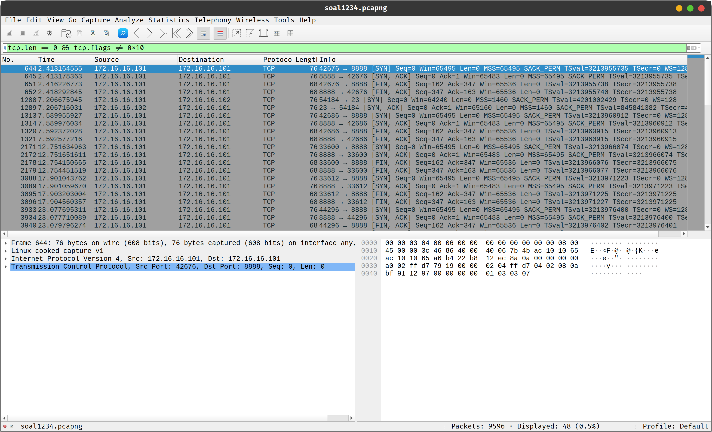

  <br>
  <br>

## Task 3

- Flag

  ```
  JARKOM25{W0w_Y0uU_h4V33e_d0n3_444_90od_j0bB_BB7AFg0dl1k39c112cobifvvdncfgoehvv_ab5830b2c3341a3281c555dd3213ee11}
  ```
  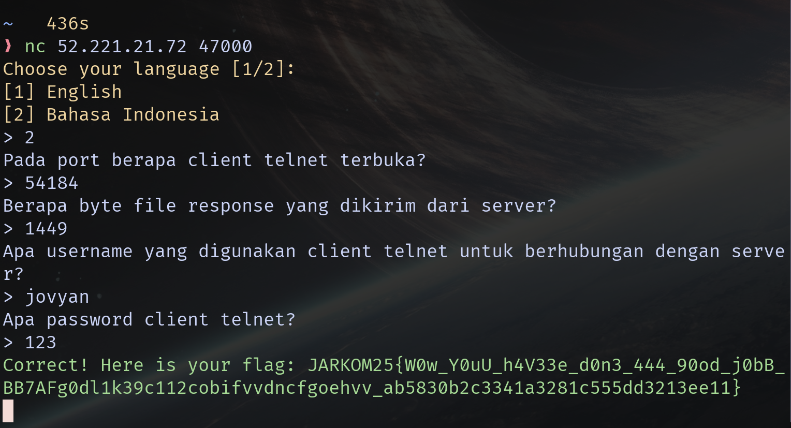

> a. Pada port berapa client telnet terbuka?

> _a. In what port is the telnet client open?_

**Answer:** `54184`

- Filter expression

  ```
  telnet
  ```

- Explanation

  Gunakan display filter `telnet` untuk menampilkan packet dengan protokol telnet, lalu pilih satu packet yang pertama kali ditangkap oleh wireshark, disitu terlihat bahwa `port destination` nya adalah `54184`.

- Output result

  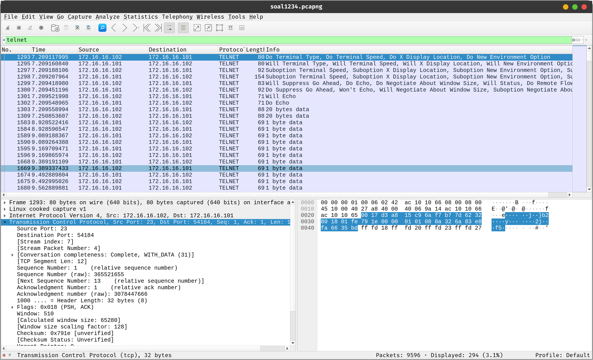

  <br>
  <br>

> b. Berapa byte file response yang dikirim dari server?

> _b. How many bytes of the response files are sent from the server?_

**Answer:** `1449`

- Filter expression

  ```
  telnet
  ```

- Explanation

  Gunakan display filter `telnet` untuk menampilkan packet dengan protokol telnet, lalu buka menu `tcp stream` pada `analyze > follow > tcp stream`, lalu pada bagian bawah terdapat tulisan `entire conversation`, klik lalu pada `dropdown` terdapat `172.16.16.101:23` (sebagai server) -> `172.16.16.101:54184` (sebagai client) disitu kita bisa lihat ada tulisan `1449 bytes`.

- Output result

  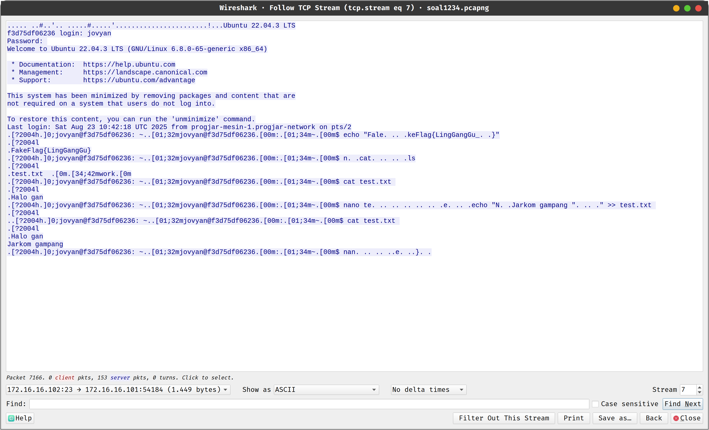

  <br>
  <br>

> c. Apa username yang digunakan client telnet untuk berhubungan dengan server?

> _c. What telnet client's username is used to connect with the server?_

**Answer:** `jovyan`

- Filter expression

  ```
  telnet
  ```

- Explanation

  Sama sepert soal sebelumnya, kita gunakan display filter 'telnet' untuk menampilkan packet dengan protokol telnet, lalu buka menu `tcp stream` pada `analyze > follow > tcp stream`, lalu pada bagian text area setelah `login:` terdapat username yang digunakan client telnet untuk berhubungan dengan server yaitu `jovyan`.

- Output result

  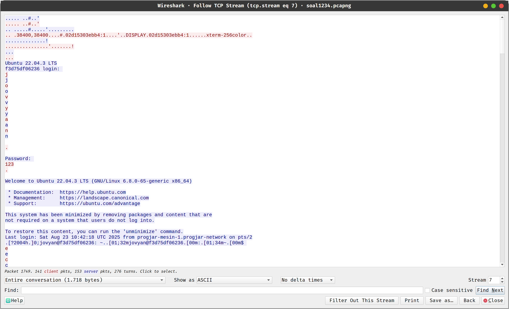

  <br>
  <br>

> d. Apa password client telnet?

> _d. What is the telnet client's password?_

**Answer:** `123`

- Filter expression

  ```
  telnet
  ```

- Explanation

  Sama seperti sebelumnya, kita tinggal liat saja kata setelah `Password:` pada bagian text area di `tcp stream`, disitu tertulis passwordnya yaitu `123`.

- Output result

  

  <br>
  <br>

## Task 4

- Flag

  ```
  JARKOM25{G04t__a4n4liz333er_0NZKEHU20XXPWZ5RUDKVfr0gjnv5blyu6etkb43r3ys6338153594_915d007971878d25d7ab4f774bb81003}
  ```
  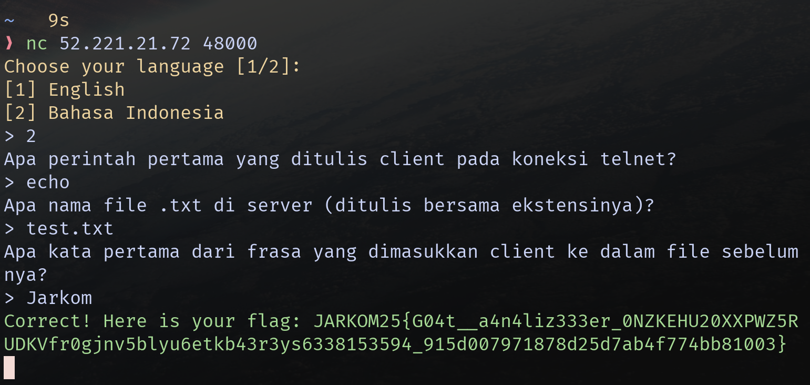

> a. Apa perintah pertama yang ditulis client pada koneksi telnet?

> _a. What is the first command that client wrote on telnet connection?_

**Answer:** `echo`

- Filter expression

  ```
  telnet
  ```

- Explanation

  Sama juga seperti soal 3b, buka menu `tcp stream` lalu scroll ke bawah sampai ketemu perintah pertama yang ditulis client pada koneksi telnet yaitu `echo`.

- Output result

  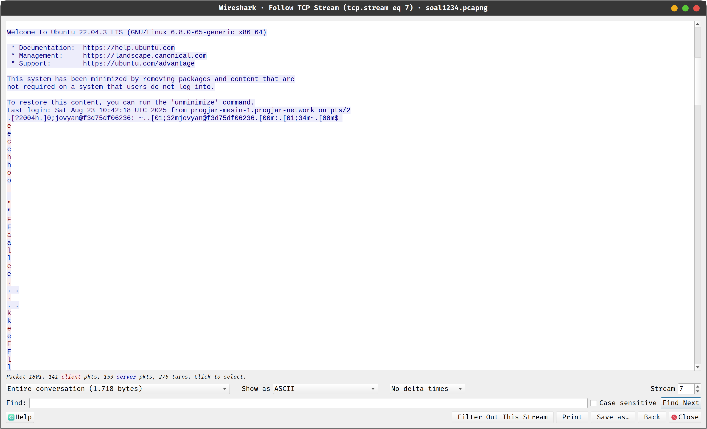

  <br>
  <br>

> b. Apa nama file .txt di server (ditulis bersama ekstensinya)?

> _b. What is the name of .txt file on the server (write with the extension)?_

**Answer:** `test.txt`

- Filter expression

  ```
  telnet
  ```

- Explanation

  Sama seperti soal sebelumnya, scroll sampai ketemu file dengan ekstensi `.txt` yang ada di server, disitu tertulis `test.txt`.

- Output result

  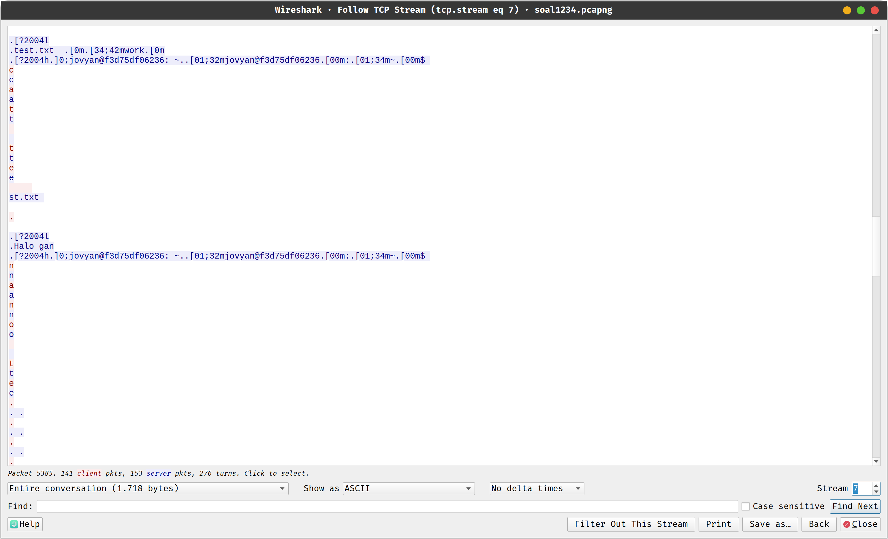

  <br>
  <br>

> c. Apa kata pertama dari frasa yang dimasukkan client ke dalam file sebelumnya?

> _c. What is the first word that the client inserted into the previous file?_

**Answer:** `Jarkom`

- Filter expression

  ```
  telnet
  ```

- Explanation

  Sama seperti soal sebelumnya, scroll sampai ketemu frasa yang dimasukkan client ke dalam file `test.txt`, disitu tertulis `Jarkom gampang`, lalu ambil kata pertama yaitu `Jarkom`.

- Output result

  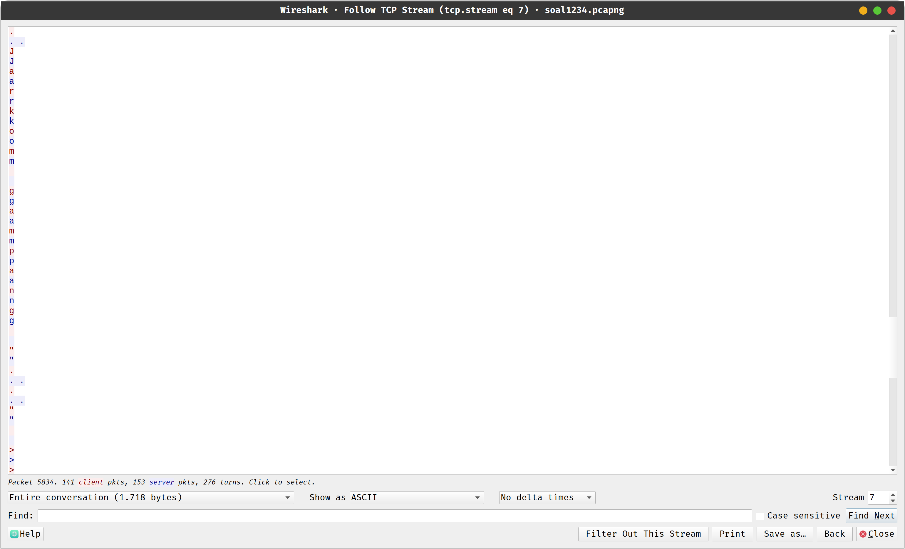

  <br>
  <br>

## Task 5

- Flag

  ```
  JARKOM25{n4il0ng_m1lk_dr4g000n_8EGIF5BORTYAUYJ4NK406W5LACROEBcr0cb02apw83ipymopbqptpcb438_8a4efb8a6b9da1abf763dac558886a18}
  ```
  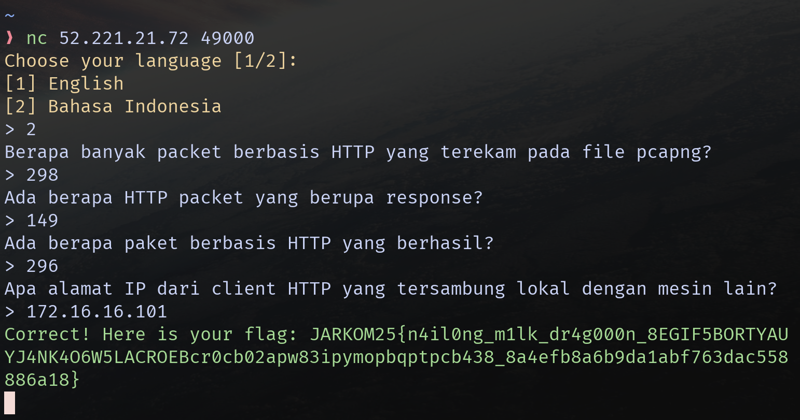

> a. Berapa banyak packet berbasis HTTP yang terekam pada file pcapng?

> _a. How many HTTP packets are recorded in the pcapng file?_

**Answer:** `298`

- Filter expression

  ```
  http
  ```

- Explanation

  Gunakan display filter `http` untuk menampilkan packet dengan protokol HTTP, lalu lihat di pojok kanan bawah wireshark, disitu ada tulisan `Displayed: 298 (0.4%)`.

- Output result

  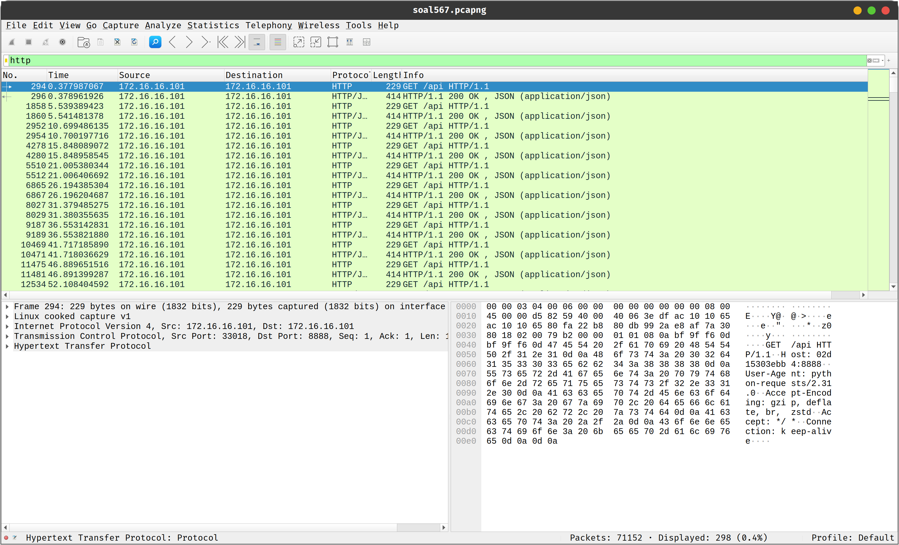

  <br>
  <br>

> b. Ada berapa HTTP packet yang berupa response?

> _b. How many response HTTP packets are recorded in the traffic?_

**Answer:** `149`

- Filter expression

  ```
  http.response
  ```

- Explanation

  Gunakan display filter `http.response` untuk menampilkan packet dengan protokol HTTP yang berupa response, lalu lihat di pojok kanan bawah wireshark, disitu ada tulisan `Displayed: 149 (0.2%)`.

- Output result

  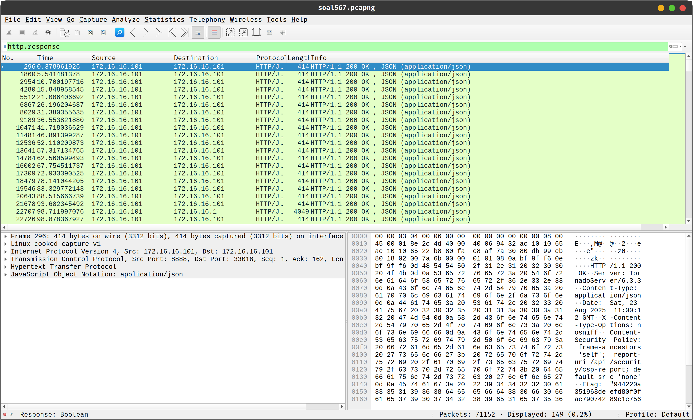

  <br>
  <br>

> c. Ada berapa paket berbasis HTTP yang berhasil?

> _c. How many HTTP packets that succeed?_

**Answer:** `296`

- Filter expression

  ```
  http && http.response.code == 200
  ```

- Explanation

  Sama seperti soal sebelummnya, tapi bedanya karena mencari yang berhasil maka kita tambahin display filter `http && http.response.code == 200`, karena jika ada response pasti ada request maka total package yang terdisplay yaitu `148` dikali 2. Jadi http package yang berhasil yaitu `296`.

- Output result

  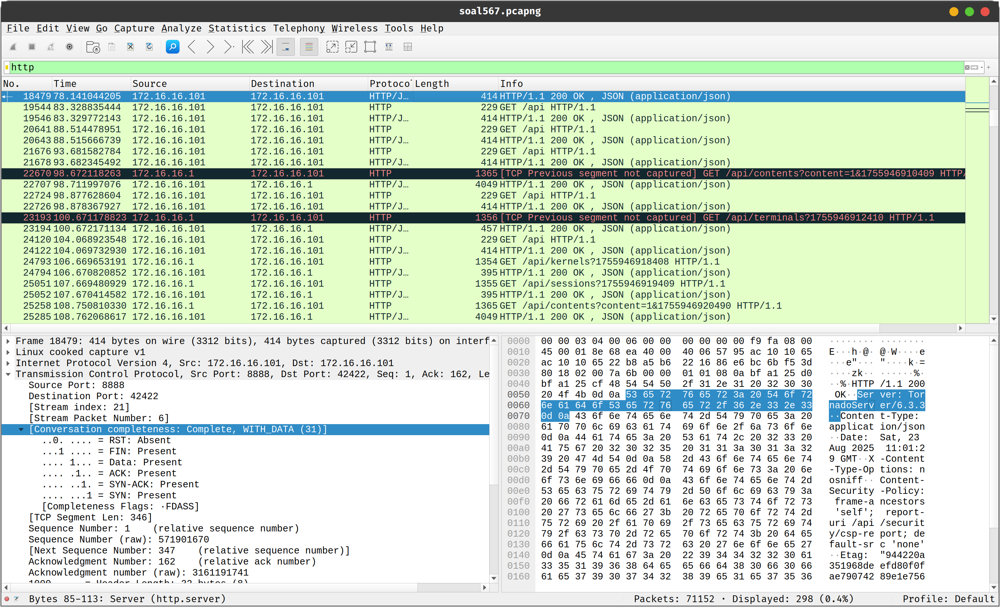

  <br>
  <br>

> d. Apa alamat IP dari client HTTP yang tersambung lokal dengan mesin lain?

> _d. What is the client HTTP IP Address in connection with other local machine?_

**Answer:** `172.16.16.101` 

- Filter expression

  ```
  http
  ```

- Explanation

  Pada soal ini kita tinggal liat ip yang ada di wireshark, karena ada 2 ip yang berbeda yaitu `172.16.16.101` dan `172.16.16.1`, lalu kita lihat bahwa mayoritas paket berasal dari `172.16.16.101` maka ip tersebut adalah ip dari client HTTP yang tersambung lokal dengan mesin lain.

- Output result

  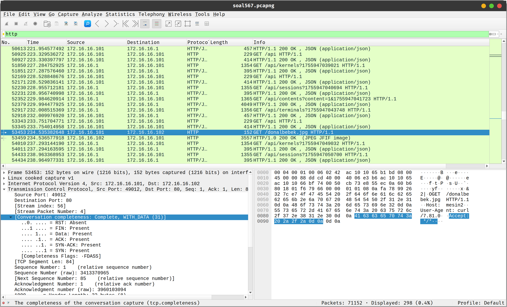

  <br>
  <br>

## Task 6

- Flag

  ```
  JARKOM25{br0mb44rdin0u_Cr0ccc0c0c0cdi1l10l_0008166058awaesabywlylw4exsh1n0buUF3ODWP72L7J91C_fc1b58220a36bf3a42537c2c838ce914}
  ```
  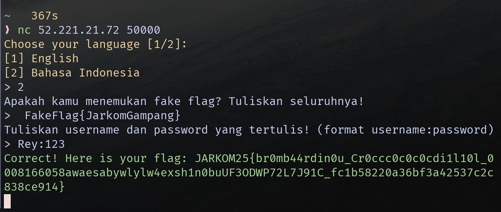

> a. Apakah kamu menemukan fake flag? Tuliskan seluruhnya!

> _a. Did you find the fake flag? Write it whole!_

**Answer:** `FakeFlag{JarkomGampang}`

- Filter expression

  ```
  -
  ```

- Explanation

  Langusung `file > export objects > http` lalu `content type` nya diubah menjadi `text/plain`, lalu cari file dengan nama `flag.txt` lalu kita bisa preview file tersebut dengan text editor, lalu disitu terdapat fake flag yaitu `FakeFlag{JarkomGampang}`.

- Output result

  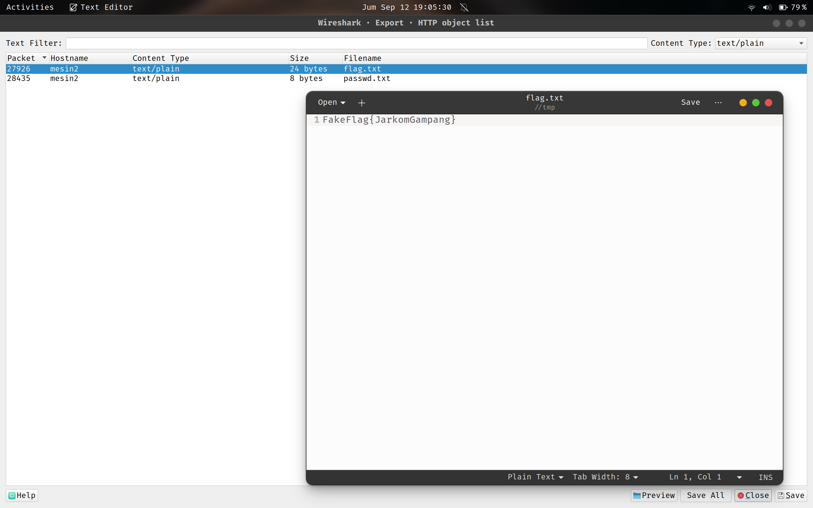

  <br>
  <br>

> b. Tuliskan username dan password yang tertulis! (format username:password)

> _b. Write the written username and password! (format username:password)_

**Answer:** `Rey:123`

- Filter expression

  ```
  -
  ```

- Explanation

  Sama seperti soal sebelumnya, kita tinggal cari file dengan nama `passwd.txt` lalu kita bisa preview file tersebut dengan text editor, lalu disitu terdapat username `Rey` dan password `123`.

- Output result

  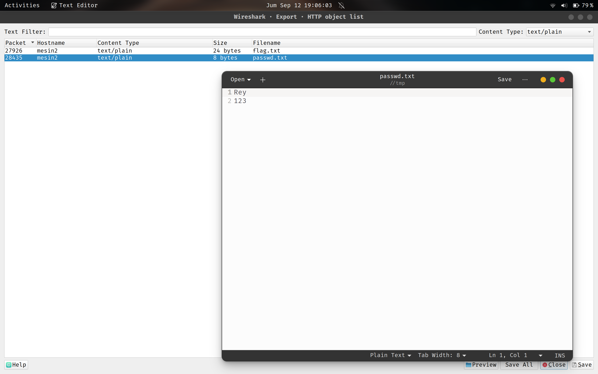

  <br>
  <br>

## Task 7

- Flag

  ```
  JARKOM25{tr414lel0_tr1lil1_f5o5vge0gok3b0s0sOZA4YCTI5ET5WY2_5c447afcf91ba1468eccb8e6434e607e}
  ```
  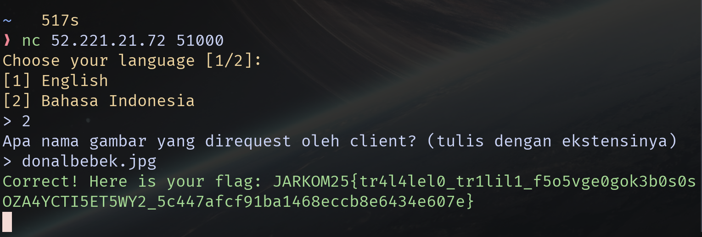

> Apa nama gambar yang direquest oleh client? (tulis dengan ekstensinya)

> _What is the image that is being requested by the client? (write with its extension)_

**Answer:** `donalbebek.jpg`

- Filter expression

  ```
  -
  ```

- Explanation

  Sama seperti soal sebelumnya, cuman di soal ini `content type` nya diubah menjadi `image/jpeg`, lalu cari file dengan ekstensi `.jpg`. Disitu terdapat nama gambar yang direquest oleh client yaitu `donalbebek.jpg`.

- Output result

  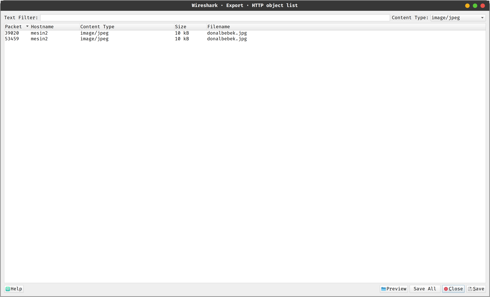

  <br>
  <br>

## Task 8

- Flag

  ```
  JARKOM25{y0u_4r3_s0_G00d_1n_F0r3nsic_PT7YZM04D372DAYP9VOUR8LVAXZLCJx45y4n67s5oqttbvzsi6h8dr37caa3_1598e38e74849c3453983a0958a93589}
  ```
  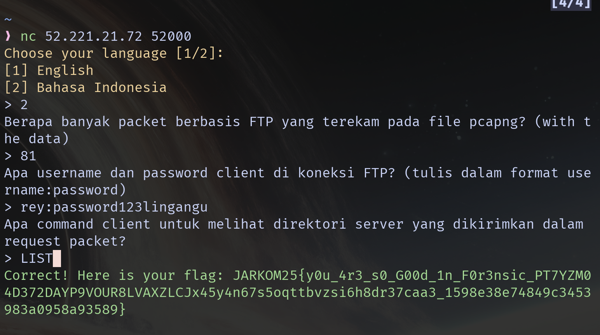

> a. Berapa banyak packet berbasis FTP yang terekam pada file pcapng? (with the data)

> _a. How many FTP packets are recorded in the pcapng file? (with the data)_

**Answer:** `81`

- Filter expression

  ```
  ftp || ftp-data
  ```

- Explanation

  Gunakan display filter `ftp || ftp-data` untuk menampilkan packet dengan protokol FTP (with the data), lalu lihat di pojok kanan bawah wireshark, disitu ada tulisan `Displayed: 81 (0.4%)`.

- Output result

  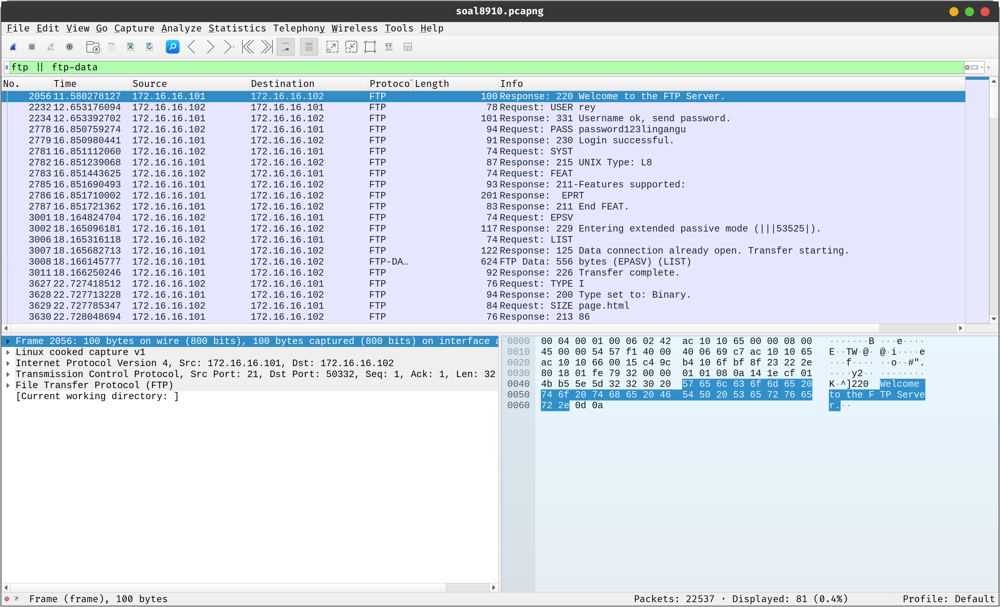

  <br>
  <br>

> b. Apa username dan password client di koneksi FTP? (tulis dalam format username:password)

> _b. What is the client's username and password in FTP connection? (write in following format username:password)_

**Answer:** `rey:password123lingangu`

- Filter expression

  ```
  ftp
  ```

- Explanation

  Gunakan display filter `ftp` untuk menampilkan packet dengan protokol FTP, lalu buka menu `tcp stream` pada `analyze > follow > tcp stream`, lalu pada bagian text area setelah `USER (user)` terdapat username yang digunakan client ftp untuk berhubungan dengan server yaitu `rey`, dan setelah `PASS` terdapat passwordnya yaitu `password123lingangu`, maka username dan password client di koneksi FTP adalah `rey:password123lingangu`.

- Output result

  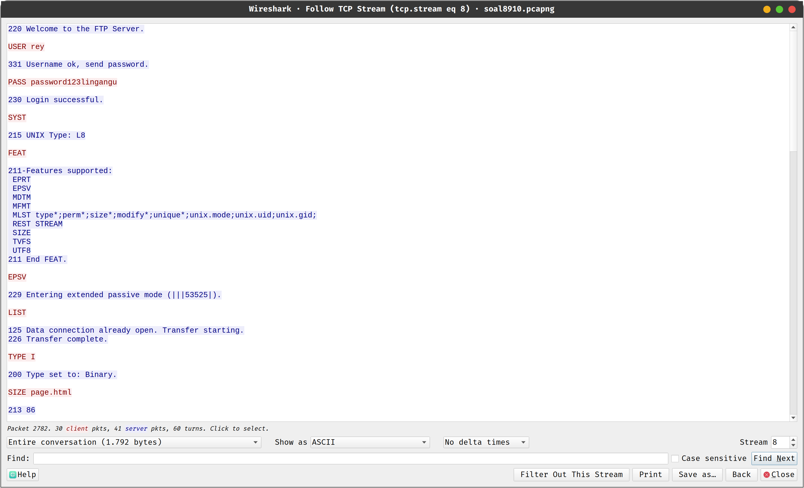

  <br>
  <br>

> c. What is the client's command for showing server directory that was sent on request packet?

> _c. Apa command client untuk melihat direktori server yang dikirimkan dalam request packet?_

**Answer:** `LIST`

- Filter expression

  ```
  ftp-data
  ```

- Explanation

  Gunakan display filter `ftp-data` untuk menampilkan packet dengan protokol FTP dengan data, lalu pada bagian `line-based text data` cari command `LIST` terdapat isi dari direktori server.

- Output result

  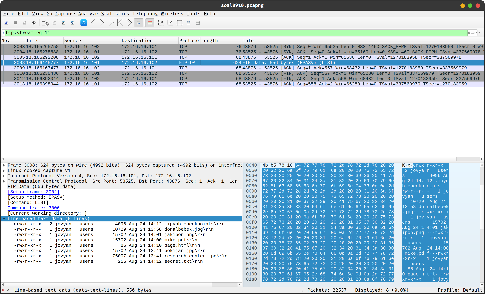

  <br>
  <br>

## Task 9

- Flag

  `put your flag here`
  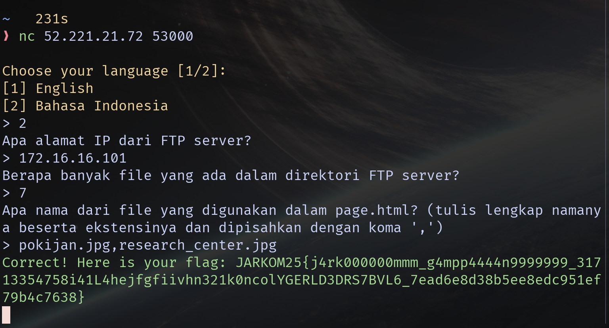

> a. Apa alamat IP dari FTP server?

> _a. What is the FTP server IP Address?_

**Answer:** `172.16.16.101`

- Filter expression

  ```
  ftp
  ```

- Explanation

  Gunakan display filter `ftp` untuk menampilkan packet dengan protokol FTP, lalu pada bagian `Source` di paket pertama terdapat alamat IP dari FTP server yaitu `172.16.16.101`.

- Output result

  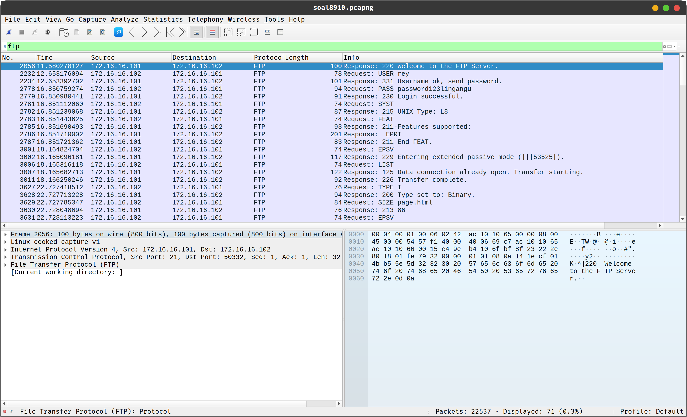

  <br>
  <br>

> b. Berapa banyak file yang ada dalam direktori FTP server?

> _b. How many files are there inside the FTP server directory?_

**Answer:** `7`

- Filter expression

  ```
  ftp-data
  ```

- Explanation

  Pada soal 8c kita sudah menemukan command `LIST` yang berisi isi dari direktori server, lalu kita tinggal hitung saja ada berapa file yang ada dalam direktori FTP server, disitu terdapat `7` file(dotfile tidak dihitung).

- Output result

  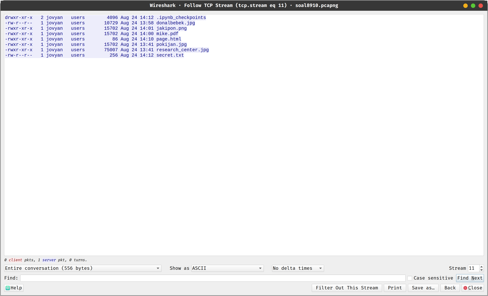

  <br>
  <br>

> c. Apa nama dari file yang digunakan dalam page.html? (tulis lengkap namanya beserta ekstensinya dan dipisahkan dengan koma ',')

> _c. What are the filenames used in the page.html? (write the filebames with their extensions and separate them with comma ',')_

**Answer:** `pokijan.jpg,research_center.jpg`

- Filter expression

  ```
  ftp-data
  ```

- Explanation

  Untuk filter expression nya masih sama seperti soal sebelumnya, lalu cari paket dengan info `page.html`, lalu follow paket tersebut, disitu terdapat file `pokijan.jpg` dan `research_center.jpg`.

- Output result

  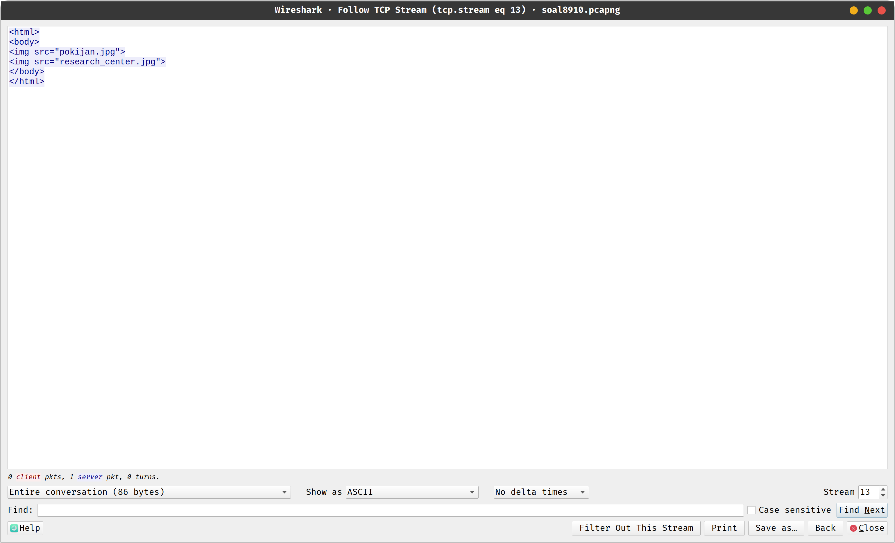

  <br>
  <br>

## Task 10

- Flag

  `put your flag here`
  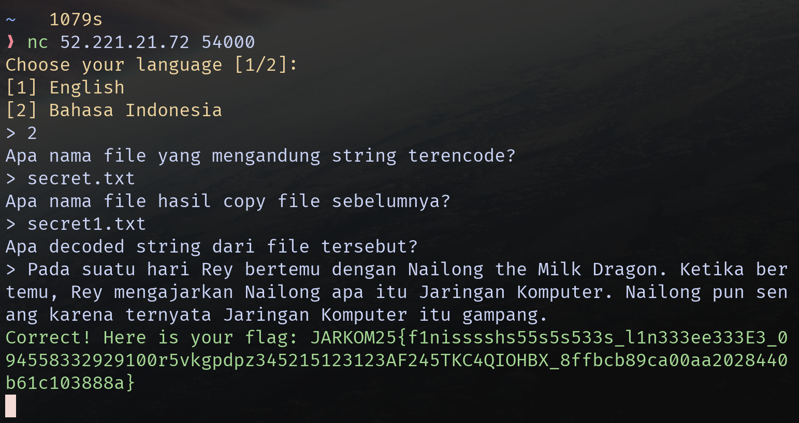

> a. Apa nama file yang mengandung string terencode?

> _a. What is the filename that contains encoded string?_

**Answer:** `secret.txt`

- Filter expression

  ```
  ftp-data
  ```

- Explanation

  Gunakan display filter `ftp-data` untuk menampilkan packet dengan protokol FTP dengan data, lalu pada bagian `line-based text data` dari file dengan nama `secret.txt` terdapat string terencode.

- Output result

  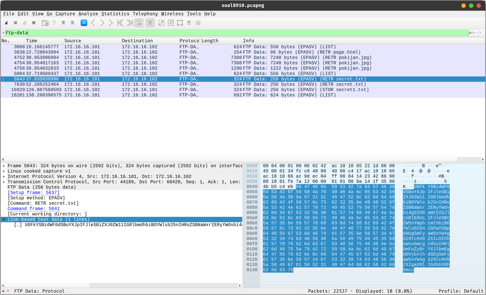

  <br>
  <br>

> b. Apa nama file hasil copy file sebelumnya?

> _b. What is the filename of the previous file copy?_

**Answer:** `secret1.txt`

- Filter expression

  ```
  ftp
  ```

- Explanation

  Gunakan display filter `ftp` untuk menampilkan packet dengan protokol FTP, lalu buka `tcp stream` pada `analyze > follow > tcp stream`, scroll ke bawah, disitu terdapat command `STOR secret1.txt`, dari situ kita tau bahwa file hasil copy tersebut adalah `secret1.txt`.
  

- Output result

  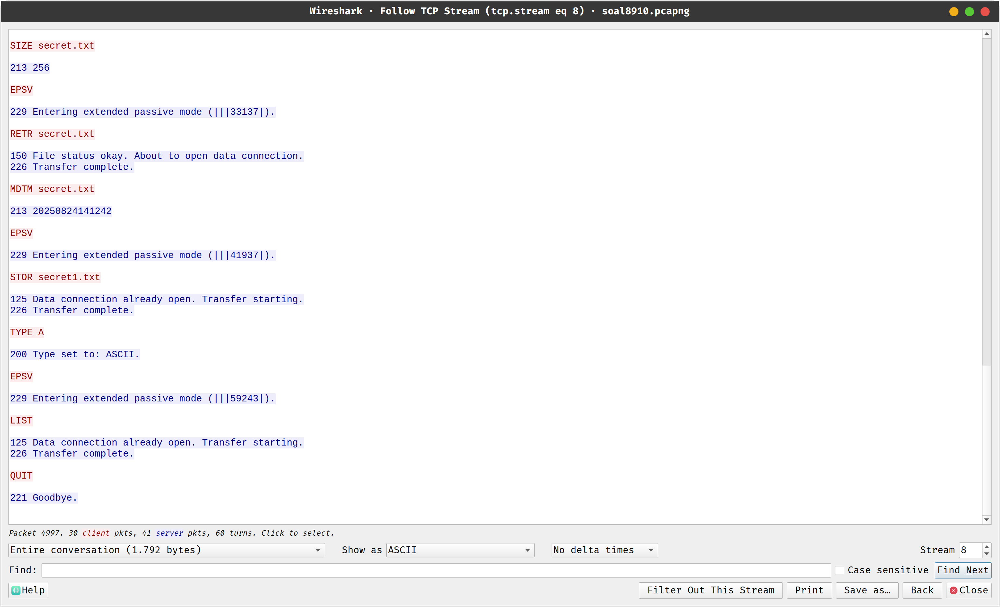

  <br>
  <br>

> c. What is the decoded string from the previous file?

> _c. Apa decoded string dari file tersebut?_

**Answer:** `Pada suatu hari Rey bertemu dengan Nailong the Milk Dragon. Ketika bertemu, Rey mengajarkan Nailong apa itu Jaringan Komputer. Nailong pun senang karena ternyata Jaringan Komputer itu gampang.`

- Filter expression

  ```
  tcp-data
  ```

- Explanation

  Pada soal 9a kita sudah menemukan nama file yang mengandung string terencode yaitu `secret.txt`, lalu kita tinggal decode string tersebut menggunakan base64 decode yang terdapat di web internet, maka didapatkan hasil decode stringnya yaitu `Pada suatu hari Rey bertemu dengan Nailong the Milk Dragon. Ketika bertemu, Rey mengajarkan Nailong apa itu Jaringan Komputer. Nailong pun senang karena ternyata Jaringan Komputer itu gampang.`

- Output result

  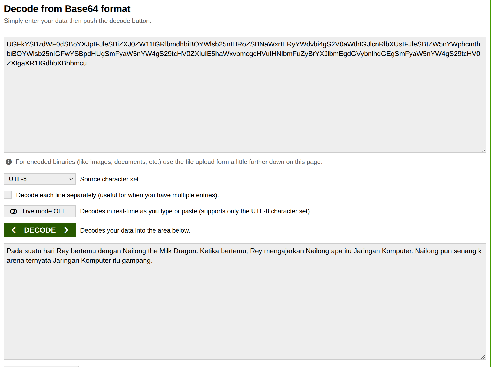

  <br>
  <br>

## Summary

## Problems
