[](https://classroom.github.com/a/1niUih_B)
| Name           | NRP        | Kelas     |
| ---            | ---        | ----------|
| Gilbran Mahdavikia Raja | 5025241134 | B |


## Put your topology config image here!

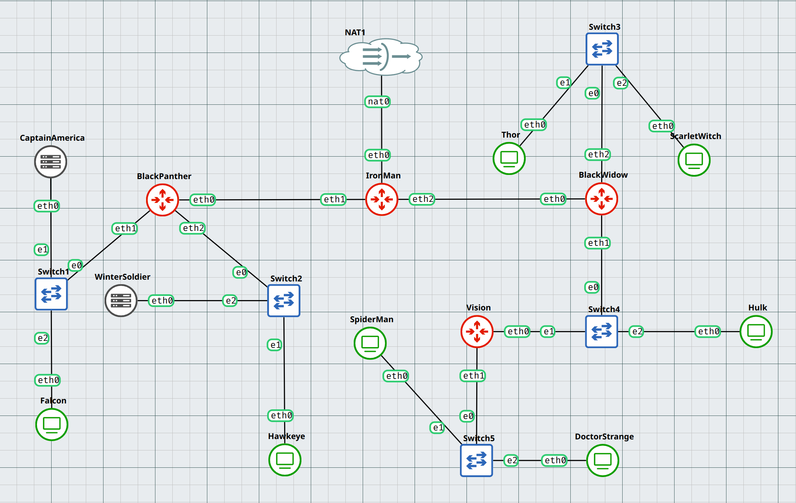

## Put your GNS3 Project file here!

[GNS3 Project File](./GNS3_Project_File/)

<br>

## Soal 1

> Dokumentasikan hasil pengelompokan subnet yang telah dibuat.

> _Document the results of the subnet grouping that has been created._

**Answer:**

- Screenshot

  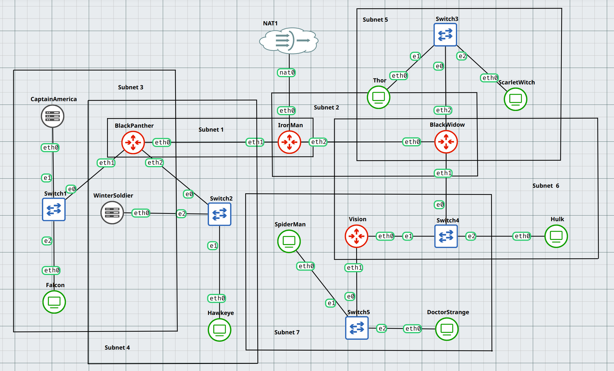

- Explanation

  | Subnet | Node          | Interface | Kategori     | IP Config |
  |--------|--------------|-----------|--------------|-----------|
  | 1      | IronMan      | eth1      | Router       | Statis    |
  | 1      | BlackPanther | eth0      | Router       | Statis    |
  | 2      | IronMan      | eth2      | Router       | Statis    |
  | 2      | BlackWidow   | eth0      | Router       | Statis    |
  | 3      | BlackPanther | eth1      | Router       | Statis    |
  | 3      | CaptainAmerika | eth0    | DHCP Server  | Statis    |
  | 3      | Falcon       | eth0      | Client       | Dinamis   |
  | 4      | BlackPanther | eth2      | Router       | Statis    |
  | 4      | WinterSoldier | eth0     | DHCP Server  | Statis    |
  | 4      | Hawkeye      | eth0      | Client       | Dinamis   |
  | 5      | BlackWidow   | eth2      | Router       | Statis    |
  | 5      | ScarletWitch | eth0      | Client       | Dinamis   |
  | 5      | Thor         | eth0      | Client       | Dinamis   |
  | 6      | BlackWidow   | eth1      | Router       | Statis    |
  | 6      | Vision       | eth0      | Client       | Dinamis   |
  | 6      | Hulk         | eth0      | Client       | Dinamis   |
  | 7      | Vision       | eth1      | Router       | Statis    |
  | 7      | SpiderMan    | eth0      | Client       | Dinamis   |
  | 7      | DoctorStrange | eth0     | Client       | Dinamis   |


<br>

## Soal 2

> Lakukan konfigurasi routing agar setiap node dapat saling berkomunikasi. Pastikan setiap router dapat mengirimkan paket ke jaringan lain melalui tabel routing yang sesuai. Sertakan bukti bahwa Falcon bisa melakukan ping ke SpiderMan, DoctorStrange, dan ScarletWitch.

> _Configure routing so that each node can communicate with each other. Ensure each router can forward packets to other networks through the appropriate routing table. Include proof that Falcon can ping SpiderMan, Doctor Strange, and ScarletWitch._

**Answer:**

- Screenshot

  - Konfigurasi routing pada setiap router

    #### IronMan
    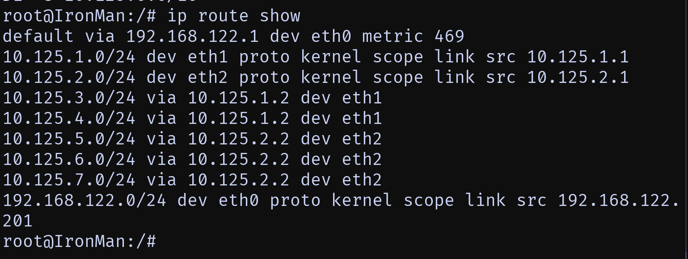

    #### BlackPanther
    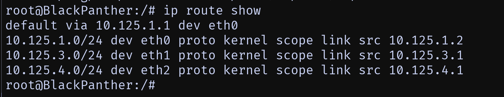

    #### BlackWidow
    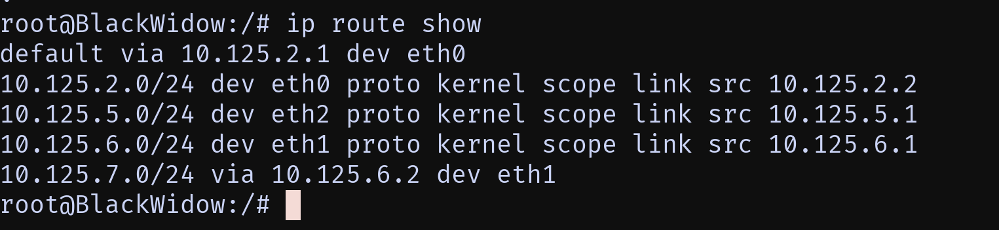

    #### Vision
    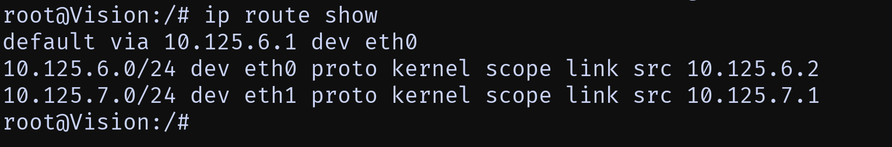

  - `ping` on `Falcon` to `SpiderMan`, `DoctorStrange`, and `ScarletWitch`

    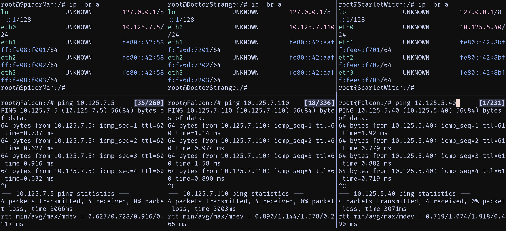

- Explanation

  Pada topologi jaringan di atas terdapat 4 buah router, yaitu `IronMan`, `BlackPanther`, `BlackWidow`, dan `Vision`. 
  Setiap router telah dikonfigurasi routingnya agar dapat saling berkomunikasi antar subnet. 
  Konfigurasi routing pada setiap router dilakukan dengan menambahkan static route pada masing-masing router. 
  Static route yang ditambahkan pada setiap router adalah sebagai berikut:
  #### Pada router `IronMan`:
  - Default Route

    - `default via 192.168.122.1 dev eth0 metric 469` Semua trafik yang tidak tahu jalurnya akan dikirim ke gateway `192.168.122.1` lewat `eth0`.

  - Directly Connected Networks

    - `10.125.1.0/24 dev eth1 proto kernel scope link src 10.125.1.1` Jaringan `10.125.1.0/24` terhubung langsung lewat `eth1`, IP lokal `10.125.1.1`.

    - `10.125.2.0/24 dev eth2 proto kernel scope link src 10.125.2.1` Jaringan `10.125.2.0/24` terhubung langsung lewat `eth2`, IP lokal `10.125.2.1`.

    - `192.168.122.0/24 dev eth0 proto kernel scope link src 192.168.122.201` Jaringan `192.168.122.0/24` terhubung langsung lewat `eth0`, IP lokal `192.168.122.201`.

  - Static Routes via Next Hop

    - `10.125.3.0/24 via 10.125.1.2 dev eth1` Untuk ke jaringan `10.125.3.0/24`, lewat router `10.125.1.2` via `eth1`.

    - `10.125.4.0/24 via 10.125.1.2 dev eth1` Untuk ke jaringan `10.125.4.0/24`, lewat router `10.125.1.2` via `eth1`.

    - `10.125.5.0/24 via 10.125.2.2 dev eth2` Untuk ke jaringan `10.125.5.0/24`, lewat router `10.125.2.2` via `eth2`.

    - `10.125.6.0/24 via 10.125.2.2 dev eth2` Untuk ke jaringan `10.125.6.0/24`, lewat router `10.125.2.2` via `eth2`.

    - `10.125.7.0/24 via 10.125.2.2 dev eth2` Untuk ke jaringan `10.125.7.0/24`, lewat router `10.125.2.2` via `eth2`.

  #### Pada Router `BlackPanther`:

  - Default Route

    - `default via 10.125.1.1 dev eth0` Semua trafik yang tidak tahu jalurnya akan dikirim ke gateway `10.125.1.1` lewat `eth0`.

  - Directly Connected Networks

    - `10.125.1.0/24 dev eth0 proto kernel scope link src 10.125.1.2` Jaringan `10.125.1.0/24` terhubung langsung lewat `eth0`, IP lokal `10.125.1.2`.

    - `10.125.3.0/24 dev eth1 proto kernel scope link src 10.125.3.1` Jaringan `10.125.3.0/24` terhubung langsung lewat `eth1`, IP lokal `10.125.3.1`.

    - `10.125.4.0/24 dev eth2 proto kernel scope link src 10.125.4.1` Jaringan `10.125.4.0/24` terhubung langsung lewat `eth2`, IP lokal `10.125.4.1`.

  #### Pada Router `BlackWidow`:

  - Default Route

    - `default via 10.125.2.1 dev eth0` Semua trafik yang tidak punya rute spesifik akan dikirim ke gateway `10.125.2.1` lewat `eth0`.

  - Directly Connected Networks

    - `10.125.2.0/24 dev eth0 proto kernel scope link src 10.125.2.2` Jaringan `10.125.2.0/24` terhubung langsung lewat `eth0`, IP lokal `10.125.2.2`.

    - `10.125.5.0/24 dev eth2 proto kernel scope link src 10.125.5.1` Jaringan `10.125.5.0/24` terhubung langsung lewat `eth2`, IP lokal `10.125.5.1`.

    - `10.125.6.0/24 dev eth1 proto kernel scope link src 10.125.6.1` Jaringan `10.125.6.0/24` terhubung langsung lewat `eth1`, IP lokal `10.125.6.1`.

  - Static Route via Next Hop

    - `10.125.7.0/24 via 10.125.6.2 dev eth1` Untuk menuju jaringan `10.125.7.0/24`, paket akan diarahkan ke router tetangga `10.125.6.2` lewat `eth1`.

  #### Pada Router `Vision`:

  - Default Route

    - `default via 10.125.6.1 dev eth0` Semua trafik yang tidak tahu jalurnya akan dikirim ke gateway `10.125.6.1` lewat `eth0`.

  - Directly Connected Networks

    - `10.125.6.0/24 dev eth0 proto kernel scope link src 10.125.6.2` Jaringan `10.125.6.0/24` terhubung langsung lewat `eth0`, IP lokal `10.125.6.2`.

    - `10.125.7.0/24 dev eth1 proto kernel scope link src 10.125.7.1` Jaringan `10.125.7.0/24` terhubung langsung lewat `eth1`, IP lokal `10.125.7.1`.

  #### Kesimpulan:
  Keempat router pada topologi ini saling bekerja sama untuk membangun konektivitas antarjaringan. `IronMan` bertindak sebagai router pusat yang terhubung ke NAT/internet `192.168.122.0/24` dan menghubungkan dua backbone subnet besar `10.125.1.0/24` ke `BlackPanther` dan `10.125.2.0/24` ke `BlackWidow`, serta meneruskan trafik ke jaringan lain melalui next-hop router. `BlackPanther` melayani jaringan `10.125.3.0/24` dan `10.125.4.0/24`, dengan default route kembali ke `IronMan`. `BlackWidow` menghubungkan jaringan `10.125.5.0/24`, `10.125.6.0/24`, dan melalui `Vision` dapat mencapai `10.125.7.0/24`, sementara default route diarahkan ke `IronMan`. `Vision` sendiri berperan sebagai router edge untuk `10.125.7.0/24`, dengan default route diarahkan dikirim ke `BlackWidow`. Dengan pola ini, setiap jaringan lokal dihubungkan ke router masing-masing, sementara jalur antar subnet dan akses internet diatur melalui rute statis dengan `IronMan` sebagai core gateway.

  Pada gambar diketahui bahwa `SpiderMan` memiliki ip address `10.125.7.5`, `DoctorStrange` memiliki ip address `10.125.7.110`, dan `ScarletWitch` memiliki ip address `10.125.5.40`. 
  Kemudian pada gambar hasil `ping` diketahui bahwa `Falcon` berhasil melakukan ping ke `SpiderMan`, `DoctorStrange`, dan `ScarletWitch`. Hal ini menandakan bahwa `Falcon` dapat berkomunikasi dengan `SpiderMan`, `DoctorStrange`, dan `ScarletWitch`. 

<br>

## Soal 3

> Lakukan konfigurasi agar semua node dapat terhubung ke internet. Sertakan hasil uji coba dengan melakukan ping ke google.com dari node Falcon, CaptainAmerica, SpiderMan, dan Thor.

> _Configure all nodes to connect to the internet. Include test results by pinging google.com from the Falcon, CaptainAmerica, SpiderMan, and Thor nodes._

**Answer:**

- Screenshot

  - `ping google.com` on `Falcon`, `CaptainAmerica`, `SpiderMan`, and `Thor`

    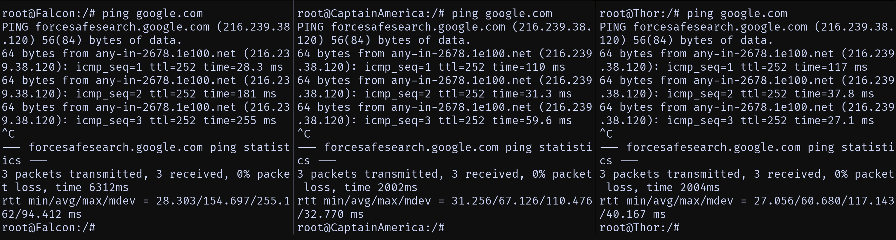

- Explanation

  #### Pada router `IronMan` lakukan:
  ``` bash
  apt update
  apt install iptables
  iptables -t nat -A POSTROUTING -o eth0 -j MASQUERADE -s 10.125.0.0/16
  ```
  keterangan:
  - `iptables`: Merupakan suatu tools dalam sistem operasi Linux yang berfungsi sebagai filter terhadap lalu lintas data. Dengan iptables inilah kita akan mengatur semua lalu lintas dalam komputer, baik yang masuk, keluar, maupun yang sekadar melewati komputer kita. Untuk penjelasan lebih lanjut nanti akan dibahas pada Modul 5.
  - `NAT`: Suatu metode penafsiran alamat jaringan yang digunakan untuk menghubungkan lebih dari satu komputer ke jaringan internet dengan menggunakan satu alamat IP.
  - `MASQUERADE`: Digunakan untuk menyamarkan paket, misal mengganti alamat pengirim dengan alamat router.
  - `-s 10.125.0.0/16`: aturan ini hanya berlaku untuk paket yang berasal dari subnet 10.125.0.0 – 10.125.255.255.


  #### pada Router selain `IronMan` dan DHCP Server lakukan:
  ``` bash
  echo "nameserver 192.168.122.1" > /etc/resolv.conf
  ```
  
  #### Kesimpulan:
  Konfigurasi pada IronMan membuatnya berperan sebagai gateway utama bagi seluruh jaringan internal (10.125.0.0/16). Hal ini memungkinkan semua host di dalam jaringan private dapat mengakses internet meskipun mereka hanya memiliki alamat IP privat, karena bagi jaringan luar, semua trafik akan tampak berasal dari IronMan.

  Sementara itu, router lain selain IronMan dan DHCP Server diarahkan untuk menggunakan 192.168.122.1 sebagai nameserver melalui pengaturan file /etc/resolv.conf. Dengan konfigurasi ini, mereka dapat menerjemahkan nama domain menjadi alamat IP menggunakan DNS server tersebut. Keseluruhan pengaturan ini memastikan bahwa akses internet terpusat melalui IronMan sebagai gateway, sementara router lain hanya berfungsi meneruskan trafik internal dan tetap bisa mengenali domain berkat konfigurasi DNS tersebut.

<br>

## Soal 4

> Berikan Falcon alamat IP dalam rentang [Prefix IP].3.20 - [Prefix IP].3.25
> <br> </br>
> Berikan Hawkeye alamat IP dalam rentang [Prefix IP].4.30 - [Prefix IP].4.35
> <br> </br>
> Berikan Hulk alamat IP dalam rentang [Prefix IP].6.50 - [Prefix IP].6.55

<br>

> _Give Falcon an IP address in the range [IP Prefix].3.20 - [IP Prefix].4.35_
> <br> </br>
> _Give Hawkeye an IP address in the range [IP Prefix].4.30 - [IP Prefix].4.35_
> <br> </br>
> _Give Hulk an IP address in the range [IP Prefix].6.50 - [IP Prefix].6.55_

**Answer:**

- Screenshot
 
  - `dhcpd.conf` on `CaptainAmerica`

    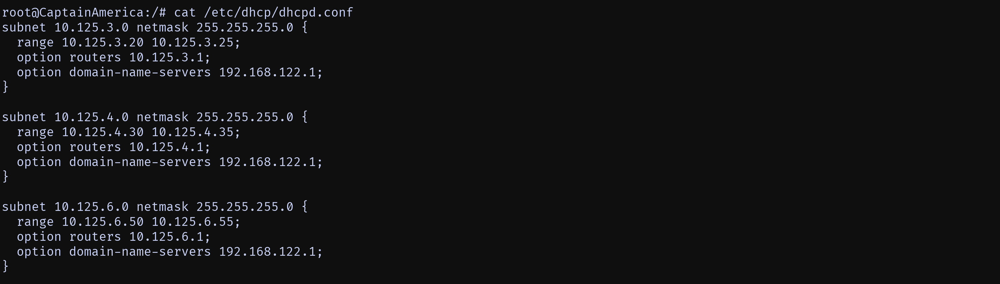

  - `ip -br a` on `Falcon`, `Hawkeye`, and `Hulk`
    
    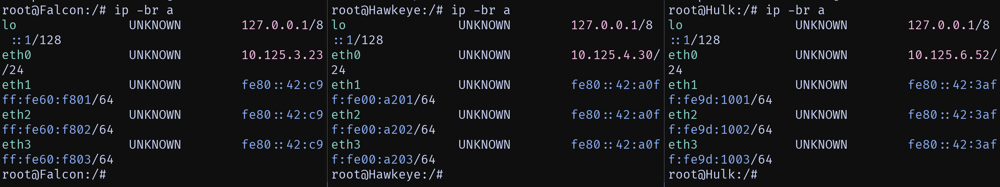 

- Explanation

  #### Setting `CaptainAmerika` sebagai DHCP Server

  - Lakukan Instalasi:
    ``` bash
    apt-get update
    apt-get install isc-dhcp-server
    ```

  - Pilih `eth0` sebagai interface v4
    ``` bash
    echo -e "INTERFACESv4=\"eth0\"" > /etc/default/isc-dhcp-server
    ```

  - Tambahkan konfigurasi isc-dhcp-server pada `/etc/dhcp/dhcpd.conf`
    ``` bash
    subnet 10.125.3.0 netmask 255.255.255.0 {
      range 10.125.3.20 10.125.3.25;
      option routers 10.125.3.1;
      option domain-name-servers 192.168.122.1;
    }

    subnet 10.125.4.0 netmask 255.255.255.0 {
      range 10.125.4.30 10.125.4.35;
      option routers 10.125.4.1;
      option domain-name-servers 192.168.122.1;
    }

    subnet 10.125.6.0 netmask 255.255.255.0 {
      range 10.125.6.50 10.125.6.55;
      option routers 10.125.6.1;
      option domain-name-servers 192.168.122.1;
    }
    ```
    keterangan:
    - Subnet `10.125.3.0/24`: subnet dari `Falcon`.
      - Netmask: `255.255.255.0` artinya 1 subnet punya 256 alamat (`0–255`).
      - DHCP hanya akan memberikan IP dari `10.125.3.20` – `10.125.3.25`.
      - Gateway (default router) client adalah `10.125.3.1`.
      - DNS server yang dipakai adalah `192.168.122.1`.
    - Subnet `10.125.4.0/24`: subnet dari `Hawkeye`.
      - DHCP akan membagikan IP dalam rentang `10.125.4.30` – `10.125.4.35`.
      - Gateway default client adalah `10.125.4.1`.
      - DNS yang digunakan juga sama, yaitu `192.168.122.1`.
    - Subnet `10.125.6.0/24`: subnet dari `Hulk`.
      - DHCP akan membagikan IP dalam rentang `10.125.6.50` – `10.125.6.55`.
      - Gateway default client adalah `10.125.6.1`.
      - DNS server tetap `192.168.122.1`.

  - Lalu start DHCP Server:
    ``` bash
    service isc-dhcp-server start
    ```

  #### Setting router sebagai DHCP Relay

  - Lakukan instalasi:
    ``` bash
    apt-get update
    apt-get install isc-dhcp-relay -y
    ```

  - Pada `/etc/default/isc-dhcp-relay` lakukan konfigurasi berikut:
    ``` bash
    SERVERS="10.125.3.2 10.125.4.2"
    INTERFACES=""
    OPTIONS=""
    ```
    keterangan:
    - `SERVERS`: Berisi Alamat IP dari DHCP Server, disini adalah `10.125.3.2` (`CaptainAmerika`) dan `10.125.4.2` (`WinterSoldier`).
    - `INTERFACES`: Berisi interface yang akan menerima request dari client, disini kosong agar diatur oleh relay secara otomatis.
    - `OPTIONS`: Kosongi.

  - Pada `/etc/sysctl.conf` tambahkan:
    ``` bash
    net.ipv4.ip_forward=1
    ```

  - Lalu start DHCP Relay:
    ``` bash
    service isc-dhcp-relay start
    ```

  #### Kesimpulan:
  Konfigurasi yang dilakukan bertujuan untuk mengatur distribusi alamat IP secara otomatis menggunakan DHCP Server yang telah dipasang pada jaringan. DHCP Server ini dikonfigurasi untuk melayani tiga subnet, yaitu `10.125.3.0/24`, `10.125.4.0/24`, dan `10.125.6.0/24`. Masing-masing subnet diberikan alokasi IP dalam rentang tertentu, misalnya subnet 10.125.3.0/24 hanya akan membagikan IP dari `10.125.3.20`–`10.125.3.25`, sedangkan subnet `10.125.4.0/24` membagikan IP `10.125.4.30`–`10.125.4.35`, dan subnet `10.125.6.0/24` membagikan IP `10.125.6.50`–`10.125.6.55`. Selain itu, setiap subnet diberikan gateway sesuai dengan alamat router di subnet tersebut, serta menggunakan DNS server yang sama, yaitu `192.168.122.1`. Dengan pengaturan ini, client yang berada di ketiga subnet akan mendapatkan konfigurasi jaringan secara otomatis tanpa perlu diatur manual.

  Agar DHCP dapat melayani client di subnet yang tidak langsung terhubung ke server, maka digunakan DHCP Relay pada router. DHCP Relay ini berfungsi sebagai perantara yang meneruskan request DHCP dari client menuju DHCP Server utama yang berada pada alamat `10.125.3.2` (`CaptainAmerika`) dan `10.125.4.2` (`WinterSoldier`). Konfigurasi relay dilakukan dengan menentukan alamat server tujuan, membiarkan interface kosong agar diatur otomatis, dan mengaktifkan fitur IP forwarding pada router. Dengan adanya DHCP Relay, client di berbagai subnet tetap bisa mendapatkan alamat IP, gateway, dan DNS meskipun DHCP Server tidak langsung terkoneksi dengan mereka.

<br>

## Soal 5

> Berikan ScarletWitch dan Thor alamat IP dalam rentang [Prefix IP].5.40 - [Prefix IP].5.45 dan [Prefix IP].5.100 - [Prefix IP].5.105

> _Give ScarletWitch and Thor IP addresses in the range [IP Prefix].5.40 - [IP Prefix].5.45 and [IP Prefix].5.100 - [IP Prefix].5.105_

**Answer:**

- Screenshot

  - `dhcpd.conf` on `CaptainAmerica`

    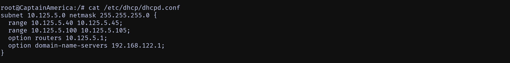

  - `ip -br a` on `ScarletWitch` and `Thor`

    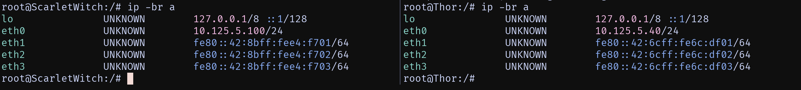

- Explanation

  - Tambahkan konfigurasi isc-dhcp-server pada `/etc/dhcp/dhcpd.conf`
    ``` bash
    subnet 10.125.5.0 netmask 255.255.255.0 {
      range 10.125.5.40 10.125.5.45;
      range 10.125.5.100 10.125.5.105;
      option routers 10.125.5.1;
      option domain-name-servers 192.168.122.1;
    }
    ```
    keterangan:
    - Subnet `10.125.5.0/24`: subnet dari `ScarletWitch` dan `Thor`.
    - Netmask: `255.255.255.0` artinya 1 subnet punya 256 alamat (`0–255`).
    - DHCP hanya akan memberikan IP dari `10.125.5.40` – `10.125.5.45` dan `10.125.5.100` – `10.125.5.105`.
    - Gateway (default router) client adalah `10.125.5.1`.
    - DNS server yang dipakai adalah `192.168.122.1`.
  - Lalu restart DHCP Server:
    ``` bash
    service isc-dhcp-server restart
    ```
  #### Kesimpulan:
  Kurang lebih sama seperti penjelasan pada soal 4, hanya saja pada soal ini terdapat dua rentang IP yang diberikan pada subnet `10.125.5.0/24`, yaitu `10.125.5.40`–`10.125.5.45` dan `10.125.5.100`–`10.125.5.105`.

<br>

## Soal 6

> Berikan SpiderMan dan DoctorStrange alamat IP dalam rentang [Prefix IP].7.60 - [Prefix IP].7.65  dan [Prefix IP].7.110 - [Prefix IP].7.115

> _Give SpiderMan and DoctorStrange IP addresses in the ranges [IP Prefix].7.60 - [IP Prefix].7.65 and [IP Prefix].7.110 - [IP Prefix].7.115_

**Answer:**

- Screenshot

  - `dhcpd.conf` on `CaptainAmerica`

    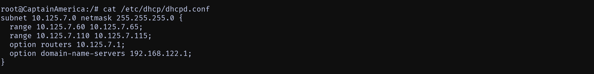

  - `ip -br a` on `SpiderMan` and `DoctorStrange`

    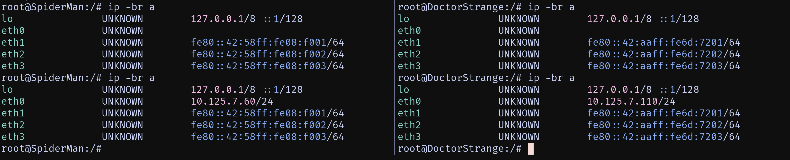

- Explanation

- Tambahkan konfigurasi isc-dhcp-server pada `/etc/dhcp/dhcpd.conf`
    ``` bash
    subnet 10.125.7.0 netmask 255.255.255.0 {
      range 10.125.7.60 10.125.75;
      range 10.125.7.110 10.125.7.115;
      option routers 10.125.7.1;
      option domain-name-servers 192.168.122.1;
    }
    ```
    keterangan:
    - Subnet `10.125.7.0/24`: subnet dari `SpiderMan` dan `DoctorStrange`.
    - Netmask: `255.255.255.0` artinya 1 subnet punya 256 alamat (`0–255`).
    - DHCP hanya akan memberikan IP dari `10.125.7.60` – `10.125.7.65` dan `10.125.7.110` – `10.125.7.115`.
    - Gateway (default router) client adalah `10.125.7.1`.
    - DNS server yang dipakai adalah `192.168.122.1`.

  - Lalu restart DHCP Server:
    ``` bash
    service isc-dhcp-server restart
    ```
  #### Kesimpulan:
  Kurang lebih sama seperti penjelasan pada soal 4 dan 5, hanya saja pada soal ini alamat IP yang diberikan pada subnet `10.125.7.0/24`, yaitu `10.125.7.60`–`10.125.7.65` dan `10.125.7.110`–`10.125.7.115`.

<br>

## Soal 7

> Tetapkan waktu peminjaman alamat IP pada DHCP server untuk client yang terhubung melalui Switch 2 selama 5 menit (Default), dan untuk client melalui Switch 5 selama 10 menit (Default). Tetapkan juga batas waktu peminjaman maksimal selama 2 jam.
> <br> </br>
> Tetapkan waktu peminjaman alamat IP pada DHCP server untuk client yang terhubung melalui Switch 1 dan Switch 3 selama 2 menit (Default). Tetapkan juga batas waktu peminjaman maksimal selama 100 menit.

<br>

> _Set the IP address lease period on the DHCP server for clients connected through Switch 2 to 5 minutes (default), and for clients connected through Switch 5 to 10 minutes (default). Also, set the maximum lease period to 2 hours._
> <br> </br>
> _Set the IP address lease time on the DHCP server for clients connected via Switch 1 and Switch 3 to 2 minutes (default). Also set the maximum lease time limit to 100 minutes._

**Answer:**

- Screenshot

  - `dhcpd.conf` on `CaptainAmerica`

    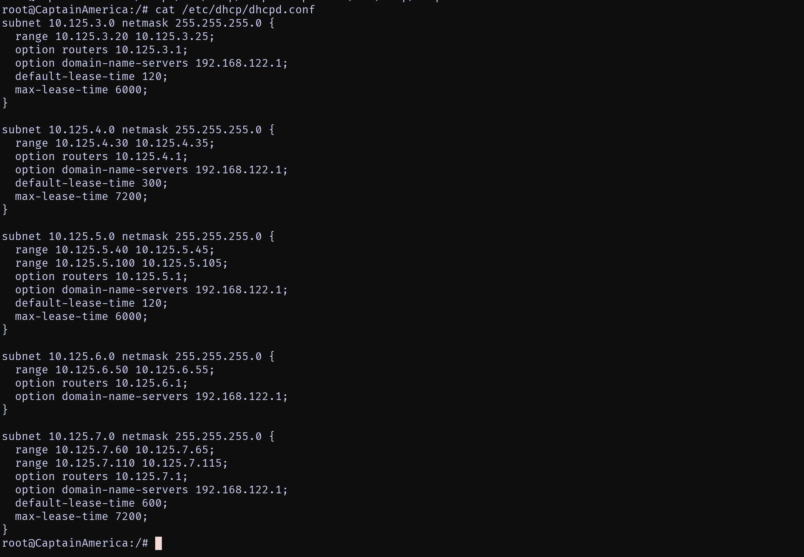

- Explanation

  - Verify which subnet each switch is connected to.
    - Switch 1: Subnet 3 (`10.125.3.0/24`)
    - Switch 2: Subnet 4 (`10.125.4.0/24`)
    - Switch 3: Subnet 5 (`10.125.5.0/24`)
    - Switch 5: Subnet 7 (`10.125.7.0/24`)

  - Tambahkan lease time pada `/etc/dhcp/dhcpd.conf`
    ``` bash
    subnet 10.125.3.0 netmask 255.255.255.0 {
      range 10.125.3.20 10.125.3.25;
      option routers 10.125.3.1;
      option domain-name-servers 192.168.122.1;
      default-lease-time 120;
      max-lease-time 6000;
    }

    subnet 10.125.4.0 netmask 255.255.255.0 {
      range 10.125.4.30 10.125.4.35;
      option routers 10.125.4.1;
      option domain-name-servers 192.168.122.1;
      default-lease-time 300;
      max-lease-time 7200;
    }

    subnet 10.125.5.0 netmask 255.255.255.0 {
      range 10.125.5.40 10.125.5.45;
      range 10.125.5.100 10.125.5.105;
      option routers 10.125.5.1;
      option domain-name-servers 192.168.122.1;
      default-lease-time 120;
      max-lease-time 6000;
    }

    subnet 10.125.6.0 netmask 255.255.255.0 {
      range 10.125.6.50 10.125.6.55;
      option routers 10.125.6.1;
      option domain-name-servers 192.168.122.1;
    }

    subnet 10.125.7.0 netmask 255.255.255.0 {
      range 10.125.7.60 10.125.7.65;
      range 10.125.7.110 10.125.7.115;
      option routers 10.125.7.1;
      option domain-name-servers 192.168.122.1;
      default-lease-time 600;
      max-lease-time 7200;
    }
    ```
    keterangan:
    - Switch 1 (Subnet 3):
      - `default-lease-time 120` (2 menit).
      - `max-lease-time 6000` (100 menit).
    - Switch 2 (Subnet 4):
      - `default-lease-time 300` (5 menit).
      - `max-lease-time 7200` (2 jam).
    - Switch 3 (Subnet 5):
      - `default-lease-time 120` (2 menit).
      - `max-lease-time 6000` (100 menit).
    - Switch 5 (Subnet 7): 
      - `default-lease-time 600` (10 menit).
      - `max-lease-time 7200` (2 jam).

  - Lalu restart DHCP Server:
    ``` bash
    service isc-dhcp-server restart
    ```

  #### Kesimpulan:
  konfigurasi DHCP sudah sesuai dengan ketentuan soal, yaitu, Switch 2 (Subnet 4) mendapat waktu peminjaman default 5 menit dan Switch 5 (Subnet 7) mendapat default 10 menit, keduanya dengan batas maksimal 2 jam, sementara Switch 1 (Subnet 3) dan Switch 3 (Subnet 5) mendapatkan default 2 menit dengan batas maksimal 100 menit. Dengan demikian, setiap subnet memiliki pengaturan lease time yang berbeda sesuai instruksi, sehingga distribusi alamat IP dapat berjalan lebih efisien dan sesuai kebutuhan masing-masing jaringan.

<br>

## Soal 8

> Ubah konfigurasi DHCP Server agar Hawkeye, Thor, dan SpiderMan mendapatkan IP statis dengan [Prefix IP].x.5, namun masih menggunakan DHCP.

> _Change the DHCP Server configuration so that Hawkeye, Thor, and SpiderMan get static IPs with [Prefix IP].x.5, but still use DHCP._

**Answer:**

- Screenshot

  - Interface configuration on `Hawkeye`, `Thor`, and `SpiderMan`
    ##### Hawkeye
    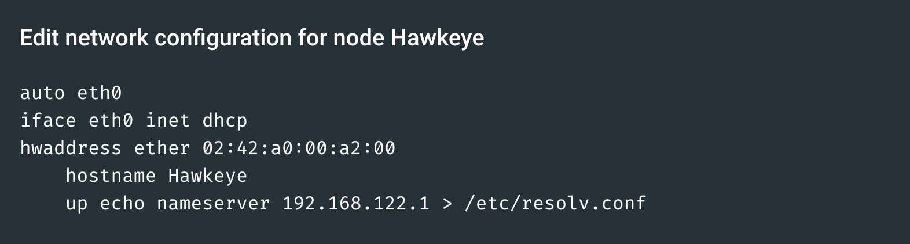
    ##### Thor
    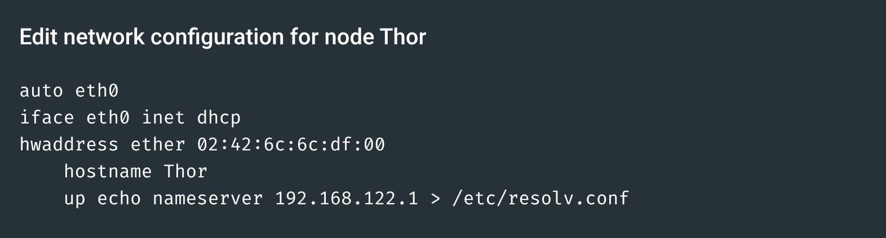
    ##### SpiderMan
    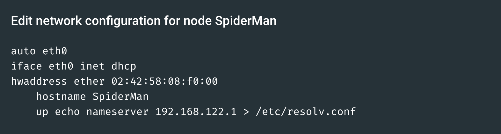

  - `dhcpd.conf` on `CaptainAmerica`
    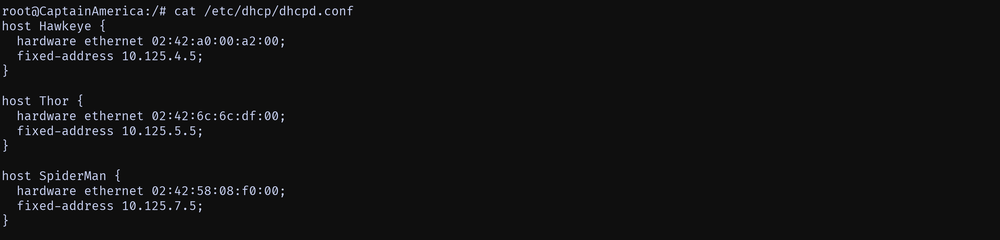

  - `ip -br a` on `Hawkeye`, `Thor`, and `SpiderMan`

    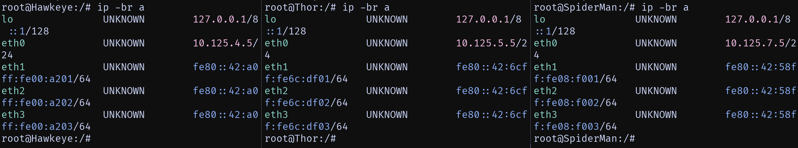

- Explanation

  - Berikan MAC Address pada `Hawkeye`, `Thor`, dan `SpiderMan` agar MAC Address tidak berubah-ubah setiap kali node di-restart.
    - Hawkeye: `02:42:a0:00:a2:00`
    - Thor: `02:42:6c:6c:df:00`
    - SpiderMan: `02:42:58:08:f0:00`

  - Tambahkan konfigurasi isc-dhcp-server pada `/etc/dhcp/dhcpd.conf`
    ``` bash
    host Hawkeye {
      hardware ethernet 02:42:a0:00:a2:00;
      fixed-address 10.125.4.5;
    }

    host Thor {
      hardware ethernet 02:42:6c:6c:df:00;
      fixed-address 10.125.5.5;
    }

    host SpiderMan {
      hardware ethernet 02:42:58:08:f0:00;
      fixed-address 10.125.7.5;
    }
    ```
    keterangan:
    - `host Hawkeye`: Mendefinisikan host dengan nama `Hawkeye`.
      - `hardware ethernet 02:42:a0:00:a2:00`: Menentukan MAC address dari `Hawkeye`.
      - `fixed-address 10.125.4.5`: Menentukan alamat IP statis untuk `Hawkeye`.
    - `host Thor`: Mendefinisikan host dengan nama `Thor`.
      - `hardware ethernet 02:42:6c:6c:df:00`: Menentukan MAC address dari `Thor`.
      - `fixed-address 10.125.5` : Menentukan alamat IP statis untuk `Thor`.
    - `host SpiderMan`: Mendefinisikan host dengan nama `SpiderMan`.
      - `hardware ethernet 02:42:58:08:f0:00`: Menentukan MAC address dari `SpiderMan`.
      - `fixed-address 10.125.7.5`: Menentukan alamat IP statis untuk `SpiderMan`.

  - Lalu restart DHCP Server:
    ``` bash
    service isc-dhcp-server restart
    ```
  #### Kesimpulan:
  Konfigurasi DHCP Server telah diubah untuk memberikan alamat IP statis kepada tiga host tertentu, yaitu Hawkeye, Thor, dan SpiderMan, berdasarkan MAC address mereka. Dengan pengaturan ini, meskipun mereka masih menggunakan DHCP untuk mendapatkan konfigurasi jaringan, mereka akan selalu menerima alamat IP yang sama setiap kali mereka terhubung ke jaringan.

<br>

## Soal 9

> Buatlah konfigurasi DHCP Failover dengan WinterSoldier sebagai DHCP server backup untuk CaptainAmerica.

> _Create a DHCP Failover configuration with WinterSoldier as the backup DHCP server for CaptainAmerica._

**Answer:**

- Screenshot

  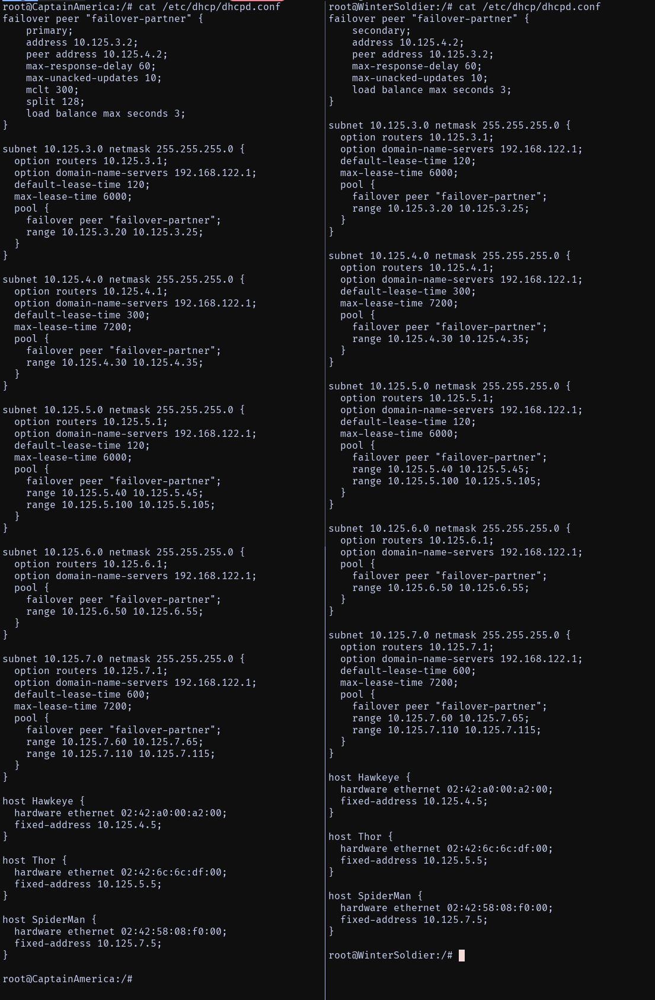

- Explanation

  #### Setting `CaptainAmerika` sebagai Primary DHCP Server
  - Tambahkan konfigurasi isc-dhcp-server pada `/etc/dhcp/dhcpd.conf`
    ``` bash
    failover peer "failover-partner" {
      primary;
      address 10.125.3.2;      
      peer address 10.125.4.2;
      max-response-delay 60;
      max-unacked-updates 10;
      mclt 3600;             
      split 128;            
      load balance max seconds 3;
    }

    subnet 10.125.3.0 netmask 255.255.255.0 {
      option routers 10.125.3.1;
      option domain-name-servers 192.168.122.1;
      default-lease-time 120;
      max-lease-time 6000;
      pool {
        failover peer "failover-partner";
        range 10.125.3.20 10.125.3.25;
      }
    }

    subnet 10.125.4.0 netmask 255.255.255.0 {
      option routers 10.125.4.1;
      option domain-name-servers 192.168.122.1;
      default-lease-time 300;
      max-lease-time 7200;
      pool {
        failover peer "failover-partner";
        range 10.125.4.30 10.125.4.35;
      }
    }

    subnet 10.125.5.0 netmask 255.255.255.0 {
      option routers 10.125.5.1;
      option domain-name-servers 192.168.122.1;
      default-lease-time 120;
      max-lease-time 6000;
      pool {
        failover peer "failover-partner";
        range 10.125.5.40 10.125.5.45;
        range 10.125.5.100 10.125.5.105;
      }
    }

    subnet 10.125.6.0 netmask 255.255.255.0 {
      option routers 10.125.6.1;
      option domain-name-servers 192.168.122.1;
      pool {
        failover peer "failover-partner";
        range 10.125.6.50 10.125.6.55;
      }
    }

    subnet 10.125.7.0 netmask 255.255.255.0 {
      option routers 10.125.7.1;
      option domain-name-servers 192.168.122.1;
      default-lease-time 600;
      max-lease-time 7200;
      pool {
        failover peer "failover-partner";
        range 10.125.7.60 10.125.7.65;
        range 10.125.7.110 10.125.7.115;
      }
    }
    ```

  - Lalu restart DHCP Server:
    ``` bash
    service isc-dhcp-server restart
    ```

  #### Setting `WinterSoldier` sebagai Secondary DHCP Server
  - Lakukan Instalasi DHCP Server sama seperti instalasi `CaptainAmerika` pada soal 4.

  - Tambahkan konfigurasi isc-dhcp-server pada `/etc/dhcp/dhcpd.conf`
    ``` bash
    failover peer "failover-partner" {
      primary;
      address 10.125.3.2;      
      peer address 10.125.4.2;
      max-response-delay 60;
      max-unacked-updates 10;
      mclt 3600;             
      split 128;            
      load balance max seconds 3;
    }

    subnet 10.125.3.0 netmask 255.255.255.0 {
      option routers 10.125.3.1;
      option domain-name-servers 192.168.122.1;
      default-lease-time 120;
      max-lease-time 6000;
      pool {
        failover peer "failover-partner";
        range 10.125.3.20 10.125.3.25;
      }
    }

    subnet 10.125.4.0 netmask 255.255.255.0 {
      option routers 10.125.4.1;
      option domain-name-servers 192.168.122.1;
      default-lease-time 300;
      max-lease-time 7200;
      pool {
        failover peer "failover-partner";
        range 10.125.4.30 10.125.4.35;
      }
    }

    subnet 10.125.5.0 netmask 255.255.255.0 {
      option routers 10.125.5.1;
      option domain-name-servers 192.168.122.1;
      default-lease-time 120;
      max-lease-time 6000;
      pool {
        failover peer "failover-partner";
        range 10.125.5.40 10.125.5.45;
        range 10.125.5.100 10.125.5.105;
      }
    }

    subnet 10.125.6.0 netmask 255.255.255.0 {
      option routers 10.125.6.1;
      option domain-name-servers 192.168.122.1;
      pool {
        failover peer "failover-partner";
        range 10.125.6.50 10.125.6.55;
      }
    }

    subnet 10.125.7.0 netmask 255.255.255.0 {
      option routers 10.125.7.1;
      option domain-name-servers 192.168.122.1;
      default-lease-time 600;
      max-lease-time 7200;
      pool {
        failover peer "failover-partner";
        range 10.125.7.60 10.125.7.65;
        range 10.125.7.110 10.125.7.115;
      }
    }
    ```
  - Lalu restart DHCP Server:
    ``` bash
    service isc-dhcp-server restart
    ```

  #### Kesimpulan:
  Konfigurasi DHCP Failover telah berhasil diterapkan antara dua server, CaptainAmerica sebagai primary dan WinterSoldier sebagai secondary. Dengan pengaturan ini, kedua server dapat saling berbagi informasi tentang status alamat IP yang telah diberikan kepada klien. Jika CaptainAmerica mengalami gangguan atau tidak dapat diakses, WinterSoldier akan mengambil alih fungsi distribusi alamat IP tanpa mengganggu layanan kepada klien. Hal ini memastikan kontinuitas layanan DHCP, sehingga klien tetap dapat memperoleh alamat IP dan konfigurasi jaringan lainnya tanpa gangguan. Selain itu, pengaturan ini juga membantu dalam load balancing, di mana beban permintaan DHCP dapat dibagi antara kedua server, meningkatkan efisiensi dan keandalan jaringan secara keseluruhan.

<br>

## Soal 10

> Buatlah konfigurasi agar CaptainAmerica dan WinterSoldier berjalan dengan mode Load Balancing.

> _Create a configuration so that CaptainAmerica and WinterSoldier run in Load Balancing mode._

**Answer:**

- Screenshot

  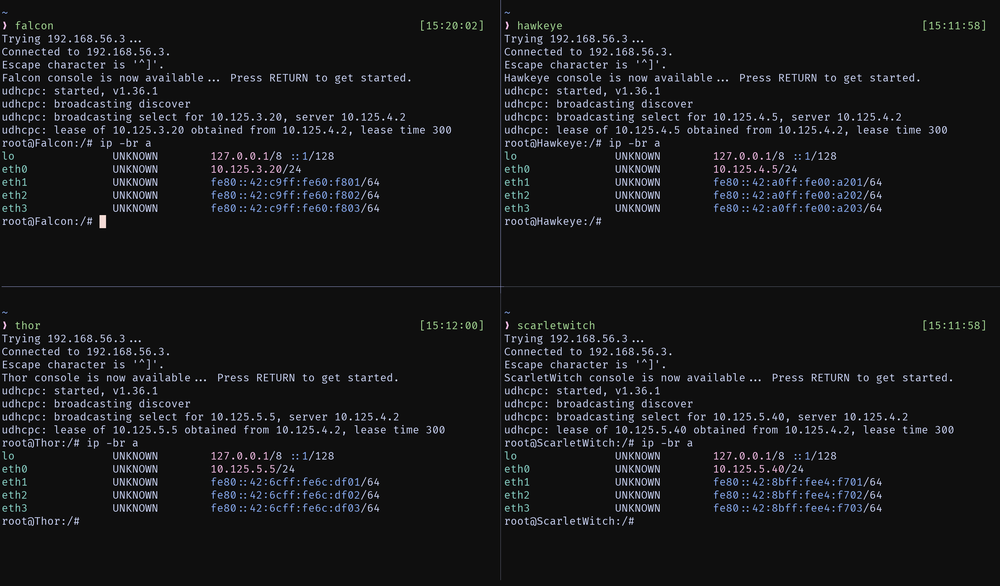
  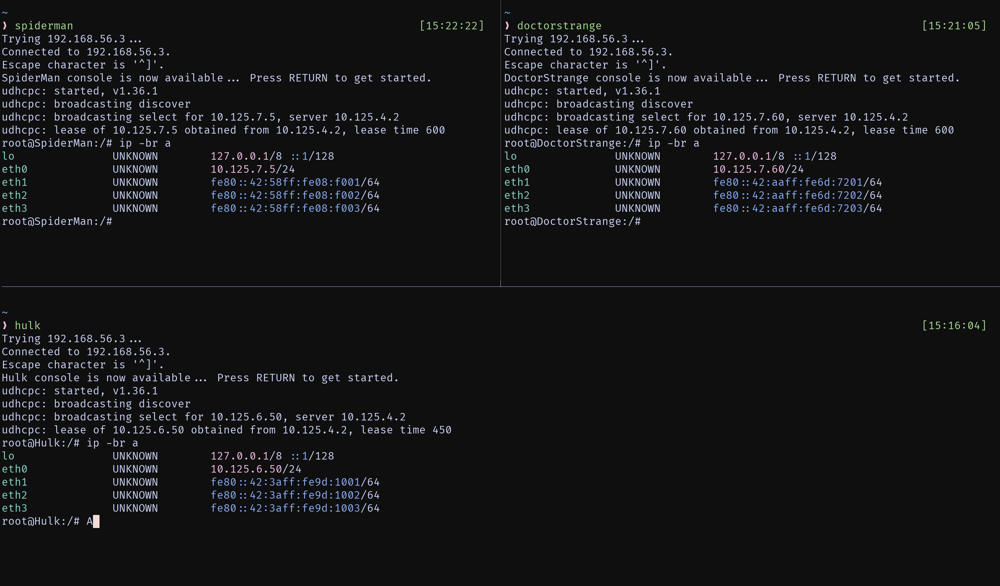

- Explanation

  Pada konfigurasi failover yang telah dibuat pada soal 9, sudah termasuk pengaturan untuk load balancing antara CaptainAmerica dan WinterSoldier. Hal ini ditunjukkan oleh parameter `split 128;` dalam blok konfigurasi failover pada server DHCP utama.

<br>
  
## Problems

## Revisions (if any)
