[](https://classroom.github.com/a/e_s827HM)
| Name                    | NRP        | Kelas |
|-------------------------|------------|-------|
| Gilbran Mahdavikia Raja | 5025241134 | B     |


## Put your topology config image here!

  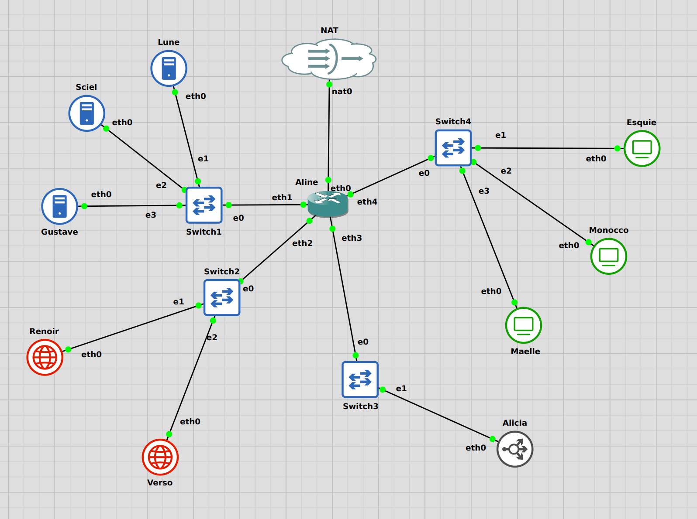

## Put your GNS3 Project file here!

  [GNS3 Project File](./project.gns3project)

<br>

## Soal 1

> Setup Topo

> _Document the results of the subnet grouping that has been created._

**Answer:**

- Screenshot

  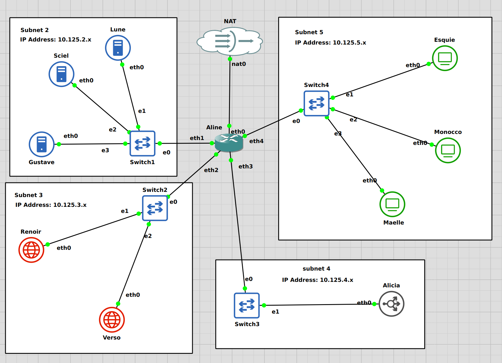

- Explanation

  | Nama Host     | Interface | Alamat IP   | Keterangan             |
  |---------------|-----------|-------------|------------------------|
  | Aline         | eth0      | DHCP        | Terhubung ke internet  |
  |               | eth1      | 10.125.2.1  | Jaringan Web Server    |
  |               | eth2      | 10.125.3.1  | Jaringan DNS Server    |
  |               | eth3      | 10.125.4.1  | Jaringan Reverse Proxy |
  |               | eth4      | 10.125.5.1  | Jaringan Client        |
  | Lune          | eth0      | 10.125.2.11 | Web Server             |
  | Scial         | eth0      | 10.125.2.12 | Web Server             |
  | Gustave       | eth0      | 10.125.2.13 | Web Server             |
  | Renoir        | eth0      | 10.125.3.11 | DNS Master Server      |
  | Verso         | eth0      | 10.125.3.12 | DNS Slave Server       |
  | Alicia        | eth0      | 10.125.4.11 | Reverse Proxy          |
  | Esquie        | eth0      | 10.125.5.11 | Client                 |
  | Monocco       | eth0      | 10.125.5.12 | Client                 |
  | Maelle        | eth0      | 10.125.5.13 | Client                 |


<br>

## Soal 2

> Buatlah konfigurasi untuk domain 
> **lune33.com** → ke IP node Lune , 
> **sciel33.com** → ke IP node Sciel ,
> **gustave33.com** → ke IP node Gustave 
> pada DNS Master Renoir. Kemudian konfigurasikan node Verso sebagai DNS Slave yang bekerja untuk DNS Master Renoir.

> _Dns Configuration , on  the DNS Master (Renoir)_
> _lune33.com → IP of node Lune ,_
> _sciel33.com → IP of node Sciel ,_
> _gustave33.com → IP of node Gustave_
> _Configure Verso as the DNS Slave that works with DNS Master Renoir._

**Answer:**

- Screenshot

  #### Konfigurasi DNS di Renoir
  - ##### konfigurasi `named.conf.local` 
  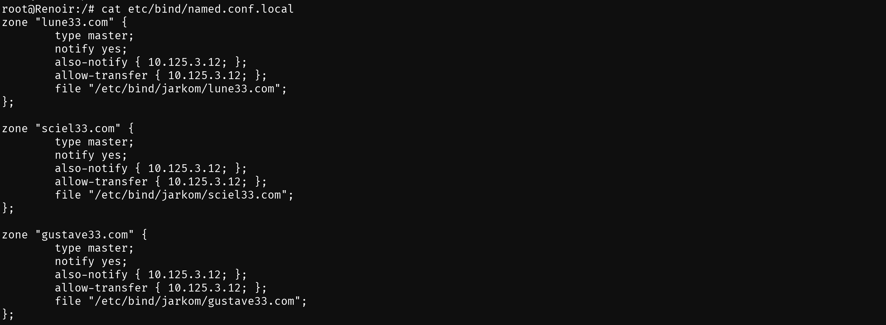

  - ##### Konfigurasi Zona `lune33.com` 
  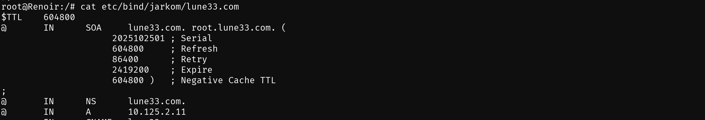

  - ##### Konfigurasi Zona `sciel33.com` 
  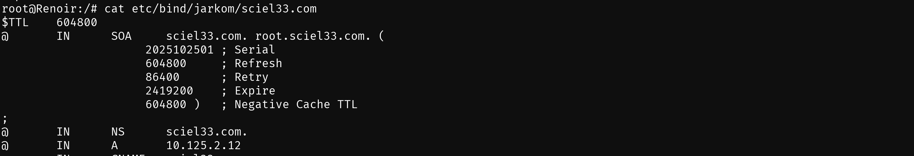

  - ##### Konfigurasi Zona `gustave33.com`
  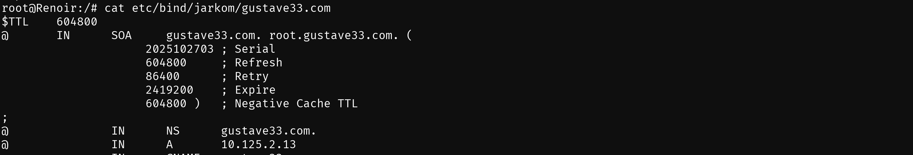

  #### Konfigurasi DNS di Verso
  - ##### Konfigurasi DNS Slave `named.conf.local`
  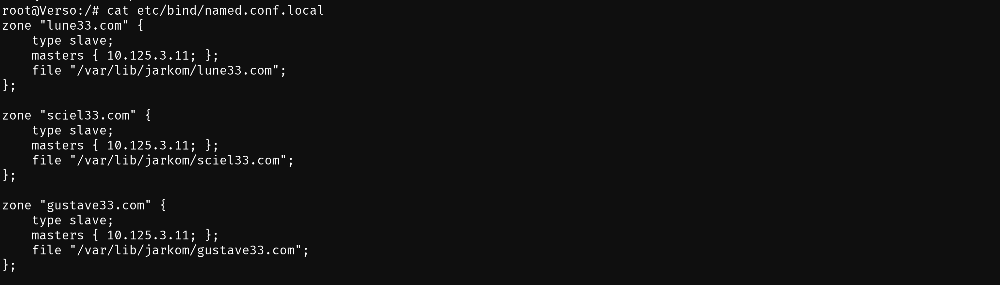

- Explanation

  #### Konfigurasi DNS di Renoir
  - Pada file `named.conf.local`, ditambahkan konfigurasi zona untuk domain `lune33.com`, `sciel33.com`, dan `gustave33.com` dengan tipe master dan tambahkan also-notify dan allow-transfer ke IP Verso (10.125.3.12) agar DNS Slave dapat menerima pembaruan.
    ```
    zone "lune33.com" {
        type master;
        notify yes;
        also-notify { 10.125.3.12; };
        allow-transfer { 10.125.3.12; };
        file "/etc/bind/jarkom/lune33.com";
    };
    zone "sciel33.com" {
        type master;
        notify yes;
        also-notify { 10.125.3.12; };
        allow-transfer { 10.125.3.12; };
        file "/etc/bind/jarkom/sciel33.com";
    };
    zone "gustave33.com" {
        type master;
        notify yes;
        also-notify { 10.125.3.12; };
        allow-transfer { 10.125.3.12; };
        file "/etc/bind/jarkom/gustave33.com";
    };
    ```
  - Pada konfigurasi zona `lune33.com`, ditambahkan record A yang mengarah ke IP node Lune (10.125.2.11).
    ```
    $TTL    604800
    @   IN  SOA lune33.com. root.lune33.com. (
            2025102501 ; Serial
            604800      ; Refresh
            86400       ; Retry
            2419200     ; Expire
            604800 )    ; Negative Cache TTL

    @   IN  NS  lune33.com.
    @   IN  A   10.125.2.11
    ```
  - Pada konfigurasi zona `sciel33.com`, ditambahkan record A yang mengarah ke IP node Sciel (10.125.2.12).
    ```
    $TTL    604800
    @   IN  SOA sciel33.com. root.sciel33.com. (
            2025102501 ; Serial
            604800      ; Refresh
            86400       ; Retry
            2419200     ; Expire
            604800 )    ; Negative Cache TTL
    @   IN  NS  sciel33.com.
    @   IN  A   10.125.2.12
    ```
  - Pada konfigurasi zona `gustave33.com`, ditambahkan record A yang mengarah ke IP node Gustave (10.125.2.13).
    ```
    $TTL    604800
    @   IN  SOA gustave33.com. root.gustave33.com. (
            2025102501 ; Serial
            604800      ; Refresh
            86400       ; Retry
            2419200     ; Expire
            604800 )    ; Negative Cache TTL
    @   IN  NS  gustave33.com.
    @   IN  A   10.125.2.13
    ```
  - Setelah konfigurasi selesai, restart layanan DNS pada Renoir untuk menerapkan perubahan.
    ```
    service named restart
    ```
  #### Konfigurasi DNS di Verso
  - Pada file `named.conf.local`, ditambahkan konfigurasi zona untuk domain `lune33.com`, `sciel33.com`, dan `gustave33.com` dengan tipe slave dan ditentukan master DNS Renoir (10.125.3.11).
    ```
    zone "lune33.com" {
        type slave;
        masters { 10.125.3.11; };
        file "/var/lib/bind/lune33.com";
    };
    zone "sciel33.com" {
        type slave;
        masters { 10.125.3.11; };
        file "/var/lib/bind/sciel33.com";
    };
    zone "gustave33.com" {
        type slave;
        masters { 10.125.3.11; };
        file "/var/lib/bind/gustave33.com";
    };
    ```
    file `/var/lib/bind/lune33.com`, `/var/lib/bind/sciel33.com`, dan `/var/lib/bind/gustave33.com` akan otomatis terisi oleh Verso setelah menerima transfer zona dari Renoir.
  - Setelah konfigurasi selesai, restart layanan DNS pada kedua server untuk menerapkan perubahan.
    ```
    service named restart
    ```

<br>

## Soal 3

> Tambahkan subdomain alias berupa exp.lune33.com yang mengarah ke alamat lune33.com dan exp.sciel33.com yang mengarah ke alamat sciel33.com (HINT: CNAME). Selain itu, tambahkan konfigurasi untuk melakukan reverse DNS lookup untuk domain gustave33.com

> _Subdomain Configuration,_ 
> _Add alias subdomains (HINT: CNAME)._
> _exp.lune33.com → alias to lune33.com_
> _exp.sciel33.com → alias to sciel33.com_
> _Also, configure reverse DNS lookup for the domain gustave33.com._

**Answer:**

- Screenshot

  #### Konfigurasi DNS di Renoir
  - ##### Konfigurasi Zona `lune33.com` di Renoir
  

  - ##### Konfigurasi Zona `sciel33.com` di Renoir
  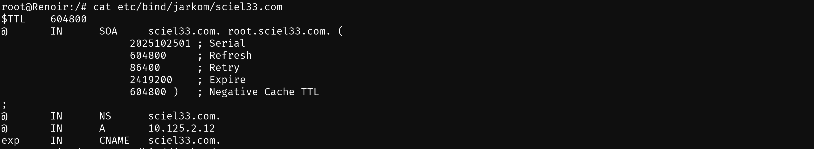

  - ##### Konfigurasi Reverse DNS Lookup di Renoir
  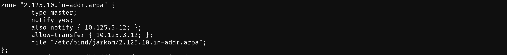
  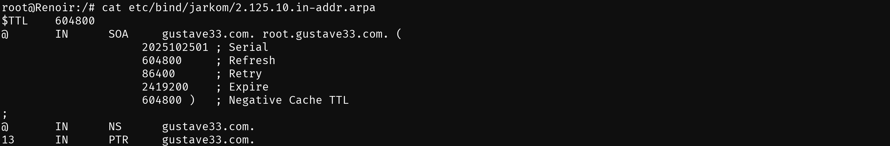

- Explanation

  #### Konfigurasi DNS di Renoir
  - Pada konfigurasi zona `lune33.com`, ditambahkan record CNAME untuk subdomain `exp.lune33.com` yang mengarah ke `lune33.com`.
    ```
    exp   IN  CNAME   lune33.com.
    ```
  - Pada konfigurasi zona `sciel33.com`, ditambahkan record CNAME untuk subdomain `exp.sciel33.com` yang mengarah ke `sciel33.com`.
    ```
    exp   IN  CNAME   sciel33.com.
    ```
  - Untuk konfigurasi reverse DNS lookup `gustave33.com`, pertama-tama perlu menentukan PTR record di zona reverse yang sesuai dengan IP node Gustave (10.125.2.13).
    - Hitung alamat jaringan untuk reverse DNS lookup:
      - IP Gustave: 10.125.2.13
      - Alamat jaringan: 10.125.2.0/24
      - Zona reverse: 2.125.10.in-addr.arpa
    - Konfigurasi zona reverse di Renoir:
      ```
      zone "2.125.10.in-addr.arpa" {
          type master;
          file "/etc/bind/jarkom/2.125.10.in-addr.arpa";
      };
      ```
    - Tambahkan PTR record di file zona reverse:
      ```
      $TTL    604800
      @   IN  SOA 2.125.10.in-addr.arpa. root.2.125.10.in-addr.arpa. (
              2025102501 ; Serial
              604800      ; Refresh
              86400       ; Retry
              2419200     ; Expire
              604800 )    ; Negative Cache TTL
      @   IN  NS  2.125.10.in-addr.arpa.
      13  IN  PTR gustave33.com.
      ```
    - Setelah konfigurasi selesai, restart layanan DNS untuk menerapkan perubahan.
      ```
      service named restart
      ```

<br>

## Soal 4

> Buatlah subdomain berupa expedition.gustave33.com dan delegasikan subdomain tersebut dari Renoir ke Verso dengan alamat IP tujuan adalah node Gustave. Kemudian, matikan Renoir dan coba lakukan ping ke semua domain dan subdomain yang telah dikonfigurasikan pada nomor 2, 3, dan 4.

> _Create a subdomain expedition.gustave33.com and delegate it from Renoir to Verso, with the target IP being node Gustave.Then, turn off Renoir and try pinging all domains and subdomains configured in tasks 2, 3, and 4 to verify delegation works correctly._

**Answer:**

- Screenshot

  #### Konfigurasi Delegasi Subdomain di Renoir
  - ##### Konfigurasi Zona `gustave33.com` di Renoir
  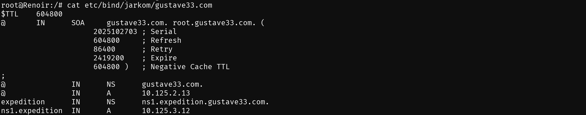

  #### Konfigurasi Delegasi Subdomain di Verso
  - ##### Konfigurasi `named.conf.local` di Verso
  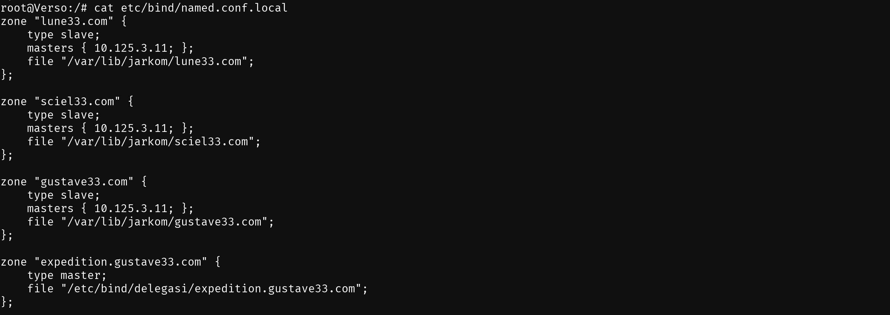
  
  - ##### Konfigurasi Zona `expedition.gustave33.com` di Verso
  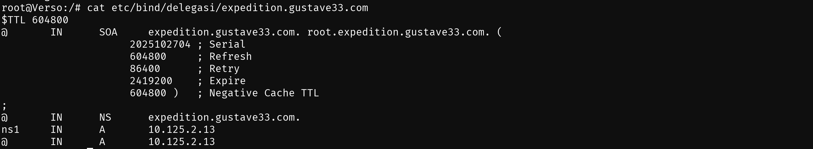
  
  #### Hasil Ping dari Client setelah mematikan Renoir
  - ##### Hasil Ping `lune33.com` dan `exp.lune33.com` dari Esquie   (client)
  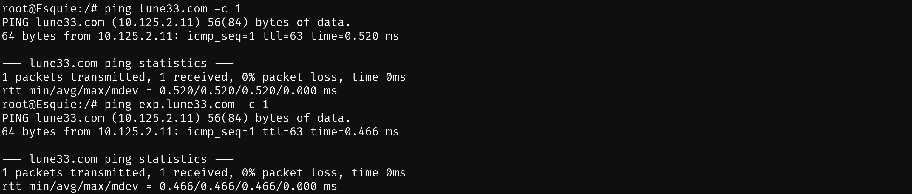
  
  - ##### Hasil Ping `sciel33.com` dan `exp.sciel33.com` dari Esquie
  
  
  - ##### Hasil Ping `gustave33.com` dan `expedition.gustave33.com` dari Esquie
  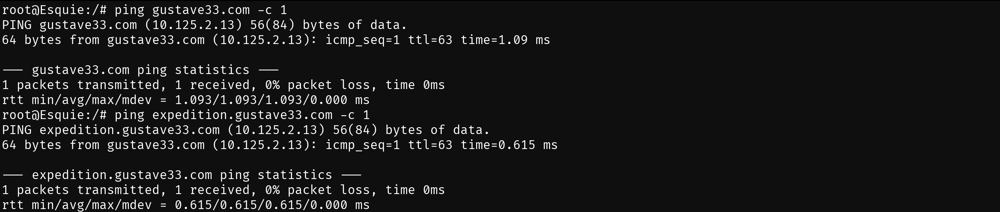

  - ##### Hasil `host -t PTR` Reverse DNS Lookup `gustave33.com` dari Esquie
  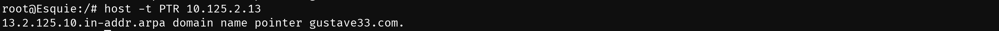

- Explanation

  #### Konfigurasi Delegasi Subdomain di Renoir
  - Pada konfigurasi zona `gustave33.com`, ditambahkan record NS untuk subdomain `expedition.gustave33.com` yang mendelegasikan ke DNS Slave Verso (IP: 10.125.3.12).
    ```
    expedition                      IN  NS  ns1.expedition.gustave33.com.
    ns1.expedition.gustave33.com.   IN  A   10.125.3.12
    ```
  #### Konfigurasi Delegasi Subdomain di Verso
  - Pada file `named.conf.local` di Verso, ditambahkan konfigurasi zona untuk subdomain `expedition.gustave33.com` dengan tipe master.
    ```
    zone "expedition.gustave33.com" {
        type master;
        file "/etc/bind/jarkom/expedition.gustave33.com";
    };
    ```
  - Pada konfigurasi zona `expedition.gustave33.com`, ditambahkan record A yang mengarah ke IP node Gustave (IP: 10.125.2.13).
    ```
    @  IN  SOA expedition.gustave33.com. root.expedition.gustave33.com. (
            2025102501 ; Serial
            604800      ; Refresh
            86400       ; Retry
            2419200     ; Expire
            604800 )    ; Negative Cache TTL
    @   IN  NS  expedition.gustave33.com.
    @   IN  A   10.125.2.13
    ns1 IN  A   10.125.2.13
    ```
  - Setelah konfigurasi selesai, restart layanan DNS untuk menerapkan perubahan.
    ```
    service named restart
    ```

<br>

## Soal 5

> Konfigurasi node Lune, Sciel, dan Gustave agar berfungsi sebagai web server Nginx yang akan menyajikan halaman profil, dimana halaman profil akan berbeda untuk setiap node. Dari folder berikut, gunakan profile_lune.html untuk menyajikan halaman profil di node Lune, profile_sciel.html untuk menyajikan halaman profil di node Sciel, dan profile_gustave.html untuk menyajikan halaman profil di node Gustave. Konfigurasikan Nginx di setiap node untuk menyimpan custom access log ke file /tmp/access.log dan error log ke file /tmp/error.log. 

> _Configure Lune, Sciel, and Gustave as Nginx web servers serving profile pages, where each node has a unique profile page:_
> _- Use profile_lune.html for Lune_
> _- Use profile_sciel.html for Sciel_
> _- Use profile_gustave.html for Gustave_
> _In each web server, Configure Nginx to store custom logs:_
> _- Access log: /tmp/access.log_
> _- Error log: /tmp/error.log_

**Answer:**

- Screenshot

  #### Konfigurasi Lune
  - ##### Konfigurasi Nginx di Lune
  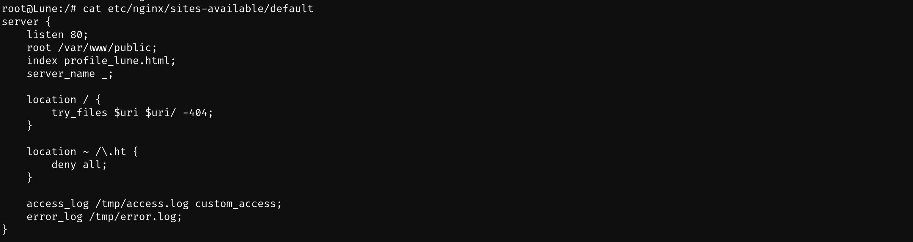

  - ##### Halaman Profil Lune
  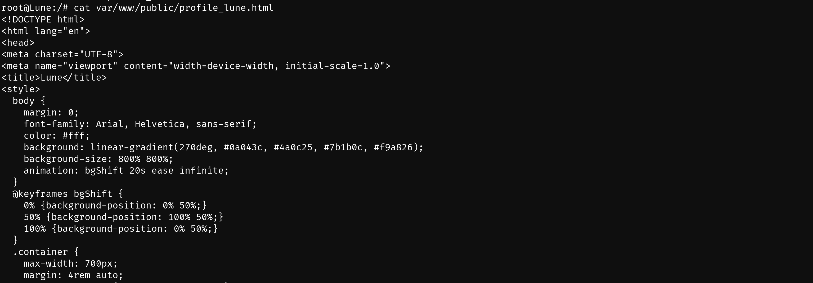

  #### Konfigurasi Sciel
  - ##### Konfigurasi Nginx di Sciel
  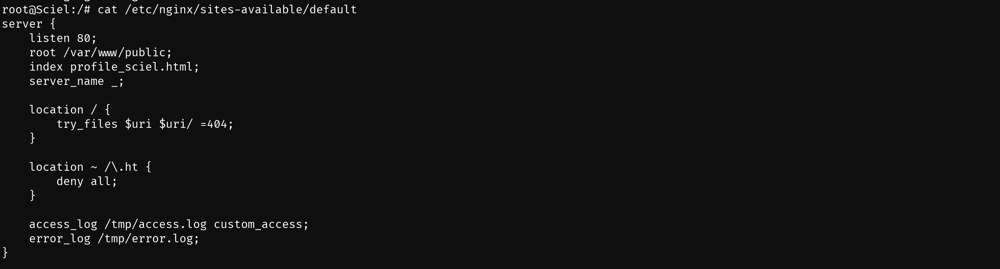
  - ##### Halaman Profil Sciel
  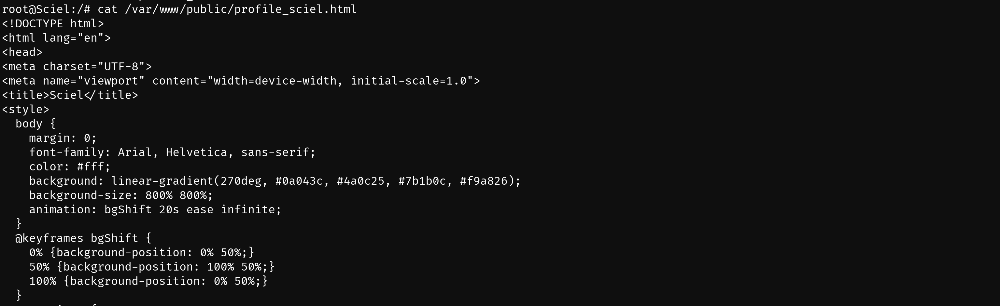

  #### Konfigurasi Gustave
  - ##### Konfigurasi Nginx di Gustave
  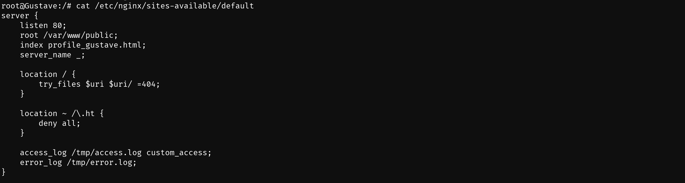
  - ##### Halaman Profil Gustave
  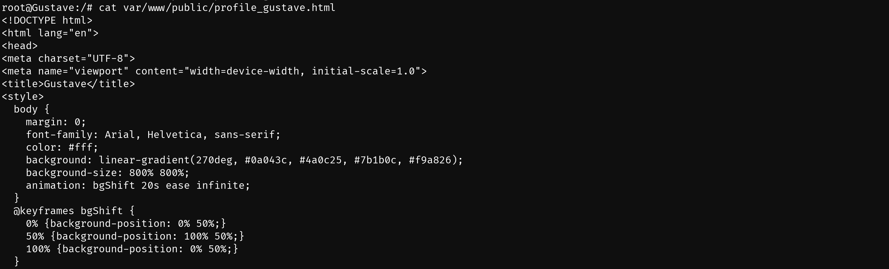

  #### Hasil Lynx dari Client
  - ##### Hasil Lynx ke Lune dari Esquie (Client)
  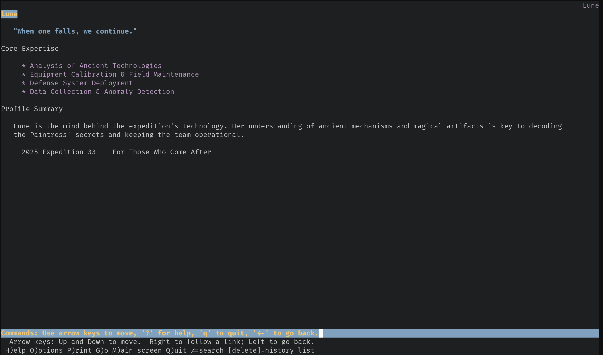
  - ##### Hasil Lynx ke Sciel dari Esquie (Client)
  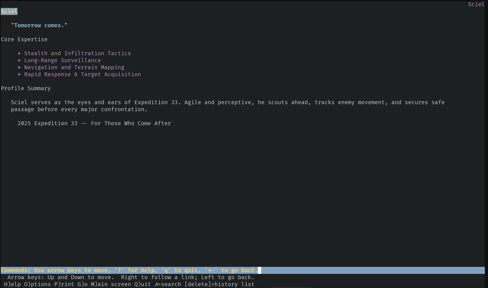
  - ##### Hasil Lynx ke Gustave dari Esquie (Client)
  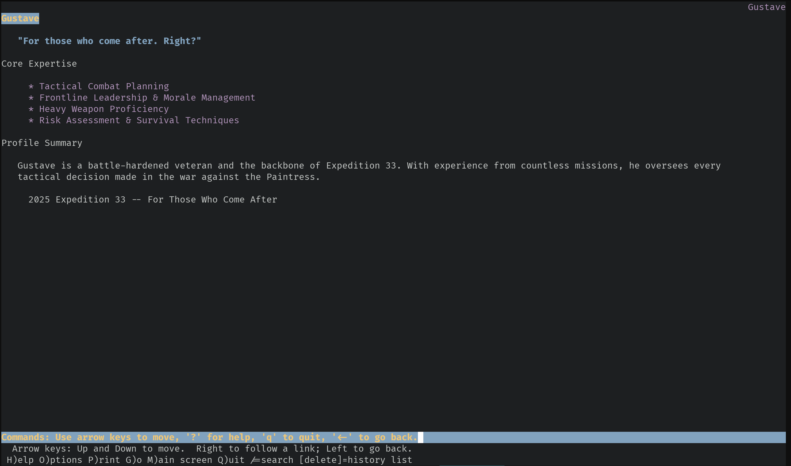

- Explanation

  #### Konfigurasi Nginx di Lune, Sciel, dan Gustave
  - Pada masing-masing node web server (Lune, Sciel, dan Gustave), tambahkan [file html](https://drive.google.com/drive/folders/1A6_IelWIX90PY33oPIM3jHuS9QmBnXft) kedalam /var/www/public dengan nama profile_lune.html, profile_sciel.html, dan profile_gustave.html.
  - Ubah konfigurasi default Nginx pada file `/etc/nginx/sites-available/default` di masing-masing node web server untuk menyajikan halaman profil yang sesuai.
    - Contoh konfigurasi di node Lune:
    ```
    server {
        listen 80;
        root /var/www/html; 
        index profile_lune.html; 
        server_name _;

        location / {
            try_files $uri $uri/ =404;
        }

        location ~ /\.ht {
            deny all;
        }
    }
    ```
    - Ganti `index profile_lune.html;` menjadi `index profile_sciel.html;` di node Sciel dan `index profile_gustave.html;` di node Gustave.
  - Tambahkkan `access_log` dan `error_log` di dalam blok server pada file konfigurasi Nginx.
    ```
    access_log /tmp/access.log;
    error_log /tmp/error.log;
    ```
  - Setelah konfigurasi selesai, dilakukan restart layanan Nginx untuk menerapkan perubahan.
    ```
    service nginx restart
    ```


<br>

## Soal 6

> Setelah website berhasil dideploy pada masing-masing node web server dan halaman dapat menampilkan profil yang sesuai,  buatlah custom access log ke file /tmp/access.log di masing-masing node web server menggunakan format log tertentu seperti di bawah:
> - Tanggal dan waktu akses dalam format standar log.
> - Nama node yang sedang diakses.
> - Alamat IP klien yang mengakses website.
> - Metode HTTP dan URI yang diakses oleh klien.
> - Status respons HTTP yang diberikan oleh server.
> - Jumlah byte yang dikirimkan dalam respons.
> - Waktu yang dihabiskan oleh server untuk menangani permintaan.
> - Contoh format log yang sesuai:
>   [01/Oct/2024:11:30:45 +0000] Jarkom Node Lune Access from 192.168.1.15 using method "GET /resep/bayam HTTP/1.1" returned status 200 with 2567 bytes sent in 0.038 seconds

> _After successfully deploying each website and verifying the correct profile page is displayed, create a custom access log in /tmp/access.log on each web server using the following format:_
> _- Date and time of access (standard log format)_
> _- Name of the node being accessed_
> _- IP address of the client accessing the website_
> _- HTTP method and URI accessed by the client_
> _- HTTP response status code_
> _- Number of bytes sent in the response_
> _- Time taken by the server to process the request_
> _- Example Log Format:_
> _[01/Oct/2024:11:30:45 +0000] Jarkom Node Lune Access from 192.168.1.15 using method "GET /resep/bayam HTTP/1.1" returned status 200 with 2567 bytes sent in 0.038 seconds_

**Answer:**

- Screenshot

  #### Konfigurasi Custom Log di Lune, Sciel, dan Gustave 
  - ##### Konfigurasi Custom Log di Lune sebagai contoh
  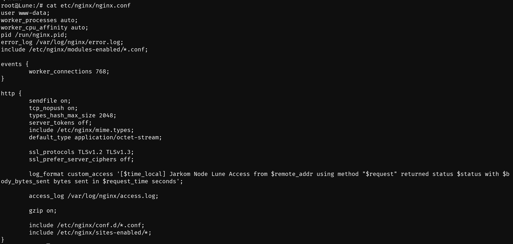
  #### Hasil Log di Lune, Sciel, dan Gustave
  - ##### Hasil Log di Lune sebagai contoh
  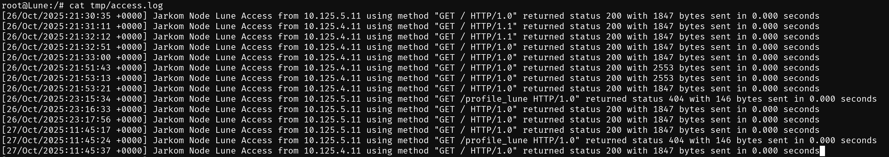

- Explanation

  #### Konfigurasi Custom Log di Lune, Sciel, dan Gustave
  - Tambahkan custom log format di dalam blok http pada file `/etc/nginx/nginx.conf` di masing-masing node web server (Lune, Sciel, dan Gustave).
    - Contoh konfigurasi di node Lune:
    ```
    log_format custom_access '[$time_local] Jarkom Node Lune Access from $remote_addr using method "$request" returned status $status with $body_bytes_sent bytes sent in $request_time seconds';

    ```
    - Ganti `Jarkom Node Lune` menjadi `Jarkom Node Sciel` di node Sciel dan `Jarkom Node Gustave` di node Gustave.
  - Ubah konfigurasi access_log di dalam blok server pada file `/etc/nginx/sites-available/default` di masing-masing node web server untuk menggunakan custom log format yang telah dibuat.
    - Contoh konfigurasi di node Lune:
    ```
    access_log /tmp/access.log custom_format;
    ```
  - Setelah konfigurasi selesai, dilakukan restart layanan Nginx untuk menerapkan perubahan.
    ```
    service nginx restart
    ```

<br>

## Soal 7

> Gustave merupakan web server yang tidak disarankan untuk dilihat oleh publik. Maka dari itu, ubahlah konfigurasi nginx sehingga halaman profil Gustave menjadi hanya bisa di akses melalui port 8080 dan 8888.

> _The Gustave web server should not be publicly accessible.
Modify the Nginx configuration so that Gustave’s profile page can only be accessed through ports 8080 and 8888._

**Answer:**

- Screenshot

  #### Konfigurasi Nginx di Gustave
  - ##### Konfigurasi Port 8080 dan 8888 di Gustave
  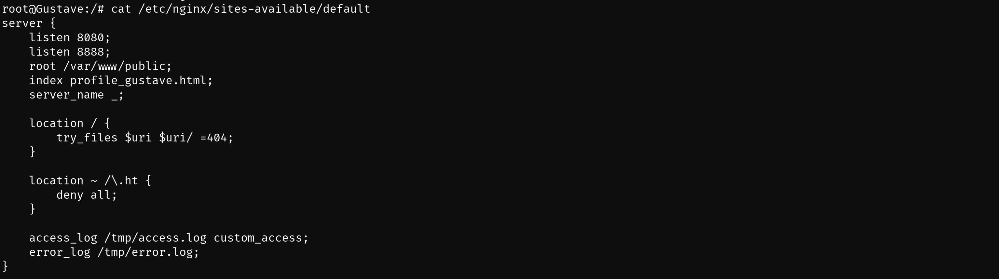
  - ##### Hasil Lynx ke Gustave di Port 80 dan 8080 dari Esquie (Client)
  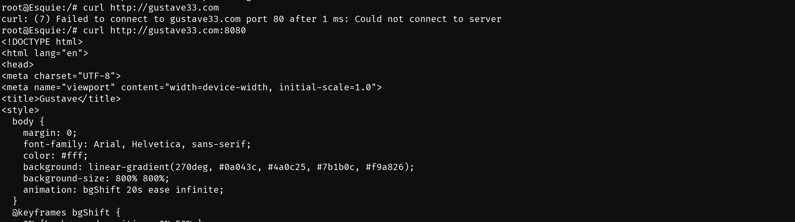

- Explanation

  #### Konfigurasi Nginx di Gustave
  - Ubah konfigurasi default Nginx pada file `/etc/nginx/sites-available/default` di node Gustave untuk mendengarkan pada port 8080 dan 8888 saja.
    ```
    server {
        listen 8080;
        listen 8888;
        root /var/www/html; 
        index profile_gustave.html; 
        server_name _;

        location / {
            try_files $uri $uri/ =404;
        }

        location ~ /\.ht {
            deny all;
        }
    }
    ```
  - Hapus atau komentari baris `listen 80;` agar Nginx tidak mendengarkan pada port 80.
  - Setelah konfigurasi selesai, dilakukan restart layanan Nginx untuk menerapkan perubahan.
    ```
    service nginx restart
    ```

<br>

## Soal 8

> Untuk mempermudah program ekspedisi, maka node Lune, Sciel, Gustave sepakat untuk membuat halaman informasi dengan konten yang sama. Maka dari itu, buatlah lagi 1 server block di dalam konfigurasi nginx yang akan menyajikan file HTML ini. Namun, mereka ingin menyajikan halaman informasi tersebut di port yang berbeda-beda, yaitu Lune menggunakan port 8000, Sciel menggunakan port 8100, dan Gustave menggunakan port 8200.

> _To simplify coordination for the expedition program, Lune, Sciel, and Gustave agree to create a shared information page with the same content. Add one more server block in each node’s Nginx configuration that serves this HTML file 
Each node should serve the information page on a different port:_
> _- Lune → port 8000_
> _- Sciel → port 8100_
> _- Gustave → port 8200_

**Answer:**

- Screenshot

  #### Konfigurasi Nginx di Lune, Sciel, dan Gustave
  - ##### Konfigurasi Port 8000 di Lune
  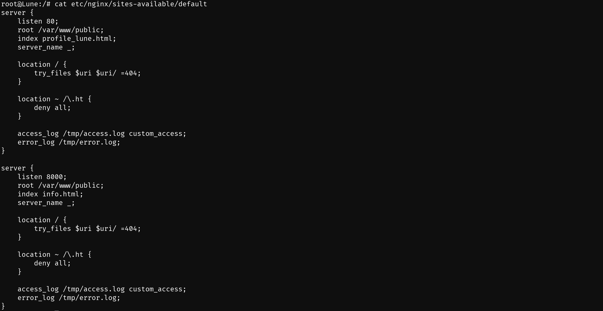
  - ##### Hasil Lynx ke Lune di Port 8000 dari Esquie (Client)
  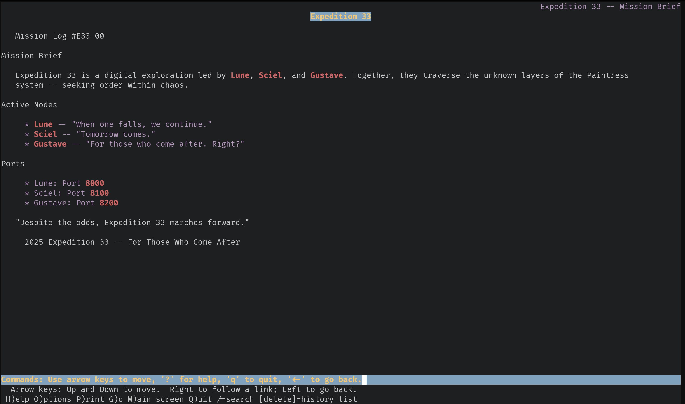

  - ##### Konfigurasi Port 8100 di Sciel
  
  - ##### Hasil Lynx ke Sciel di Port 8100 dari Esquie (Client)
  

  - ##### Konfigurasi Port 8200 di Gustave
  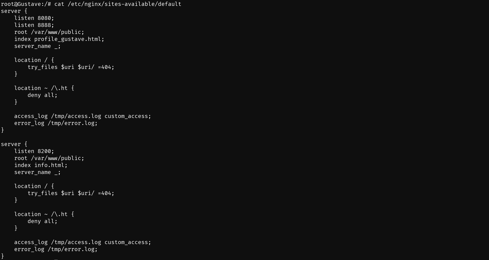
  - ##### Hasil Lynx ke Gustave di Port 8200 dari Esquie (Client)
  

  #### Halaman Informasi yang Sama di Lune, Sciel, dan Gustave
  - ##### Halaman Informasi di Lune sebagai contoh
  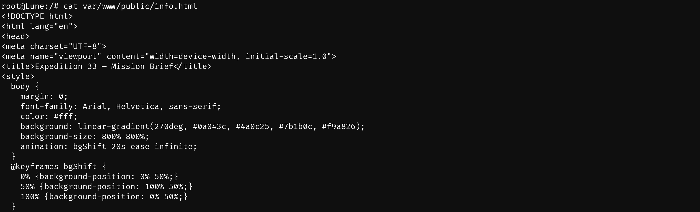


- Explanation

  #### Konfigurasi Nginx di Lune, Sciel, dan Gustave
  - Tambahkan file html [`informasi.html`](https://drive.google.com/file/d/1BLg3S22ldhL-wRYN-ivowEqh8cYwwfVS/view) dengan konten yang sama ke dalam /var/www/html di masing-masing node web server (Lune, Sciel, dan Gustave).
  - Tambahkan server block baru di dalam file `/etc/nginx/sites-available/default` di masing-masing node web server (Lune, Sciel, dan Gustave) untuk menyajikan halaman informasi pada port yang ditentukan.
    - Contoh konfigurasi di node Lune:
    ```
    server {
        listen 8000;
        root /var/www/html; 
        index informasi.html; 
        server_name _;

        location / {
            try_files $uri $uri/ =404;
        }

        location ~ /\.ht {
            deny all;
        }
    }
    ```
    - Ganti `listen 8000;` menjadi `listen 8100;` di node Sciel dan `listen 8200;` di node Gustave.
    - Pastikan file `informasi.html` dengan konten yang sama telah ditambahkan ke dalam `/var/www/html` di masing-masing node web server.
  - Setelah konfigurasi selesai, dilakukan restart layanan Nginx untuk menerapkan perubahan.
    ```
    service nginx restart
    ```

<br>

## Soal 9

> Untuk mempermudah akses ke profil tiap anggota ekspedisi, buatlah 1 domain lagi yaitu "expeditioners.com" yang akan mengarah ke Alicia. Lalu, untuk mencegah overload dari salah satu web server, konfigurasikan reverse proxy Alicia agar bisa forward request ke server yang sesuai berdasarkan URL profile yang diminta oleh klien dengan ketentuan sebagai berikut:
> -  Request untuk “expeditioners.com/profil_lune” harus dialihkan ke halaman profil web server Lune.
> -  Request untuk “expeditioners.com/profil_sciel” harus dialihkan ke halaman profil web server Sciel.
> -  Request untuk “expeditioners.com/profil_gustave” harus dialihkan ke halaman profil web server Gustave.
> Jika terdapat request ke URL selain profil yang ditentukan, reverse proxy akan mengalihkan ke halaman informasi pada web server Lune.

> _To make it easier to access each member’s profile, create a new domain “expeditioners.com” that points to Alicia. "
Configure Alicia’s reverse proxy (Nginx) to forward requests to the correct web server based on the requested URL, with the following rules:_
> _- Request URL expeditioners.com/profil_lune, Forward To Lune’s profile page_
> _- Request URL expeditioners.com/profil_sciel, Forward To Sciel’s profile page_
> _- Request URL expeditioners.com/profil_gustave, Forward To Gustave’s profile page_
> _- Any other URL, Forward To Lune’s information page_

**Answer:**

- Screenshot

  #### Konfigurasi DNS di Renoir untuk expeditioners.com
  - ##### Konfigurasi Zona `expeditioners.com` di Renoir
  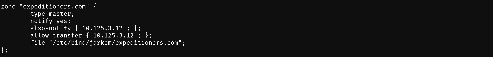
  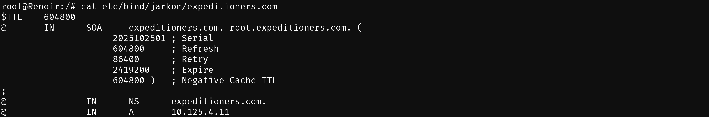
  - #### Konfigurasi Reverse Proxy di Alicia
  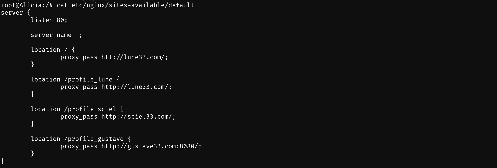
  #### Hasil Lynx dari Client
  - ##### Hasil Lynx ke expeditioners.com/profil_lune dari Esquie
  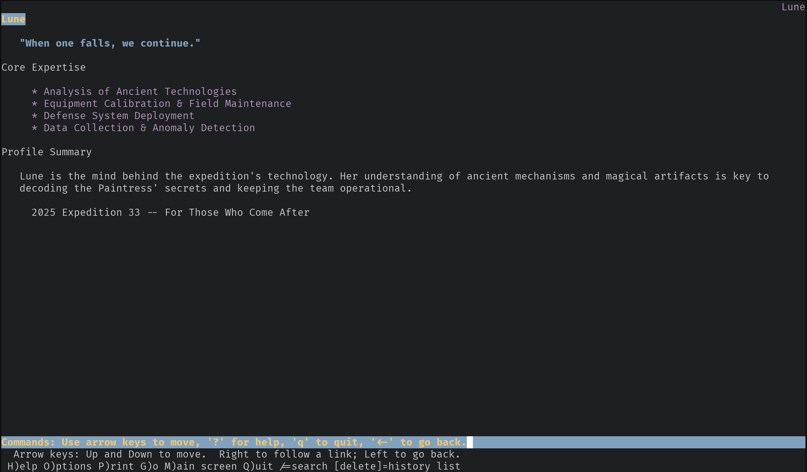
  - ##### Hasil Lynx ke expeditioners.com/ dari Esquie
  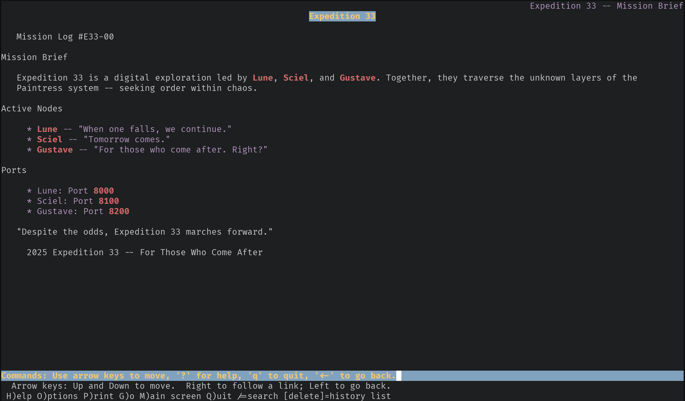

- Explanation

  #### Konfigurasi DNS di Renoir untuk expeditioners.com
  - Pada file `named.conf.local`, ditambahkan konfigurasi zona untuk domain `expeditioners.com` dengan tipe master dan tambahkan also-notify dan allow-transfer ke IP Verso (10.125.3.12).
    ```
    zone "expeditioners.com" {
        type master;
        notify yes;
        also-notify { 10.125.3.12; };
        allow-transfer { 10.125.3.12; };
    }
    ```
  - Pada konfigurasi zona `expeditioners.com`, ditambahkan record A yang mengarah ke IP node Alicia (10.125.4.11).
    ```
    $TTL    604800
    @   IN  SOA expeditioners.com. root.expeditioners.com. (
            2025102501 ; Serial
            604800      ; Refresh
            86400       ; Retry
            2419200     ; Expire
            604800 )    ; Negative Cache TTL

    @   IN  NS  expeditioners.com.
    @   IN  A   10.125.4.11
    ```
  #### Konfigurasi Reverse Proxy di Alicia
  - Tambahkan server block baru di dalam file `/etc/nginx/sites-available/default` di node Alicia untuk mengatur reverse proxy sesuai dengan ketentuan soal.
    ```
    server {
        listen 80;

        server_name _; 

        location /profil_lune {
            proxy_pass http://lune33.com/;
        }

        location /profil_sciel {
            proxy_pass http://sciel33.com/;
        }

        location /profil_gustave {
            proxy_pass http://gustave33.com/;
        }

        location / {
            proxy_pass http://lune33.com:8000/;
        }
    }

<br>

## Soal 10

> Untuk mendistribusikan traffic halaman informasi, atur Reverse Proxy Alicia agar dapat membagi pekerjaan kepada web server Lune, Sciel, dan Gustave secara optimal menggunakan algoritma Round-robin. Pastikan target pembagian load merupakan halaman informasi, bukan halaman profil masing-masing web server.

> _To distribute traffic for the information page, configure the reverse proxy (Alicia) to use Round-robin load balancing between the three web servers: Lune, Sciel, and Gustave.
Ensure that only the information page is included in the load-balancing configuration - not the profile pages._

**Answer:**

- Screenshot

  #### Konfigurasi Load Balancing di Alicia
  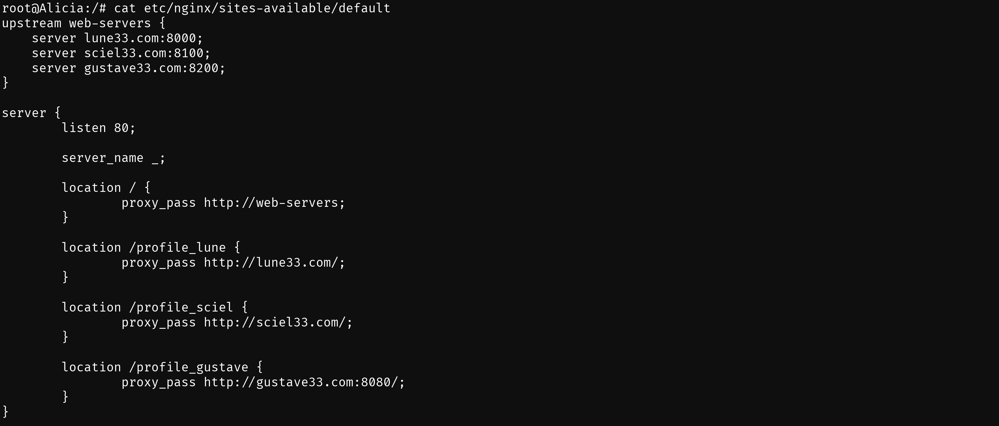
  #### Hasil Lynx dari Client
  - ##### Hasil Lynx ke expeditioners.com/ dari Esquie (Client)
  

- Explanation

  #### Konfigurasi Load Balancing di Alicia
  - Tambahkan upstream block di dalam file `/etc/nginx/sites-available/default` di node Alicia untuk mengatur load balancing dengan algoritma Round-robin antara web server Lune, Sciel, dan Gustave.
    ```
    upstream web_servers {
        server lune33.com:8000;
        server sciel33.com:8100;
        server gustave33.com:8200;
    }
    ```
  - Ubah lokasi root (`/`) di dalam server block untuk menggunakan upstream `web_servers`.
    ```
    location / {
        proxy_pass http://web_servers/;
    }
    ```
  - Setelah konfigurasi selesai, dilakukan restart layanan Nginx untuk menerapkan perubahan.
    ```
    service nginx restart
    ```

<br>
  
## Problems

## Revisions (if any)
