[](https://classroom.github.com/a/oYnIPZ_t)
| Name           | NRP        | Kelas     |
| ---            | ---        | ----------|
| Gilbran Mahdavikia Raja | 5025241134 | B |

## Put your topology config image here!

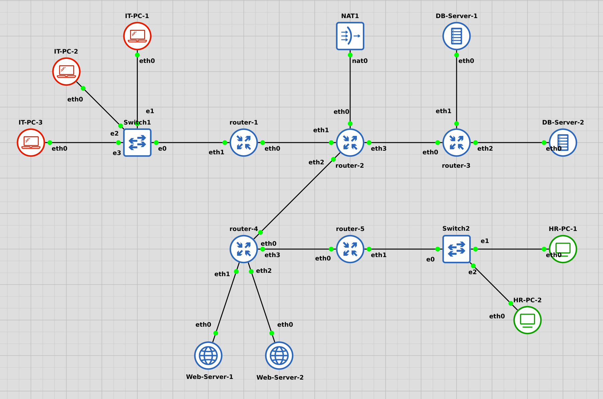

## Put your GNS3 Project file here!

  [gns3project](./gns3/Praktikum4_Gilbran_Mahdavikia_Raja.gns3project)

<br>

## Soal 1

> Lakukan subnetting pada topologi diatas menggunakan metode VLSM: [Referensi](https://github.com/arsitektur-jaringan-komputer/Modul-Jarkom/tree/master/Modul-4/Subnetting#2-vlsm-variable-length-subnet-masking)  
*Cantumkan juga tabel dan diagram pembagian subnet pada laporan praktikum*.


> _Subnet the topology above using the VLSM method: [Reference](https://github.com/arsitektur-jaringan-komputer/Modul-Jarkom/tree/master/Modul-4/Subnetting#2-vlsm-variable-length-subnet-masking)_  
_Also include the subnet table and diagram in the lab report._

**Answer:**

- Screenshot

  subnetting:
  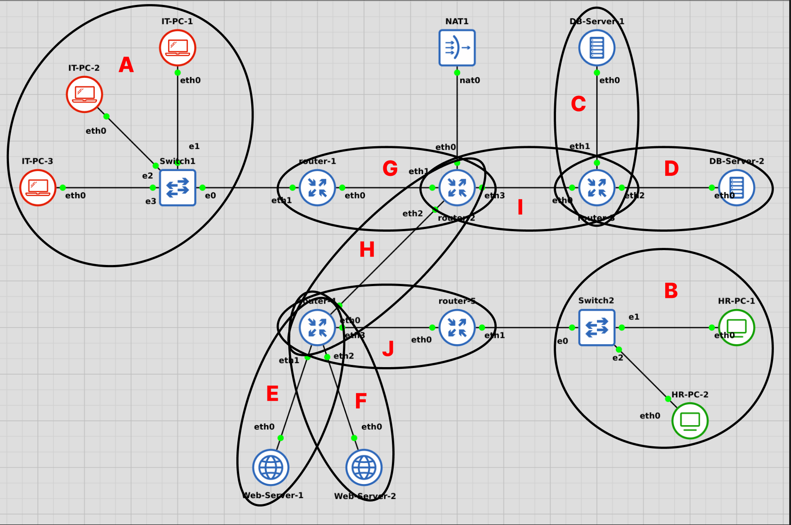
  Diagram subnetting VLSM:
  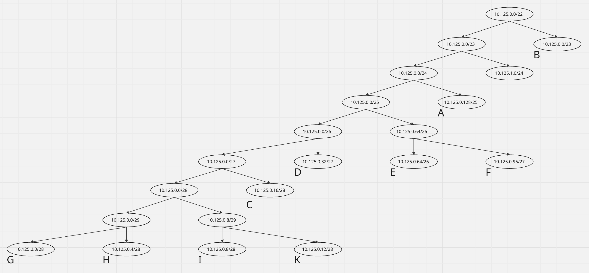

- Explanation

  Tabel Pembagian Subnetting VLSM:
  | SUBNET | HOST | NETMASK | IP RANGE |
  | --- | --- | --- | --- |
  | A | 116 | /25 | 10.125.0.128 - 10.125.0.255 |
  | B | 451 | /23 | 10.125.2.0 - 10.125.3.255 |
  | C | 13 | /28 | 10.125.0.16 - 10.125.0.31 |
  | D | 19 | /27 | 10.125.0.32 - 10.125.0.63 |
  | E | 26 | /27 | 10.125.0.64 - 10.125.0.95 |
  | F | 21 | /27 | 10.125.0.96 - 10.125.0.127 |
  | G | 2 | /30 | 10.125.0.0 - 10.125.0.3 |
  | H | 2 | /30 | 10.125.0.4 - 10.125.0.7 |
  | I | 2 | /30 | 10.125.0.8 - 10.125.0.11 |
  | J | 2 | /30 | 10.125.0.12 - 10.125.0.15 |

  IP Address Masing-masing Node:
  | SUBNET | IFACE | NODE          | HOST | IP ADDRESS     | NETMASK           |
  |--------|--------|----------------|------|-----------------|-------------------|
  | A      | eth0   | IT-PC-1        | 50   | 10.125.0.130    | 255.255.255.128   |
  | A      | eth0   | IT-PC-2        | 25   | 10.125.0.180    | 255.255.255.128   |
  | A      | eth0   | IT-PC-3        | 40   | 10.125.0.205    | 255.255.255.128   |
  | A      | eth1   | router-1       | 1    | 10.125.0.129    | 255.255.255.128   |
  | B      | eth0   | HR-PC-1        | 250  | 10.125.2.2      | 255.255.254.0     |
  | B      | eth0   | HR-PC-2        | 200  | 10.125.2.252    | 255.255.254.0     |
  | B      | eth1   | router-5       | 1    | 10.125.2.1      | 255.255.254.0     |
  | C      | eth0   | DB-Server-1    | 12   | 10.125.0.18     | 255.255.255.240   |
  | C      | eth1   | router-3       | 1    | 10.125.0.17     | 255.255.255.240   |
  | D      | eth0   | DB-Server-2    | 18   | 10.125.0.34     | 255.255.255.224   |
  | D      | eth2   | router-3       | 1    | 10.125.0.33     | 255.255.255.224   |
  | E      | eth0   | Web-Server-1   | 25   | 10.125.0.66     | 255.255.255.224   |
  | E      | eth1   | router-4       | 1    | 10.125.0.65     | 255.255.255.224   |
  | F      | eth0   | Web-Server-2   | 20   | 10.125.0.98     | 255.255.255.224   |
  | F      | eth2   | router-4       | 1    | 10.125.0.97     | 255.255.255.224   |
  | G      | eth0   | router-1       | 1    | 10.125.0.2      | 255.255.255.252   |
  | G      | eth1   | router-2       | 1    | 10.125.0.1      | 255.255.255.252   |
  | H      | eth0   | router-4       | 1    | 10.125.0.6      | 255.255.255.252   |
  | H      | eth2   | router-2       | 1    | 10.125.0.5      | 255.255.255.252   |
  | I      | eth0   | router-3       | 1    | 10.125.0.10     | 255.255.255.252   |
  | I      | eth3   | router-2       | 1    | 10.125.0.9      | 255.255.255.252   |
  | J      | eth0   | router-5       | 1    | 10.125.0.14     | 255.255.255.252   |
  | J      | eth3   | router-4       | 1    | 10.125.0.13     | 255.255.255.252   |


<br>

## Soal 2

> Buatlah agar router-2 dapat melakukan koneksi ke internet. [Dapat menggunakan static routing].

> _Make sure router-2 can connect to the internet. [Can use static routing]._

**Answer:**

- Screenshot

  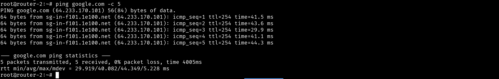

- Explanation

  Pada router-2, cukup konfigurasi eth0 menjadi dhcp dan sambungkan eth0 ke NAT. Setelah itu, router-2 dapat melakukan koneksi ke internet dengan melakukan ping ke google.com seperti pada gambar di atas.

<br>

## Soal 3

> Setelah mengimplementasi subnetting, buatlah agar seluruh topologi dapat terhubung. Lakukan Dynamic Routing pada topologi tersebut.
*Pastikan seluruh node yang ada dapat mengakses internet*.

> _After implementing subnetting, ensure the entire topology is connected. Perform dynamic routing on the topology._  
_Ensure all existing nodes can access the internet._

**Answer:**

- Screenshot

  - router-1 routing table
    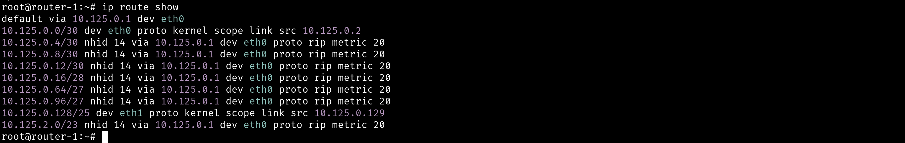
  - router-2 routing table
    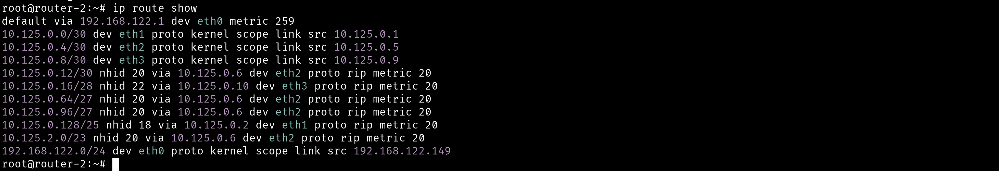
  - router-3 routing table
    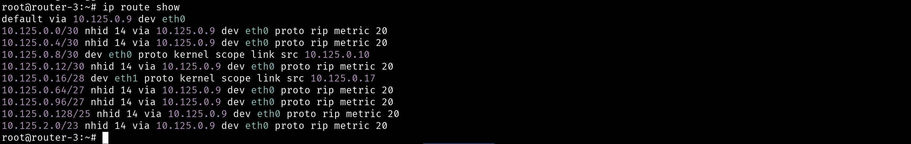
  - router-4 routing table
    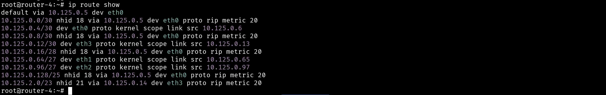
  - router-5 routing table
    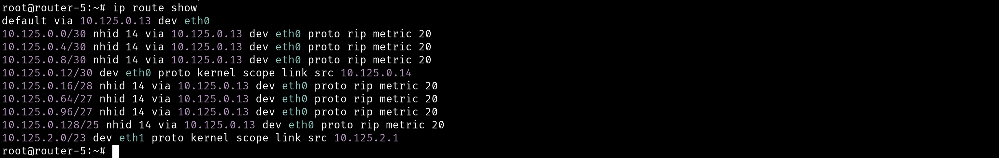

- Explanation

  #### Jalan kan service FRR pada masing-masing router
  ```
  cd /usr/lib/frr
  ./zebra -d
  ./ripd -d
  ./mgmtd -d
    
  vtysh
  conf t
  router rip
  ```

  #### Konfigurasi masing-masing router untuk dynamic routing menggunakan protokol RIP
  - Router-1
    ```
    network 10.125.0.128/25 
    network 10.125.0.0/30  
    ```

  - Router-2
    ```
    network 10.125.0.0/30   
    network 10.125.0.4/30  
    network 10.125.0.8/30 
    ```

  - Router-3
    ```
    network 10.125.0.16/28  
    network 10.125.0.32/27  
    network 10.125.0.8/30  
    ```

  - Router-4
    ```
    network 10.125.0.64/27
    network 10.125.0.96/27  
    network 10.125.0.4/30  
    network 10.125.0.12/30
    ```

  - Router-5
    ```
    network 10.125.2.0/23
    network 10.125.0.12/30
    ```

<br>

## Soal 4

> Lakukan setup web server dengan file html di attachment berikut: [ Attachment ](https://drive.google.com/file/d/199qwfTNJCkxDV7mdO-MsaDdApkmKsnAG/view?usp=sharing)  menggunakan nginx pada “Web-Server-1” dan “Web-Server-2”.  
*Config dibebaskan kepada praktikkan dengan catatan menggunakan port 80*.

> _Set up a web server with the HTML file in the following attachment: [ Attachment ](https://drive.google.com/file/d/199qwfTNJCkxDV7mdO-MsaDdApkmKsnAG/view?usp=sharing) using nginx on “Web-Server-1” and “Web-Server-2”._
_Configuration is free to practice, but note that it uses port 80._

**Answer:**

- Screenshot

  - Web-Server-1
    
  - Web-Server-2
    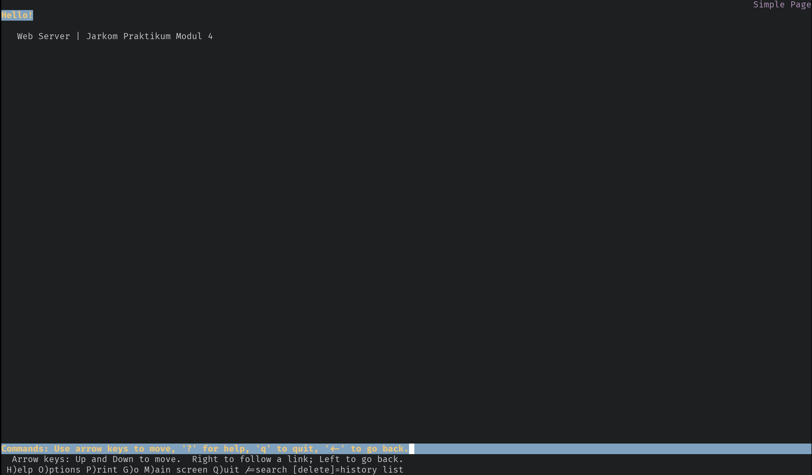

- Explanation

  - Download file attachment dari link yang diberikan pada web-server-1 dan web-server-2
    ```
    wget 'https://docs.google.com/uc?export=download&id=199qwfTNJCkxDV7mdO-MsaDdApkmKsnAG' -O /var/www/html/index.html
    ```
  - Konfigurasi Nginx pada web-server-1 dan web-server-2
    ```
    server {
        listen 80;
        root /var/www/html;
        index index.html;
        server_name _;

        location / {
            try_files $uri $uri/ =404;
        }

        access_log /tmp/access.log;
        error_log /tmp/error.log;
    }
    ```
  - Restart service nginx pada web-server-1 dan web-server-2
    ```
    systemctl restart nginx
    ```
<br>

## Soal 5

> Kalian diminta untuk melakukan drop semua paket TCP yang masuk  ke subnet HR dengan port 1337 dan 4444. Lakukan testing dengan netcat.

> _You are asked to drop all incoming TCP packets to the HR subnet with ports 1337 and 4444. Test with netcat._

**Answer:**

- Screenshot

  - hasil `watch -n 1 "iptables -nvL FORWARD"` pada router-5
  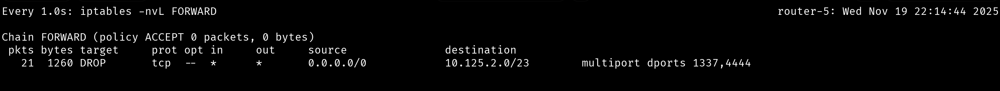

- Explanation

  #### Pada router-5, tambahkan rule pada iptables untuk drop semua paket TCP yang masuk ke subnet HR (10.125.0.128/25) dengan port 1337 dan 4444
  ```
  iptables -A FORWARD -p tcp -d 10.125.2.0/23 -m multiport --dports 1337,4444 -j DROP
  ```
  Keterangan:
  - `iptables -A FORWARD` : Menambahkan rule pada chain FORWARD
  - `-p tcp` : Menentukan protokol yang digunakan adalah TCP
  - `-d` : Menentukan destination address
  - `-m multiport --dports 1337,4444` : Menentukan destination port 1337 dan 4444
  - `-j DROP` : Menolak paket
  - `10.125.2.0/23` : Subnet B (HR-PC-1, HR-PC-2)

<br>

## Soal 6

> Lakukan pembatasan sehingga koneksi SSH pada semua Web Server hanya dapat dilakukan oleh user yang berada pada node IT-PC-1, IT-PC-2, dan IT-PC-3. 

> _Implement restrictions so that SSH connections to all Web Servers can only be made by users on nodes IT-PC-1, IT-PC-2, and IT-PC-3._

**Answer:**

- Screenshot

  - hasil `watch -n 1 "iptables -nvL FORWARD"` pada router-4
  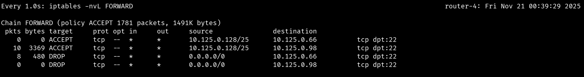

- Explanation

  #### Pada router-4, tambahkan rule pada iptables untuk membatasi koneksi SSH pada web-server-1 dan web-server-2 hanya dapat dilakukan oleh user yang berada pada node IT-PC-1, IT-PC-2, dan IT-PC-3
  ```
  iptables -A FORWARD -p tcp -s 10.125.0.128/25 -d 10.125.0.66 --dport 22 -j ACCEPT
  iptables -A FORWARD -p tcp -s 10.125.0.128/25 -d 10.125.0.98 --dport 22 -j ACCEPT
  iptables -A FORWARD -p tcp -d 10.125.0.66 --dport 22 -j DROP
  iptables -A FORWARD -p tcp -d 10.125.0.98 --dport 22 -j DROP
  ```
  keterangan:
  - `iptables -A FORWARD` : Menambahkan rule pada chain FORWARD
  - `-p tcp` : Menentukan protokol yang digunakan adalah TCP
  - `-s` : Menentukan source address
  - `-d` : Menentukan destination address
  - `--dport 22` : Menentukan destination port 22 (SSH)
  - `-j ACCEPT` : Menerima paket
  - `-j DROP` : Menolak paket
  - `10.125.0.128/25` : Subnet A (IT-PC-1, IT-PC-2, IT-PC-3)
  - `10.125.0.66` : Web-Server-1
  - `10.125.0.98` : Web-Server-2

<br>

## Soal 7

> Semua subnet hanya dapat mengakses semua DB-Server pada port 80 dan 443 (DB-Server-1 dan DB-Server-2) pada hari Senin-Sabtu, pukul 07:00- 22:00.

> _All subnets can only access all DB-Servers on ports 80 and 443 (DB-Server-1 and DB-Server-2) on Monday-Saturday, 07:00-22:00._

**Answer:**

- Screenshot

  - hasil `watch -n 1 "iptables -nvL FORWARD"` pada router-3
  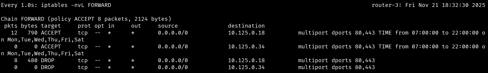

- Explanation

  #### Pada router-3, tambahkan rule pada iptables untuk membatasi akses ke db-server-1 dan db-server-2 pada port 80 dan 443 hanya pada hari Senin-Sabtu, pukul 07:00-22:00
  ```
  iptables -A FORWARD -p tcp -d 10.125.0.18 -m multiport --dports 80,443 -m time --timestart 07:00 --timestop 22:00 --weekdays Mon,Tue,Wed,Thu,Fri,Sat --kerneltz -j ACCEPT
  iptables -A FORWARD -p tcp -d 10.125.0.34 -m multiport --dports 80,443 -m time --timestart 07:00 --timestop 22:00 --weekdays Mon,Tue,Wed,Thu,Fri,Sat --kerneltz -j ACCEPT

  iptables -A FORWARD -p tcp -d 10.125.0.18 -m multiport --dports 80,443 -j DROP
  iptables -A FORWARD -p tcp -d 10.125.0.34 -m multiport --dports 80,443 -j DROP
  ```
  Keterangan:
  - `iptables -A FORWARD` : Menambahkan rule pada chain FORWARD
  - `-p tcp` : Menentukan protokol yang digunakan adalah TCP
  - `-d` : Menentukan destination address
  - `-m multiport --dports 80,443` : Menentukan destination port 80 dan 443
  - `-m time --timestart 07:00` : Menentukan waktu mulai 07:00
  - `--timestop 22:00` : Menentukan waktu berhenti 22:00
  - `--weekdays Mon,Tue,Wed,Thu,Fri,Sat` : Menentukan hari Senin-Sabtu
  - `--kerneltz` : Menggunakan timezone dari kernel
  - `-j ACCEPT` : Menerima paket
  - `-j DROP` : Menolak paket
  - `10.125.0.18` : DB-Server-1
  - `10.125.0.34` : DB-Server-2

<br>

## Soal 8

> Kemudian, buat agar “Web-Server-1” dan “Web-Server-2” hanya memperbolehkan traffic bertipe HTTP.

> _Then, make sure that “Web-Server-1” and “Web-Server-2” only allow HTTP type traffic._

**Answer:**

- Screenshot

  - hasil `watch -n 1 "iptables -nvL FORWARD"` pada router-4
  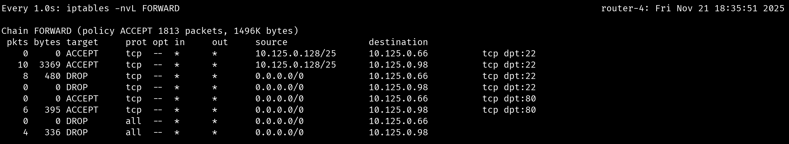

- Explanation
  
  #### Pada router-4, tambahkan rule pada iptables untuk membatasi web-server-1 dan web-server-2 hanya memperbolehkan traffic bertipe HTTP
  ```
  iptables -A FORWARD -p tcp -d 10.125.0.66 --dport 80 -j ACCEPT
  iptables -A FORWARD -p tcp -d 10.125.0.98 --dport 80 -j ACCEPT

  iptables -A FORWARD -d 10.125.0.66 -j DROP
  iptables -A FORWARD -d 10.125.0.98 -j DROP
  ```
  Keterangan:
  - `iptables -A FORWARD` : Menambahkan rule pada chain FORWARD
  - `-p tcp` : Menentukan protokol yang digunakan adalah TCP
  - `-d` : Menentukan destination address
  - `--dport 80` : Menentukan destination port 80 (HTTP)
  - `-j ACCEPT` : Menerima paket
  - `-j DROP` : Menolak paket
  - `10.125.0.66` : Web-Server-1
  - `10.125.0.98` : Web-Server-2

<br>

## Soal 9

> Pilih salah satu Subnet dan lakukan blokir terhadap semua request protokol ICMP (ping) dari luar subnet terhadap subnet tersebut.

> _Select one of the Subnets and block all ICMP protocol requests (ping) from outside the subnet to that subnet._

**Answer:**

- Screenshot

  - hasil `watch -n 1 "iptables -nvL FORWARD"` pada router-1
  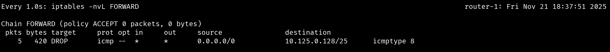

- Explanation

  #### Pada router-1, tambahkan rule pada iptables untuk memblokir semua request protokol ICMP (ping) dari luar subnet A terhadap subnet tersebut
  ```
  iptables -A FORWARD -p icmp --icmp-type echo-request -d 10.125.0.128/25 -j DROP
  ```
  Keterangan:
  - `iptables -A FORWARD` : Menambahkan rule pada chain FORWARD
  - `-p icmp` : Menentukan protokol yang digunakan adalah ICMP
  - `--icmp-type echo-request` : Menentukan tipe ICMP adalah echo-request
  - `-d` : Menentukan destination address
  - `-j DROP` : Menolak paket
  - `10.125.0.128/25` : Subnet A (IT-PC-1, IT-PC-2, IT-PC-3)

<br>

## Soal 10

> Konfigurasikan fitur logging untuk melakukan log terhadap seluruh paket yang di-DROP pada lalu lintas setiap node.

> _Configure the logging feature to log all dropped packets on each node's traffic._

**Answer:**

- Screenshot

  - contoh hasil `iptables -nvL FORWARD` pada router-1
  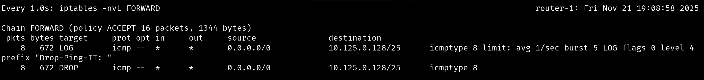

- Explanation

  #### Pada masing-masing router, tambahkan rule pada iptables untuk melakukan logging terhadap seluruh paket yang di-DROP pada lalu lintas setiap node
  - router-1
    ```
    # Subnet A (IT-PC-1, IT-PC-2, IT-PC-3)
    iptables -D FORWARD -p icmp --icmp-type echo-request -d 10.125.0.128/25 -j DROP
    iptables -A FORWARD -p icmp --icmp-type echo-request -d 10.125.0.128/25 -m limit --limit 5/min -j LOG --log-prefix "Drop-Ping-IT: " --log-level 7
    iptables -A FORWARD -p icmp --icmp-type echo-request -d 10.125.0.128/25 -j DROP
    ```
  - router-3
    ```
    # DB Server 1
    iptables -D FORWARD -p tcp -d 10.125.0.18 -m multiport --dports 80,443 -j DROP
    iptables -A FORWARD -p tcp -d 10.125.0.18 -m multiport --dports 80,443 -m limit --limit 5/min -j LOG --log-prefix "Drop-Time-DB1: " --log-level 7
    iptables -A FORWARD -p tcp -d 10.125.0.18 -m multiport --dports 80,443 -j DROP

    # DB Server 2
    iptables -D FORWARD -p tcp -d 10.125.0.34 -m multiport --dports 80,443 -j DROP
    iptables -A FORWARD -p tcp -d 10.125.0.34 -m multiport --dports 80,443 -m limit --limit 5/min -j LOG --log-prefix "Drop-Time-DB2: " --log-level 7
    iptables -A FORWARD -p tcp -d 10.125.0.34 -m multiport --dports 80,443 -j DROP
    ```
  - router-4
    ```
    # Web Server 1
    iptables -D FORWARD -p tcp -d 10.125.0.66 --dport 22 -j DROP
    iptables -A FORWARD -p tcp -d 10.125.0.66 --dport 22 -m limit --limit 5/min -j LOG --log-prefix "Drop-SSH-Web1: " --log-level 7
    iptables -A FORWARD -p tcp -d 10.125.0.66 --dport 22 -j DROP
    iptables -D FORWARD -d 10.125.0.66 -j DROP
    iptables -A FORWARD -d 10.125.0.66 -m limit --limit 5/min -j LOG --log-prefix "Drop-All-Web1: " --log-level 7
    iptables -A FORWARD -d 10.125.0.66 -j DROP

    # Web Server 2
    iptables -D FORWARD -p tcp -d 10.125.0.98 --dport 22 -j DROP
    iptables -A FORWARD -p tcp -d 10.125.0.98 --dport 22 -m limit --limit 5/min -j LOG --log-prefix "Drop-SSH-Web2: " --log-level 7
    iptables -A FORWARD -p tcp -d 10.125.0.98 --dport 22 -j DROP
    iptables -D FORWARD -d 10.125.0.98 -j DROP
    iptables -A FORWARD -d 10.125.0.98 -m limit --limit 5/min -j LOG --log-prefix "Drop-All-Web2: " --log-level 7
    iptables -A FORWARD -d 10.125.0.98 -j DROP
    ```
  - router-5
    ```
    # Subnet B (HR-PC-1, HR-PC-2)
    iptables -D FORWARD -p tcp -d 10.125.2.0/23 -m multiport --dports 1337,4444 -j DROP
    iptables -A FORWARD -p tcp -d 10.125.2.0/23 -m multiport --dports 1337,4444 -m limit --limit 5/min -j LOG --log-prefix "Drop-HR-Port: " --log-level 7
    iptables -A FORWARD -p tcp -d 10.125.2.0/23 -m multiport --dports 1337,4444 -j DROP
    ```
  Keterangan:
  - `iptables -D FORWARD` : Menghapus rule pada chain FORWARD
  - `iptables -A FORWARD` : Menambahkan rule pada chain FORWARD
  - `-p` : Menentukan protokol yang digunakan
  - `--icmp-type echo-request` : Menentukan tipe ICMP adalah echo-request
  - `-d` : Menentukan destination address
  - `--dport` : Menentukan destination port
  - `-m limit --limit 5/min` : Membatasi log maksimal 5 per menit
  - `-j LOG` : Melakukan logging pada paket
  - `--log-prefix "Drop-..."` : Menentukan prefix log
  - `--log-level 7` : Menentukan level log
  - `-j DROP` : Menolak paket

<br>
  
## Problems

## Revisions (if any)
